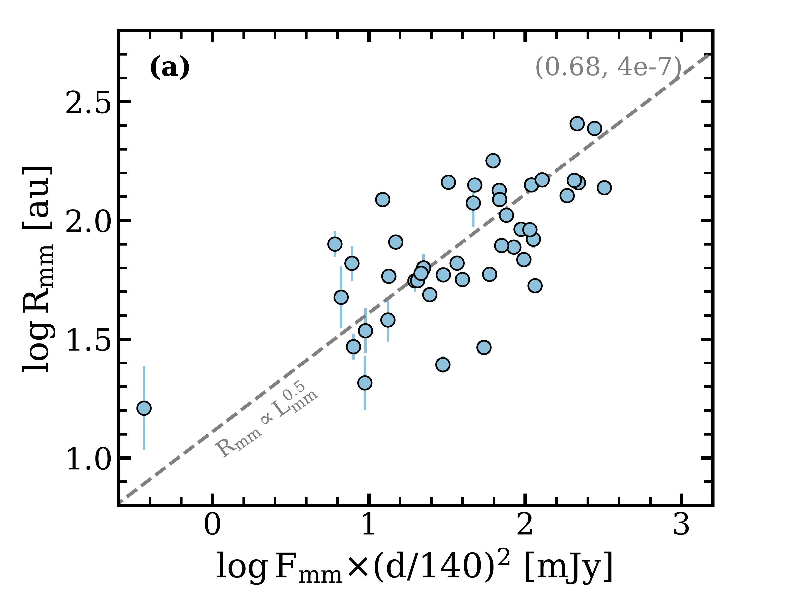
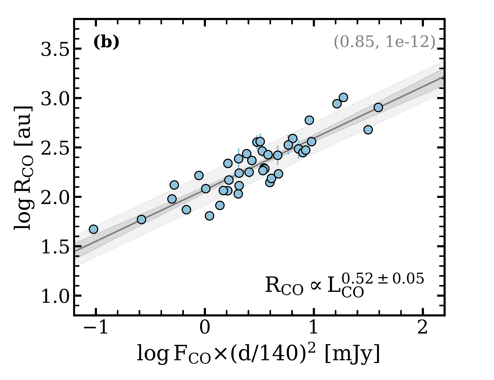
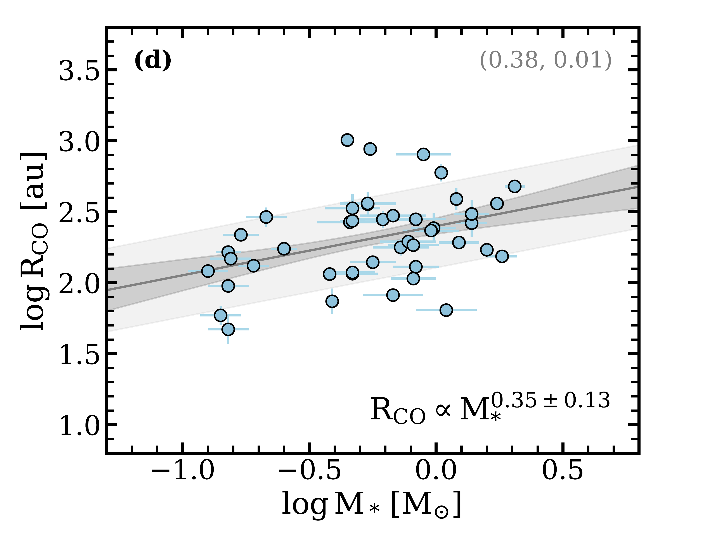
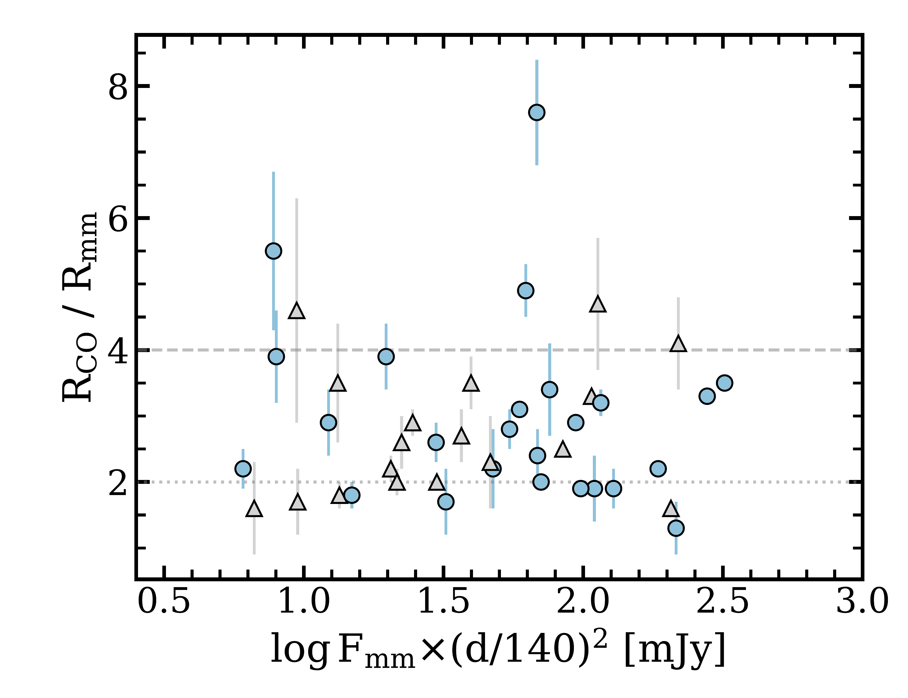
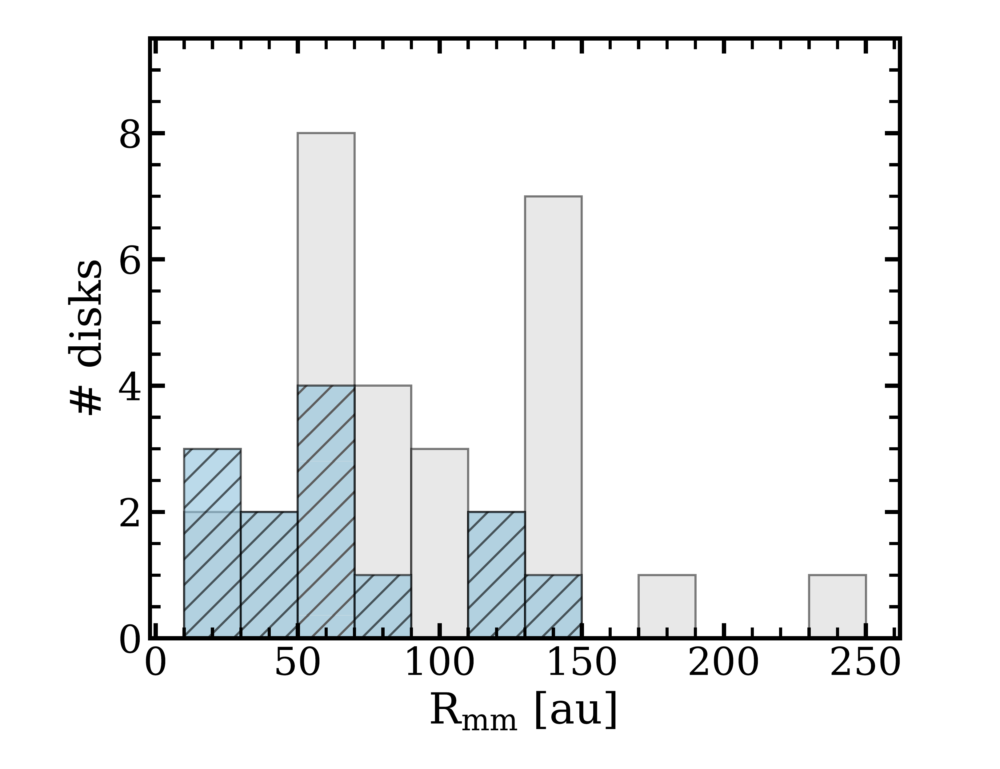
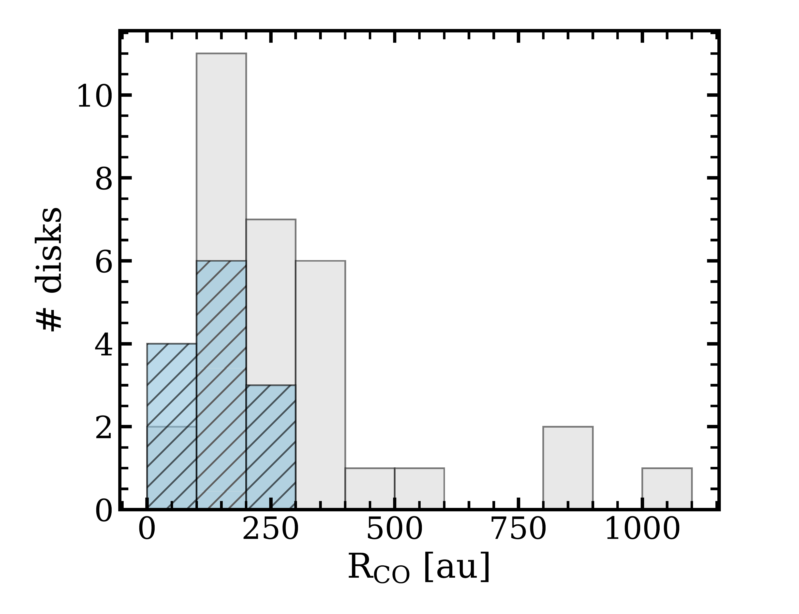
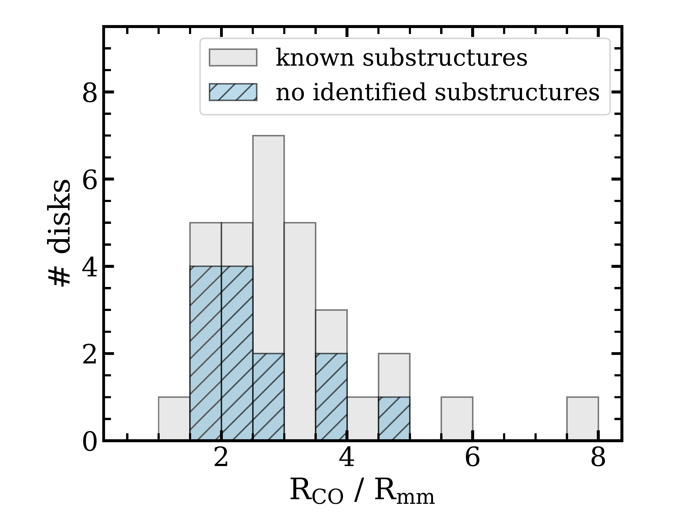

$\newcommand{\ensuremath}{}$
$\newcommand{\xspace}{}$
$\newcommand{\object}[1]{\texttt{#1}}$
$\newcommand{\farcs}{{.}''}$
$\newcommand{\farcm}{{.}'}$
$\newcommand{\arcsec}{''}$
$\newcommand{\arcmin}{'}$
$\newcommand{\vdag}{(v)^\dagger}$
$\newcommand$
$\newcommand$
$\newcommand{\feng}[1]$
$\newcommand{\oi}{[O {\scriptsize I}]}$

# Gas Disk Sizes from CO Line Observations: A Test of Angular Momentum Evolution

  _Accepted for publication in ApJ_

Feng Long(龙凤), et al. -- incl., <mark>Paola Pinilla</mark> 

 **Abstract:** The size of a disk encodes important information about its evolution. Combining new Submillimeter Array (SMA) observations with archival Atacama Large Millimeter Array (ALMA) data, we analyze mm continuum and CO emission line sizes for a sample of 44 protoplanetary disks around stars with masses of 0.15--2$ M_{\odot} $in several nearby star-forming regions.Sizes measured from$ ^{12} $CO line emission span from 50 to 1000 au. This range could be explained by viscous evolution models with different$ \alpha $values (mostly of$ 10^{-4}-10^{-3} $) and/or a spread of initial conditions.The CO sizes for most disks are also consistent with MHD wind models that directly remove disk angular momentum, but very large initial disk sizes would be required to account for the very extended CO disks in the sample. As no CO size evolution is observed across stellar ages of 0.5--20 Myr in this sample, determining the dominant mechanism of disk evolution will require a more complete sample for both younger and more evolved systems.We find that the CO emission is universally more extended than the continuum emission by an average factor of$ 2.9\pm1.2 $.The ratio of the CO to continuum sizes does not show any trend with stellar mass, mm continuum luminosity, or the properties of substructures.The GO Tau disk has the most extended CO emission in this sample, with an extreme CO to continuum size ratio of 7.6.Seven additional disks in the sample show high size ratios ($ \gtrsim4 $) that we interpret as clear signs of substantial radial drift.

**Figure 9. -** The comparison of disk sizes with stellar and disk properties. \textbf{(a)}$ L_{\rm mm} $  vs.  $ R_{\rm mm} $ . The scaled correlation from \citet{Andrews2018_Lmm} is marked as dashed line to demonstrate the generic properties of the sample.  \textbf{(b)}$ L_{\rm CO 2-1} $  vs.  $ R_{\rm CO} $ .
\textbf{(c)}$ M_{\rm *} $  vs.  $ R_{\rm mm} $ . \textbf{(d)}$ M_{\rm *} $  vs.  $ R_{\rm CO} $ . \textbf{(e)}$ L_{\rm *} $  vs.  $ R_{\rm CO} $ . \textbf{(f)} system age vs.  $ R_{\rm CO} $ .  The derived scaling relation is shown in grey solid line with the 68\% confidence interval marked in grey shaded region. The light shaded region denotes the scatter around the mean relation. The Pearson correlation coefficient and the corresponding  $ p- $ value are noted in the upper right corner in each panel.
\label{fig:LR} (*fig:LR*)

**Figure 3. -** The distribution of  $ R_{\rm CO} $ / $ R_{\rm mm} $  with stellar mass (upper) and disk mm luminosity (bottom). Grey triangles represent disks that either have cloud contamination around systemic velocities or  $ R_{\rm mm} $  is less than twice of the beam size, where in both cases  $ R_{\rm CO} $ / $ R_{\rm mm} $  is likely underestimated. \label{fig:ratio} (*fig:ratio*)

**Figure 10. -** The distribution of  $ R_{\rm mm} $ ,  $ R_{\rm CO} $ ,  $ R_{\rm CO} $ / $ R_{\rm mm} $  for disks with observed dust substructures (grey) and disks that are featureless at the resolution of currently available data (blue). The latter group of disks are more compact, but their CO-to-continuum size ratios are comparable to disks with substructures. \label{fig:ratio_hist} (*fig:ratio_hist*)

