

$\newcommand{\ensuremath}{}$
$\newcommand{\xspace}{}$
$\newcommand{\object}[1]{\texttt{#1}}$
$\newcommand{\farcs}{{.}''}$
$\newcommand{\farcm}{{.}'}$
$\newcommand{\arcsec}{''}$
$\newcommand{\arcmin}{'}$

# The atmosphere of 55 Cnc eThe PEPSI Exoplanet Transit Survey (PETS) I:

Investigating the presence of a silicate atmosphere on the super-Earth 55 Cnc e

  _MNRAS, in press_

Engin Keles, et al. -- incl., <mark>Matthias Mallonn</mark>, <mark>Thomas Henning</mark> 

 **Abstract:** The study of exoplanets and especially their atmospheres can reveal key insights on their evolution by identifying specific atmospheric species. For such atmospheric investigations, high-resolution transmission spectroscopy has shown great success, especially for Jupiter-type planets. Towards the atmospheric characterization of smaller planets, the super-Earth exoplanet 55 Cnc e is one of the most promising terrestrial exoplanets studied to date. Here, we present a high-resolution spectroscopic transit observation of this planet, acquired with the PEPSI instrument at the Large Binocular Telescope. Assuming the presence of Earth-like crust species on the surface of 55 Cnc e, from which a possible silicate-vapor atmosphere could have originated, we search in its transmission spectrum for absorption of various atomic and ionized species such as\ion{Fe},\ion{Fe}\textsuperscript{+},\ion{Ca},\ion{Ca}\textsuperscript{+},\ion{Mg}and\ion{K}, among others. Not finding absorption for any of the investigated species, we are able to set absorption limits with a median\mbox{value of 1.9  $ \times $  R\textsubscript{P}}. In conclusion, we do not find evidence of a widely extended silicate envelope on this super-Earth reaching several planetary radii.

**Figure 1. -** The top panel shows the spectrum observed at the lowest airmass (yellow) and highest airmass (blue) at a spectral region where telluric water lines are evident. The central panel shows the transmission spectrum derived by dividing the in-transit spectra by the mean out-of-transit spectrum. The bottom panel shows the pixel-by-pixel approach to derive the transmission spectrum. (*fig:func*)

**Figure 3. -** The combined transmission spectra for the \ion{Mg}{I}-triplet, the H $ \beta $ -line, the \ion{K}{I} line and the \ion{Ca}{II}-IR-triplet lines. The yellow shaded region shows the expected absorption position  $ \pm $ 1\AA. (*fig:transspec*)

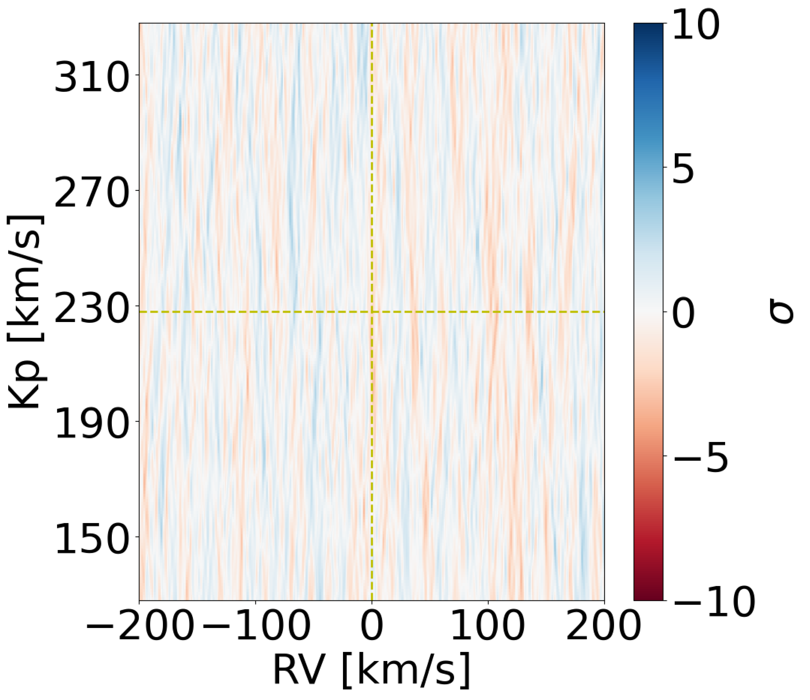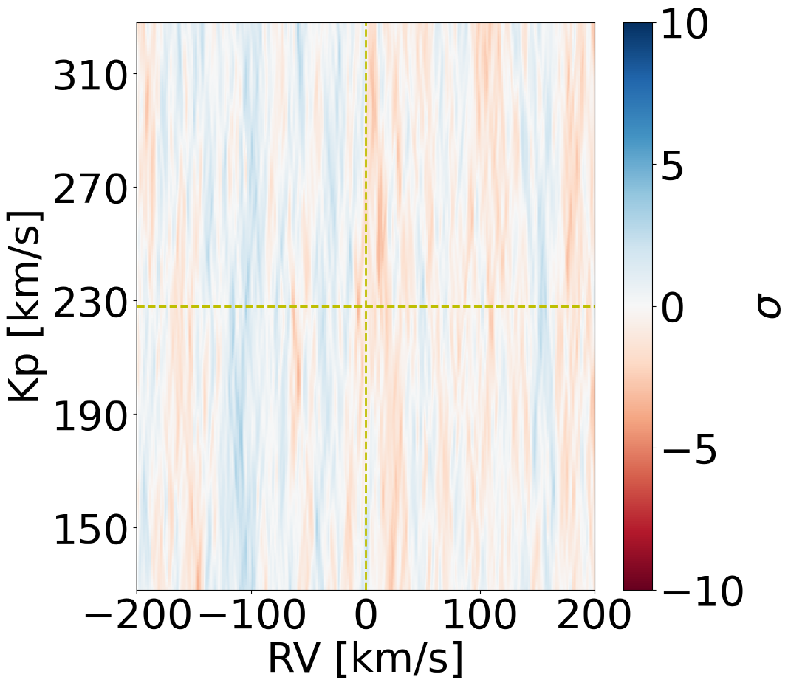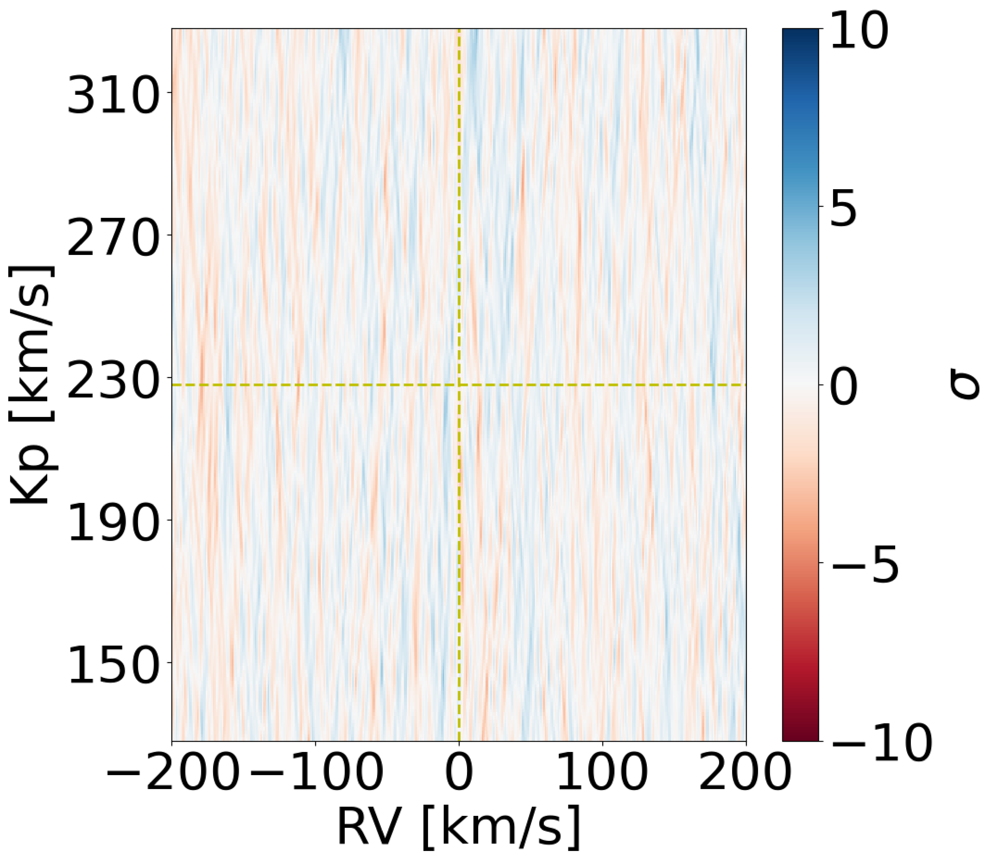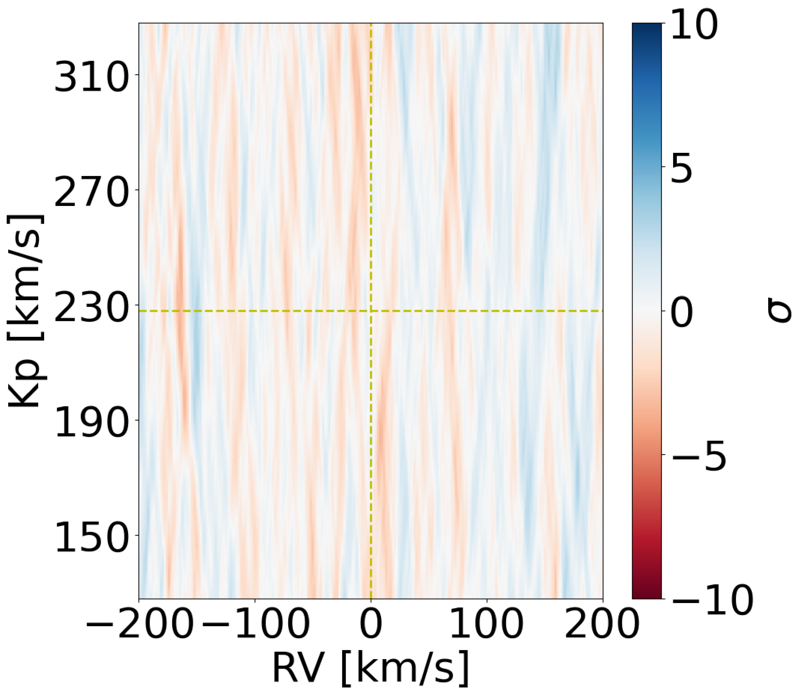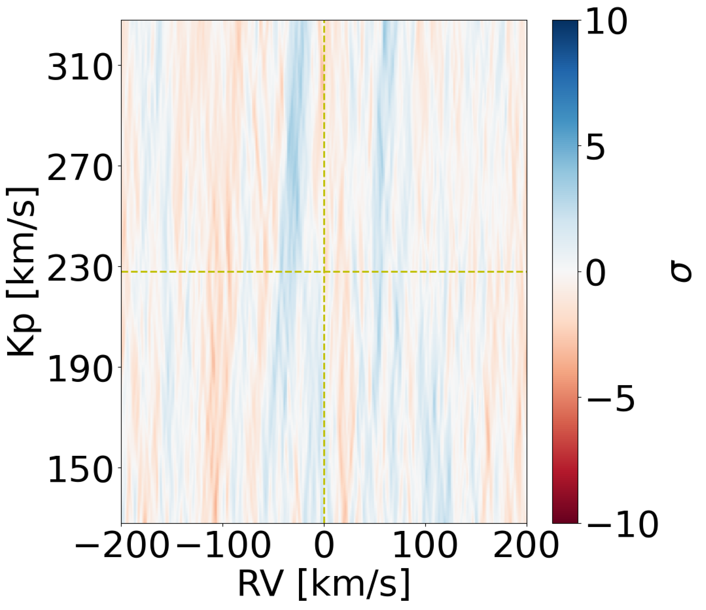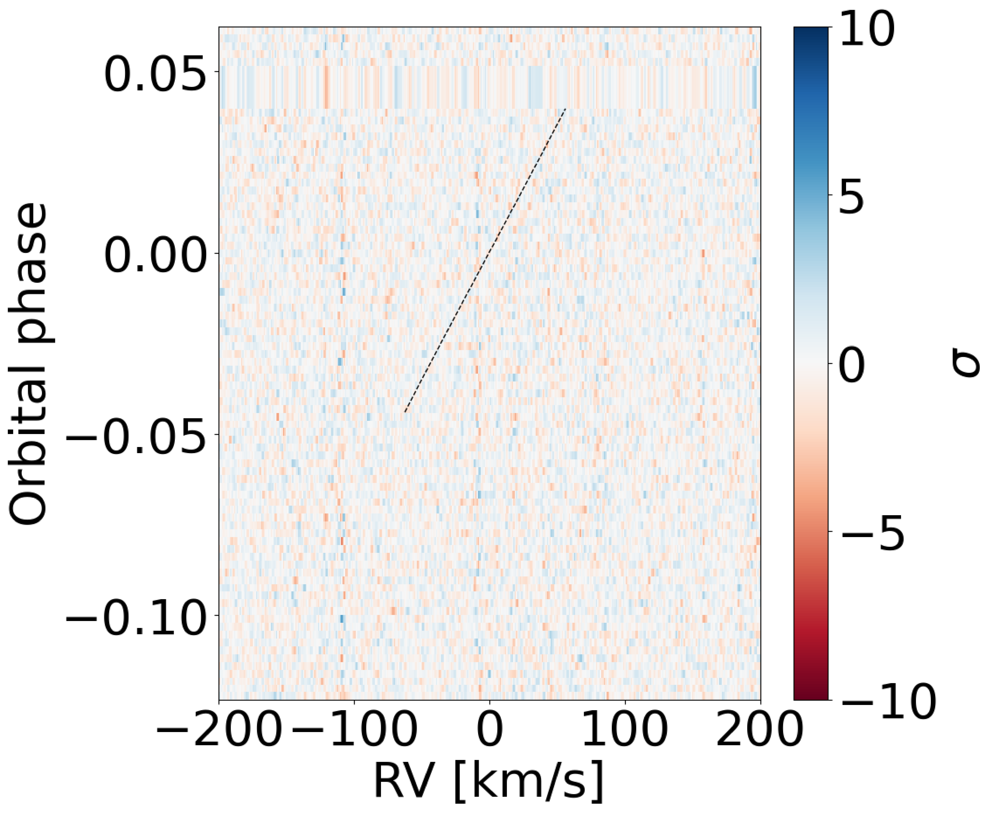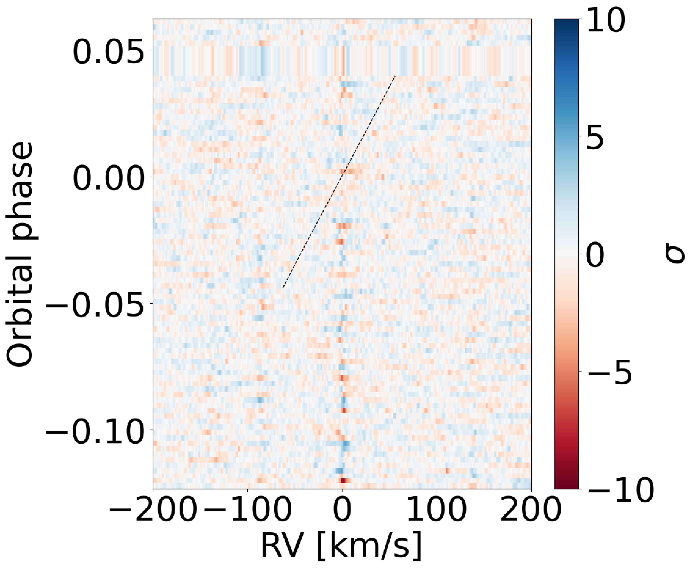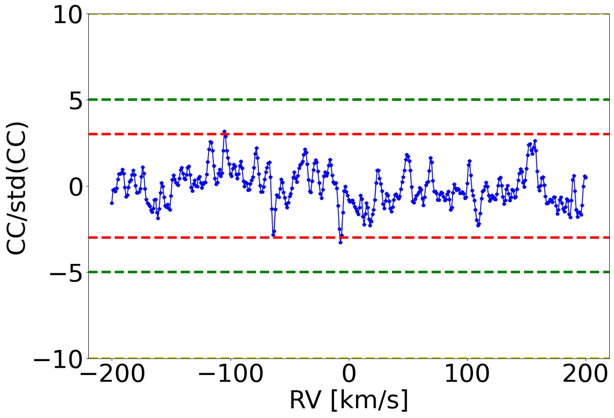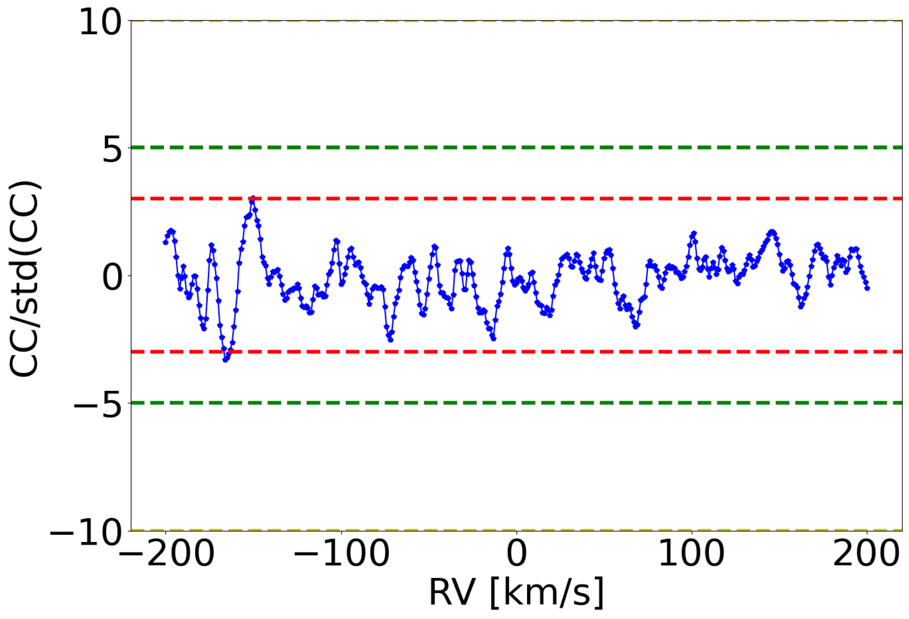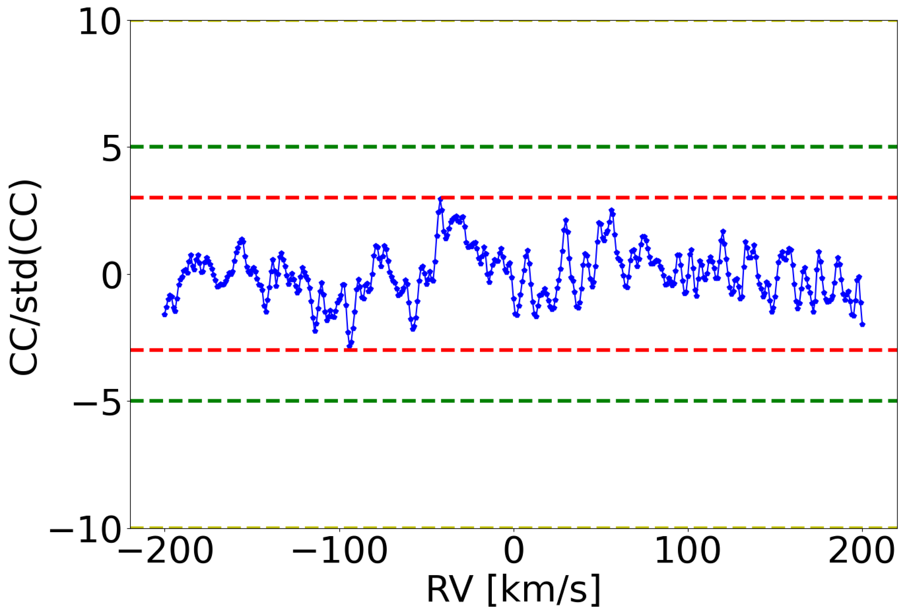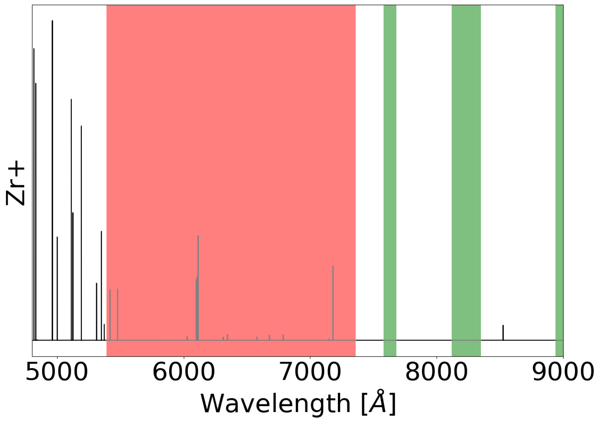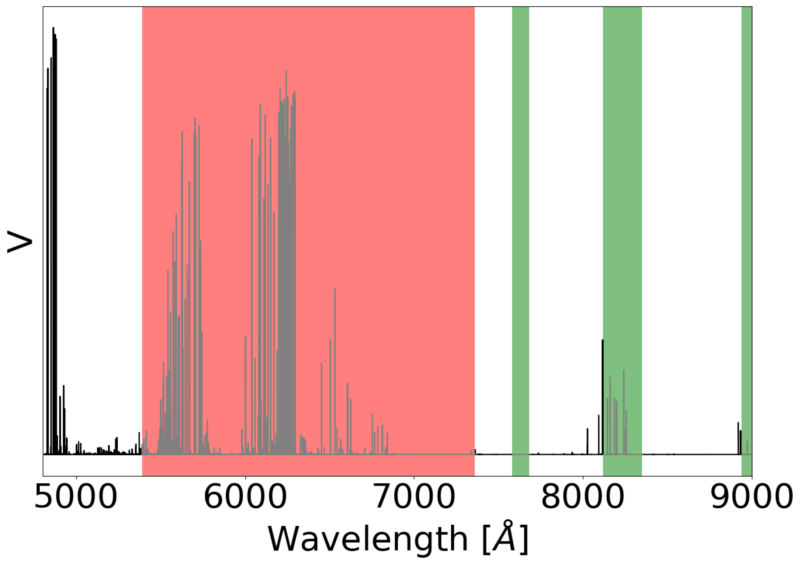

**Figure 8. -** Same as Figure \ref{fig:A1} (*fig:A4*)

