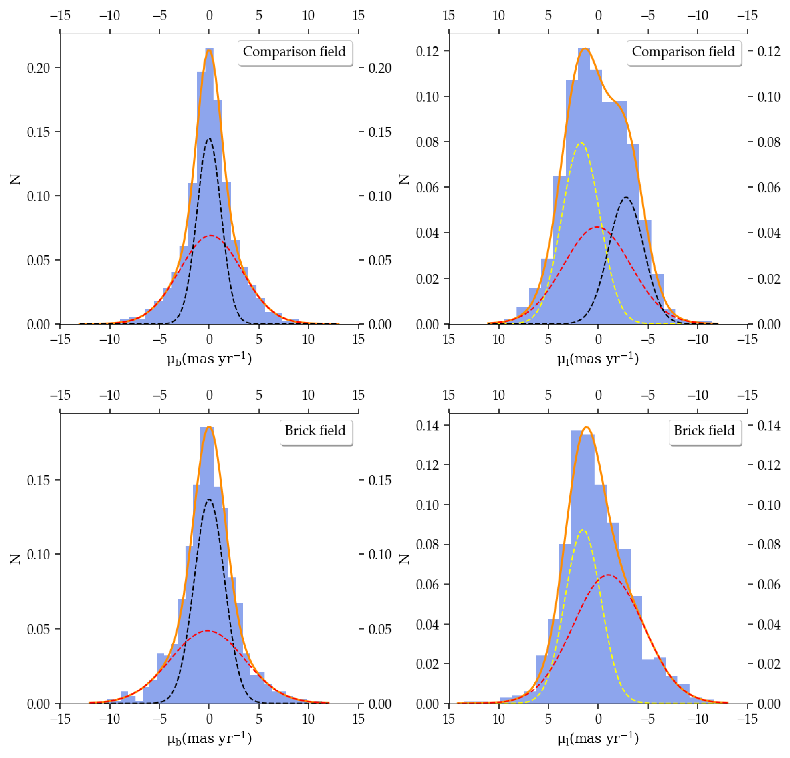

$\newcommand{\ensuremath}{}$
$\newcommand{\xspace}{}$
$\newcommand{\object}[1]{\texttt{#1}}$
$\newcommand{\farcs}{{.}''}$
$\newcommand{\farcm}{{.}'}$
$\newcommand{\arcsec}{''}$
$\newcommand{\arcmin}{'}$
$\newcommand{\ion}[2]{#1#2}$
$\newcommand{\quotes}[1]{"#1"}$

$\newcommand{$\ensuremath$}{}$
$\newcommand{$\xspace$}{}$
$\newcommand{$\object$}[1]{\texttt{#1}}$
$\newcommand{$\farcs$}{{.}''}$
$\newcommand{$\farcm$}{{.}'}$
$\newcommand{$\arcsec$}{''}$
$\newcommand{$\arcmin$}{'}$
$\newcommand{$\ion$}[2]{#1#2}$
$\newcommand{$\quotes$}[1]{"#1"}$

# Distance to the Brick cloud using stellar kinematics 

 _5 pages, 5 figures_

Á. Martínez-Arranz, R. Schödel, <mark><mark>F. Nogueras-Lara</mark></mark>, B. Shahzamanian

**Abstract:** The central molecular zone at the Galactic center is currently being studied intensively to understand how star formation proceeds under the extreme conditions of a galactic nucleus. Knowing the position of molecular clouds along the line of sight toward the Galactic center has had important implications in our understanding of the physics of the gas and star formation in the central molecular zone.	It was recently claimed that the dense molecular cloud G0.253 + 0.016 (the Brick) has a distance of$\sim$7.20 kpc from the Sun. That would place it outside of the central molecular zone, and therefore of the nuclear stellar disk, but still inside the Bulge.Theoretical considerations as well as observational studies show that stars that belong to the nuclear stellar disk have different kinematics from those that belong to the inner Bulge. Therefore, we aim to constrain the distance to the Brick by studying the proper motions of the stars in the area.We used ESO HAWK-I/VLT imaging data from epochs 2015 and 2019 to compute proper motions on the Brick and in a nearby comparison field free of dark clouds.The stellar population seen toward the nuclear stellar disk shows the following three kinematic components: 1) Bulge stars with an isotropic velocity dispersion of$\sim$3.5 micro-arc second per year; 2) eastward moving stars on the near side of the nuclear stellar disk; and 3) westward moving stars on the far side of the nuclear stellar disk. We clearly see all three components toward the comparison field. However, toward the Brick, which blocks the light from stars behind it, we can only see kinematic components 1) and 2).While the Brick blocks the light from  stars on the far side of the nuclear stellar disk, the detection of a significant component of eastward streaming stars implies that the Brick must be located inside the nuclear stellar disk and, therefore, that it forms part of the central molecular zone.

**Figure 4. -** Proper motion distribution for the comparison field (top row) and the Brick field (bottom row). Left-hand plots correspond to the perpendicular component, where the red Gaussian represents the Bulge stars and the black one corresponds to the NSD stars. Right-hand plots correspond to the parallel component, where the red Gaussian represents the Bulge stars and the yellow and black ones represent the NSD stars moving eastward and westward, respectively.
	 (*all_in_one*)

**Figure 1. -**  Pointings from GNS (outlined in black) and D19 (in white) overlaid on a 4.5 $\mu m $ Spitzer/IRAC image \citep{Sch_del_2014}. The GNS pointings cover smaller areas because of detector windowing. The overlapping areas used for proper motion calculations are shown in blue (on the Brick) and green (comparison field).
		 (*region*)

**Figure 2. -**  Relative astrometric uncertainty as a function of H magnitude for all stars in the Brick and comparison fields that are common to D15(red dots) and D19 (black dots).  (*pilot_study*)

