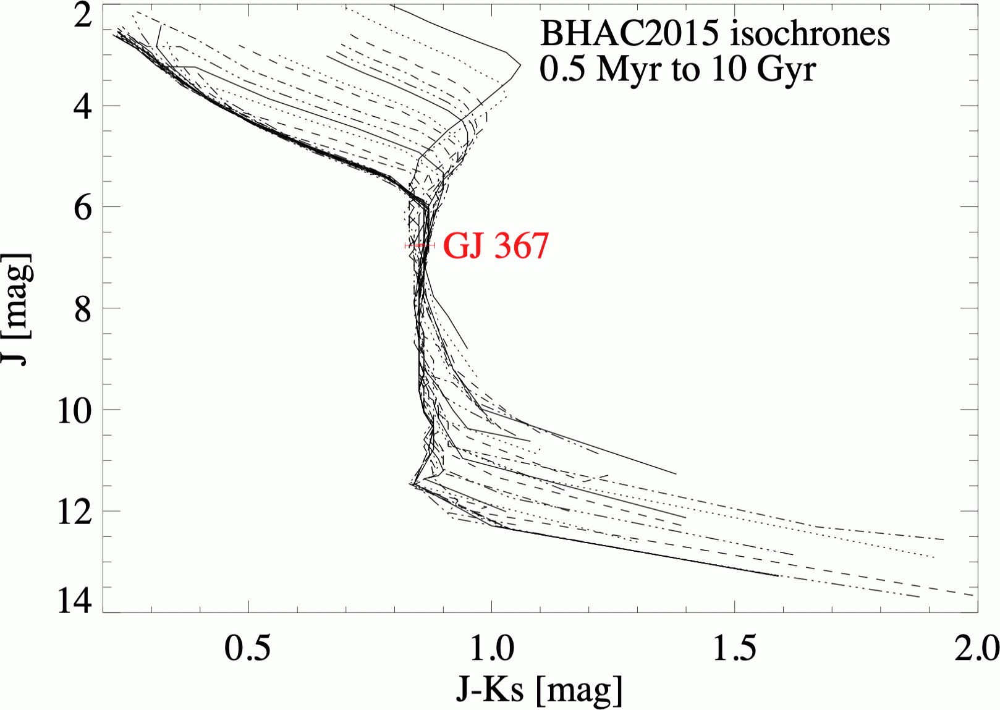

$\newcommand{\ensuremath}{}$
$\newcommand{\xspace}{}$
$\newcommand{\object}[1]{\texttt{#1}}$
$\newcommand{\farcs}{{.}''}$
$\newcommand{\farcm}{{.}'}$
$\newcommand{\arcsec}{''}$
$\newcommand{\arcmin}{'}$
$\newcommand{\ion}[2]{#1#2}$
$\newcommand{\textsc}[1]{\textrm{#1}}$
$\newcommand{\hl}[1]{\textrm{#1}}$
$\newcommand{\thebibliography}{\DeclareRobustCommand{\VAN}[3]{##3}\VANthebibliography}$

$\newcommand{$\ensuremath$}{}$
$\newcommand{$\xspace$}{}$
$\newcommand{$\object$}[1]{\texttt{#1}}$
$\newcommand{$\farcs$}{{.}''}$
$\newcommand{$\farcm$}{{.}'}$
$\newcommand{$\arcsec$}{''}$
$\newcommand{$\arcmin$}{'}$
$\newcommand{$\ion$}[2]{#1#2}$
$\newcommand{$\textsc$}[1]{\textrm{#1}}$
$\newcommand{$\hl$}[1]{\textrm{#1}}$
$\newcommand{$\thebibliography$}{\DeclareRobustCommand{\VAN}[3]{##3}\VANthebibliography}$

# High-contrast, high-angular resolution view of the GJ 367 exoplanet system

 _9 pages, 8 figures, accepted by MNRAS_

Wolfgang Brandner, Per Calissendorff, <mark><mark>Neige Frankel</mark></mark>, Faustine Cantalloube

**Abstract:** We search for additional companions in the GJ 367 exoplanet system, and aim at better constraining its age and evolutionary status.We analyse high contrast direct imaging observations obtained with HST/NICMOS, VLT/NACO, and VLT/SPHERE. We investigate and critically discuss conflicting age indicators based on theoretical isochrones and models for Galactic dynamics.A comparison of GAIA EDR3 parallax and photometric measurements with theoretical isochrones suggest a young age$\le$60 Myr for GJ 367. The star's Galactic kinematics exclude membership to any nearby young moving group or stellar stream. Its highly eccentric Galactic orbit, however, is atypical for a young star. Age estimates considering Galactic dynamical evolution are most consistent with an age of 1 to 8 Gyr. We find no evidence for a significant mid-infrared excess in the WISE bands, suggesting the absence of warm dust in the GJ 367 system.The direct imaging data provide significantly improved detection limits compared to previous studies. At 530 mas (5 au) separation, the SPHERE data achieve a 5 sigma contrast of$2.6 \times 10^{-6}$. The data exclude the presence of a stellar companion at projected separations$\ge$0.4 au. At projected separations$\ge$5 au we can exclude substellar companions with a mass$\ge$1.5 M$_{\rm Jup}$for an age of 50 Myr, and$\ge$20 M$_{\rm Jup}$for an age of 5 Gyr.By applying the stellar parameters corresponding to the 50 Myr isochrone, we derive a bulk density of$\rho_{\rm planet} = 6.2$g/cm$^3$for GJ 367 b, which is 25\%smaller than a previous estimate.

**Figure 5. -** Left: HST NIC2 image in F110W centered on GJ 367, with five companion candidates (cc) visible (black circles). The location of residuals originating in NIC2's coronagraphic mask is indicated (white circle). Right: VLT/NACO image in NB175 centered on GJ 367. The lower left insert shows a $4\times$ zoom-in on an individual 10s frame depicting a side-lope resulting from the low wind effect. The insert on the lower right shows a $4\times$ zoom-in of the coadded PSF. (*GJ367_NIC2_NACO*)

**Figure 7. -** Colour-magnitude diagrams for GJ 367 compared of theoretical models by \cite{Baraffe2015}. The plot on the left shows isochrones in the GAIA photometric systems, with GJ 367 (red symbol) being located below the 50 Myr and above the 80 Myr isochrone. The plot on the right illustrates that isochrones transformed to 2MASS bands do not provide any meaningful constraint on GJ 367's age. The 1 $\sigma$ error bars in both plots are based on the uncertainties in photometry and parallax. (*GJ367_age_mag*)

**Figure 1. -** Radial 5 $\sigma$ contrast achieved with NIC2 in the F180M filter (dash-dotted line, \cite{Dieterich2012}), and SADI processed SPHERE/IRDIS in the H2/H3-filters (red dashed line) plotted over the projected separation. (*contrast_h2*)

