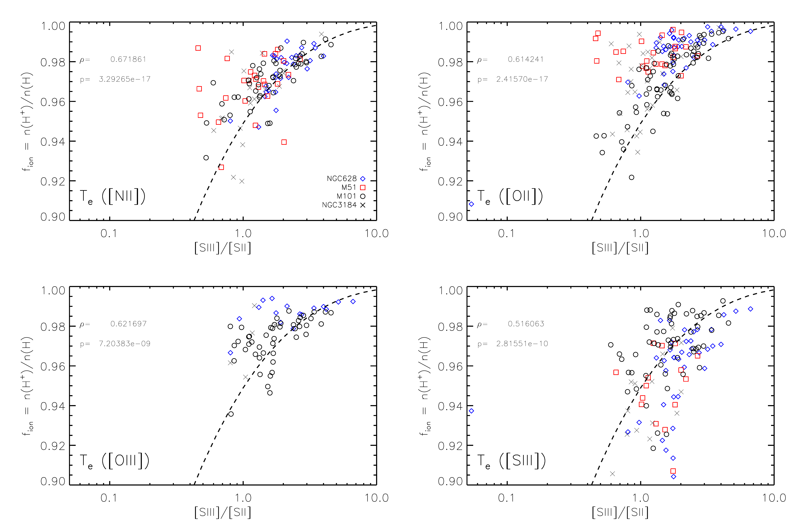
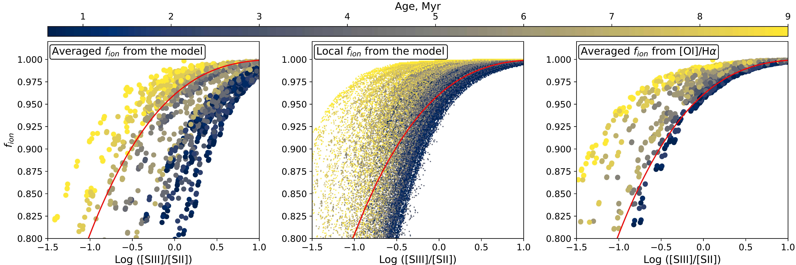
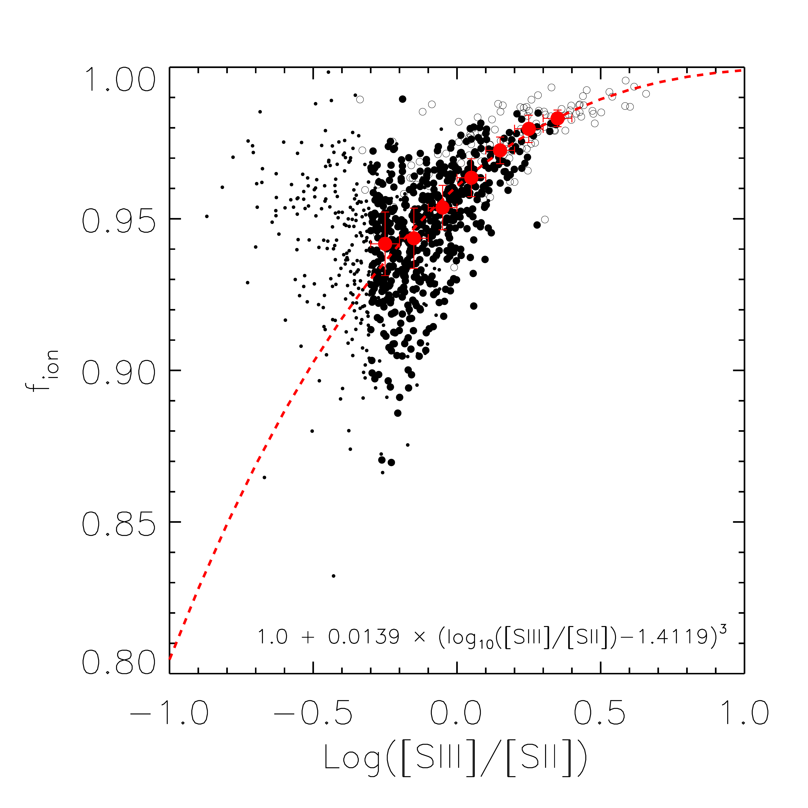

$\newcommand{\ensuremath}{}$
$\newcommand{\xspace}{}$
$\newcommand{\object}[1]{\texttt{#1}}$
$\newcommand{\farcs}{{.}''}$
$\newcommand{\farcm}{{.}'}$
$\newcommand{\arcsec}{''}$
$\newcommand{\arcmin}{'}$
$\newcommand{\ion}[2]{#1#2}$
$\newcommand{\textsc}[1]{\textrm{#1}}$
$\newcommand{\hl}[1]{\textrm{#1}}$
$\newcommand{\oiii}{[O \textsc{iii}]}$
$\newcommand{\nii}{[N \textsc{ii}]}$
$\newcommand{\sii}{[S \textsc{ii}]}$
$\newcommand{\oi}{[O \textsc{i}]}$
$\newcommand{\niion}{[N \textsc{i}]}$
$\newcommand{\hei}{[He \textsc{i}]}$
$\newcommand{\siii}{[S \textsc{iii}]}$
$\newcommand{\oii}{[O \textsc{ii}]}$
$\newcommand{\hii}{H \textsc{ii}}$
$\newcommand{\ha}{H\alpha}$
$\newcommand{\hb}{H\beta}$
$\newcommand{\te}{T_{\rm e}}$
$\newcommand{\fion}{f_{\rm ion}}$
$\newcommand$
$\newcommand{\revone}$
$\newcommand{\OSU}{\label{OSU} Department of Astronomy, The Ohio State University, 140 West 18th Avenue, Columbus, Ohio 43210, USA}$
$\newcommand{\Alberta}{\label{Alberta} Department of Physics, University of Alberta, Edmonton, AB T6G 2E1, Canada}$
$\newcommand{\ANU}{\label{ANU} Research School of Astronomy and Astrophysics, Australian National University, Canberra, ACT 2611, Australia}$
$\newcommand{\IPAC}{\label{IPAC} Caltech-IPAC, 1200 E. California Blvd. Pasadena, CA 91125, USA}$
$\newcommand{\Carnegie}{\label{Carnegi} Observatories of the Carnegie Institution for Science, 813 Santa Barbara Street, Pasadena, CA 91101, USA}$
$\newcommand{\CCAPP}{\label{CCAPP} Center for Cosmology and Astroparticle Physics, 191 West Woodruff Avenue, Columbus, OH 43210, USA}$
$\newcommand{\CfA}{\label{CfA} Harvard-Smithsonian Center for Astrophysics, 60 Garden Street, Cambridge, MA 02138, USA}$
$\newcommand{\CITEVA}{\label{CITEVA} Centro de Astronomía (CITEVA), Universidad de Antofagasta, Avenida Angamos 601, Antofagasta, Chile}$
$\newcommand{\CNRS}{\label{CNRS} CNRS, IRAP, 9 Av. du Colonel Roche, BP 44346, F-31028 Toulouse cedex 4, France}$
$\newcommand{\ESO}{\label{ESO} European Southern Observatory, Karl-Schwarzschild Stra{\ss}e 2, D-85748 Garching bei M\"{u}nchen, Germany}$
$\newcommand{\HD}{\label{HD} Astronomisches Rechen-Institut, Zentrum f\"{u}r Astronomie der Universit\"{a}t Heidelberg, M\"{o}nchhofstra\ss e 12-14, D-69120 Heidelberg, Germany}$
$\newcommand{\ICRAR}{\label{ICRAR} International Centre for Radio Astronomy Research, University of Western Australia, 35 Stirling Highway, Crawley, WA 6009, Australia}$
$\newcommand{\IRAM}{\label{IRAM} Institut de Radioastronomie Millimétrique (IRAM), 300 Rue de la Piscine, F-38406 Saint Martin d'Hères, France}$
$\newcommand{\ITA}{\label{ITA} Universit\"{a}t Heidelberg, Zentrum f\"{u}r Astronomie, Institut f\"{u}r Theoretische Astrophysik, Albert-Ueberle-Str 2, D-69120 Heidelberg, Germany}$
$\newcommand{\IWR}{\label{IWR} Universit\"{a}t Heidelberg, Interdisziplin\"{a}res Zentrum f\"{u}r Wissenschaftliches Rechnen, Im Neuenheimer Feld 205, D-69120 Heidelberg, Germany}$
$\newcommand{\JHU}{\label{JHU} Department of Physics and Astronomy, The Johns Hopkins University, Baltimore, MD 21218, USA}$
$\newcommand{\Leiden}{\label{Leiden} Leiden Observatory, Leiden University, P.O. Box 9513, 2300 RA Leiden, The Netherlands}$
$\newcommand{\Maryland}{\label{Maryland} Department of Astronomy, University of Maryland, College Park, MD 20742, USA}$
$\newcommand{\MPE}{\label{MPE} Max-Planck-Institut f\"{u}r extraterrestrische Physik, Giessenbachstra{\ss}e 1, D-85748 Garching, Germany}$
$\newcommand{\MPIA}{\label{MPIA} Max-Planck-Institut f\"{u}r Astronomie, K\"{o}nigstuhl 17, D-69117, Heidelberg, Germany}$
$\newcommand{\Nagoya}{\label{Nagoya} Department of Physics, Nagoya University, Furo-cho, Chikusa-ku, Nagoya, Aichi 464-8602, Japan}$
$\newcommand{\NRAO}{\label{NRAO} National Radio Astronomy Observatory, 520 Edgemont Road, Charlottesville, VA 22903-2475, USA}$
$\newcommand{\OAN}{\label{OAN} Observatorio Astronómico Nacional (IGN), C/Alfonso XII, 3, E-28014 Madrid, Spain}$
$\newcommand{\ObsParis}{\label{ObsParis} Sorbonne Université, Observatoire de Paris, Université PSL, CNRS, LERMA, F-75014, Paris, France}$
$\newcommand{\Princeton}{\label{Princeton} Department of Astrophysical Sciences, Princeton University, Princeton, NJ 08544 USA}$
$\newcommand{\UToledo}{\label{UToledo} University of Toledo, 2801 W. Bancroft St., Mail Stop 111, Toledo, OH, 43606}$
$\newcommand{\Toulouse}{\label{Toulouse} Université de Toulouse, UPS-OMP, IRAP, F-31028 Toulouse cedex 4, France}$
$\newcommand{\UBonn}{\label{UBonn} Argelander-Institut f\"ur Astronomie, Universit\"at Bonn, Auf dem H\"ugel 71, 53121 Bonn, Germany}$
$\newcommand{\UChile}{\label{UChile} Departamento de Astronomía, Universidad de Chile, Camino del Observatorio 1515, Las Condes, Santiago, Chile}$
$\newcommand{\UConn}{\label{UConn} Department of Physics, University of Connecticut, Storrs, CT, 06269, USA}$
$\newcommand{\UCSD}{\label{UCSD} Center for Astrophysics and Space Sciences, Department of Physics,  University of California, San Diego, 9500 Gilman Drive, La Jolla, CA 92093, USA}$
$\newcommand{\UGent}{\label{UGent} Sterrenkundig Observatorium, Universiteit Gent, Krijgslaan 281 S9, B-9000 Gent, Belgium}$
$\newcommand{\ULyon}{\label{ULyon} Univ Lyon, Univ Lyon 1, ENS de Lyon, CNRS, Centre de Recherche Astrophysique de Lyon UMR5574,\F-69230 Saint-Genis-Laval, France}$
$\newcommand{\UMass}{\label{UMass} University of Massachusetts—Amherst, 710 N. Pleasant Street, Amherst, MA 01003, USA}$
$\newcommand{\UWyoming}{\label{UWyoming} Department of Physics and Astronomy, University of Wyoming, Laramie, WY 82071, USA}$
$\newcommand{\LAM}{\label{LAM} Aix Marseille Univ, CNRS, CNES, LAM (Laboratoire d’Astrophysique de Marseille), Marseille, France}$
$\newcommand{\UHawaii}{\label{UHawaii} Institute for Astronomy, University of Hawaii, 2680 Woodlawn Drive, Honolulu, HI 96822, USA}$
$\newcommand{\UCM}{\label{UCM} Departamento de F\'{\i}sica de la Tierra y Astrof\'{\i}sica, Universidad Complutense de Madrid, E-28040, Spain}$
$\newcommand{\IPARC}{\label{IPARC} Instituto de F\'{\i}sica de Part\'{\i}culas y del Cosmos IPARCOS, Facultad de Ciencias F\'{\i}sicas, Universidad Complutense de Madrid, E-28040, Spain}$
$\newcommand{\STScI}{\label{STScI} Space Telescope Science Institute, 3700 San Martin Drive, Baltimore, MD 21218, USA}$
$\newcommand{\McMaster}{\label{McMaster} Department of Physics and Astronomy, McMaster University, 1280 Main Street West, Hamilton, ON L8S 4M1, Canada}$
$\newcommand{\INAF}{\label{INAF} INAF -- Osservatorio Astrofisico di Arcetri, Largo E. Fermi 5, I-50157, Firenze, Italy}$
$\newcommand{\Sydney}{\label{Sydney} Sydney Institute for Astronomy, School of Physics A28, The University of Sydney, NSW 2006, Australia}$
$\newcommand{\UA}{\label{UA} Centro de Astronomía (CITEVA), Universidad de Antofagasta, Avenida Angamos 601, Antofagasta, Chile}$
$\newcommand{\CITA}{\label{CITA} Canadian Institute for Theoretical Astrophysics (CITA), University of Toronto, 60 St George St, Toronto, ON M5S 3H8, Canada}$
$\newcommand{\ASIAA}{\label{ASIAA} Institute of Astronomy and Astrophysics, Academia Sinica, No. 1, Sec. 4, Roosevelt Road, Taipei 10617, Taiwan}$
$\newcommand{\TKU}{\label{TKU} Department of Physics, Tamkang University, No.151, Yingzhuan Rd., Tamsui Dist., New Taipei City 251301, Taiwan}$
$\newcommand{\PSMA}{\label{PSMA} Penn State Mont Alto, 1 Campus Drive, Mont Alto, PA  17237, USA}$
$\newcommand{\ILL}{\label{ILL} ILL}$
$\newcommand{\stromlo}{\label{stromlo} Research School of Astronomy and Astrophysics, Australian National University, Mt Stromlo Observatory, Weston Creek, ACT 2611, Australia}$
$\newcommand{\}{natexlab}$

$\newcommand{$\ensuremath$}{}$
$\newcommand{$\xspace$}{}$
$\newcommand{$\object$}[1]{$\te$xttt{#1}}$
$\newcommand{$\farcs$}{{.}''}$
$\newcommand{$\farcm$}{{.}'}$
$\newcommand{$\arcsec$}{''}$
$\newcommand{$\arcmin$}{'}$
$\newcommand{$\ion$}[2]{#1#2}$
$\newcommand{$\textsc$}[1]{$\te$xtrm{#1}}$
$\newcommand{$\hl$}[1]{$\te$xtrm{#1}}$
$\newcommand{$\oiii$}{[O $\textsc${iii}]}$
$\newcommand{$\nii$}{[N $\textsc${ii}]}$
$\newcommand{$\sii$}{[S $\textsc${ii}]}$
$\newcommand{$\oi$}{[O $\textsc${i}]}$
$\newcommand{$\nii$on}{[N $\textsc${i}]}$
$\newcommand{$\hei$}{[He $\textsc${i}]}$
$\newcommand{$\sii$i}{[S $\textsc${iii}]}$
$\newcommand{$\oi$i}{[O $\textsc${ii}]}$
$\newcommand{$\hii$}{H $\textsc${ii}}$
$\newcommand{$\ha$}{H\alpha}$
$\newcommand{$\hb$}{H\beta}$
$\newcommand{$\te$}{T_{\rm e}}$
$\newcommand{$\fion$}{f_{\rm ion}}$
$\newcommand$
$\newcommand{$\revone$}$
$\newcommand{$\OSU$}{\label{OSU} Department of Astronomy, The Ohio State University, 140 West 18th Avenue, Columbus, Ohio 43210, USA}$
$\newcommand{$\Alberta$}{\label{Alberta} Department of Physics, University of Alberta, Edmonton, AB T6G 2E1, Canada}$
$\newcommand{$\ANU$}{\label{ANU} Research School of Astronomy and Astrophysics, Australian National University, Canberra, ACT 2611, Australia}$
$\newcommand{$\IPAC$}{\label{IPAC} Caltech-IPAC, 1200 E. California Blvd. Pasadena, CA 91125, USA}$
$\newcommand{$\Carnegie$}{\label{Carnegi} Observatories of the Carnegie Institution for Science, 813 Santa Barbara Street, Pasadena, CA 91101, USA}$
$\newcommand{$\CCAPP$}{\label{CCAPP} Center for Cosmology and Astroparticle Physics, 191 West Woodruff Avenue, Columbus, OH 43210, USA}$
$\newcommand{$\CfA$}{\label{CfA} Harvard-Smithsonian Center for Astrophysics, 60 Garden Street, Cambridge, MA 02138, USA}$
$\newcommand{$\CITEVA$}{\label{CITEVA} Centro de Astronomía (CITEVA), Universidad de Antofagasta, Avenida Angamos 601, Antofagasta, Chile}$
$\newcommand{$\CNRS$}{\label{CNRS} CNRS, IRAP, 9 Av. du Colonel Roche, BP 44346, F-31028 Toulouse cedex 4, France}$
$\newcommand{$\ESO$}{\label{ESO} European Southern Observatory, Karl-Schwarzschild Stra{\ss}e 2, D-85748 Garching bei M\"{u}nchen, Germany}$
$\newcommand{$\HD$}{\label{HD} Astronomisches Rechen-Institut, Zentrum f\"{u}r Astronomie der Universit\"{a}t Heidelberg, M\"{o}nchhofstra\ss e 12-14, D-69120 Heidelberg, Germany}$
$\newcommand{$\ICRAR$}{\label{ICRAR} International Centre for Radio Astronomy Research, University of Western Australia, 35 Stirling Highway, Crawley, WA 6009, Australia}$
$\newcommand{$\IRAM$}{\label{IRAM} Institut de Radioastronomie Millimétrique (IRAM), 300 Rue de la Piscine, F-38406 Saint Martin d'Hères, France}$
$\newcommand{$\ITA$}{\label{ITA} Universit\"{a}t Heidelberg, Zentrum f\"{u}r Astronomie, Institut f\"{u}r Theoretische Astrophysik, Albert-Ueberle-Str 2, D-69120 Heidelberg, Germany}$
$\newcommand{$\IWR$}{\label{IWR} Universit\"{a}t Heidelberg, Interdisziplin\"{a}res Zentrum f\"{u}r Wissenschaftliches Rechnen, Im Neuenheimer Feld 205, D-69120 Heidelberg, Germany}$
$\newcommand{$\JHU$}{\label{JHU} Department of Physics and Astronomy, The Johns Hopkins University, Baltimore, MD 21218, USA}$
$\newcommand{$\Leiden$}{\label{Leiden} Leiden Observatory, Leiden University, P.O. Box 9513, 2300 RA Leiden, The Netherlands}$
$\newcommand{$\Maryland$}{\label{Maryland} Department of Astronomy, University of Maryland, College Park, MD 20742, USA}$
$\newcommand{$\MPE$}{\label{MPE} Max-Planck-Institut f\"{u}r extraterrestrische Physik, Giessenbachstra{\ss}e 1, D-85748 Garching, Germany}$
$\newcommand{$\MPIA$}{\label{MPIA} Max-Planck-Institut f\"{u}r Astronomie, K\"{o}nigstuhl 17, D-69117, Heidelberg, Germany}$
$\newcommand{$\Nagoya$}{\label{Nagoya} Department of Physics, Nagoya University, Furo-cho, Chikusa-ku, Nagoya, Aichi 464-8602, Japan}$
$\newcommand{$\NRAO$}{\label{NRAO} National Radio Astronomy Observatory, 520 Edgemont Road, Charlottesville, VA 22903-2475, USA}$
$\newcommand{$\OAN$}{\label{OAN} Observatorio Astronómico Nacional (IGN), C/Alfonso XII, 3, E-28014 Madrid, Spain}$
$\newcommand{$\ObsParis$}{\label{ObsParis} Sorbonne Université, Observatoire de Paris, Université PSL, CNRS, LERMA, F-75014, Paris, France}$
$\newcommand{$\Princeton$}{\label{Princeton} Department of Astrophysical Sciences, Princeton University, Princeton, NJ 08544 USA}$
$\newcommand{$\UToledo$}{\label{UToledo} University of Toledo, 2801 W. Bancroft St., Mail Stop 111, Toledo, OH, 43606}$
$\newcommand{$\Toulouse$}{\label{Toulouse} Université de Toulouse, UPS-OMP, IRAP, F-31028 Toulouse cedex 4, France}$
$\newcommand{$\UBonn$}{\label{UBonn} Argelander-Institut f\"ur Astronomie, Universit\"at Bonn, Auf dem H\"ugel 71, 53121 Bonn, Germany}$
$\newcommand{$\UChile$}{\label{UChile} Departamento de Astronomía, Universidad de Chile, Camino del Observatorio 1515, Las Condes, Santiago, Chile}$
$\newcommand{$\UConn$}{\label{UConn} Department of Physics, University of Connecticut, Storrs, CT, 06269, USA}$
$\newcommand{$\UCSD$}{\label{UCSD} Center for Astrophysics and Space Sciences, Department of Physics,  University of California, San Diego, 9500 Gilman Drive, La Jolla, CA 92093, USA}$
$\newcommand{$\UGent$}{\label{UGent} Sterrenkundig Observatorium, Universiteit Gent, Krijgslaan 281 S9, B-9000 Gent, Belgium}$
$\newcommand{$\ULyon$}{\label{ULyon} Univ Lyon, Univ Lyon 1, ENS de Lyon, CNRS, Centre de Recherche Astrophysique de Lyon UMR5574,\F-69230 Saint-Genis-Laval, France}$
$\newcommand{$\UMass$}{\label{UMass} University of Massachusetts—Amherst, 710 N. Pleasant Street, Amherst, MA 01003, USA}$
$\newcommand{$\UWyoming$}{\label{UWyoming} Department of Physics and Astronomy, University of Wyoming, Laramie, WY 82071, USA}$
$\newcommand{$\LAM$}{\label{LAM} Aix Marseille Univ, CNRS, CNES, LAM (Laboratoire d’Astrophysique de Marseille), Marseille, France}$
$\newcommand{$\UHawaii$}{\label{UHawaii} Institute for Astronomy, University of Hawaii, 2680 Woodlawn Drive, Honolulu, HI 96822, USA}$
$\newcommand{$\UCM$}{\label{UCM} Departamento de F\'{\i}sica de la Tierra y Astrof\'{\i}sica, Universidad Complutense de Madrid, E-28040, Spain}$
$\newcommand{$\IPARC$}{\label{IPARC} Instituto de F\'{\i}sica de Part\'{\i}culas y del Cosmos IPARCOS, Facultad de Ciencias F\'{\i}sicas, Universidad Complutense de Madrid, E-28040, Spain}$
$\newcommand{$\STScI$}{\label{STScI} Space Telescope Science Institute, 3700 San Martin Drive, Baltimore, MD 21218, USA}$
$\newcommand{$\McMaster$}{\label{McMaster} Department of Physics and Astronomy, McMaster University, 1280 Main Street West, Hamilton, ON L8S 4M1, Canada}$
$\newcommand{$\INAF$}{\label{INAF} INAF -- Osservatorio Astrofisico di Arcetri, Largo E. Fermi 5, I-50157, Firenze, Italy}$
$\newcommand{$\Sydney$}{\label{Sydney} Sydney Institute for Astronomy, School of Physics A28, The University of Sydney, NSW 2006, Australia}$
$\newcommand{$\UA$}{\label{UA} Centro de Astronomía (CITEVA), Universidad de Antofagasta, Avenida Angamos 601, Antofagasta, Chile}$
$\newcommand{$\CITA$}{\label{CITA} Canadian Institute for Theoretical Astrophysics (CITA), University of Toronto, 60 St George St, Toronto, ON M5S 3H8, Canada}$
$\newcommand{$\ASIAA$}{\label{ASIAA} Institute of Astronomy and Astrophysics, Academia Sinica, No. 1, Sec. 4, Roosevelt Road, Taipei 10617, Taiwan}$
$\newcommand{$\TKU$}{\label{TKU} Department of Physics, Tamkang University, No.151, Yingzhuan Rd., Tamsui Dist., New Taipei City 251301, Taiwan}$
$\newcommand{$\PSMA$}{\label{PSMA} Penn State Mont Alto, 1 Campus Drive, Mont Alto, PA  17237, USA}$
$\newcommand{$\ILL$}{\label{ILL} ILL}$
$\newcommand{$\stromlo$}{\label{stromlo} Research School of Astronomy and Astrophysics, Australian National University, Mt Stromlo Observatory, Weston Creek, ACT 2611, Australia}$
$\newcommand{\}{natexlab}$

# A physically motivated `charge-exchange method' for measuring electron temperatures within HII regions

 _21 pages, 22 figures, accepted by A&A_

<mark><mark>K. Kreckel</mark></mark>, et al. -- incl., <mark><mark>T. G. Williams</mark></mark>

**Abstract:** Aims: Temperature uncertainties plague our understanding of abundance variations within the ISM. Using the PHANGS-MUSE large program, we develop and apply a new technique to model the strong emission lines arising from HII regions in 19 nearby spiral galaxies at ~50 pc resolution and infer electron temperatures for the nebulae. Methods: Due to the charge-exchange coupling of the ionization fraction of the atomic oxygen to that of hydrogen, the emissivity of the observed [OI]6300/Ha line ratio can be modeled as a function of gas phase oxygen abundance (O/H), ionization fraction (f_ion) and electron temperature (T_e). We measure (O/H) using a strong line metallicity calibration, and identify a correlation between f_ion and [SIII]9069/[SII]6716,6730, tracing ionization parameter variations. Results: We solve for T_e, and test the method by reproducing direct measurements of T_e([NII]5755) based on auroral line detections to within ~600 K. We apply this charge-exchange method of calculating T_e to 4,129 HII regions across 19 PHANGS-MUSE galaxies. We uncover radial temperature gradients, increased homogeneity on small scales, and azimuthal temperature variations in the disks that correspond to established abundance patterns. This new technique for measuring electron temperatures leverages the growing availability of optical integral field unit spectroscopic maps across galaxy samples, increasing the statistics available compared to direct auroral line detections. 

**Figure 11. -** For the CHAOS $\hii$ regions, we model $\fion$  based on Equation \ref{eqn}, assuming different input electron temperatures based on auroral line measurements ($\te$($\nii$), $\te$($\oi$i), $\te$($\oiii$), $\te$($\sii$i)) as well as their reported 12+log(O/H) and $\oi$/$\ha$. Each of the four galaxies is shown with separate symbols, and the Spearman's rank correlation coefficient ($\rho$) and its significance (p) are shown in each figure. Each value of $\fion$ is plotted as a function of the $\sii$i/$\sii$ line ratio, which robustly traces changes in the ionization parameter \citep{Kewley2002}. We identify $\te$($\nii$) as showing the strongest correlation ($\rho=0.69$) and a large number of detections, and therefore choose to adopt $\te$($\nii$) as a reference temperature for the rest of the analysis in this paper. The dashed line shows the fit derived in Section \ref{sec:varfion}, using a combination of PHANGS-MUSE and CHAOS $\hii$ regions.
This same line is overplotted for the other panels (dashed lines) to allow comparison across the ionic temperatures.
\label{fig:chaos_auroral} (*fig:chaos_auroral*)

**Figure 18. -** The relation between $\fion$ and $\sii$i/$\sii$  based on the Cloudy models. On the left-hand panel the value of $\fion$ is obtained directly from the model (as $<n({\rm H}^+)>/<n({\rm H})>$), while on the right-hand panel it was derived as in the observations (Equation (\ref{eqn})) based on the integrated values of $\oi$/$\ha$  metallicity and electron temperature $\te$($\nii$). The central panel shows  $f_{\rm ion}=n({\rm H}^+)/n({\rm H})$ in individual zones of the models. The colors on all panels correspond to the age of the ionizing cluster, and the red curve is the empirical relation derived from the observational data (Equation \ref{eqn:fion}). Spatially integrating across the entire line emitting region clearly reduces the scatter in this relation, and brings the model results into better agreement with the empirical relation. (*fig:cloudy_s3s2_fion*)

**Figure 3. -** As in Figure \ref{fig:chaos_auroral}, we model $\fion$ assuming the values of $\te$($\nii$) measured from direct detection of auroral lines in the PHANGS-MUSE $\hii$ region sample (points). This forms a continuous sequence with the $\hii$ regions in the CHAOS sample (open circles), but with a significantly more pronounced non-linear trend. From the PHANGS-MUSE sample, we select only regions with more than  50\% contrast against the DIG background and with $\sii$i/$\sii$$>$ 0.5 (filled circles). We then combine the PHANGS-MUSE and CHAOS samples to construct a binned  median (red circles).  We fit this with the functional form described in Equation \ref{eqn:fion}(red dashed line) to determine our empirical relation for $\fion$.  (*fig:fion_relation*)

