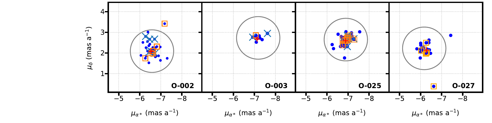
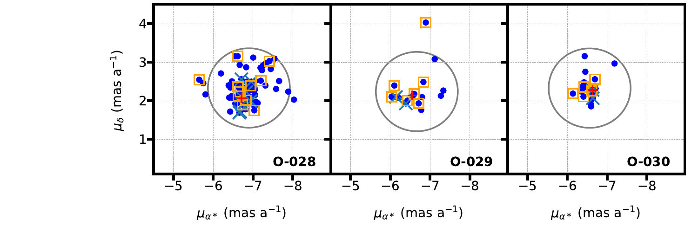

 stars are outside the frame towards the lower right due to their high extinction. Black lines show the average main sequence at a distance of 2.35 kpc with no extinction and with values of $\EBV$ of 0.5, 1.0, 1.5, and 2.0 (labelled) using the extinction law of [ and á (2014)]() with a value of $\RV$ of 4.5, which is typical of the region but with a large dispersion   ([ and á 2018]()) . Solid orange lines show the $\RV$ = 4.5 extinction tracks for average MS stars of $\Teff$ of 52.5 kK, 30 kK, and 20 kK (labelled), respectively. The dotted orange line shows the $\RV$ = 3.0 extinction track for $\Teff$ = 30 kK. (*Gaia_CMD*)

**Figure 6. -** Proper motion distribution from _Gaia_ EDR3 astrometry for all stars of our census in each assigned Villafranca group. Orange squares indicate those OB stars analyzed in this work that are rotating at $v\sin i$$\geq$ 200 km s$^{-1}$. Blue crosses represent identified binary systems. Circles represent group proper motion constraints, whose centers $\mu_{\alpha *,g}$  and  $\mu_{\delta,g}$ are those shown in Table \ref{pm_groups} in the central columns. For comparison, red plus symbols indicate group centers from Villafranca II and III works. Note that stars labelled as Car OB1 members are not included in the panels. (*pm_fast*)

**Figure 2. -** Negative image of the Great Carina Nebula by Robert Gendler and Stephane Guisard showing the location of the whole census of massive stars in the GES surveyed area presented in this work. Yellow and cyan colors indicate O and B-type stars, respectively. Green, red, purple and pink colors have been used to represent the sdO, LBV,  WR and RSG stars, respectively. Small filled-circles refer to the GES sample while rhombuses and squares refer to stars from GOSSS/LiLiMarlin and other works \citep[][]{smith06a,Alexetal16,Preietal21} not present in GES, respectively. Red circles indicate the observing GES pointings while the blue ones indicate the Villafranca groups: O-002 (Trumpler 14), O-003 (Trumpler 16 W), O-025 (Trumpler 16 E), O-027 (Trumpler 15), O-028 (Collinder 228), O-029 (Collinder 232), and O-030 (Bochum 11). The V-shaped extinction lane that dominates the appearance of the nebula is clearly seen crossing the image from top to bottom. (*carina*)

