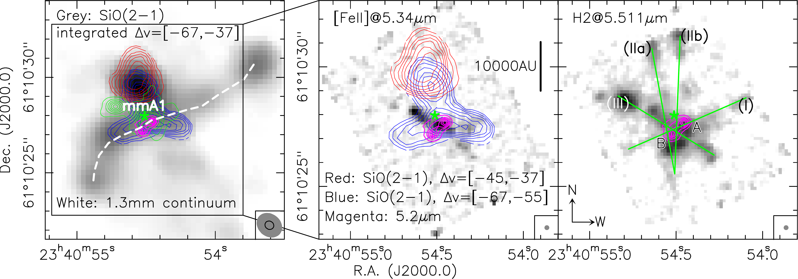
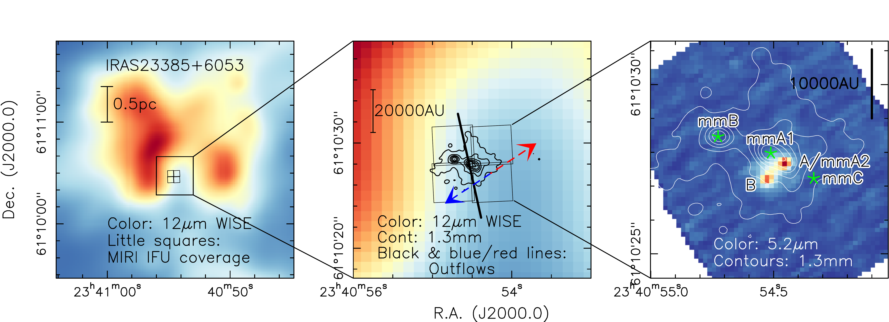

$\newcommand{\ensuremath}{}$
$\newcommand{\xspace}{}$
$\newcommand{\object}[1]{\texttt{#1}}$
$\newcommand{\farcs}{{.}''}$
$\newcommand{\farcm}{{.}'}$
$\newcommand{\arcsec}{''}$
$\newcommand{\arcmin}{'}$
$\newcommand{\ion}[2]{#1#2}$
$\newcommand{\textsc}[1]{\textrm{#1}}$
$\newcommand{\hl}[1]{\textrm{#1}}$
$\newcommand{\footnote}[1]{}$

# JOYS: JWST Observations of Young protoStars

<mark>Appeared on: 2023-03-24</mark> - _12 pages, 9 figures, accepted for Astronomy & Astrophysics, the paper is also available at this https URL_

<mark>H. Beuther</mark>, et al. -- incl., <mark>G. Perotti</mark>, <mark>M. Guedel</mark>

**Abstract:** Understanding the earliest stages of star formation, and setting that into context with the general cycle of matter in the interstellar medium, is a central aspect of research with the James Webb Space Telescope (JWST). The JWST program JOYS (JWST Observations of Young protoStars) aims at characterizing the physical and chemical properties of young high- and low-mass star-forming regions, in particular the unique mid-infrared diagnostics of the warmer gas and solid-state components. We present early results from the high-mass star formation region IRAS 23385+6053. The JOYS program uses the Mid-Infrared Instrument (MIRI) Medium Resolution Spectrometer (MRS) with its Integral Field Unit (IFU) to investigate a sample of high- and low-mass star-forming protostellar systems. The full 5 to 28 $\mu$ m MIRI MRS spectrum of IRAS 23385+6053 shows a plethora of interesting features. While the general spectrum is typical for an embedded protostar, we see many atomic and molecular gas lines boosted by the higher spectral resolution and sensitivity compared to previous space missions. Furthermore, ice and dust absorption features are also present. Here, we focus on the continuum emission, outflow tracers like the $H_2$ (0--0)S(7), [ FeII ] ( $^4F_{9/2}$ -- $^6D_{9/2}$ ) and [ NeII ] ( $^2P_{1/2}-^2P_{3/2}$ ) lines as well as the potential accretion tracer Humphreys $\alpha$ H ${i}$ (7--6). The short-wavelength MIRI data resolve two continuum sources A and B, where mid-infrared source A is associated with the main mm continuum peak. The combination of mid-infrared and mm data reveals a young cluster in its making. Combining the mid-infrared outflow tracer $H_2$ , [ FeII ] and [ NeII ] with mm SiO data shows a complex interplay of at least three molecular outflows driven by protostars in the forming cluster. Furthermore, the Humphreys $\alpha$ line is detected at a 3--4 $\sigma$ level towards the mid-infrared sources A and B. Following [Rigliaco, Pascucci and Duchene (2015)]() , one can roughly estimate both accretion luminosities and corresponding accretion rates between $\sim$ 2.6 $\times 10^{-6}$ and $\sim$ 0.9 $\times 10^{-4}$ $M_{\odot}yr^{-1}$ . This is discussed in the context of the observed outflow rates. The analysis of the MIRI MRS observations for this young high-mass star-forming region reveals connected outflow and accretion signatures. Furthermore, they outline the enormous potential of JWST to boost our understanding of the physical and chemical processes during star formation.

**Figure 8. -** Outflow images in NOEMA SiO(2-1) (integrated emission, left panel), JWST [FeII]($^4F_{9/2}$--$^6D_{9/2}$)@5.34 $\mu$m (middle panel) and JWST $H_2$(0--0)S(7)@5.511 $\mu$m (right panel). The red and blue contours show the red- and blue-shifted NOEMA SiO(2--1) emission in the labeled velocity regimes ($v_{\rm lsr}=-50.2$ km s$^{-1}$). Contour levels are from 30 to 90\%(step 10\%) of the respective integrated peak emission. The magenta contours show the 5.2 $\mu$m continuum emission (steps 20 to 90\% by 15\%). The green contours in the left panel outline the 1.3 mm continuum starting at the 20$\sigma$ levels (1$\sigma$=1.13 mJy beam$^{-1}$). A linear scale bar is presented in the middle panel, and the green lines in the right panel outline and label potential outflows. The two mid-infrared sources are labeled in the right panel as well. The dashed line in the left panel marks a potentially precessing outflow corresponding to outflow (I). A green star in all panels marks the main mm peak position labeled mmA1 in [Cesaroni, Beuther and Ahmadi (2019)](). North and west are labeled in the right panel. The resolution elements are shown at the bottom right of each panel, left SiO(2--1) in grey and 1.3 mm continuum as line, middle and right [FeII] and $H_2$, respectively. (*outflows*)

**Figure 15. -** Outflow images in NOEMA SiO(2-1) (integrated emission, left panel), JWST [FeII]($^4F_{9/2}$--$^6D_{9/2}$)@5.34 $\mu$m (middle panel) and JWST $H_2$(0--0)S(7)@5.511 $\mu$m (right panel). The red and blue contours show the red- and blue-shifted NOEMA SiO(2--1) emission in the labeled velocity regimes ($v_{\rm lsr}=-50.2$ km s$^{-1}$). Contour levels are from 30 to 90\%(step 10\%) of the respective integrated peak emission. The magenta contours show the 5.2 $\mu$m continuum emission (steps 20 to 90\% by 15\%). The green contours in the left panel outline the 1.3 mm continuum starting at the 20$\sigma$ levels (1$\sigma$=1.13 mJy beam$^{-1}$). A linear scale bar is presented in the middle panel, and the green lines in the right panel outline and label potential outflows. The two mid-infrared sources are labeled in the right panel as well. The dashed line in the left panel marks a potentially precessing outflow corresponding to outflow (I). A green star in all panels marks the main mm peak position labeled mmA1 in [Cesaroni, Beuther and Ahmadi (2019)](). North and west are labeled in the right panel. The resolution elements are shown at the bottom right of each panel, left SiO(2--1) in grey and 1.3 mm continuum as line, middle and right [FeII] and $H_2$, respectively. (*outflows*)

**Figure 5. -** Overview of the region around IRAS 23385+6053. The left panel shows a large-scale overview while the middle and right panels present  zoom-ins. The color-scale in the left and middle panels show the 12 $\mu$m emission from WISE at an angular resolution of $6.5"$ ([Wright, Eisenhardt and Mainzer 2010]()) . The little squares outline the field of view of the MIRI IFU mosaic in channel 1 (each square $3.7"\times 3.7"$). The color-scale in the right panel shows the new MIRI 5.2 $\mu$m continuum emission (see also Fig. \ref{continuum}). The contours in the middle and right panels present the 1.3 mm continuum emission  ([Beuther, Mottram and Ahmadi 2018](), [Cesaroni, Beuther and Ahmadi 2019]()) . The contours start at the 5$\sigma$ level of 0.55 mJy beam$^{-1}$ and continue in 25$\sigma$ steps. The black and red/blue lines in the middle panel show the directions of outflows identified in [Molinari, et. al (1998)]() and [Cesaroni, Beuther and Ahmadi (2019)](), respectively. The right panel marks the mid-infrared sources A and B as well as the mm sources labeled "mm" with the corresponding source letters from [Cesaroni, Beuther and Ahmadi (2019)](). Mid-infrared source A and mm source mmA2 are spatially co-located. A linear scale-bar is shown in all panels. (*overview*)

