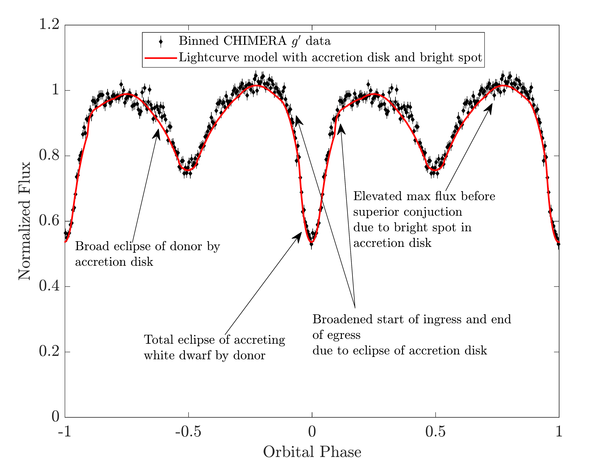
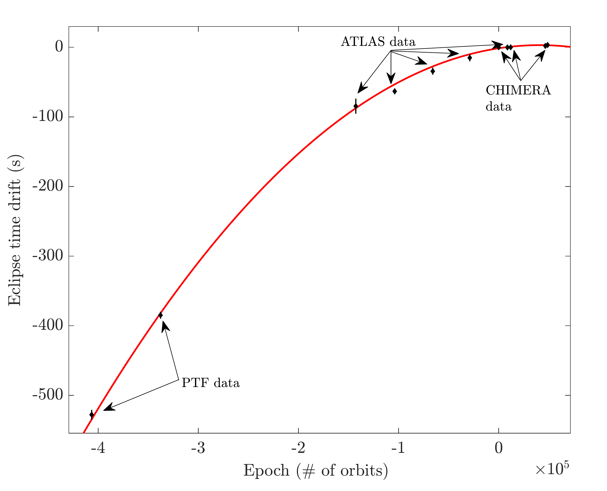

$\newcommand{\ensuremath}{}$
$\newcommand{\xspace}{}$
$\newcommand{\object}[1]{\texttt{#1}}$
$\newcommand{\farcs}{{.}''}$
$\newcommand{\farcm}{{.}'}$
$\newcommand{\arcsec}{''}$
$\newcommand{\arcmin}{'}$
$\newcommand{\ion}[2]{#1#2}$
$\newcommand{\textsc}[1]{\textrm{#1}}$
$\newcommand{\hl}[1]{\textrm{#1}}$
$\newcommand{\footnote}[1]{}$
$\newcommand{\vdag}{(v)^\dagger}$
$\newcommand$
$\newcommand$
$\newcommand{\msun}{\mathrm{M_{\odot}}}$
$\newcommand{\msunyr}{\msun{\rm yr}^{-1}}$
$\newcommand{\mhe}{M_{\mathrm{He}}}$
$\newcommand{\mwd}{M_{\mathrm{WD}}}$
$\newcommand{\mdot}{\dot{M}}$
$\newcommand{\mesa}{{\tt\string MESA}}$
$\newcommand{\kB}{k_{\mathrm{B}}}$
$\newcommand{\NA}{N_{\mathrm{A}}}$
$\newcommand{\She}{s_{\mathrm{c},\mathrm{He}}}$
$\newcommand{\taumdot}{\tau_{\dot{M}}}$
$\newcommand{\tauth}{\tau_{\mathrm{th}}}$
$\newcommand{\Jdotgr}{\dot{J}_{\mathrm{gr}}}$
$\newcommand{\Porb}{P_{\mathrm{orb}}}$
$\newcommand{\Pcrit}{P_{\mathrm{c}}}$
$\newcommand{\Etide}{\dot{E}_{\mathrm{tide}}}$
$\newcommand{\Eheat}{\dot{E}_{\mathrm{heat}}}$
$\newcommand{\Teff}{T_{\mathrm{eff}}}$
$\newcommand{\Rmin}{R_{\mathrm{min}}}$
$\newcommand{\RWD}{R_{\mathrm{WD}}}$

# Orbital decay in an accreting and eclipsing 13.7 minute orbital period binary with a luminous donor

<mark>Appeared on: 2023-03-27</mark> -  _13 pages, 7 figures, 2 tables, submitted to ApJL_

K. B. Burdge, et al. -- incl., <mark>K. El-Badry</mark>

**Abstract:** We report the discovery of ZTF J0127+5258, a compact mass-transferring binary with an orbital period of 13.7 minutes. The system contains a white dwarf accretor, which likely originated as a post-common envelope carbon-oxygen (CO) white dwarf, and a warm donor ( $T_{\rm eff, donor}= 16,400\pm1000 \rm K$ ). The donor probably formed during a common envelope phase between the CO white dwarf and an evolving giant which left behind a helium star or helium white dwarf in a close orbit with the CO white dwarf. We measure gravitational wave-driven orbital inspiral with $\sim 35\sigma$ significance, which yields a joint constraint on the component masses and mass transfer rate. While the accretion disk in the system is dominated by ionized helium emission, the donor exhibits a mixture of hydrogen and helium absorption lines. Phase-resolved spectroscopy yields a donor radial-velocity semi-amplitude of $771\pm27 \rm km  s^{-1}$ , and high-speed photometry reveals that the system is eclipsing. We detect a $_ Chandra_$ X-ray counterpart with $L_{X}\sim 3\times 10^{31} \rm erg s^{-1}$ . Depending on the mass-transfer rate, the system will likely evolve into either a stably mass-transferring helium CV, merge to become an R Crb star, or explode as a Type Ia supernova in the next million years. We predict that the Laser Space Interferometer Antenna (LISA) will detect the source with a signal-to-noise ratio of $24\pm6$ after 4 years of observations. The system is the first $*LISA*$ -loud mass-transferring binary with an intrinsically luminous donor, a class of sources that provide the opportunity to leverage the synergy between optical and infrared time domain surveys, X-ray facilities, and gravitational-wave observatories to probe general relativity, accretion physics, and binary evolution.

**Figure 7. -** A diagram of the possible outcomes of double white dwarf mergers presented in [ and Shen (2015)](), with the dashed blue lines indicating the mass constraints on ZTF J0127+5258 in the low mass transfer rate case, and the dashed green lines indicating the constraints in the high mass transfer rate case. If ZTF J0127+5258 fails to undergo stable mass transfer and evolve into a helium CV, this diagram indicates that it will likely form an R Coronae Borealis star which eventually cools into a white dwarf if its current mass transfer rate is on the lower end of our estimates, or will explode as a Type Ia supernova if its mass transfer rate is on the higher end of our estimates. Note that parenthetical entries in the merger outcomes may not apply to all objects in that mass range. (*fig:shen*)

**Figure 1. -** A model fit of the binned CHIMERA $g^{\prime}$ lightcurve of ZTF J0127+5258. We used the LCURVE modeling code to construct a physical model for the system. In order to account for the behavior in the lightcurve, particularly the geometry of the eclipses, as well as the increased flux at the quadrature phase at $0.75$, we had to include an accretion disk with a bright spot, indicating that the disk and bright spot contribute an appreciable fraction of the optical flux.
 (*fig:LC*)

**Figure 2. -** The measured evolution of eclipse times in ZTF J0127+5258. The red fit of a quadratic clearly indicates that the system is undergoing orbital decay, as the coefficient of the quadratic term of the polynomial is clearly negative. A precise measurement of the orbital evolution was made possible by the eclipsing nature of the source (allowing for precise timing), and the long baseline resulting from archival PTF and ATLAS observations.
 (*fig:Decay*)

