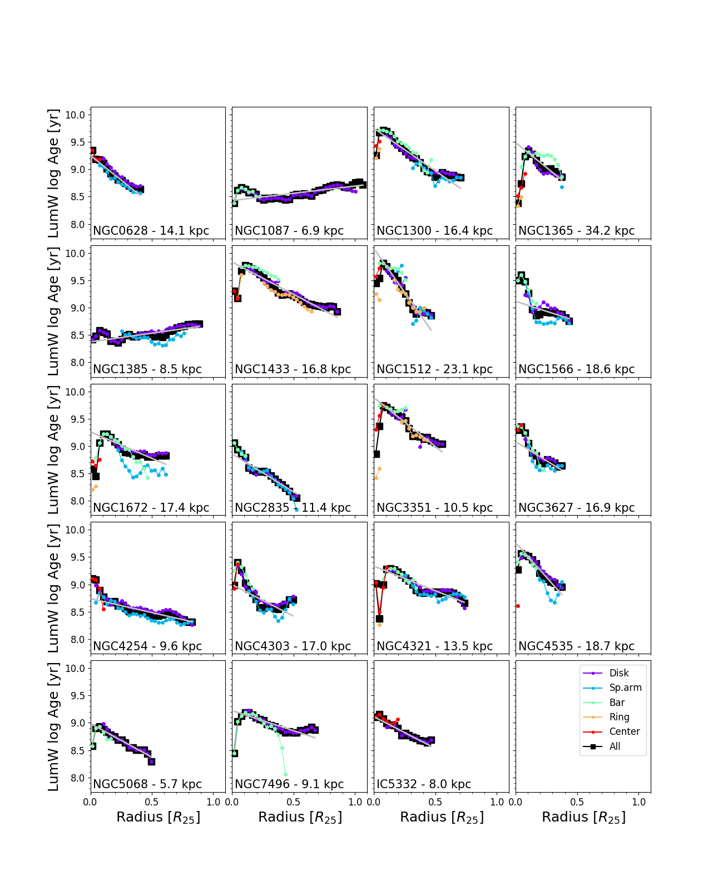
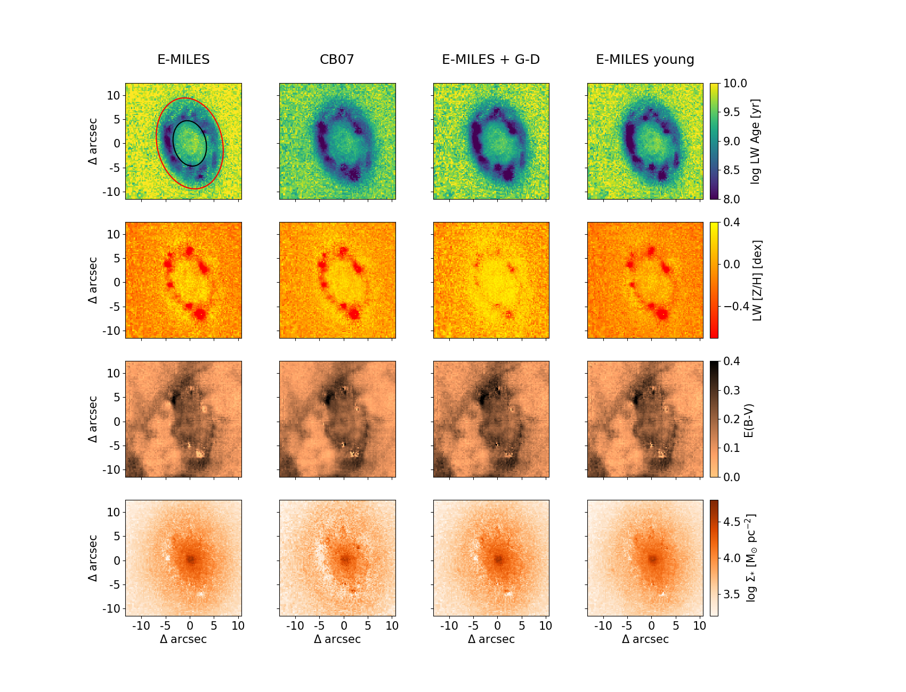
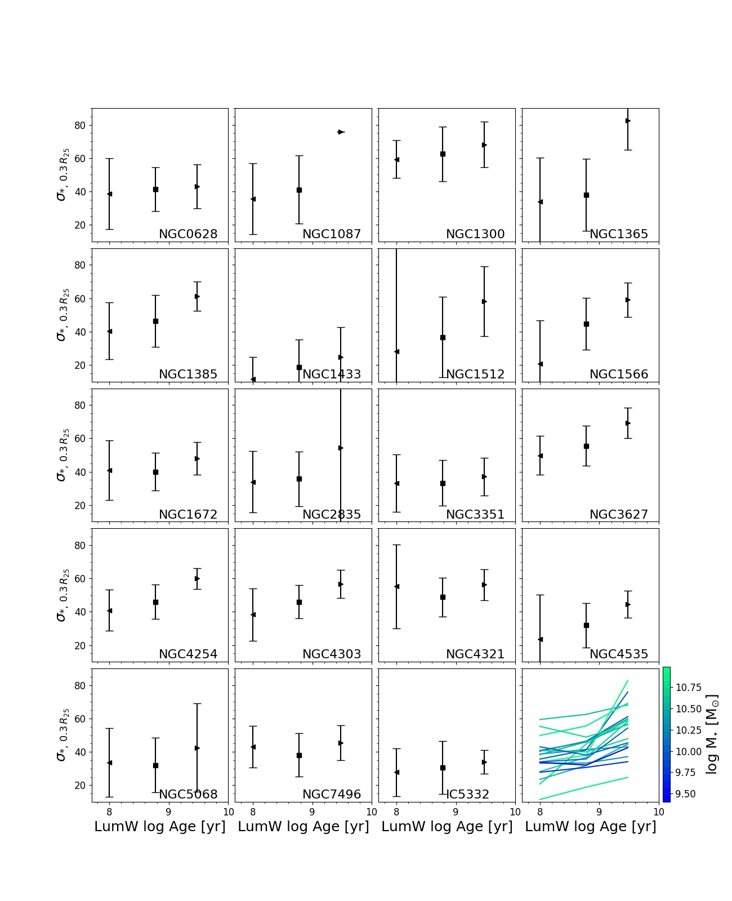

$\newcommand{\ensuremath}{}$
$\newcommand{\xspace}{}$
$\newcommand{\object}[1]{\texttt{#1}}$
$\newcommand{\farcs}{{.}''}$
$\newcommand{\farcm}{{.}'}$
$\newcommand{\arcsec}{''}$
$\newcommand{\arcmin}{'}$
$\newcommand{\ion}[2]{#1#2}$
$\newcommand{\textsc}[1]{\textrm{#1}}$
$\newcommand{\hl}[1]{\textrm{#1}}$
$\newcommand{\footnote}[1]{}$
$\newcommand{\hii}{\ion{H}{II}}$
$\newcommand{\hi}{\ion{H}{I}}$
$\newcommand{\cii}{\ion{C}{II}}$
$\newcommand{\nii}{[\ion{N}{II}]}$
$\newcommand{\sii}{[\ion{S}{II}]}$
$\newcommand{\oiii}{[\ion{O}{III}]}$
$\newcommand{\arraystretch}{1.2}$

# Resolved stellar population properties of PHANGS-MUSE galaxies

<mark>Appeared on: 2023-03-27</mark> -  _52 pages, 48 figures, accepted for publication in A&A_

I. Pessa, et al. -- incl., <mark>E. Schinnerer</mark>, <mark>J. Neumann</mark>, <mark>K. Kreckel</mark>, <mark>F. Pinna</mark>

**Abstract:** Analyzing resolved stellar populations across the disk of a galaxy can provide unique insights into how that galaxy assembled its stellar mass over its lifetime.Previous work at $\sim$ 1 kpc resolution has already revealed common features in the mass buildup (e.g., inside-out growth of galaxies). However, even at approximate kpc scales, the stellar populations are blurred between the different galactic morphological structures such as spiral arms, bars and bulges.  Here we present a detailed analysis of the spatially resolved star formation histories (SFHs) of 19 PHANGS-MUSE galaxies, at a spatial resolution of $\sim100$ pc. We show that our sample of local galaxies exhibits predominantly negative radial gradients of stellar age and metallicity, consistent with previous findings, and a radial structure that is primarily consistent with local star formation, and indicative of inside-out formation. In barred galaxies, we find flatter metallicity gradients along the semi-major axis of the bar than along the semi-minor axis, as is expected from the radial mixing of material along the bar during infall. In general, the derived assembly histories of the galaxies in our sample tell a consistent story of inside-out growth, where low-mass galaxies assembled the majority of their stellar mass later in cosmic history than high-mass galaxies (also known as "downsizing"). We also show how stellar populations of different ages exhibit different kinematics. Specifically, we find that younger stellar populations have lower velocity dispersions than older stellar populations at similar galactocentric distances, which we interpret as an imprint of the progressive dynamical heating of stellar populations as they age. Finally, we explore how the time-averaged star formation rate evolves with time, and how it varies across galactic disks. This analysis reveals a wide variation of the SFHs of galaxy centers and additionally shows that structural features become less pronounced with age.

**Figure 9. -** Luminosity-weighted stellar age radial profiles for the galaxies in our sampleLuminosity-weighted stellar age radial profiles for the galaxies in our sample. Different colors indicate the radial profile measured across different environments, as indicated in the legend of the bottom-right panel. The black line shows the radial profile measured for the entire FoV (i.e., all environments together). The galactocentric distance is measured in units of $R_{25}$, in order to measure radial distance homogeneously across our sample. The value of $R_{25}$(kpc) of each galaxy is indicated in each corresponding panel. The solid gray line shows the best-fit linear gradient for each galaxy. (*fig:radial_LW_age*)

**Figure 35. -** Age, metallicity, extinction and stellar mass surface density maps obtained for the central region of NGC 3351, with the four different sets of templates testedLuminosity-weighted age (top row), luminosity-weighted [Z/H](second row), stellar E(B-V) (third row), and stellar mass surface density (bottom row) maps derived for the central star-forming ring of NGC 3351. Each column shows the maps obtained using the set of templates indicated at the top of each column. The maps obtained using our fiducial set of templates are shown in the left column. The area outside the red ellipse in the top-left panel is used to probe disk stellar population properties, and the area between the red and the black ellipses is used to probe stellar population properties of the young star-forming ring (see text). (*fig:base_case_tests*)

**Figure 24. -** Mean stellar velocity dispersion measured at a galactocentric radius of 0.25-0.30 $R_{25}$ in the disk environment of all our sample galaxies for stellar populations with different luminosity-weighted ages.Mean stellar velocity dispersion ($\sigma_{*}$) measured at a galactocentric radius of 0.25-0.30 $R_{25}$ in the disk environment of all our sample galaxies for stellar populations with luminosity-weighted ages within the three different age bins defined in the main text. We note that for visualization purposes, the $x$-axis position of each data point is located at the edge of the age bin it represents. In each panel, the leftmost triangle represents the mean (area-weighted) velocity dispersion of all populations younger than $100$ Myr. The central square marks the mean velocity dispersion of populations with 100 Myr < LumW age < 300 Myr, and the rightmost triangle shows the same quantity for populations older than 3 Gyr. The errorbar indicates the standard deviation of the $\sigma_{*}$ values of the pixels within a given age bin. The bottom right panel shows the trend for all galaxies, colored by total stellar mass. (*fig:sigma_age_fixed_radii*)

