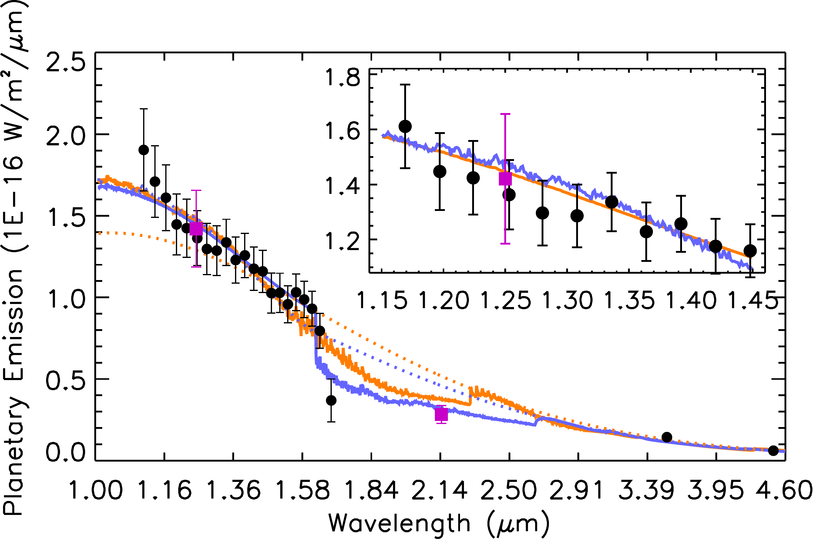
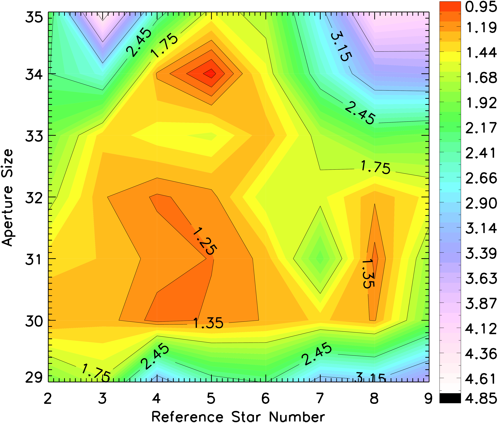
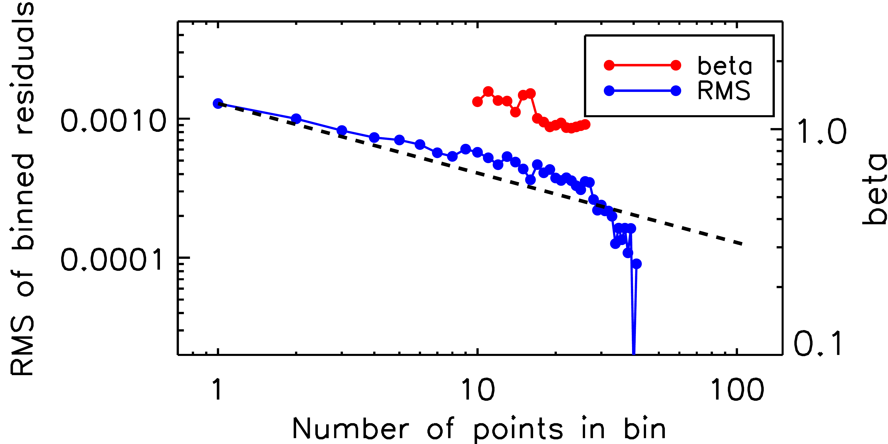

$\newcommand{\ensuremath}{}$
$\newcommand{\xspace}{}$
$\newcommand{\object}[1]{\texttt{#1}}$
$\newcommand{\farcs}{{.}''}$
$\newcommand{\farcm}{{.}'}$
$\newcommand{\arcsec}{''}$
$\newcommand{\arcmin}{'}$
$\newcommand{\ion}[2]{#1#2}$
$\newcommand{\textsc}[1]{\textrm{#1}}$
$\newcommand{\hl}[1]{\textrm{#1}}$
$\newcommand{\footnote}[1]{}$
$\newcommand{\ww}[1]{{\textcolor{black}{#1}}}$
$\newcommand{\thebibliography}{\DeclareRobustCommand{\VAN}[3]{##3}\VANthebibliography}$

# THERMAL EMISSION FROM THE HOT JUPITER WASP-103 b IN $J$ AND $K{\rm s}$ BANDS

<mark>Appeared on: 2023-03-27</mark> - 

Y. Shi, et al. -- incl., <mark>M. Zhai</mark>, <mark>R. v. Boekel</mark>

**Abstract:** Hot Jupiters, particularly those with temperature higher than 2000 K are the best sample of planets that allow in-depth characterization of their atmospheres. We present here a thermal emission study of the ultra hot Jupiter WASP $\mbox{-}$ 103 b observed in two secondary eclipses with CFHT/WIRCam in $J$ and $K_{\rm s}$ bands. By means of high precision differential photometry, we determine eclipse depths in $J$ and $K_{\rm s}$ to an accuracy of 220 and 270 ppm, which are combined with the published HST/WFC3 and Spitzer data to retrieve a joint constraints on the properties of WASP-103 b dayside atmosphere. We find that the atmosphere is best fit with a thermal inversion layer included. The equilibrium chemistry retrieval indicates an enhanced C/O (1.35 $^{+0.14}_{-0.17}$ ) and a super metallicity with [ Fe/H ] $=2.19^{+0.51}_{-0.63}$ composition. Given the near-solar metallicity of WASP-103 of [ Fe/H ] =0.06, this planet seems to be $\sim$ 100 more abundant than its host star. The free chemistry retrieval analysis yields a large abundance of FeH, H $^{-}$ , $CO_2$ and $CH_4$ . Additional data of better accuracy from future observations of JWST should provide better constraint of the atmospheric properties of WASP-103b.

**Figure 7. -** Observations and model spectra of dayside thermal emission of WASP-103b. Our $J$ and $K_{\rm s}$ data are presented by purple solid square, and other archival data are presented by black solid circle. The orange line shows the EQ model, while the violet line shows the FREE model. $\ww${The two dotted lines show the EQ and FREE models assuming isothermal. } (*Fig7*)

**Figure 2. -** The normalized rms$\times\beta^{2}$ distribution overlaid with contour maps for the various combinations of aperture diameter $D$ and the number of reference star group ($N_{\rm RSG}$) in the $J$ band. The minimum value of rms$\times\beta^{2}$ is reached with $D=34$ and $N_{\rm RSG}=5$. (*Fig2*)

**Figure 6. -** RMS and noise factor $\beta$ of our residuals to the best-fit model for the various data sets in $J$ band.  (*Fig6*)

