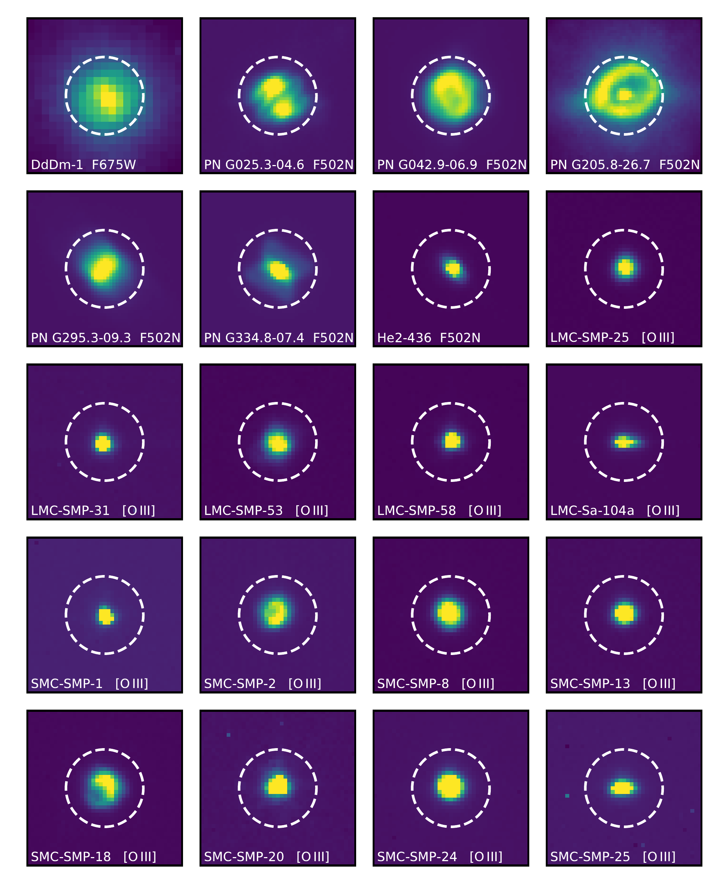
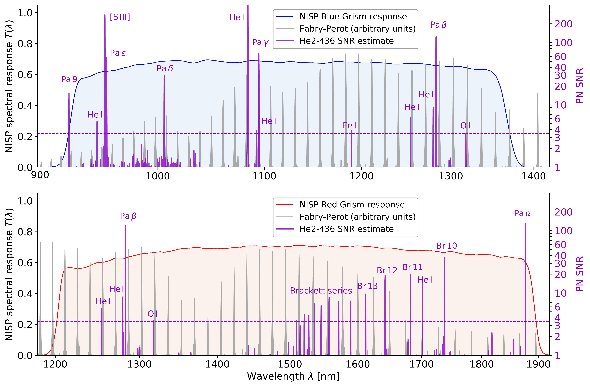

$\newcommand{\ensuremath}{}$
$\newcommand{\xspace}{}$
$\newcommand{\object}[1]{\texttt{#1}}$
$\newcommand{\farcs}{{.}''}$
$\newcommand{\farcm}{{.}'}$
$\newcommand{\arcsec}{''}$
$\newcommand{\arcmin}{'}$
$\newcommand{\ion}[2]{#1#2}$
$\newcommand{\textsc}[1]{\textrm{#1}}$
$\newcommand{\hl}[1]{\textrm{#1}}$
$\newcommand{\footnote}[1]{}$
$\newcommand{\orcid}[1]$

# $\Euclid$ preparation. XXXII. A UV–NIR spectral atlas of compact planetary nebulae for wavelength calibration

<mark>Appeared on: 2023-03-29</mark> -  _Accepted in A&A_

E. Collaboration, et al. -- incl., <mark>K. Paterson</mark>, <mark>M. Schirmer</mark>

**Abstract:** The Euclid mission will conduct an extragalactic survey over 15 000 deg $^2$ of the extragalactic sky. The spectroscopic channel of the Near-Infrared Spectrometer and Photometer (NISP)has a resolution of $R\sim450$ for its blue and red grisms that collectively cover the $0.93$ -- $1.89 $ $\micron$ \; range. NISP will obtain spectroscopic redshifts for $3\times10^7$ galaxies for the experiments on galaxy clustering, baryonic acoustic oscillations, and redshift space distortion. The wavelength calibration must be accurate within $5 $ Å to avoid systematics in the redshifts and downstream cosmological parameters. The NISP pre-flight dispersion laws for the grisms were obtained on the ground using a Fabry-Perot etalon. Launch vibrations, zero gravity conditions, and thermal stabilisation may alter these dispersion laws, requiring an in-flight recalibration. To this end, we use the emission lines in the spectra of compact planetary nebulae (PNe), which were selected from a PN data base. To ensure completeness of the PN sample, we developed a novel technique to identify compact and strong line emitters in Gaia spectroscopic data using the Gaia spectra shape coefficients. We obtained VLT/X-SHOOTER spectra from $0.3$ to $2.5$ $\micron$ \; for 19 PNe in excellent seeing conditions and a wide slit, mimicking $\Euclid$ 's slitless spectroscopy mode but with 10 times higher spectral resolution. Additional observations of one northern PN were obtained in the $0.80$ -- $1.90$ $\micron$ range with the GMOS and GNIRS instruments at the Gemini North observatory. The collected spectra were combined into an atlas of heliocentric vacuum wavelengths with a joint statistical and systematic accuracy of 0.1 Å in the optical and 0.3 Å in the near-infrared. The wavelength atlas and the related 1D and 2D spectra are made publicly available.

**Figure 7. -** HST images of all PNe in this paper, in linear scale (a nonlinear stretch is shown in Fig. \ref{fig:PNmorph}). DdDm-1 was taken in the F675W broad-band filter including the H$\alpha$ line. Contrary to the other panels shown here, this image of DdDm-1 suffers from spherical aberration prior to the installation of HST's corrective optics. F502N refers to a narrow-band filter including the [$\ion${O}{III}] line. These images include the emission from the central star. [$\ion${O}{III}] refers to that emission line extracted from a slitless spectrum. The spectral resolution is too low to resolve the intrinsic line width, hence these can be considered 2D line images, without the central star whose continuum is dispersed along the horizontal axis. The white circle shows the NISP-S EE80 disk with a radius of \ang{;;0.5}. The field of view is $\ang{;;2}\times\ang{;;2}$. (*fig:PNmorph_linear*)

**Figure 2. -** Normalised 1st-order shape coefficients (assuming 0 indexing) of the BP and RP Gaia spectra. The logarithmic density of all 200 million Gaia sources in this space is indicated by the grey cells. Our sample of compact PNe (Table \ref{table:observations}) is shown by the red crosses if they had Gaia DR3 BP/RP spectra, and known or candidate PNe from [ and Chornay (2021)]() by light blue crosses. The latter follow the bulk of the Gaia sources, suggesting that their SEDs are continuum-dominated; a small subset shows low ${\rm RP}_{1}$ values and approach our sample of compact PNe. Compact PNe candidates with ${\rm RP}_1<-0.4$ are shown in orange, but were rejected/disqualified upon further inspection  (Sect. \ref{sec:searchGaia2}). (*fig:gaia_pn*)

**Figure 4. -** _Top panel_: Total system response for the NISP blue grism (shaded area, exceeding 50\% of its peak transmission between $0.93$--$1.37 $\micron; these data are updated with respect to those presented in \citetalias{scaramella2022}). The regularly spaced, grey spectrum shows the arbitrarily scaled Fabry-Perot emission lines used for the pre-flight calibration of the dispersion law.
As an example for the in-flight calibration, the purple spectrum shows the estimated NISP signal-to-noise ratio (SNR) of He2-436, extrapolated from our X-SHOOTER observations. The horizontal dashed line displays a $3.5 \sigma$ threshold to identify usable PN lines. _Bottom panel_: Same for the NISP red grism ($1.21$--$1.89 $\micron). (*fig:fp_pn*)

