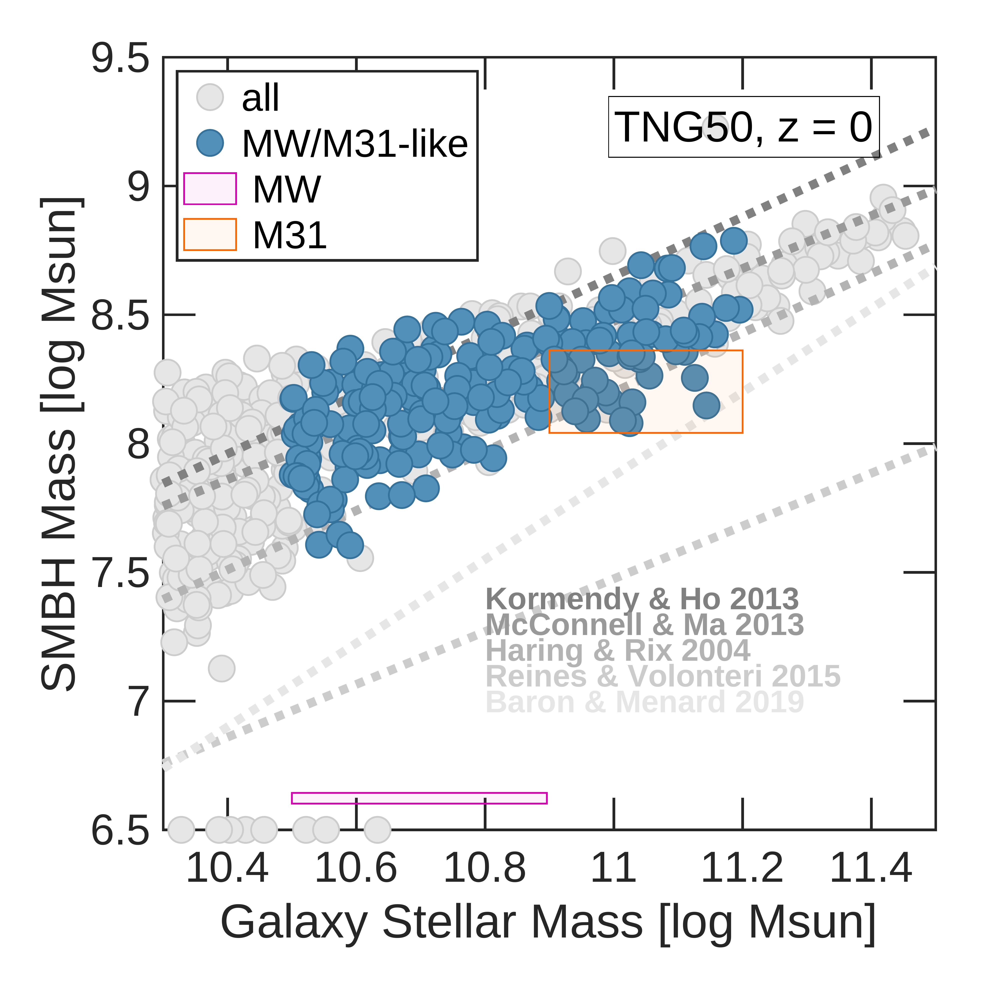
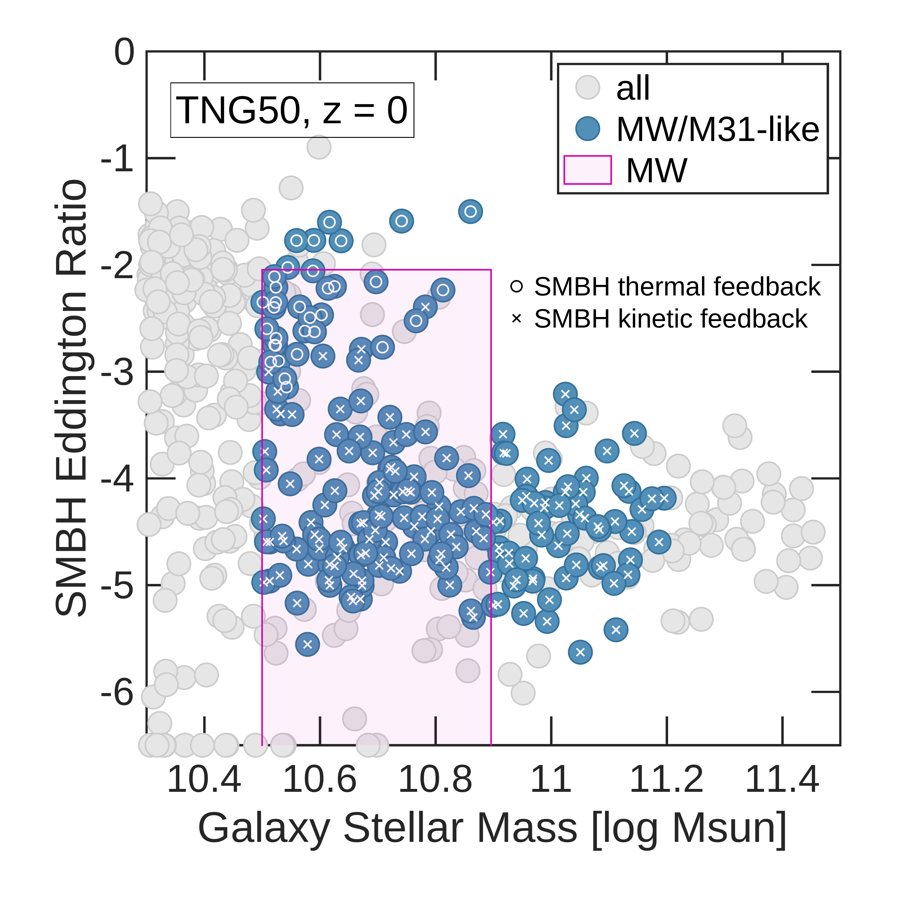
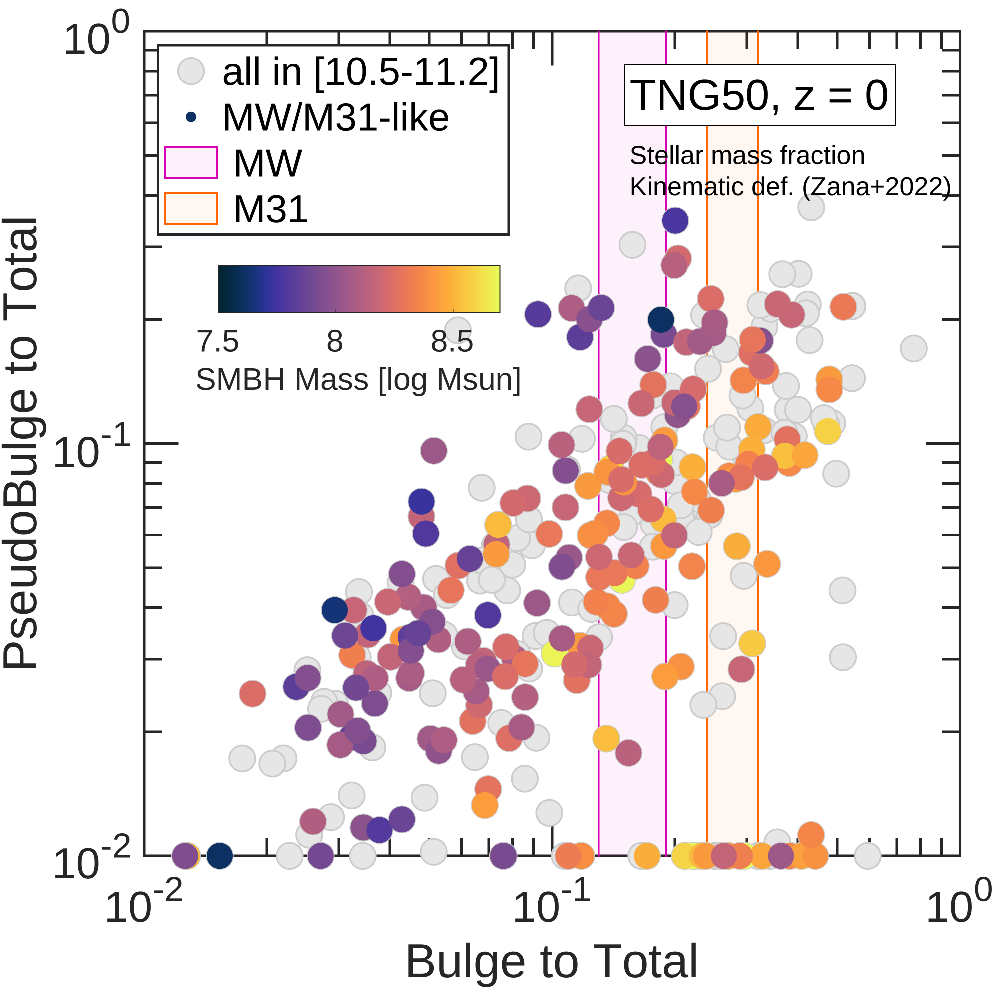
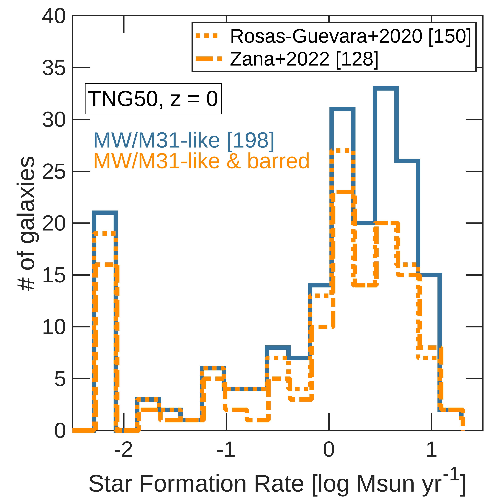
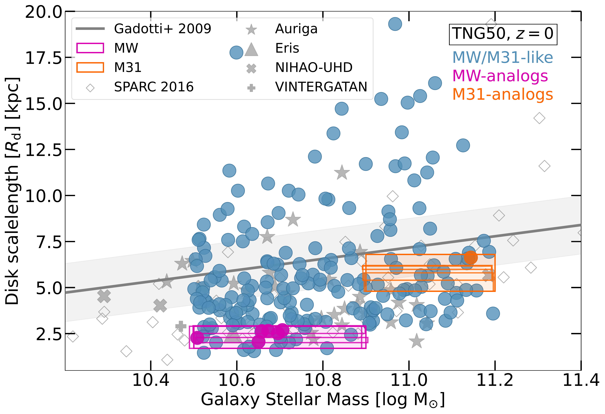
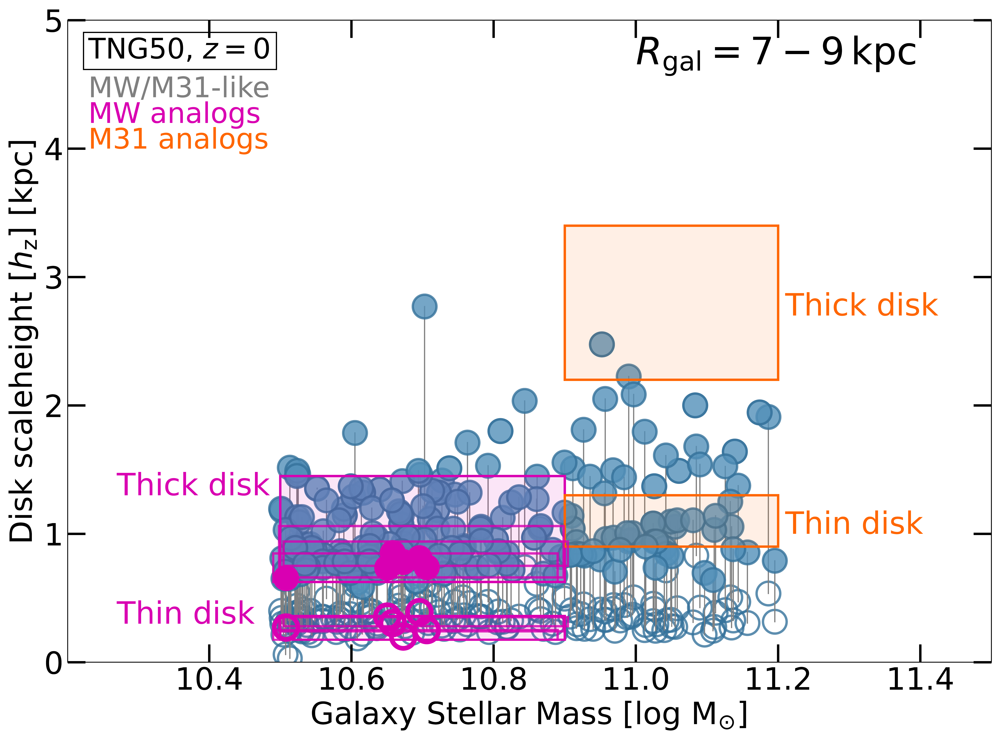
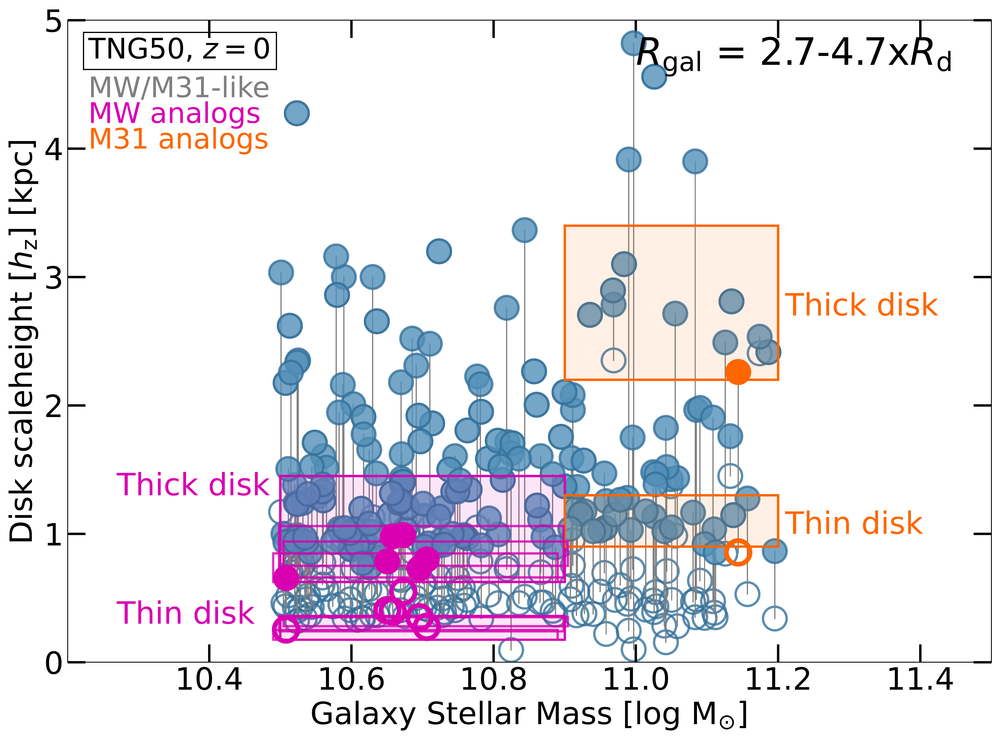

, together with the escape velocity from a point mass of $10^{12} \MSUN$ for the MW and $10^{12.4} \MSUN$ for M31 (dotted curves). (*fig:sats*)

**Figure 19. -** ** The fundamental characteristics of the central regions of TNG50 MW/M31 galaxies.** In the top panels, we showcase the SMBH populations of MW/M31 analogs (blue circles), including their mass (left) and their gas accretion rates, i.e. Eddington ratios (right). We indicate with circles (crosses) the SMBHs that are in the so-called thermal (kinetic) feedback mode at $z=0$. In the bottom left, we quantify the bulge-to-total stellar mass ratio of the sample, contrasted to the stellar mass ratio of pseudo-bulges and connected to the mass of the central SMBHs (colors). The bottom right panel shows that at least 2/3 of TNG50 MW/M31-like galaxies exhibit a bar. (*fig:center*)

**Figure 17. -** **The structural properties of the stellar disks of TNG50 MW/M31 galaxies.** We showcase disk scalelengths (top panel) and disk scaleheights (left and right bottom panels) as a function of the galaxy stellar mass, for the 198 MW/M31-like galaxies at $z=0$.
The scaleheights are evaluated at cylindrical shells located from the center at $7-9$ kpc (bottom left) and at $(2.7-4.7)\times$ the scalelength (bottom right, respectively): see text details.
The magenta and orange rectangles in the top panel represent observational estimates of the scalelength for the Galaxy \citep[1.7-2.9 kpc,][]{Hammer.2007,Juric.2008,Bovy.2013} and for Andromeda \citep[4.8--6.8 kpc,][]{Worthey.2005,Barmby.2006,Hammer.2007}, respectively.
In the bottom panels we show the scaleheights of the geometrically thin (empty symbols) and geometrically thick (full symbols) stellar disks; two sets of rectangles indicate the values of thin and thick disk inferred for the Milky Way \citep[magenta:][]{Gilmore.1983, Siegel.2002, Juric.2008, Rix.2013, Bland-Hawthorn.2016} and for Andromeda \citep[orange:][]{Collins.2011}. To guide the eye the thin and thick disk of each galaxy are also connected with a solid line. A number of TNG50 galaxies are identified as MW and M31 analogs, according to their mass, disk length and disk height values: their SubhaloIDs are given in the text. (*fig:stellardisks*)

