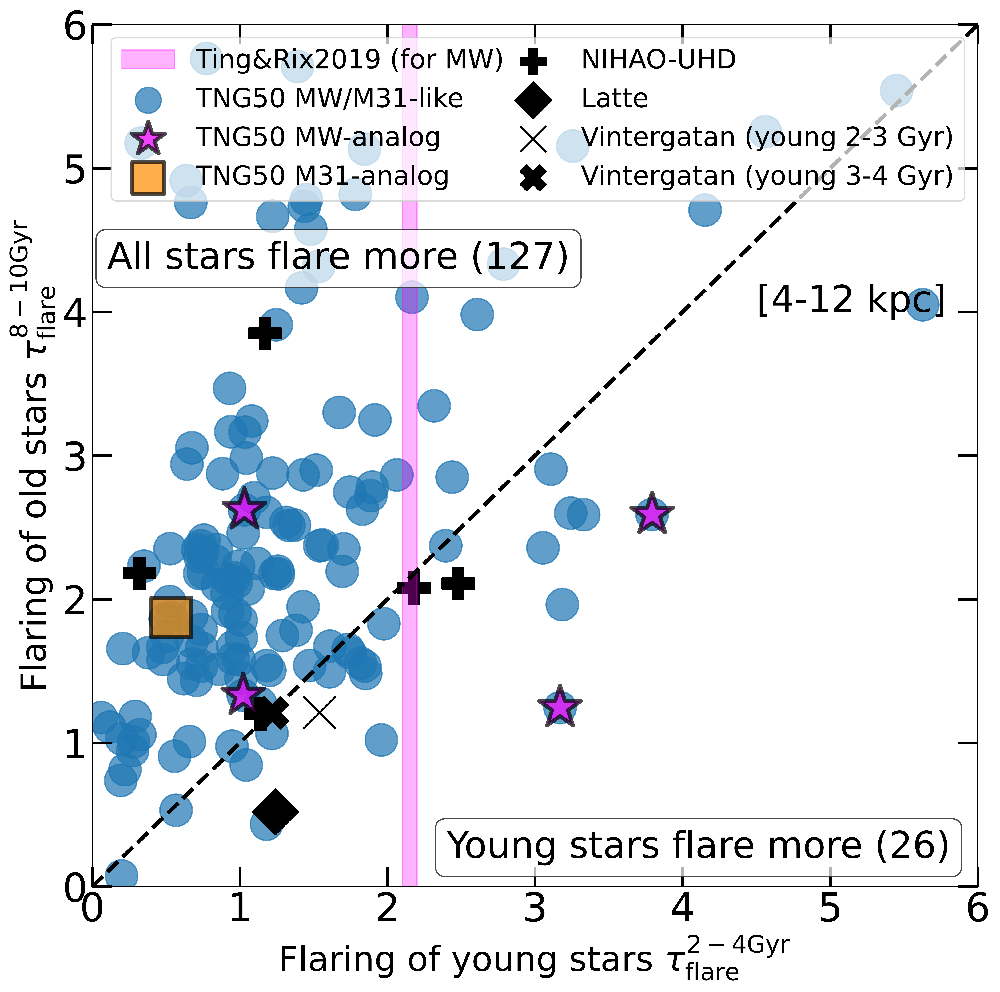
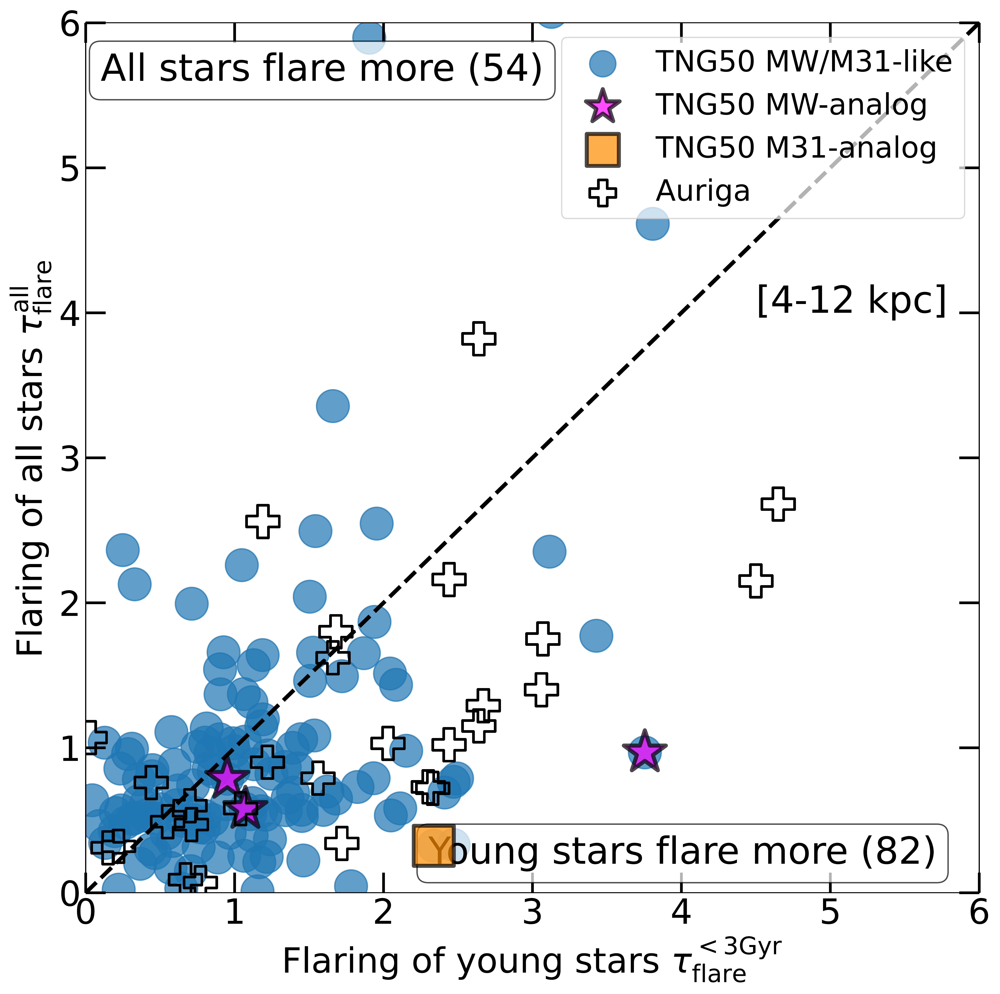
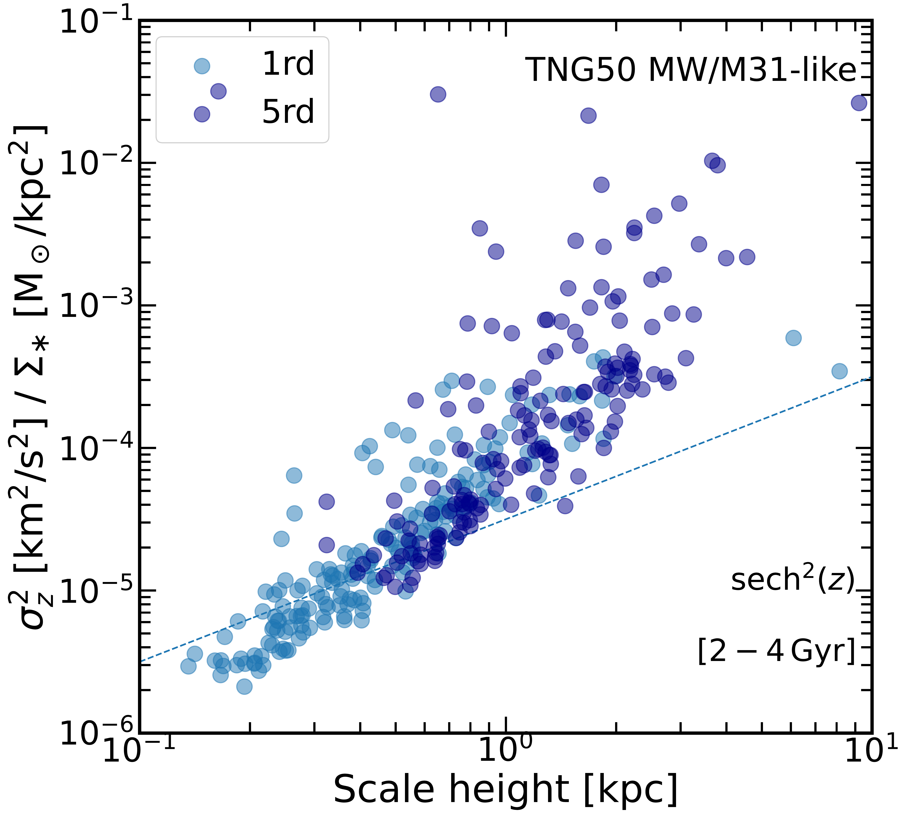
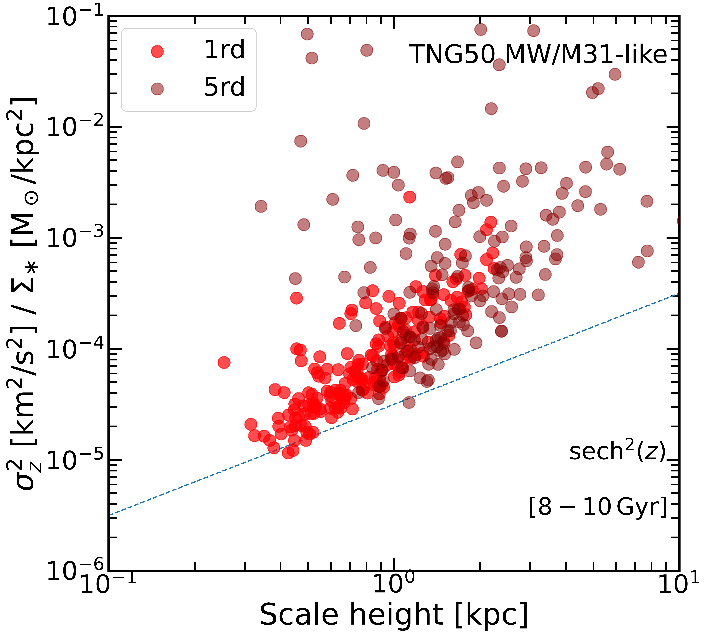
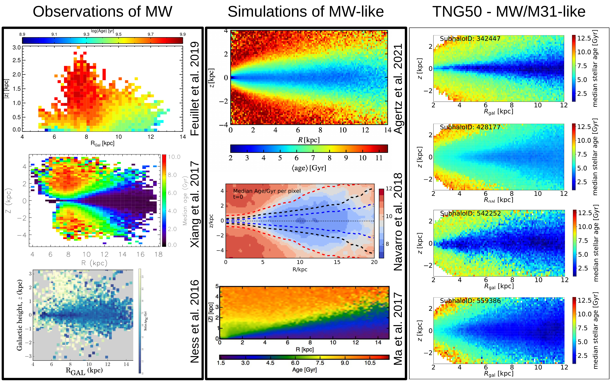

$\newcommand{\ensuremath}{}$
$\newcommand{\xspace}{}$
$\newcommand{\object}[1]{\texttt{#1}}$
$\newcommand{\farcs}{{.}''}$
$\newcommand{\farcm}{{.}'}$
$\newcommand{\arcsec}{''}$
$\newcommand{\arcmin}{'}$
$\newcommand{\ion}[2]{#1#2}$
$\newcommand{\textsc}[1]{\textrm{#1}}$
$\newcommand{\hl}[1]{\textrm{#1}}$
$\newcommand{\footnote}[1]{}$
$\newcommand{\bea}{\begin{eqnarray}}$
$\newcommand{\eea}{\end{eqnarray}}$
$\newcommand{\arraystretch}{1.2}$
$\newcommand{\Ms}{{\rm M}_\odot}$
$\newcommand{\}{MS}{M_{\rm stars}}$
$\newcommand{\}{RS}{R_{\rm stars,1/2}}$
$\newcommandinecolor{portlandorange}{rgb}{1.0, 0.35, 0.21}$
$\newcommand{\md}{\color{portlandorange}}$
$\newcommand{\ap}{\color{magenta}}$
$\newcommand{\apq}{\color{red}}$
$\newcommand{\ch}{\color{cyan}}$
$\newcommandinecolor{othergreen}{rgb}{0.0, 0.7, 0.0}$
$\newcommand{\dsr}{\color{othergreen}}$
$\newcommand{\dsrq}{\color{orange}}$
$\newcommand{\nf}{\color{purple}}$
$\newcommand{\nfq}{\color{violet}}$
$\title[Flaring of stellar disks in TNG50 MW/M31-like galaxies]{Disk flaring with TNG50: diversity across Milky Way and M31 analogs}$
$\author[Sotillo-Ramos et al.]{Diego Sotillo-Ramos,^{1}\thanks{E-mail: sotillo@mpia.de},$
$Martina Donnari^{1}, Annalisa Pillepich^{1}, Neige Frankel^{2}, Dylan Nelson^{3},$
$\newauthor Volker Springel^{4}, and Lars Hernquist^{5} \^{1} Max-Planck-Institut für Astronomie, Königstuhl 17, 69117 Heidelberg, Germany\^{2} Canadian Institute for Theoretical Astrophysics, University of Toronto, 60 St. George Street, Toronto, ON M5S 3H8, Canada\^{3} Universität Heidelberg, Zentrum für Astronomie, Institut für theoretische Astrophysik, Albert-Ueberle-Str. 2, 69120 Heidelberg, Germany\^{4} Max Planck Institut für Astrophysik, Karl-Schwarzschild-Stra\ss e 1, D-85748 Garching bei München, Germany\^{5} Center for Astrophysics | Harvard \& Smithsonian, 6P Garden St., Cambridge, MA 02138, USA$
$}$
$\begin{document}$
$\maketitle$
$\begin{abstract}$
$We use the sample of 198 Milky Way (MW) and Andromeda (M31) analogs from TNG50 to quantify the level of disk flaring predicted by a modern, high-resolution cosmological hydrodynamical simulation. Disk flaring refers to the increase of vertical stellar disk height with galactocentric distance. The TNG50 galaxies are selected to have stellar disky morphology, a stellar mass in the range of M_* = 10^{10.5 - 11.2}~\Ms, and a MW-like Mpc-scale environment at z=0.$
$The stellar disks of such TNG50 MW/M31 analogs exhibit a wide diversity of structural properties, including a number of galaxies with disk scalelength and thin and thick disk scaleheights that are comparable to those measured or inferred for the Galaxy and Andromeda.$
$With one set of physical ingredients, TNG50 returns a large variety of  flaring flavours and amounts, also for mono-age stellar populations. With this paper, we hence propose a non-parametric characterization of flaring. The typical MW/M31 analogs exhibit disk scaleheights that are 1.5-2 times larger in the outer than in the inner regions of the disk for both old and young stellar populations, but with a large galaxy-to-galaxy variation. Which stellar population flares more, and by how much, also varies from galaxy to galaxy. TNG50 de facto brackets existing observational constraints for the Galaxy and all previous numerical findings. A link between the amount of flaring and the z=0 global galaxy structural properties or merger history is complex. However, a connection between the scaleheights and the local stellar vertical kinematics and gravitational potential is clearly in place.$
$\end{abstract}$
$\begin{keywords}$
$methods: numerical --- galaxies: formation  --- Galaxy: disc --- Galaxy: evolution --- Galaxy: structure$
$\end{keywords}$
$\n\end{document}\end{eqnarray}}$
$\newcommand{\eea}{\end{eqnarray}}$
$\newcommand{\Ms}{{\rm M}_\odot}$
$\newcommand{\md}{\color{portlandorange}}$
$\newcommand{\ap}{\color{magenta}}$
$\newcommand{\apq}{\color{red}}$
$\newcommand{\ch}{\color{cyan}}$
$\newcommand{\dsr}{\color{othergreen}}$
$\newcommand{\dsrq}{\color{orange}}$
$\newcommand{\nf}{\color{purple}}$
$\newcommand{\nfq}{\color{violet}}$
$\newcommand{\arraystretch}{1.2}$
$\newcommand{\mh}{M_\bullet}$
$\newcommand{\ead}{\cal E}$
$\newcommand{\mh}{M_\bullet}$
$\newcommand{\ead}{\cal E}$
$\newcommand{\}{MS}$
$\newcommand{\}{RS}$

# Disk flaring with TNG50: diversity across Milky Way and M31 analogs

<mark>Appeared on: 2023-03-30</mark> -  _Submitted to MNRAS. Main figures: 5, 13. See presentation and data release of TNG50 MW/M31 analogs by Pillepich et al. and see also Ramesh et al. on astro-ph today_

D. Sotillo-Ramos, et al. -- incl., <mark>A. Pillepich</mark>

**Abstract:** We use the sample of 198 Milky Way (MW) and Andromeda (M31) analogs from TNG50 to quantify the level of disk flaring predicted by a modern, high-resolution cosmological hydrodynamical simulation. Disk flaring refers to the increase of vertical stellar disk height with galactocentric distance. The TNG50 galaxies are selected to have stellar disky morphology, a stellar mass in the range of $M_* = 10^{10.5 - 11.2} \Ms$ , and a MW-like Mpc-scale environment at $z=0$ .The stellar disks of such TNG50 MW/M31 analogs exhibit a wide diversity of structural properties, including a number of galaxies with disk scalelength and thin and thick disk scaleheights that are comparable to those measured or inferred for the Galaxy and Andromeda.With one set of physical ingredients, TNG50 returns a large variety of  flaring flavours and amounts, also for mono-age stellar populations. With this paper, we hence propose a non-parametric characterization of flaring. The typical MW/M31 analogs exhibit disk scaleheights that are $1.5-2$ times larger in the outer than in the inner regions of the disk for both old and young stellar populations, but with a large galaxy-to-galaxy variation. Which stellar population flares more, and by how much, also varies from galaxy to galaxy. TNG50 de facto brackets existing observational constraints for the Galaxy and all previous numerical findings. A link between the amount of flaring and the $z=0$ global galaxy structural properties or merger history is complex. However, a connection between the scaleheights and the local stellar vertical kinematics and gravitational potential is clearly in place.

**Figure 14. -** **Flaring of TNG50 MW/M31 analogs in comparison to the results of other cosmological MW-like galaxy simulations**. We show again the flaring of old and young stars for TNG50 MW/M31 analogs in comparison to, on the left, simulations from \citet[][VINTERGATAN: thin and thick crosses, with young stellar populations of 2-3 Gyr and 3-4 Gyr, respectively]{2021Agertz}, \citet[][Latte: diamonds]{2017Ma}, and \citet[][NIHAO-UHD: plus symbols]{2020Buck}; on the right, simulations from the Auriga project \citep{2017Grand}. The magenta area denotes the stellar flaring of young stars of the Milky Way extrapolated from \citet{2019Ting}, as in Fig. \ref{fig:young_old}.
We note that in all the simulation models used for this comparison (except for Latte that uses ${\rm sech}^2$), the scaleheight of the mono-age stellar populations in the disk is evaluated from a single exponential fit. In these plots, the heights are hence measured using exponential profiles also for TNG50.
 (*fig:tng50vsothers*)

**Figure 10. -** **Relationship between stellar heights and stellar kinematics for TNG50 MW/M31-like galaxies**. We plot the ratio between the squared local stellar vertical velocity dispersion and the stellar surface density vs. stellar disk scaleheight, for young (left) and old (right) stellar populations. We do so at different locations within the stellar disk.
The dashed line defines the linear correspondence that is  expected for an idealized self-gravitating disk. (*fig:young_old_sigmaVSurfDens*)

**Figure 13. -** **Stellar age distributions in the MW/M31 midplane**: vertical distance from the midplane as a function of galactocentric distance with the color code representing the mean or median stellar age. Here we compare observations from \citet{2016Ness,2017Xiang,2019Feuillet}(left), simulations from \citet{2017Ma,2018Navarro,2021Agertz}(center), and a sample of five TNG50 MW/M31 analogs (right). Barring those in the right column, the plots are replicated from the respective research studies without modification. (*fig:flaring_obs*)

