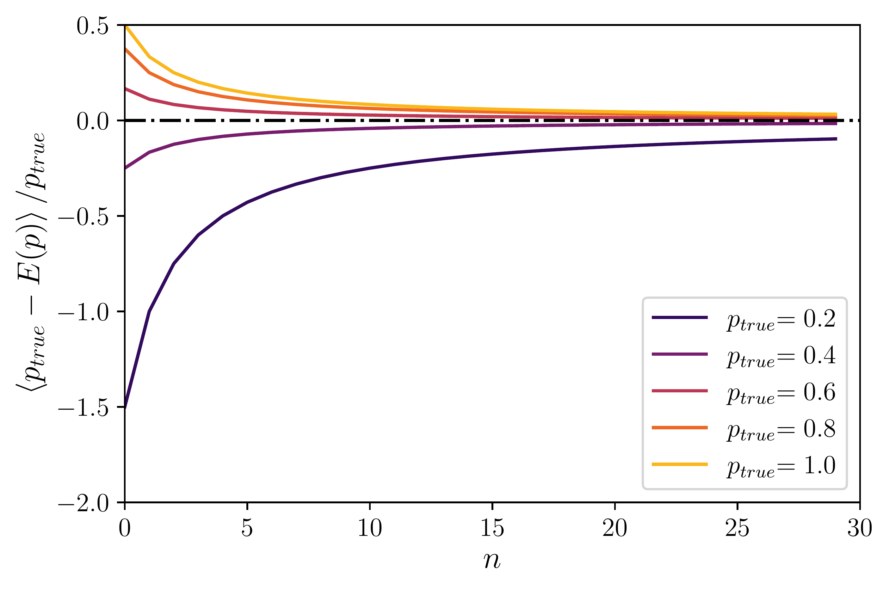
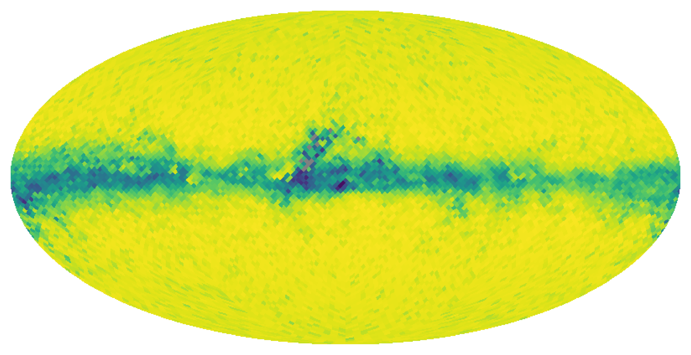
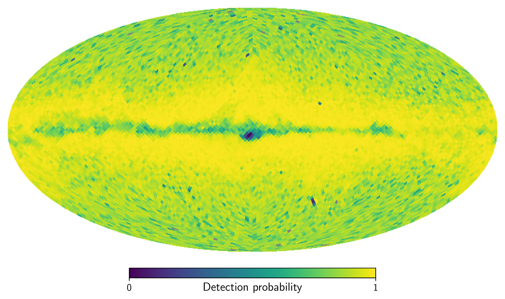
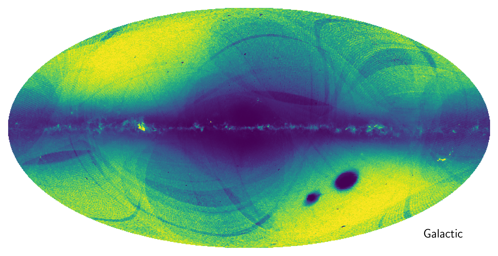
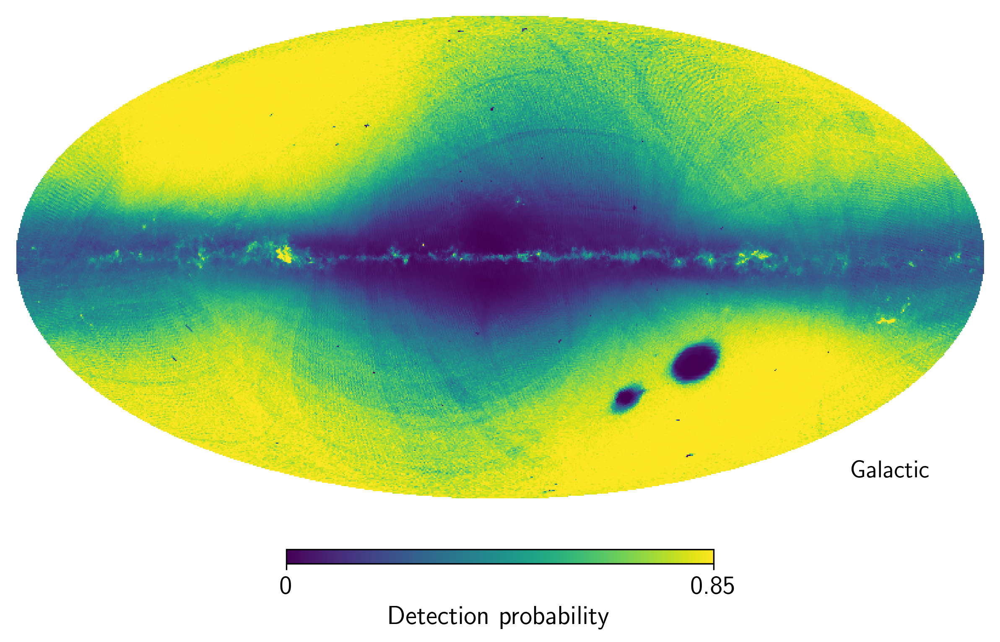

$\newcommand{\ensuremath}{}$
$\newcommand{\xspace}{}$
$\newcommand{\object}[1]{\texttt{#1}}$
$\newcommand{\farcs}{{.}''}$
$\newcommand{\farcm}{{.}'}$
$\newcommand{\arcsec}{''}$
$\newcommand{\arcmin}{'}$
$\newcommand{\ion}[2]{#1#2}$
$\newcommand{\textsc}[1]{\textrm{#1}}$
$\newcommand{\hl}[1]{\textrm{#1}}$
$\newcommand{\footnote}[1]{}$
$\newcommand$
$\newcommand$
$\newcommand$
$\newcommand$
$\newcommand{\Gaia}{\textit{Gaia}\xspace}$
$\newcommand{\cat}{\ensuremath{\mathcal{C}}}$

# Estimating the selection function of $\Gaia$ DR3 _sub_-samples

<mark>Appeared on: 2023-04-03</mark> -  _13 pages, 12 figures. Submitted to A&A_

A. Castro-Ginard, et al. -- incl., <mark>T. Cantat-Gaudin</mark>, <mark>M. Fouesneau</mark>, <mark>H.-W. Rix</mark>

**Abstract:** Understanding which sources are present in an astronomical catalogue and which are not is crucial for the accurate interpretation of astronomical data. In particular, for the multidimensional $\Gaia$ data, filters and cuts on different parameters or measurements introduces a selection function that may unintentionally alter scientific conclusions in subtle ways. We aim to develop a methodology to estimate the selection function for different _sub_ -samples of stars in the $\Gaia$ catalogue. Comparing the number of stars in a given _sub_ -sample to those in the overall $\Gaia$ catalogue, provides an estimate of the _sub_ -sample membership probability, as a function of sky position, magnitude and colour. This estimate must differentiate the stochastic absence of _sub_ -sample stars from selection effects.  When multiplied with the overall $\Gaia$ catalogue selection function this provides the total selection function of the _sub_ -sample. We present the method by estimating the selection function of the sources in $\Gaia$ DR3 with heliocentric radial velocity measurements. We also compute the selection function for the stars in the $\Gaia$ -Sausage/Enceladus sample, confirming that the apparent asymmetry of its debris across the sky is merely caused by selection effects. The developed method estimates the selection function of the stars present in a _sub_ -sample of $\Gaia$ data, given that the _sub_ -sample is completely contained in the $\Gaia$ parent catalogue (for which the selection function is known). This tool is made available in a GaiaUnlimited Python package.

**Figure 1. -** Bias of the probability estimator described by Eq. \ref{eqn:mean} for low values of $n$. The dash-dotted black line corresponds to an unbiased estimator, and the solid lines with different colours represent the experiment for different true probabilities $p_\text{true} \geq 0.5$. (*fig:bias*)

**Figure 8. -** Sky maps of the selection function  for sources with available radial velocities at magnitude $G = 13$ and colour $G-\grp = 0.5$(top panel), and $G = 14$ and colour $G-\grp = 1$(bottom panel). These maps are shown at HEALPix level $5$, with $0.2$ mag bins in $G$ and $0.4$ mag bins in $G-\grp$. They    manifestly depend on both magnitude and colour. (*fig:rvs*)

**Figure 4. -** Selection function for sources with $\varpi > 0.1$ mas and $\varpi/\sigma_\varpi > 5$ mas. The top panel shows the case for $\Gaia$ DR2, while the bottom panel shows $\Gaia$ DR3. Both maps correspond to the resolution of HEALPix level $7$. The magnitude and colour dependencies have been marginalised out. (*fig:SF_GES*)

