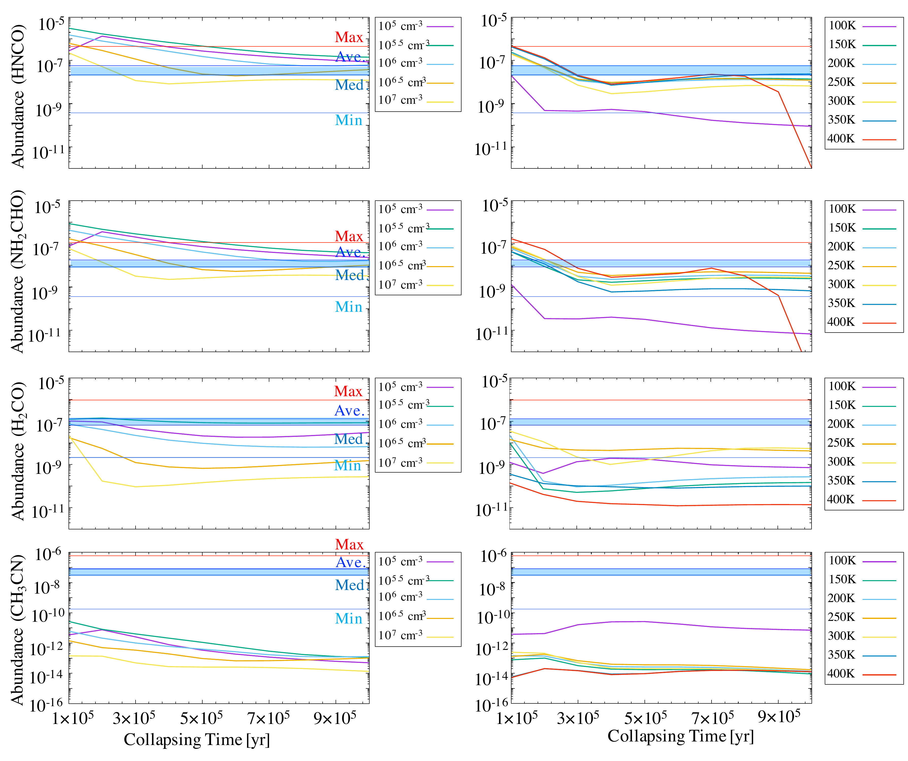
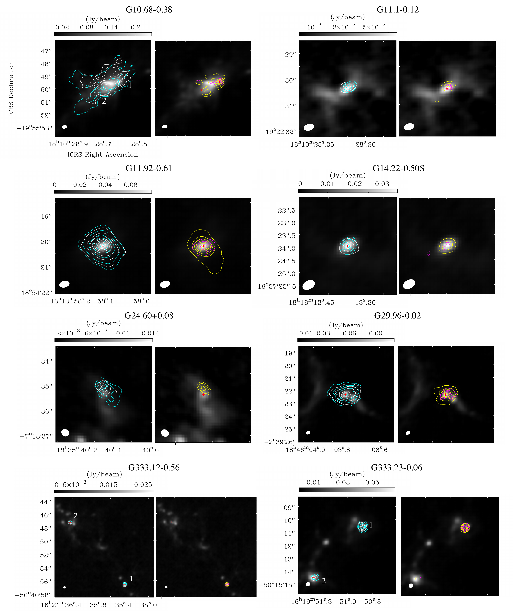
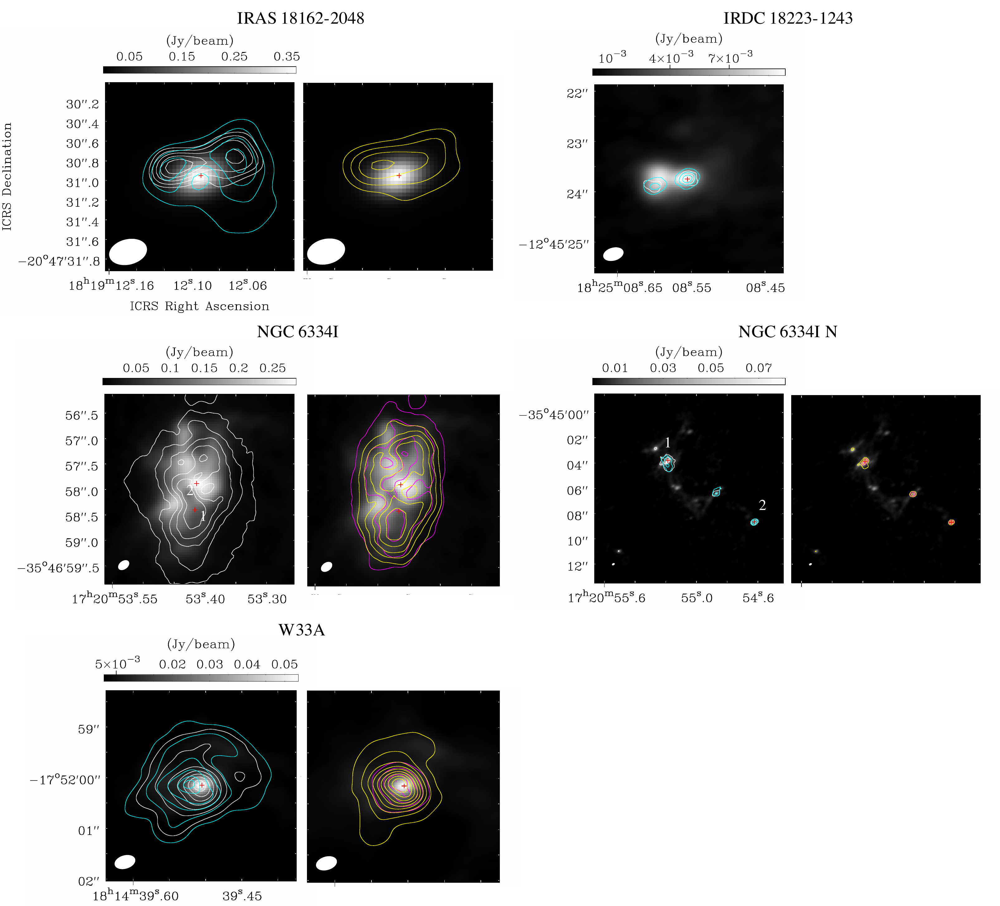

$\newcommand{\ensuremath}{}$
$\newcommand{\xspace}{}$
$\newcommand{\object}[1]{\texttt{#1}}$
$\newcommand{\farcs}{{.}''}$
$\newcommand{\farcm}{{.}'}$
$\newcommand{\arcsec}{''}$
$\newcommand{\arcmin}{'}$
$\newcommand{\ion}[2]{#1#2}$
$\newcommand{\textsc}[1]{\textrm{#1}}$
$\newcommand{\hl}[1]{\textrm{#1}}$
$\newcommand{\footnote}[1]{}$
$\newcommand{\vdag}{(v)^\dagger}$
$\newcommand$
$\newcommand$

# Digging into the Interior of Hot Cores with ALMA (DIHCA). III: \\The Chemical Link between NH$_{2}$CHO, HNCO, and H$_{2}$CO

<mark>Appeared on: 2023-04-04</mark> -  _Accepted for The Astrophysical Journal. 27 pages, 10 tables, and 13 figures_

K. Taniguchi, et al. -- incl., <mark>S. Li</mark>

**Abstract:** We have analyzed the NH $_{2}$ CHO, HNCO, H $_{2}$ CO, and CH $_{3}$ CN ( $^{13}$ CH $_{3}$ CN) molecular lines at an angular resolution of $\sim 0\farcs3$ obtained by the Atacama Large Millimeter/submillimeter Array (ALMA) Band 6 toward 30 high-mass star-forming regions.The NH $_{2}$ CHO emission has been detected in 23 regions, while the other species have been detected toward 29 regions.A total of 44 hot molecular cores (HMCs) have been identified using the moment 0 maps of the CH $_{3}$ CN line.The fractional abundances of the four species have been derived at each HMC.In order to investigate pure chemical relationships, we have conducted a partial correlation test to exclude the effect of temperature.Strong positive correlations between NH $_{2}$ CHO and HNCO ( $\rho=0.89$ ) and between NH $_{2}$ CHO and H $_{2}$ CO (0.84) have been found.These strong correlations indicate their direct chemical links; dual-cyclic hydrogen addition and abstraction reactions between HNCO and NH $_{2}$ CHO and gas-phase formation of NH $_{2}$ CHO from H $_{2}$ CO.Chemical models including these reactions can reproduce the observed abundances in our target sources.

**Figure 8. -** Comparison with Model B \citep{2020ApJ...895...86G}. Panels from top to bottom show results of HNCO, NH$_{2}$CHO, H$_{2}$CO, and CH$_{3}$CN, respectively. The modeled abundances plotted here are the values at the end of the simulations; $t$ = $t_{\rm{collapse}}$ + $t_{\rm{warm-up}}$($5\times10^4$ yrs)+ $t_{\rm{post warm-up}}$($10^5$ yrs). Left panels show dependences on different collapsing timescale and maximum density with the maximum temperature of 200 K. Right panels show dependences on different collapsing timescale and maximum temperature with the maximum density of $10^7$ cm$^{-3}$. The four representative observed abundances are plotted (Maximum, Average, Median, and Minimum). The blue filled ranges indicate the ranges between average and median values.  (*fig:modelB*)

**Figure 9. -** Continuum images (gray scales) overlaid with contours indicating moment 0 maps of molecular lines (left panels: white; CH$_{3}$CN and cyan; H$_{2}$CO, right panels: magenta; NH$_{2}$CHO and yellow; HNCO). Red crosses indicate positions of hot molecular cores (HMCs). Information on noise levels and contour levels are summarized in Tables \ref{tab:mom0info} and \ref{tab:mom0info2}.  (*fig:mom01*)

**Figure 12. -** Continued. (*fig:mom04*)

