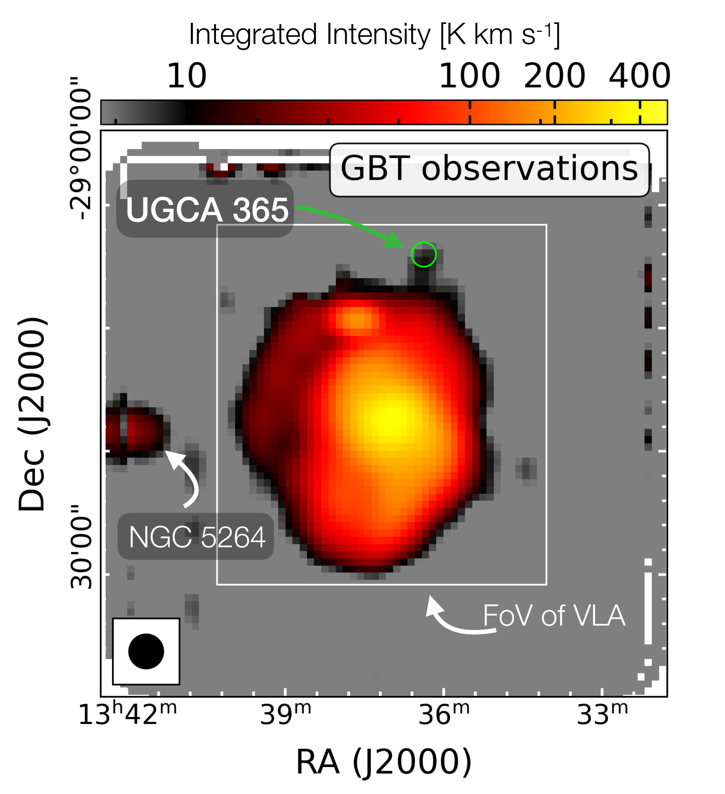
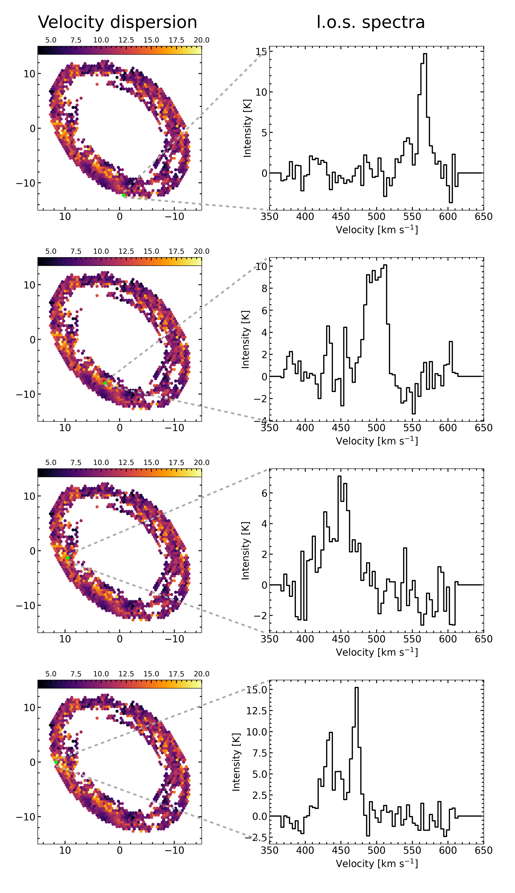

$\newcommand{\ensuremath}{}$
$\newcommand{\xspace}{}$
$\newcommand{\object}[1]{\texttt{#1}}$
$\newcommand{\farcs}{{.}''}$
$\newcommand{\farcm}{{.}'}$
$\newcommand{\arcsec}{''}$
$\newcommand{\arcmin}{'}$
$\newcommand{\ion}[2]{#1#2}$
$\newcommand{\textsc}[1]{\textrm{#1}}$
$\newcommand{\hl}[1]{\textrm{#1}}$
$\newcommand{\footnote}[1]{}$
$\newcommand{\todo}{\ifmmode \text{\color{red}\Huge{\(\bullet\)}} \else{\color{red}{\Huge\bullet}}\fi}$
$\newcommand{\comment}[2]{{\color{gray} #1:~ #2}}$
$\newcommand$
$\newcommand{  \hi       }{\ifmmode{\rm H} \textsc{i} \else H \textsc{i}\fi}$
$\newcommand$
$\newcommand$
$\newcommand$
$\newcommand$
$\newcommand$
$\newcommand$
$\newcommand$
$\newcommand$
$\newcommand$
$\newcommand{\vlosmdl}{{V_\mathrm{los, mdl}}}$
$\newcommand$
$\newcommand$
$\newcommand$
$\newcommand$
$\newcommand$
$\newcommand$
$\newcommand$
$\newcommand{\uv}{{u{-}v }}$
$\newcommand{\ubonn}{Argelander-Institut für Astronomie, Universität Bonn, Auf dem Hügel 71, 53121 Bonn, Germany}$
$\newcommand{\osu}{Department of Astronomy, The Ohio State University, 4055 McPherson Laboratory, 140 West 18th Ave, Columbus, OH 43210, USA}$
$\newcommand{\oan}{Observatorio Astronómico Nacional (IGN), C/ Alfonso XII, 3, E-28014 Madrid, Spain}$
$\newcommand{\inaf}{INAF — Osservatorio Astrofisico di Arcetri, Largo E. Fermi 5, I-50125, Florence, Italy}$
$\newcommand{\mpe}{Max-Planck-Institut für Extraterrestrische Physik (MPE), Giessenbachstr. 1, D-85748 Garching, Germany}$
$\newcommand{\rechen}{Astronomisches Rechen-Institut, Zentrum f{ü}r Astronomie der Universit{ä}t Heidelberg, M{ö}nchhofstra{\ss}e 12-14, 69120 Heidelberg, Germany}$
$\newcommand{\ox}{Sub-department of Astrophysics, Department of Physics, University of Oxford, Keble Road, Oxford OX1 3RH, UK}$
$\newcommand{\zah}{Universität Heidelberg, Zentrum für Astronomie, Institut für theoretische Astrophysik, Albert-Ueberle-Stra{\ss}e 2, 69120, Heidelberg, Germany}$
$\newcommand{\anu}{Research School of Astronomy and Astrophysics, Australian National University, Canberra, ACT 2611, Australia}$
$\newcommand{\astrothreed}{ARC Centre of Excellence for All Sky Astrophysics in 3 Dimensions (ASTRO 3D), Australia}$
$\newcommand{\mpia}{Max Planck Institute for Astronomy, Königstuhl 17, D-69117 Heidelberg, Germany}$
$\newcommand{\hsc}{Centro de Desarrollos Tecnológicos, Observatorio de Yebes (IGN), 19141 Yebes, Guadalajara, Spain}$
$\newcommand{\zw}{Universität Heidelberg, Interdisziplinäres Zentrum für Wissenschaftliches Rechnen, Im Neuenheimer Feld 205, 69120 Heidelberg, Germany}$
$\newcommand{\gent}{Sterrenkundig Observatorium, Universiteit Gent, Krijgslaan 281 S9, B-9000 Gent, Belgium}$
$\newcommand{\iram}{Institut de Radioastronomie Millimétrique (IRAM), 300 Rue de la Piscine, F-38406 Saint Martin d’Hères, France}$
$\newcommand{\lerma}{LERMA, Observatoire de Paris, PSL Research University, CNRS, Sorbonne Universités, 75014 Paris, France}$
$\newcommand{\ucsd}{Center for Astrophysics and Space Sciences, Department of Physics, University of California San Diego, 9500 Gilman Drive, La Jolla, CA 92093, USA}$
$\newcommand{\mmu}{Department of Physics and Astronomy, McMaster University, 1280 Main Street West, Hamilton, ON L8S 4M1, Canada}$
$\newcommand{\cita}{Canadian Institute for Theoretical Astrophysics (CITA), University of Toronto, 60 St George Street, Toronto, ON M5S 3H8, Canada}$
$\newcommand{\wyo}{Department of Physics \& Astronomy, University of Wyoming, Laramie, WY, 82071, USA}$
$\newcommand{\alb}{Dept. of Physics, University of Alberta, Edmonton, Alberta, Canada T6G 2E1}$
$\newcommand{\cape}{Department of Astronomy, University of Cape Town, Private Bag X3, Rondebosch 7701, South Africa}$
$\newcommand{\westv}{Department of Physics and Astronomy, West Virginia University, White Hall, Box 6315, Morgantown, WV 26506, USA}$
$\newcommand{\westvg}{Center for Gravitational Waves and Cosmology, West Virginia University, Chestnut Ridge Research Building, Morgantown, WV 26505, USA}$
$\newcommand{\eso}{European Southern Observatory, Karl-Schwarzschild Straße 2, D-85748 Garching bei M{ü}nchen, Germany}$
$\newcommand{\ulyon}{Univ Lyon, Univ Lyon1, ENS de Lyon, CNRS, Centre de Recherche Astrophysique de Lyon UMR5574, F-69230 Saint-Genis-Laval France}$
$\newcommand{\cfa}{Center for Astrophysics, Harvard \& Smithsonian, 60 Garden St., 02138 Cambridge, MA, USA}$
$\newcommand{\hopk}{Department of Physics \& Astronomy, Bloomberg Center for Physics and Astronomy, Johns Hopkins University, 3400 N. Charles Street, Baltimore, MD 21218}$
$\newcommand{\theoheid}{Institüt  für Theoretische Astrophysik, Zentrum für Astronomie der Universität Heidelberg, Albert-Ueberle-Strasse 2, 69120 Heidelberg, Germany}$
$\newcommand{\madrid}{Departamento de Fisica de la Tierra y Astrofisica \& IPARCOS, Facultad de CC Fisicas, Universidad Complutense de Madrid, 28040, Madrid, Spain}$
$\newcommand{\cool}{Cosmic Origins Of Life (COOL) Research DAO, coolresearch.io}$
$\newcommand{\eff}{Max-Planck-Institut für Radioastronomie, Radioobservatorium Effelsberg, Max-Planck-Strasse 28, Germany}$
$\newcommand{\nrao}{National Radio Astronomy Observatory, 1003 Lopezville Road, Socorro, NM 87801, USA}$
$\newcommand{\nraoc}{National Radio Astronomy Observatory, 520 Edgemont Rd, Charlottesville, VA 22903, USA}$
$\newcommand{\astron}{Netherlands Institute for Radio Astronomy (ASTRON),  Oude Hoogeveensedijk 4, 7991 PD Dwingeloo, Netherlands}$
$\newcommand{\kapeyn}{Kapteyn Astronomical Institute, University of Groningen, PO Box 800, 9700 AV Groningen, The Netherlands}$
$\newcommand{\uct}{Department of Astronomy, University of Cape Town, Private Bag X3, 7701 Rondebosch, South Africa}$
$\newcommand{\liverpool}{Astrophysics Research Institute, Liverpool John Moores University, 146 Brownlow Hill, Liverpool L3 5RF, UK}$
$\newcommand{\equationautorefname}{Eq.}$
$\newcommand{\sectionautorefname}{Section}$
$\newcommand{\subsectionautorefname}{Section}$
$\newcommand{\subsubsectionautorefname}{Section}$
$\newcommand{\arraystretch}{1.0}$

# Kinematic analysis of the super-extended HI disk of the nearby spiral galaxy M 83$\thanks{Based on observations carried out with the Karl G. Jansky Very Large Array (VLA). The National Radio Astronomy Observatory is a facility of the National Science Foundation operated under cooperative agreement by Associated Universities, Inc.}$

<mark>Appeared on: 2023-04-06</mark> -  _accepted for publication in A&A; 16 pages, 12 figures (+8 pages appendix)_

C. Eibensteiner, et al. -- incl., <mark>E. Schinnerer</mark>, <mark>S. Stuber</mark>

**Abstract:** We present new $\hi$ observations of the nearby massive spiral galaxy $\gal$ taken with the VLA at $21\arcsec$ angular resolution ( $\approx500$ pc) of an extended ( $\sim$ 1.5 deg $^2$ ) 10-point mosaic combined with GBT single dish data. We study the super-extended $\hi$ disk of M83 ( ${\sim}$ 50 kpc in radius), in particular disc kinematics, rotation and the turbulent nature of the atomic interstellar medium. We define distinct regions in the outer disk ( $r_{\rm gal}>$ central optical disk), including ring, southern area, and southern and northern arm. We examine $\hi$ gas surface density, velocity dispersion and non-circular motions in the outskirts, which we compare to the inner optical disk. We find an increase of velocity dispersion ( $\sigma_v$ ) towards the pronounced $\hi$ ring, indicative of more turbulent $\hi$ gas. Additionally, we report over a large galactocentric radius range (until $r_{\rm gal}{\sim}$ 50 kpc) that $\sigma_v$ is slightly larger than thermal (i.e. $>8$ $\kms$ ). We find that a higher star formation rate (as traced by FUV emission) is not always necessarily associated with a higher $\hi$ velocity dispersion, suggesting that radial transport could be a dominant driver for the enhanced velocity dispersion. We further find a possible branch that connects the extended $\hi$ disk to the dwarf irregular galaxy UGCA 365, that deviates from the general direction of the northern arm.  Lastly, we compare mass flow rate profiles (based on 2D and 3D tilted ring models) and find evidence for outflowing gas at r $_{\rm gal}$ $\sim$ 2 kpc, inflowing gas at r $_{\rm gal}$ $\sim$ 5.5 kpc and outflowing gas at r $_{\rm gal}$ $\sim$ 14 kpc. We caution that mass flow rates are highly sensitive to the assumed kinematic disk parameters, in particular, to the inclination.

**Figure 1. -** We show here the integrated intensity map of the GBT observation with white contours showing the field of view of the VLA observation. We denote the companion galaxies UGCA 365 and NGC 5264. The $\hi$ emission of UGCA 365 is faint relative to \gal(${\sim}$10 K km s$^{-1}$ compared to ${\sim}$400 K km s$^{-1}$).  (*fig:gbt*)

**Figure 2. -** Examples of four spectra of individual line of sights that show higher values in the velocity map. These show the multi-component behavior of the spectra. (*app:spectra_ring_region*)

**Figure 3. -**  Comparison of two approaches to determine the velocity dispersion. In all panels, the y-axes show the \sigmom  and the x-axes the \sigeff values colored by the regions defined within this work (see the mask in \autoref{fig:diff_reg}). Only the upper left panel shows the x and y axes in linear scale, all the others are in log scale. We show linear regression fits between \sigmom  and \sigeff for the central disk (yellow), ring (orange), southern area (red), southern arm (purple), and northern arm (black). We see the highest scatter in \sigmom in the ring region of ${\sim}2.5$dex. This is likely to represent a multi-component spectrum. (*fig:ew_vs_mom2*)

