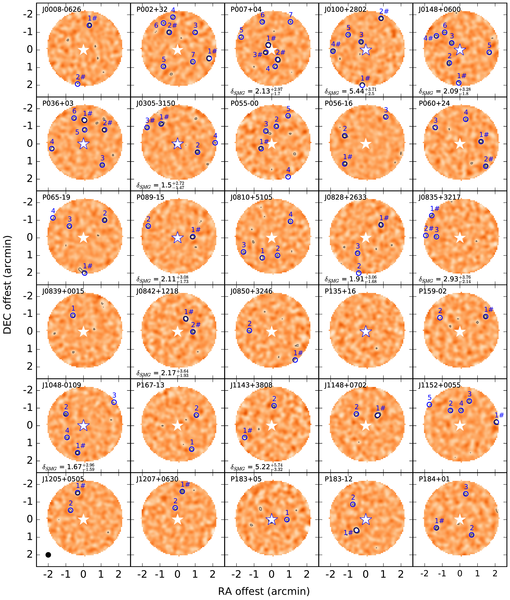
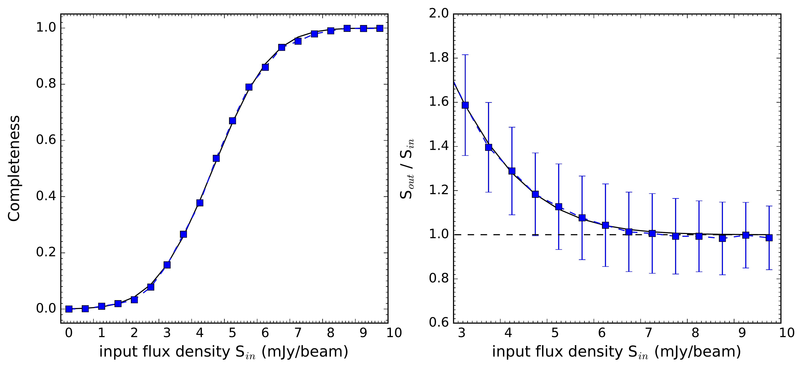
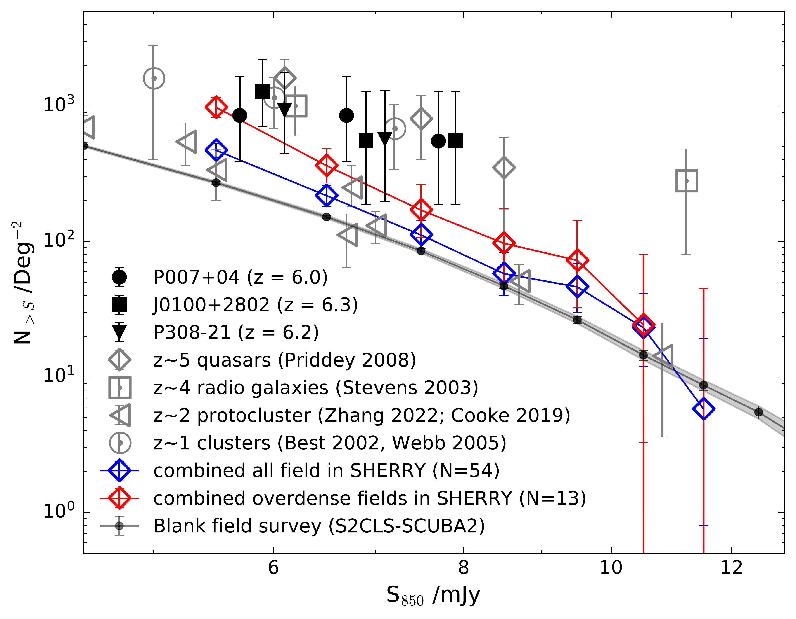

$\newcommand{\ensuremath}{}$
$\newcommand{\xspace}{}$
$\newcommand{\object}[1]{\texttt{#1}}$
$\newcommand{\farcs}{{.}''}$
$\newcommand{\farcm}{{.}'}$
$\newcommand{\arcsec}{''}$
$\newcommand{\arcmin}{'}$
$\newcommand{\ion}[2]{#1#2}$
$\newcommand{\textsc}[1]{\textrm{#1}}$
$\newcommand{\hl}[1]{\textrm{#1}}$
$\newcommand{\footnote}[1]{}$
$\newcommand{\vdag}{(v)^\dagger}$
$\newcommand$
$\newcommand$
$\newcommand{\um}{\mum}$
$\newcommand{\ai}{\mbox{\normalfontÅ} }$
$\newcommand$
$\newcommand$
$\newcommand$
$\newcommand$
$\newcommand$
$\newcommand{\cii}{[C\thinspace{\sc ii}]}$

# (SHERRY) JCMT-SCUBA2 High rEdshift bRight quasaR surveY - II: the environment of $z\sim6$ quasars in sub-millimeter band

<mark>Appeared on: 2023-04-11</mark> -  _12 pages, 8 figures and 2 tables, accepted for publication in ApJ_

Q. Li, et al. -- incl., <mark>E. Bañados</mark>

**Abstract:** The formation of the first supermassive black holes is expected to have occurred in some most pronounced matter and galaxy overdensities in the early universe. We have conducted a sub-mm wavelength continuum survey of 54 $z\sim6$ quasars using the Submillimeter Common-User Bolometre Array-2 (SCUBA2) on the James Clerk Maxwell Telescope (JCMT)to study the environments around $z \sim 6$ quasars. We identified 170 submillimeter galaxies (SMGs) with above 3.5 $\sigma$ detections at 450 or 850 $\um$ maps.Their FIR luminosities are 2.2 - 6.4 $\times$ 10 $^{12} L_{\odot}$ , and star formation rates are $\sim$ 400 - 1200 M $_{\odot}$ yr $^{-1}$ . We also calculated the SMGs differential and cumulative number counts in a combined area of $\sim$ 620 arcmin $^2$ . To a $4\sigma$ detection (at $\sim$ 5.5 mJy), SMGs overdensity is $0.68^{+0.21}_{-0.19}$ ( $\pm0.19$ ), exceeding the blank field source counts by a factor of 1.68. We find that 13/54 quasars show overdensities (at $\sim$ 5.5 mJy) of $\delta_{SMG}\sim$ 1.5 - 5.4. The combined area of these 13 quasars exceeds the blank field counts with the overdensity to 5.5 mJy of $\dsmg$ $\sim$ $2.46^{+0.64}_{-0.55}$ ( $\pm0.25$ ) in the regions of $\sim$ 150 arcmin $^2$ . However, the excess is insignificant on the bright end (e.g., 7.5 mJy). We also compare results with previous environmental studies of Lyman alpha emitters (LAEs) and Lyman-Break Galaxies (LBGs) on a similar scale. Our survey presents the first systematic study of the environment of quasars at $z\sim6$ . The newly discovered SMGs provide essential candidates for follow-up spectroscopic observations to test whether they reside in the same large-scale structures as the quasars and search for protoclusters at an early epoch.

**Figure 3. -** JCMT-SCUBA2 850$\um$  images of the surrounding regions around 54 $z \sim 6$ quasar with a beam size of FWHM = 15$\arcsec$.
The selected region is within 2.23 arcmins from the quasar optical position (which covers typical protocluster scales at $z \sim 6$) and has one sigma uncertainty of $<$ 1.5 mJy beam$^{-1}$ for each pixel. The contour levels are +3, +4, +5, +6, +7$\times$1.5 mJy beam$^{-1}$ for each map. The star indicates the quasar optical/NIR position. The star with the blue edge is the sub-mm detected quasars. The blue circles indicate the selected SMGs (with S/N$>$3.5 at 850um or 450um, see Table \ref{table2}).
The sources marked with `\#' are the SMGs used in the overdensity analysis with deboosted fluxes $>$ 5.5 mJy.
 (*figure_1*)

**Figure 6. -** Example completeness and flux boosting estimates based on Monte Carlo source insertion. Left: Completeness as a function of input flux (S$_{in}$). The solid curve represents the best-fit function of *f(S$_{in*$) = [1+erf((S$_{in}$-A)/B)]/2} with best fitting parameters give in the text. Right: The ratio between input flux density and output flux density as a function of input flux. Error bars show 1$\sigma$ of 5000 trials. Solid curve represents the best-fit function of *f(S$_{in*$) =1+Aexp(-BS$_{in} ^C$)}.  ([Hatsukade, Kohno and Umehata 2016]()) . (*fig:completeness and boosting*)

**Figure 8. -** Cumulative number counts of SMGs, in fields centered on (i) luminous high-redshift AGN: z $\sim$ 5 optically selected quasars (grey diamonds;  ([Priddey, Ivison and Isaak 2008]()) ); z $\sim$ 4 radio galaxies (grey squares;  ([Stevens, Ivison and Dunlop 2003]()) ); (ii) z $\sim$ 2 protoclusters (grey triangles;  ([Zhang, Zheng and Shi 2022](), [Cooke, Smail and Stach 2019]()) ); (iii) z $\sim$ 1 clusters (grey circles;  ([ and Best 2002](), [Webb, Yee and Ivison 2005]()) ) and (iv) $z \sim 6$ optically selected quasars (this paper, black points and red/blue diamonds).
The black line shows the blank-field number counts of SMGs in the previous survey, i.e., SCUBA2 survey for S2CLS field in [Geach, Dunlop and Halpern (2017)]().
The blue line is calculated from our survey's combined areas of all 54 quasars ($\sim$ 620 arcmin$^2$); the red line is from the combined areas of 13 overdense fields around the quasars ($\sim$ 150 arcmin$^2$).
The black-filled points indicate the three most overdense fields selected from our sample at $z \sim 6$.
Points in this work have been corrected for flux boosting and incompleteness. (*figure_7*)

