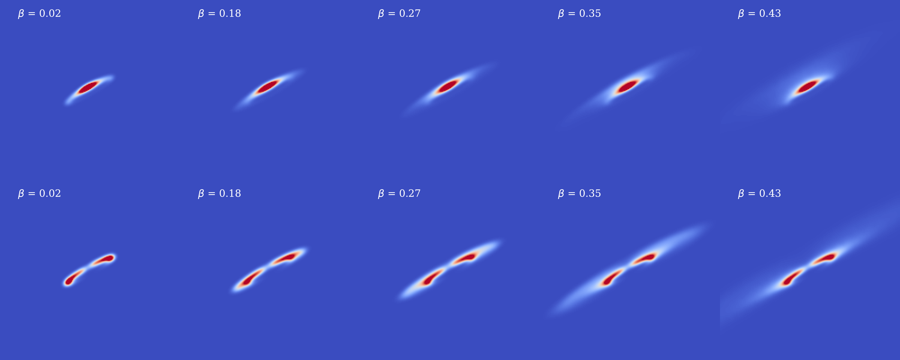
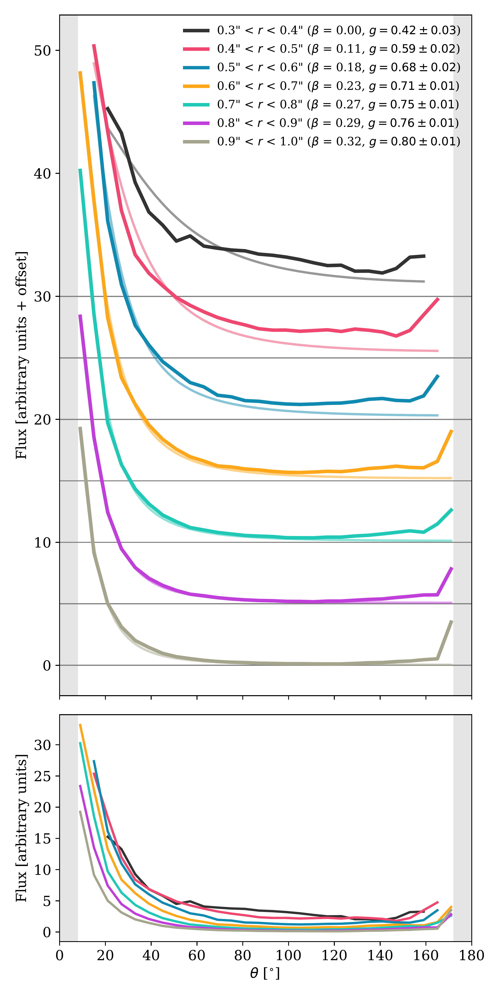
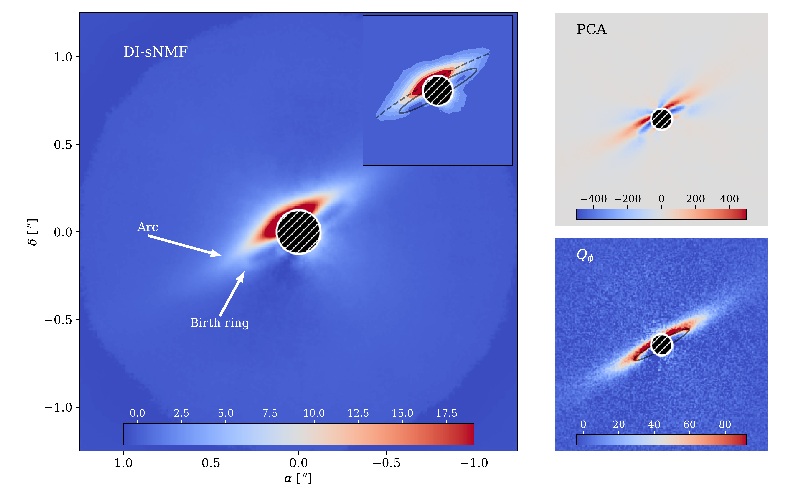

$\newcommand{\ensuremath}{}$
$\newcommand{\xspace}{}$
$\newcommand{\object}[1]{\texttt{#1}}$
$\newcommand{\farcs}{{.}''}$
$\newcommand{\farcm}{{.}'}$
$\newcommand{\arcsec}{''}$
$\newcommand{\arcmin}{'}$
$\newcommand{\ion}[2]{#1#2}$
$\newcommand{\textsc}[1]{\textrm{#1}}$
$\newcommand{\hl}[1]{\textrm{#1}}$
$\newcommand{\footnote}[1]{}$
$\newcommand{\}{natexlab}$

# Apocenter pile-up and arcs: a narrow dust ring around HD 129590$\thanks{Based on observations made with ESO Telescopes at the Paranal Observatory under programs ID 105.20GP.001 and 109.237K.001.}$

<mark>Appeared on: 2023-04-14</mark> -  _Accepted for publication in A&A, abstract shortened_

<mark>J. Olofsson</mark>, et al.

**Abstract:** Observations of debris disks have significantly improved over the past decades, both in terms of sensitivity and spatial resolution. At near-infrared wavelengths, new observing strategies and post-processing algorithms allow us to drastically improve the final images, revealing faint structures in the disks. These structures inform us about the properties and spatial distribution of the small dust particles. We present new $H$ -band observations of the disk around the solar type star HD 129590, which display an intriguing arc-like structure in total intensity but not in polarimetry, and propose an explanation for the origin of this arc. Assuming geometric parameters for the birth ring of planetesimals, our model provides the positions of millions of particles of different sizes to compute scattered light images. The code can either produce images over the full size distribution or over several smaller intervals of grain sizes. We demonstrate that if the grain size distribution is truncated or strongly peaks at a size larger than the radiation pressure blow-out size we are able to produce an arc quite similar to the one detected in the observations. If the birth ring is radially narrow, given that particles of a given size have similar eccentricities, they will have their apocenters at the same distance from the star. Since this is where the particles will spend most of their time, this results in a "apocenter pile-up" that can look like a ring. Due to more efficient forward scattering this arc only appears in total intensity observations and remains undetected in polarimetric data, in good agreement with our observations. This scenario requires sharp variations either in the grain size distribution or for the scattering efficiencies $Q_\mathrm{sca}$ (or a combination of both). Alternative possibilities such as a wavy size distribution and a size-dependent phase function are interesting candidates to strengthen the apocenter pile-up. We also discuss why such arcs are not commonly detected in other systems, which can mainly be explained by the fact that most parent belts are usually broad.

**Figure 7. -** Simulated disk images for total intensity (top panels) and polarized intensity (bottom panels) for different narrow intervals of $\beta$, and the average value of $\beta$ is reported in each panel. The value of the asymmetry parameter $g$ is set to $0.7$ for all images. The scaling is linear and adjusted to the $99.9$ percent for all frames. The images are convolved with a 2D gaussian with a standard deviation of $2$ pixels. (*fig:adi_dpi*)

**Figure 4. -** Surface brightness as a function of the scattering angle, extracted in concentric annulii (accounting for the inclination and position angle of the disk) with increasing deprojected stellocentric distances $r$(in arcsec). For clarity, the profiles have been offset and the horizontal lines show the zero point on the top panel, while no offset has been included for the bottom panel to best compare the different profiles. The fainter lines on the top panel show the best fit with an HG phase function (the $g$ values being reported in the legend). The shaded gray areas show the scattering angle that are not accessible to us for an inclination of $82^\circ$. (*fig:pfuncr*)

**Figure 6. -** SPHERE-IRDIS observations of the disk around HD 129590, showing the DI-sNMF (total intensity, left), PCA (total intensity, top right) and $Q_\phi$(polarized intensity, bottom right) reductions. The detection of the birth ring and the presence of a faint arc are highlighted by two arrows on the left panel. The inset on the left panel also shows the DI-sNMF reduction with the birth ring (best fit from \citealp{Olofsson2022}) and the arc highlighted. The location of the birth ring is also shown on the $Q_\phi$ image as a solid black line. For each image, the central mask has a radius of $0.125$\arcsec, and the color scale is linear. North is up, east is left and the pixel scale is of $12.26$ mas. (*fig:data*)

