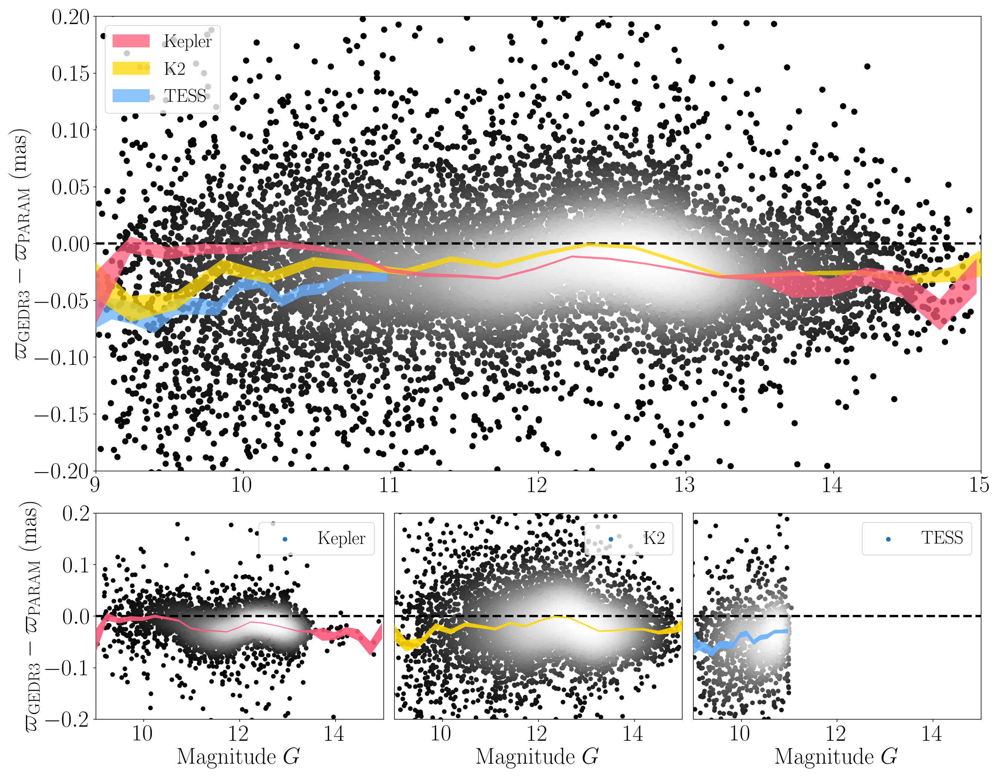
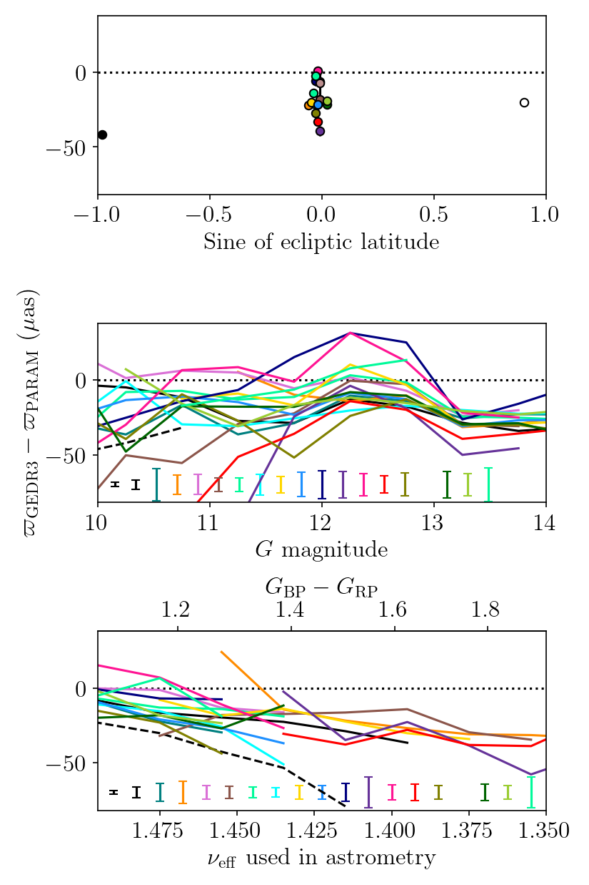

$\newcommand{\ensuremath}{}$
$\newcommand{\xspace}{}$
$\newcommand{\object}[1]{\texttt{#1}}$
$\newcommand{\farcs}{{.}''}$
$\newcommand{\farcm}{{.}'}$
$\newcommand{\arcsec}{''}$
$\newcommand{\arcmin}{'}$
$\newcommand{\ion}[2]{#1#2}$
$\newcommand{\textsc}[1]{\textrm{#1}}$
$\newcommand{\hl}[1]{\textrm{#1}}$
$\newcommand{\footnote}[1]{}$
$\newcommand{\diff}{{\hbox{d}}}$
$\newcommand{\numax}{\mbox{\nu_{\rm max}}\xspace}$
$\newcommand{\deltanu}{\mbox{\langle \Delta\nu \rangle}\xspace}$
$\newcommand{\teff}{\mbox{T_{\rm eff}}\xspace}$
$\newcommand{\logg}{\mbox{\log g}\xspace}$
$\newcommand{\feh}{\mbox{\rm{[Fe/H]}}\xspace}$
$\newcommand{\mh}{\mbox{\rm{[M/H]}}\xspace}$
$\newcommand{\afe}{\mbox{\rm{[\alpha/Fe]}}\xspace}$
$\newcommand{\msun}{\mbox{\mathrm{M}_{\odot}}\xspace}$
$\newcommand{\lsun}{\mbox{\mathrm{L}_{\odot}}\xspace}$
$\newcommand{\mearth}{\mbox{\mathrm{M}_{\oplus}}\xspace}$
$\newcommand{\rsun}{\mbox{\mathrm{R}_{\odot}}\xspace}$
$\newcommand{\muas}{\mbox{\mu \rm as}\xspace}$
$\newcommand{\kepler}{\emph{Kepler}\xspace}$
$\newcommand{\gaia}{\emph{Gaia}\xspace}$
$\newcommand{\ktwo}{K2\xspace}$
$\newcommand{\tess}{TESS\xspace}$

# Investigating $\gaia$ EDR3 parallax systematics using asteroseismology of Cool Giant Stars observed by $\$$\kepler$, $\ktwo$, and $\tess$

<mark>Appeared on: 2023-04-17</mark> -  _11 pages, 8 figures, Accepted for publication in A&A_

S. Khan, et al. -- incl., <mark>T. Cantat-Gaudin</mark>

**Abstract:** $\gaia$ EDR3 has provided unprecedented data that generate a lot of interest in the astrophysical community, despite the fact that systematics affect the reported parallaxes at the level of $\sim 10   \rm \mu as$ . Independent distance measurements are available from asteroseismology of red-giant stars with measurable parallaxes, whose magnitude and colour ranges more closely reflect those of other stars of interest. In this paper, we determine distances to nearly 12,500 red-giant branch and red clump stars observed by $\kepler$ , $\ktwo$ , and $\tess$ . This is done via a grid-based modelling method, where global asteroseismic observables, constraints on the photospheric chemical composition, and on the unreddened photometry are used as observational inputs. This large catalogue of asteroseismic distances allows us to provide a first comparison with $\gaia$ EDR3 parallaxes. Offset values estimated with asteroseismology show no clear trend with ecliptic latitude or magnitude, and the trend whereby they increase (in absolute terms) as we move towards redder colours is dominated by the brightest stars. The correction model proposed by [Lindegren, Bastian and Biermann (2021)]() is not suitable for all the fields considered in this study. We find a good agreement between asteroseismic results and model predictions of the red clump magnitude. We discuss possible trends with the $\gaia$ scan law statistics, and show that two magnitude regimes exist where either asteroseismology or $\gaia$ provides the best precision in parallax.

**Figure 6. -** Parallax difference $\varpi_{\rm EDR3}-\varpi_{\rm PARAM}$ as a function of the $G$ magnitude for the full sample (top), $\kepler$(bottom left), $\ktwo$(bottom middle), and $\tess$(bottom right panel), using \citetalias{Elsworth2020} and APOGEE DR17. The colour scale indicates the density of stars, increasing from black to white. The red, yellow, and blue-shaded areas show the median parallax difference binned by magnitude for $\kepler$, $\ktwo$, and $\tess$, respectively. (*fig:trend_G*)

**Figure 5. -** Skymap in Galactic coordinates, showing the location and coverage resulting from the crossmatch between the various asteroseismic fields considered in this study and APOGEE DR17. This figure has been generated using the \texttt{python} package \texttt{mw-plot}(\url{milkyway-plot.readthedocs.io}). The background image comes from ESA/Gaia/DPAC. (*fig:skymap*)

**Figure 1. -** _Top_: Median parallax offsets as estimated from asteroseismology (\citetalias{Elsworth2020}+APOGEE), as a function of the sine of ecliptic latitude. $\kepler$ and $\tess$ are plotted as white and black symbols, respectively. The coloured symbols correspond to the various $\ktwo$ fields, and follow the colour scheme adopted in Fig. \ref{fig:skymap}. _Middle and bottom_: Median parallax difference binned by $G$ magnitude (middle) and effective wavenumber (bottom panel). $\kepler$ and $\tess$ are plotted as black solid and dashed lines, respectively. The median uncertainty on the parallax difference is shown in the lower part of each panel. C15 does not appear in the two bottom panels as there are not enough stars to bin in $G$ and $\nu_{\rm eff}$. (*fig:offset_summary*)

