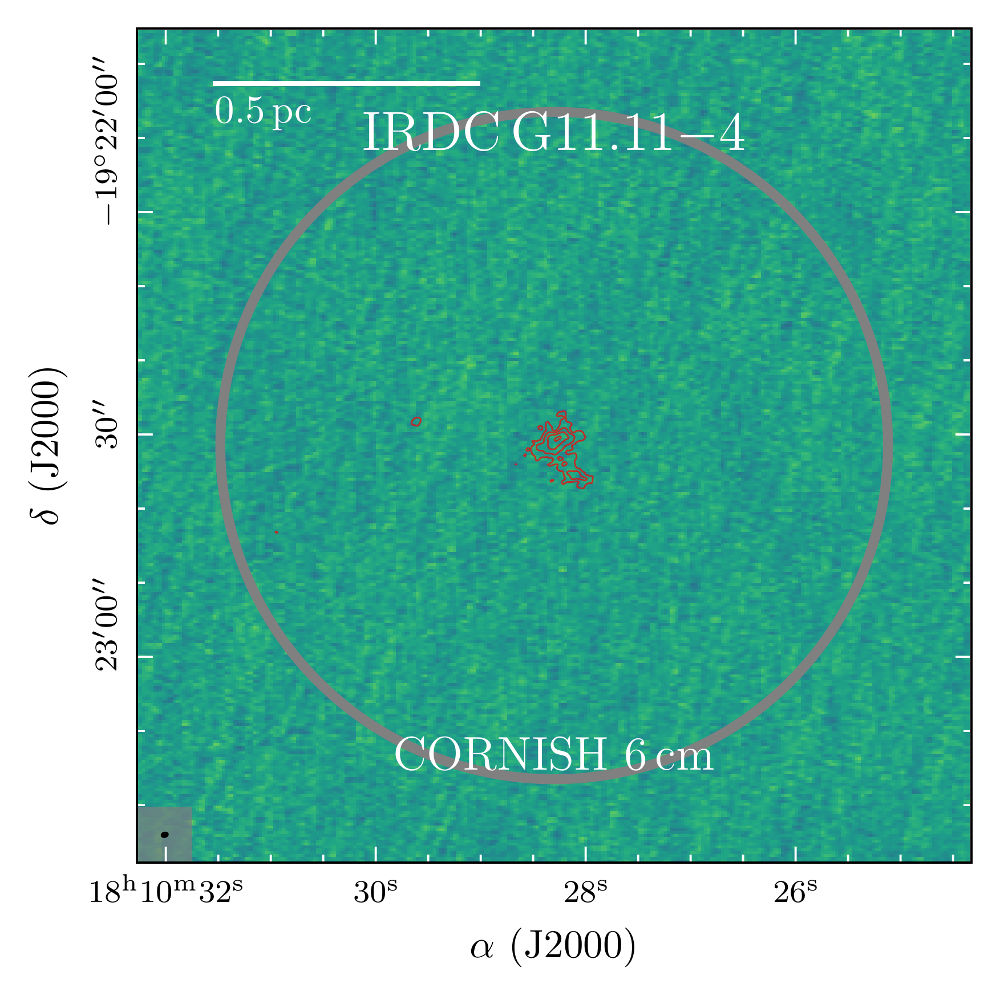
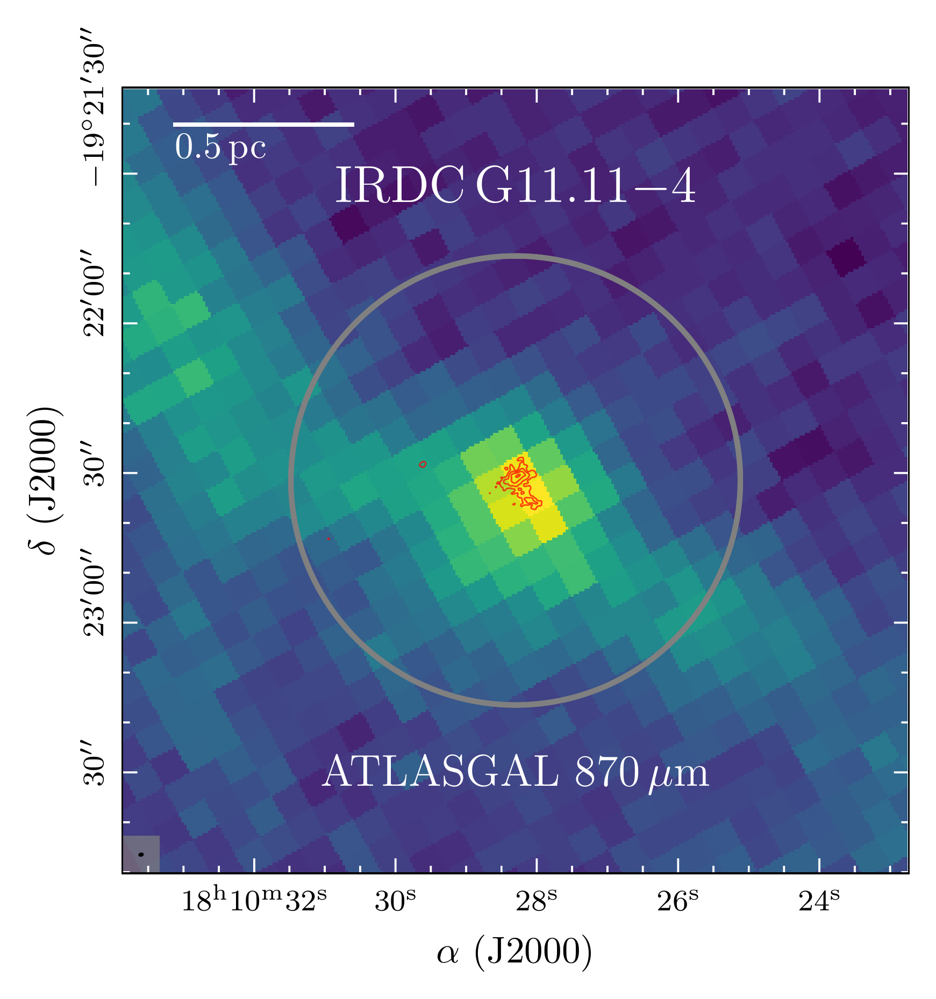
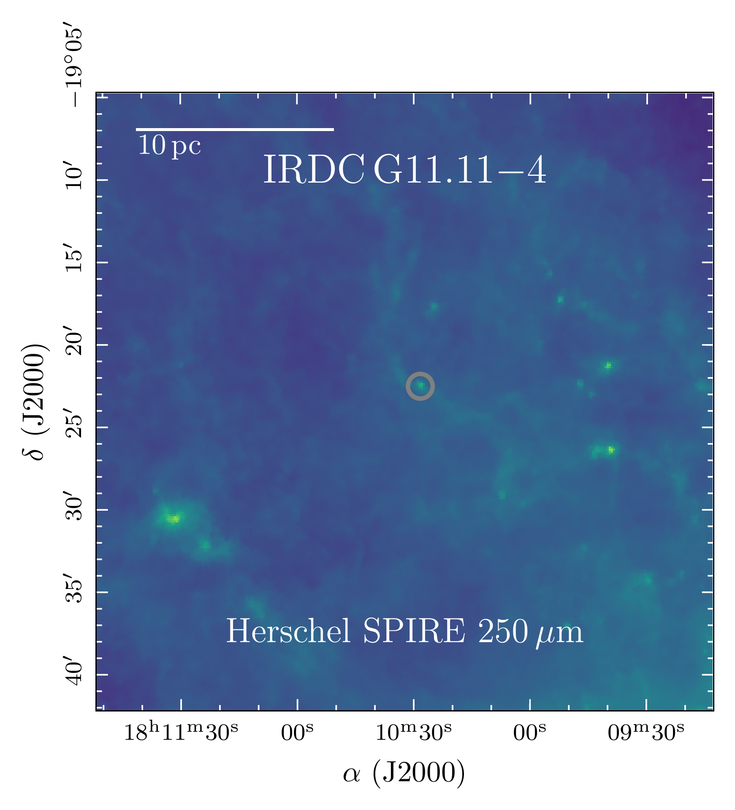
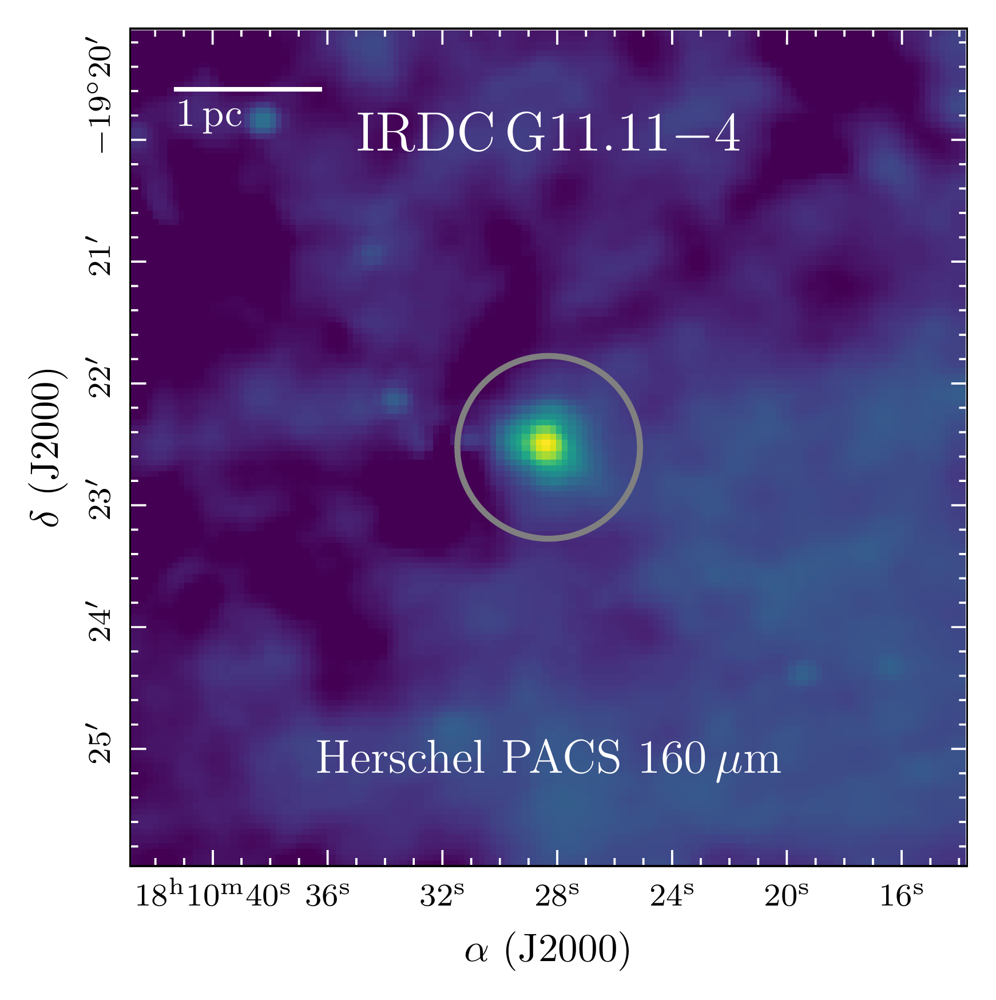
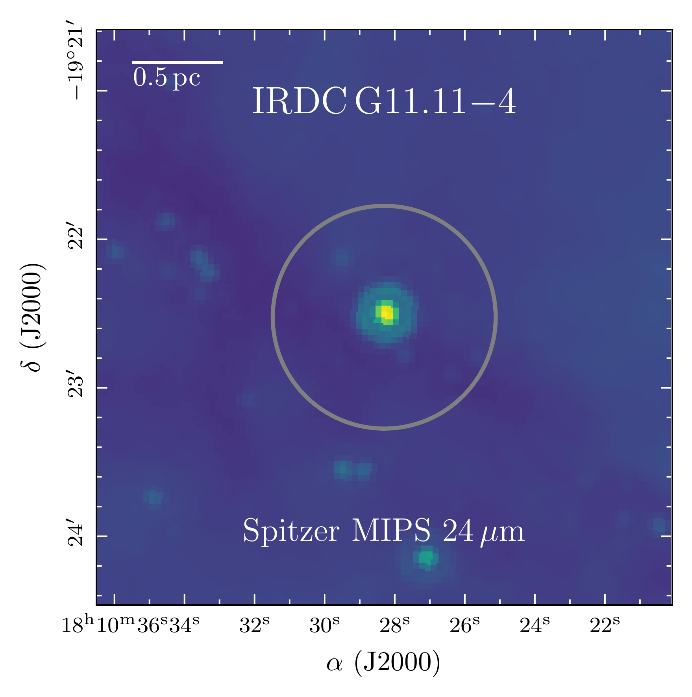
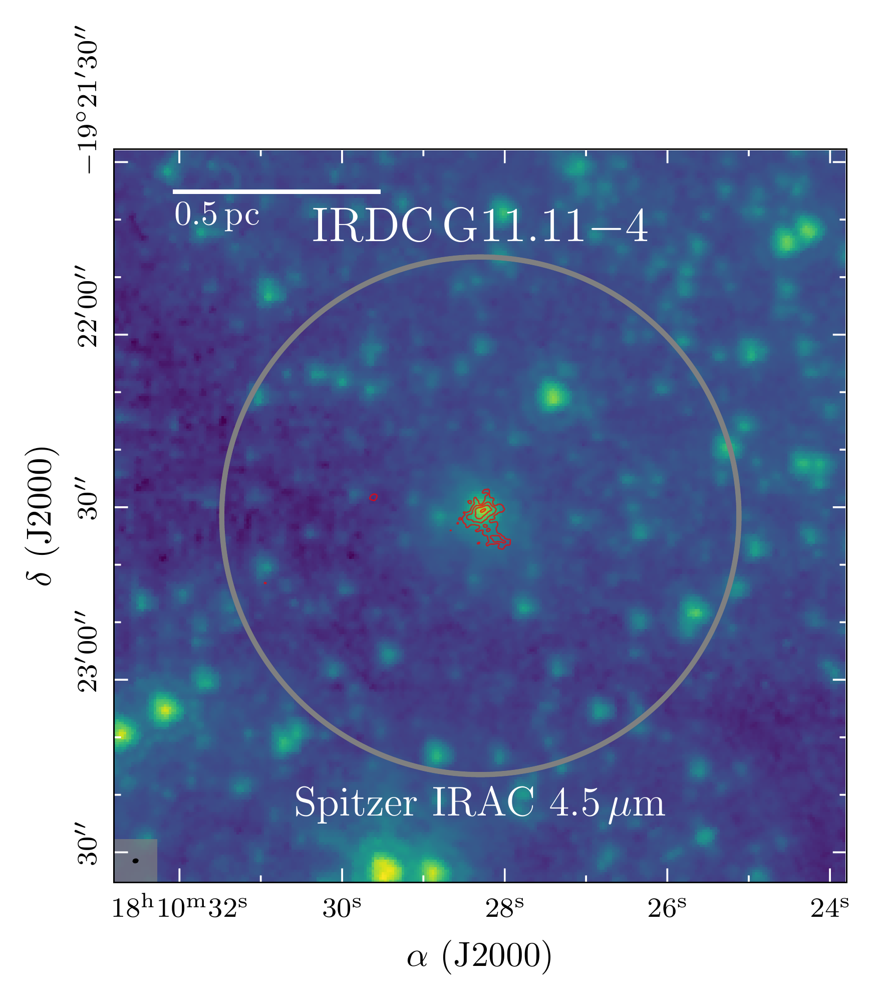
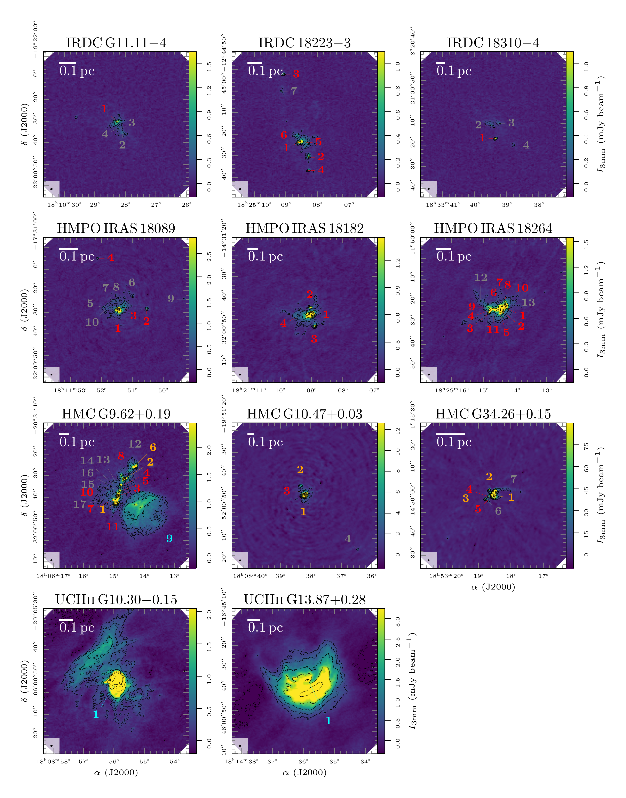
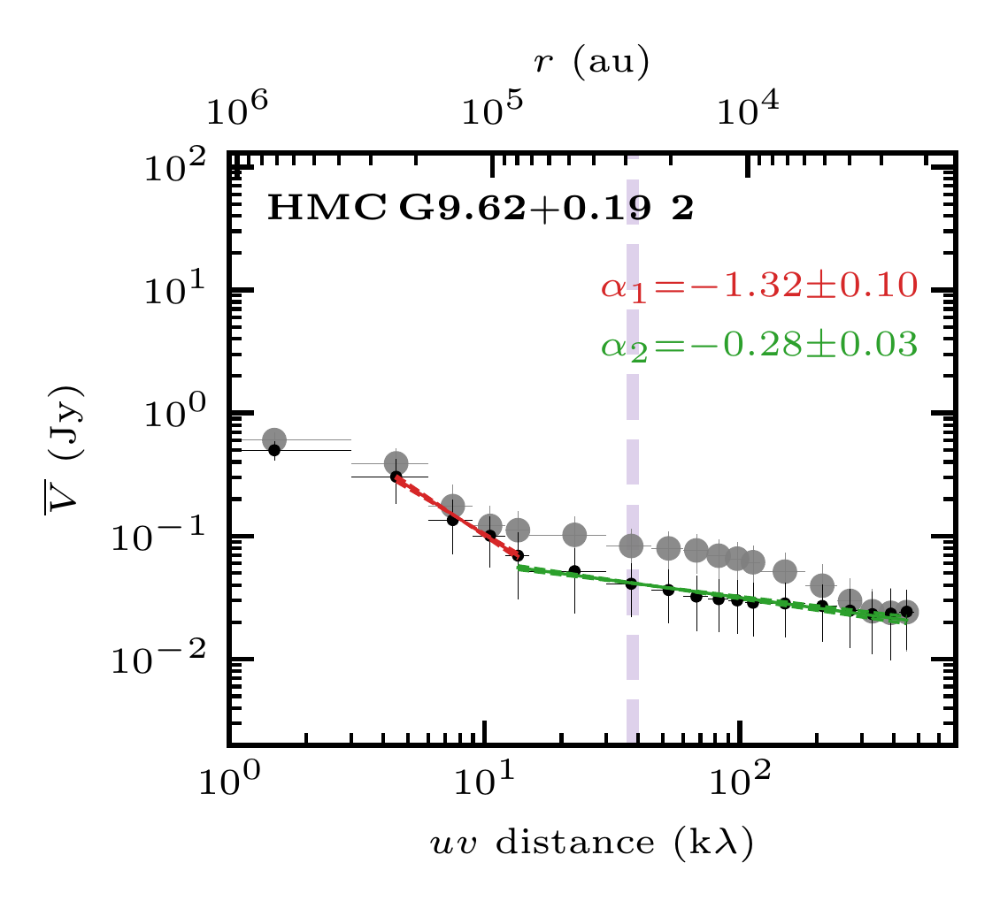

$\newcommand{\ensuremath}{}$
$\newcommand{\xspace}{}$
$\newcommand{\object}[1]{\texttt{#1}}$
$\newcommand{\farcs}{{.}''}$
$\newcommand{\farcm}{{.}'}$
$\newcommand{\arcsec}{''}$
$\newcommand{\arcmin}{'}$
$\newcommand{\ion}[2]{#1#2}$
$\newcommand{\textsc}[1]{\textrm{#1}}$
$\newcommand{\hl}[1]{\textrm{#1}}$
$\newcommand{\footnote}[1]{}$
$\newcommand{\arraystretch}{1.1}$
$\newcommand{\arraystretch}{1.1}$
$\newcommand{\arraystretch}{1.1}$
$\newcommand{\arraystretch}{1.1}$
$\newcommand{\}{as}$

# Physical and chemical complexity in high-mass star-forming regions with ALMA.

<mark>Appeared on: 2023-04-17</mark> -  _21 pages, 10 figures, submitted to A&A_

C. Gieser, et al. -- incl., <mark>H. Beuther</mark>, <mark>D. Semenov</mark>

**Abstract:** High-mass star formation is a hierarchical process from cloud ( $>$ 1 pc), to clump (0.1-1 pc) to core scales ( $<$ 0.1 pc). Modern interferometers achieving high angular resolutions at mm wavelengths allow us to probe the physical and chemical properties of the gas and dust of protostellar cores in the earliest evolutionary formation phases. In this study, we investigate how physical properties, such as the density and temperature profiles, evolve on core scales through the evolutionary sequence during high-mass star formation ranging from protostars in cold infrared dark clouds to evolved UCH ${\sc ii}$ regions. We observed 11 high-mass star-forming regions with the Atacama Large Millimeter/submillimeter Array (ALMA) at 3 mm wavelengths. Based on the 3 mm continuum morphology and H(40) $\alpha$ recombination line emission, tracing locations with free-free (ff) emission, the fragmented cores analyzed in this study are classified into either "dust" or "dust+ff" cores. In addition, we resolve three cometary UCH ${\sc ii}$ regions with extended 3 mm emission that is dominated by free-free emission. The temperature structure and radial profiles ( $T \sim r^{-q}$ ) are determined by modeling molecular emission of CH $_{3}$ CN and CH $_{3}^{13}$ CN with \texttt{XCLASS} and by using the HCN-to-HNC intensity ratio as probes for the gas kinetic temperature. The density profiles ( $n \sim r^{-p}$ ) are estimated from the 3 mm continuum visibility profiles. The masses $M$ and H $_{2}$ column densities $N$ (H $_{2}$ ) are then calculated from the 3 mm dust continuum emission. We find a large spread in mass and peak H $_{2}$ column density in the detected sources ranging from 0.1 - 150 $M_\odot$ and 10 $^{23}$ - 10 $^{26}$ cm $^{-2}$ , respectively. Including the results of the CORE and CORE-extension studies  ([Gieser, Beuther and Semenov 2021](), [Gieser, Beuther and Semenov 2022]())  to increase the sample size, we find evolutionary trends on core scales for the temperature power-law index $q$ increasing from 0.1 to 0.7 from infrared dark clouds to UCH ${\sc ii}$ regions, while for the the density power-law index $p$ on core scales, we do not find strong evidence for an evolutionary trend. However, we find that on the larger clump scales throughout these evolutionary phases the density profile flattens from $p \approx 2.2$ to $p \approx 1.2$ . By characterizing a large statistical sample of individual fragmented cores, we find that the physical properties, such as the temperature on core scales and density profile on clump scales, evolve even during the earliest evolutionary phases in high-mass star-forming regions. These findings provide observational constraint for theoretical models describing the formation of massive stars. In follow-up studies we aim to further characterize the chemical properties of the regions by analyzing the large amount of molecular lines detected with ALMA in order to investigate how the chemical properties of the molecular gas evolve during the formation of massive stars.

**Figure 12. -** Overview of IRDC G11.11$-$4.Multi wavelength overview of IRDC G11.11$-$4. In color, CORNISH 6 cm, ATLASGAL 870$\upmu$m, _Herschel_ SPIRE 250 $\upmu$m, _Herschel_ PACS 70 $\upmu$m, _Spitzer_ MIPS 24 $\upmu$m, and _Spitzer_ IRAC 4.5 $\upmu$m data are presented as labeled. In all panels, the ALMA primary beam size is indicated by a grey circle. In the top right and left and bottom right panel, the ALMA 3 mm continuum data are shown by red contours. The dotted red contour marks the $-5\sigma_\mathrm{cont}$ level. The solid red contours start at $5\sigma_\mathrm{cont}$ and contour steps increase by a factor of 2 (e.g., 5, 10, 20, $40\sigma_\mathrm{cont}$). The ALMA synthesized beam size is shown in the bottom left corner. (*fig:overview_IRDC_G1111*)

**Figure 6. -** ALMA 3 mm continuum images of the sample.ALMA 3 mm continuum. In each panel, the continuum data of the region is shown in color and black contours. The dotted black contour marks the $-5\sigma_\mathrm{cont}$ level. The solid black contours start at $5\sigma_\mathrm{cont}$ and contour steps increase by a factor of 2 (e.g., 5, 10, 20, $40\sigma_\mathrm{cont}$). The synthesized beam size is shown in the bottom left corner. The bar in the top left corner indicates a linear spatial scale of 0.1 pc. The continuum noise and synthesized beam size are listed in Table \ref{tab:ALMAcontinuumdataproducts}. The continuum fragments are classified into dust cores (red), dust+ff cores (orange), cometary UCH{\sc ii} regions (cyan), further explained in Sect. \ref{sec:ALMAfrag}. Fragments with $S$/$N < 15$ are not analyzed in this study and are labeled in grey. (*fig:ALMAcontinuum*)

**Figure 2. -** Visibility profile of dust+ff core 2 in HMC G9.62$+$0.19. The profile of the non-core-subtracted and core-subtracted data is shown in grey and black, respectively (further explained in Sect. \ref{sec:ALMAsourcesub}). Two power-law profiles, tracing roughly the clump and core scales, are fitted to the core-subtracted data shown in red and green, respectively. The bottom axis shows the $uv$ distance in k$\lambda$ and the top axis is the corresponding spatial scale. The purple dashed line indicates the source diameter (Table \ref{tab:ALMApositions}). The figures for the remaining sources are shown in Fig. \ref{fig:ALMAvisibilityprofileapp}. (*fig:ALMAvisibilityprofile*)

