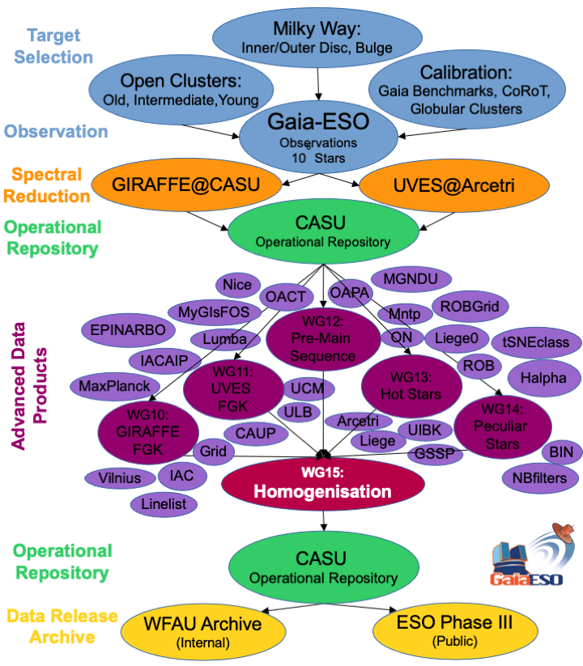
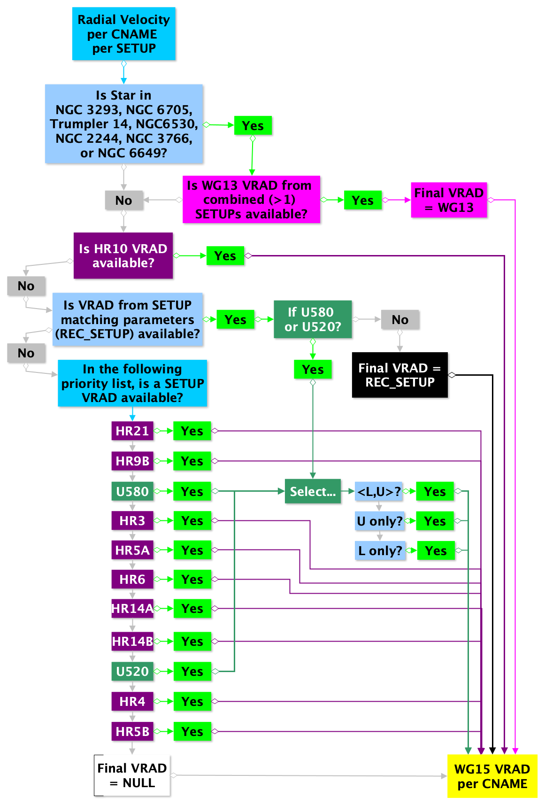
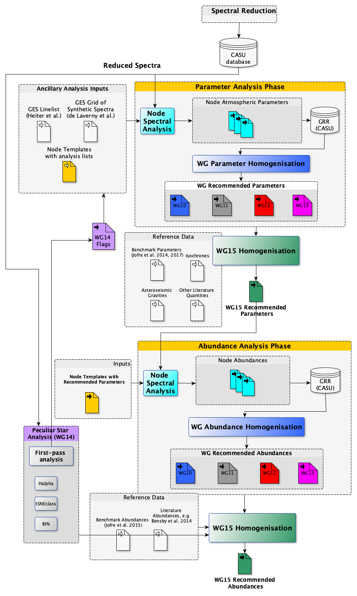

$\newcommand{\ensuremath}{}$
$\newcommand{\xspace}{}$
$\newcommand{\object}[1]{\texttt{#1}}$
$\newcommand{\farcs}{{.}''}$
$\newcommand{\farcm}{{.}'}$
$\newcommand{\arcsec}{''}$
$\newcommand{\arcmin}{'}$
$\newcommand{\ion}[2]{#1#2}$
$\newcommand{\textsc}[1]{\textrm{#1}}$
$\newcommand{\hl}[1]{\textrm{#1}}$
$\newcommand{\footnote}[1]{}$
$\newcommand{\teff}{T_{\rm eff}}$
$\newcommand{\logg}{\log g}$
$\newcommand{\feh}{\mathrm{[Fe/H]}}$
$\newcommand{\vsini}{\ensuremath{v\sin i}}$
$\newcommand{\vrad}{V_\mathrm{rad}}$

# The Gaia-ESO Survey: homogenisation of stellar parameters and elemental abundances 

<mark>Appeared on: 2023-04-18</mark> -  _A&A accepted, minor revision, 36 pages, 38 figures_

A. Hourihane, et al. -- incl., <mark>M. Bergemann</mark>, <mark>G. Guiglion</mark>

**Abstract:** The Gaia-ESO Survey is a public spectroscopic survey that has targeted $\gtrsim10^5$ stars covering all major components of the Milky Way from the end of 2011 to 2018, delivering its public final release in May 2022. Unlike other spectroscopic surveys, Gaia-ESO is the only survey that observed stars across all spectral types with dedicated, specialised analyses: from O ( $T_\mathrm{eff} \sim 30,000-52,000$ K) all the way to K-M ( $\gtrsim$ 3,500 K). The physics throughout these stellar regimes varies significantly, which has previously prohibited any detailed comparisons between stars of significantly different type. In the final data release (internal data release 6) of the Gaia-ESO Survey, we provide the final database containing a large number of products such as radial velocities, stellar parameters and elemental abundances, rotational velocity, and also, e.g.,  activity and accretion indicators in young stars and membership probability in star clusters  for more than 114,000 stars. The spectral analysis is coordinated by a number of Working Groups (WGs) within the Survey, which specialise in the various stellar samples. Common targets are analysed across WGs to allow for comparisons (and calibrations) amongst instrumental setups and spectral types. Here we describe the procedures employed to ensure all Survey results are placed on a common scale to arrive at a single set of recommended results for all Survey collaborators to use. We also present some general quality and consistency checks performed over all Survey results.

**Figure 1. -** Gaia-ESO data flow diagram for iDR6 showing the key stages from target selection to data release via the archives. (*fig:idr6_dataflow_ppt*)

**Figure 7. -** Schematic view of the GES WG15 Radial Velocity Homogenisation Work-Flow. (*fig:rvhomg_wrkflw*)

**Figure 11. -** Gaia-ESO data processing diagram for iDR6 showing the complexity of the interfaces between the reduction, parameter, abundance and homogenisation processes. The GRR is the GES Results Repository at CASU. (*fig:idr6_dataflow_yed*)

