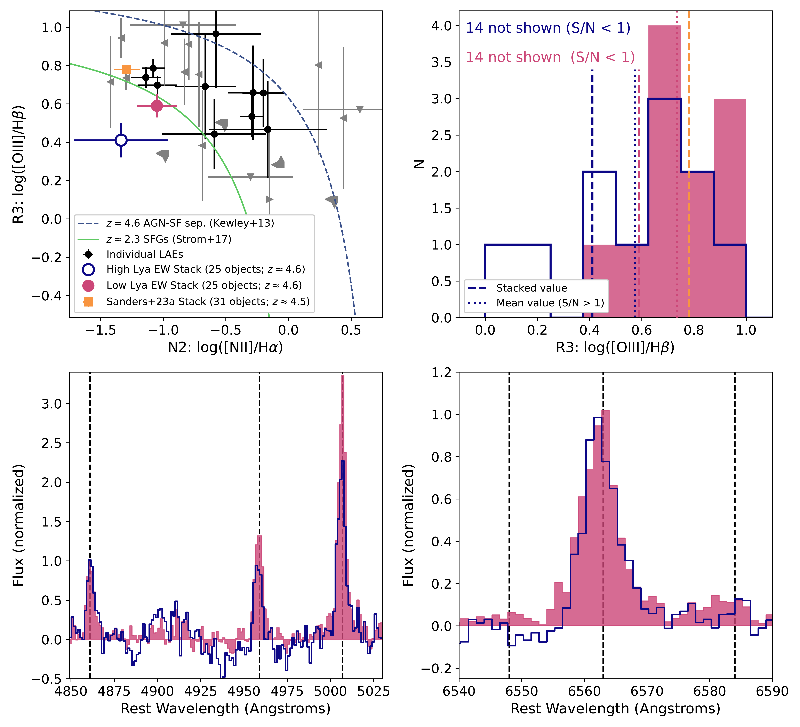
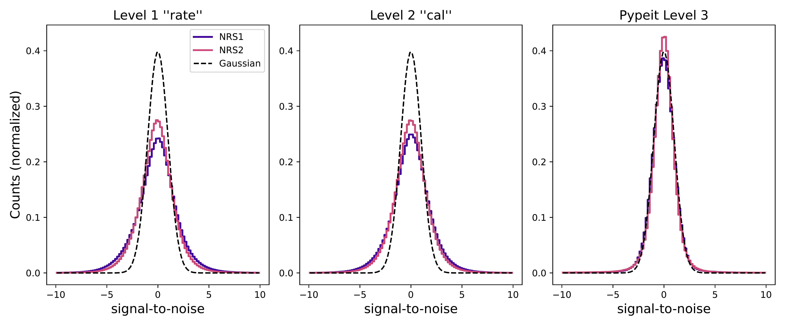

$\newcommand{\ensuremath}{}$
$\newcommand{\xspace}{}$
$\newcommand{\object}[1]{\texttt{#1}}$
$\newcommand{\farcs}{{.}''}$
$\newcommand{\farcm}{{.}'}$
$\newcommand{\arcsec}{''}$
$\newcommand{\arcmin}{'}$
$\newcommand{\ion}[2]{#1#2}$
$\newcommand{\textsc}[1]{\textrm{#1}}$
$\newcommand{\hl}[1]{\textrm{#1}}$
$\newcommand{\footnote}[1]{}$
$\newcommand{\vdag}{(v)^\dagger}$
$\newcommand$
$\newcommand$
$\newcommand{\minus}{\scalebox{0.5}[1.0]{-}}$
$\newcommand{\kms}{\>{\rm km}~ {\rm s}^{-1}}$
$\newcommand{\reff}{r_{\rm{eff}}}$
$\newcommand{\msol}{M_{\odot}}$
$\newcommand{\zsol}{Z_{\odot}}$
$\newcommand{\inverse}[1]{{#1}^{-1}}$
$\newcommand{\invvar}{\inverse{C}}$
$\newcommand{\dd}{{\rm d}}$
$\newcommand{\cgs}{erg s^{-1} cm^{-2}}$
$\newcommand{\pf}{\texttt{pyPlatefit}}$
$\newcommand{\magphys}{\texttt{MAGPHYS} }$
$\newcommand{\lya}{Lyman-\alpha }$
$\newcommand{\lyans}{Lyman-\alpha}$
$\newcommand{\oi}{[O I]}$
$\newcommand{\sii}{[S II]}$
$\newcommand{\nii}{[\ion{N}{2}]}$
$\newcommand{\neiii}{[\ion{Ne}{3}]}$
$\newcommand{\hb}{H\beta}$
$\newcommand{\oiii}{[\ion{O}{3}]}$
$\newcommand{\oii}{[\ion{O}{2}]}$
$\newcommand{\ewoii}{EW_{\mathrm{[O II]}}}$
$\newcommand{\ha}{H\alpha}$
$\newcommand{\df}{D_{n}4000}$
$\newcommand{\hd}{H\delta}$
$\newcommand{\hda}{H\delta_{A}}$

# JWST/NIRSpec Measurements of Extremely Low Metallicities in High Equivalent Width Lyman-$\alpha$ Emitters

<mark>Appeared on: 2023-04-19</mark> -  _13 pages, 4 appendices; submitted to AAS Journals_

M. V. Maseda, et al. -- incl., <mark>L. Boogaard</mark>

**Abstract:** Deep VLT/MUSE optical integral field spectroscopy has recently revealed an abundant population of ultra-faint galaxies ( $M_{UV} \approx -15$ ; 0.01 $L_{\star}$ ) at $z=$ 2.9 $-$ 6.7 due to their strong Lyman- $\alpha$ emission with no detectable continuum.  The implied $\lya$ equivalent widths can be in excess of 100-200 Å, challenging existing models of normal star formation and indicating extremely young ages, small stellar masses, and a very low amount of metal enrichment. We use JWST/NIRSpec to follow-up 45 of these galaxies (11h in G235M/F170LP and 7h in G395M/F290LP), as well as 45 lower-equivalent width Lyman- $\alpha$ emitters.  Our spectroscopy covers the range 1.7 $-$ 5.1 micron in order to target strong optical emission lines: $\ha$ , $\oiii$ , $\hb$ , and $\nii$ . Individual measurements as well as stacks reveal line ratios consistent with a metal poor nature (2 $-$ 30 \% $Z_{\odot}$ , depending on the calibration).  The galaxies with the highest equivalent widths of $\lyans$ , in excess of 120 Å, have lower gas-phase metallicities than those with lower equivalent widths.  This implies a selection based on $\lyans$ equivalent width is an efficient technique for identifying younger, less chemically enriched systems.

**Figure 3. -** (Upper left) R3 versus N2 ionization diagnostic plot for our sample of LAEs at $z\approx4.6$.  For objects with S/N $<$ 1 in any of the individual lines, we use gray triangles to represent limits (2-$\sigma$) on the ratio(s); objects without a S/N $>$ 1 detection in both components of R3 or N2 are omitted, although they are still included in the stacks.  The stacked values from our LAEs (large circles) lie below the sequence of $z\approx2.3$ star-forming galaxies (SFGs) from [Strom, Steidel and Rudie (2017)](), the [Sanders, et. al (2023)](), including the $\pm$1-$\sigma$ spread (thin lines).  The shaded regions show the stacked R3 ranges, including those from [Sanders, et. al (2023)](). Our LAEs have lower R3 values than the "typical" SFGs from [Sanders, et. al (2023)](), indicating lower metallicities (vertical dashed lines). (*fig:lya-r3*)

**Figure 5. -** Comparison of the background-subtracted signal-to-noise values for (left) all pixels in the level 1 processed "rate" files, (center) pixels illuminated by open MSA shutters in the level 2 "cal" files, and (right) pixels in the \texttt{Pypeit}-calibrated 2D frames, including the extra factors of 1.85 and 1.62 in the noise estimates as described in the text.  Each of the two detectors are plotted separately.  The discrepancy in the distributions of the levels 1 and 2 products compared to Gaussian statistics (dashed line) motivate the extra noise factors used in \texttt{Pypeit}. (*fig:noise*)

