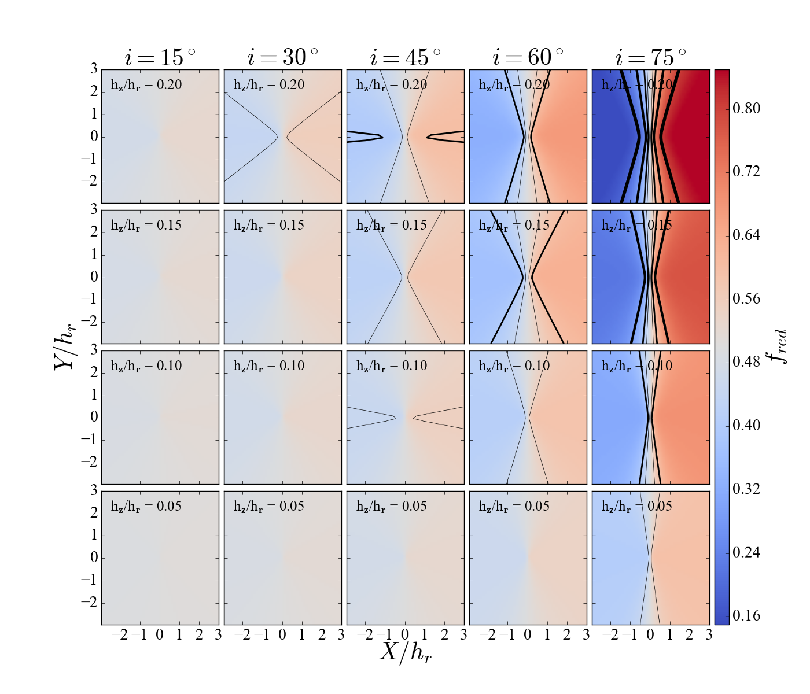
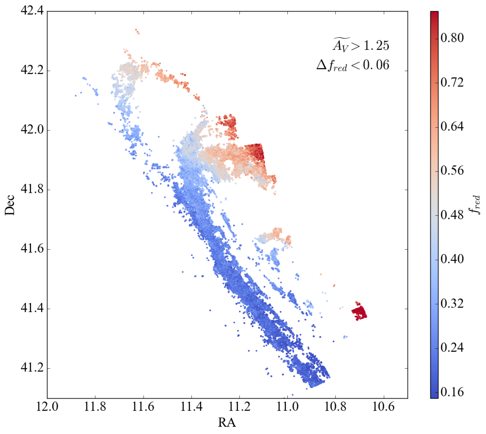
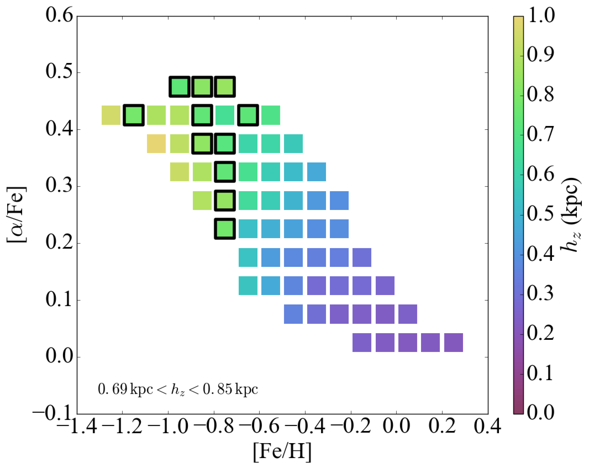
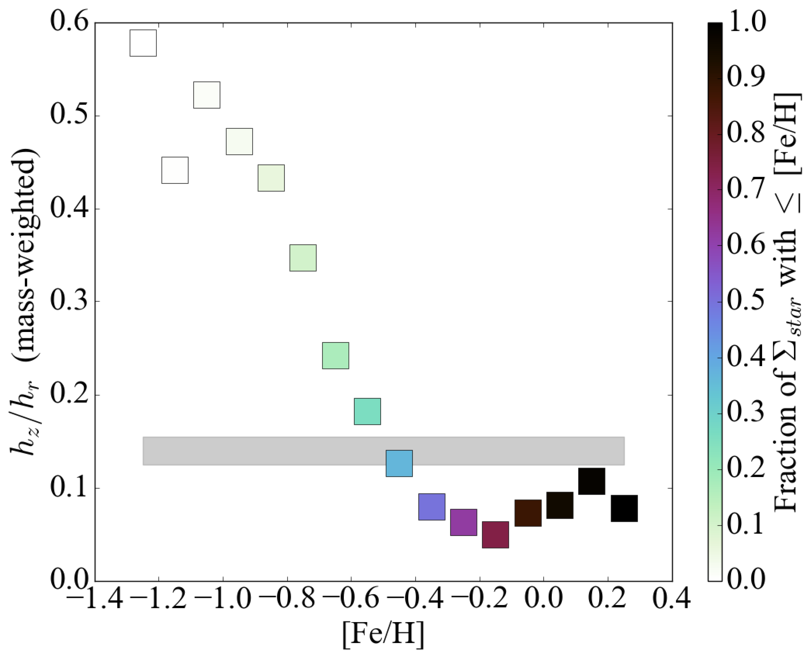

$\newcommand{\ensuremath}{}$
$\newcommand{\xspace}{}$
$\newcommand{\object}[1]{\texttt{#1}}$
$\newcommand{\farcs}{{.}''}$
$\newcommand{\farcm}{{.}'}$
$\newcommand{\arcsec}{''}$
$\newcommand{\arcmin}{'}$
$\newcommand{\ion}[2]{#1#2}$
$\newcommand{\textsc}[1]{\textrm{#1}}$
$\newcommand{\hl}[1]{\textrm{#1}}$
$\newcommand{\footnote}[1]{}$
$\newcommand{\vdag}{(v)^\dagger}$
$\newcommand$
$\newcommand$
$\newcommand$
$\newcommand$
$\newcommand$
$\newcommand$
$\newcommand$
$\newcommand$
$\newcommand$
$\newcommand$
$\newcommand$
$\newcommand$
$\newcommand$
$\newcommand$
$\newcommand$
$\newcommand$
$\newcommand$
$\newcommand$
$\newcommand$
$\newcommand$
$\newcommand$
$\newcommand$
$\newcommand$
$\newcommand$
$\newcommand$
$\newcommand$
$\newcommand$
$\newcommand$
$\newcommand$
$\newcommand$
$\newcommand$
$\newcommand$
$\newcommand$

# The Panchromatic Hubble Andromeda Treasury XX: The Disk of M31 is Thick

<mark>Appeared on: 2023-04-19</mark> -  _22 pages. Accepted to the Astrophysical Journal_

J. J. Dalcanton, et al. -- incl., <mark>M. Fouesneau</mark>

**Abstract:** We present a new approach to measuring the thickness of a partially face-on stellar disk, using dust geometry. In a moderately-inclined disk galaxy, the fraction of reddened stars is expected to be 50 \% everywhere, assuming that dust lies in a thin midplane.  In a thickened disk, however, a wide range of radii project onto the line of sight. Assuming stellar density declines with radius, this geometrical projection leads to differences in the numbers of stars on the near and far sides of the thin dust layer. The fraction of reddened stars will thus differ from the 50 \% prediction, with a deviation that becomes larger for puffier disks.  We map the fraction of reddened red giant branch (RGB) stars across M31, which shows prominent dust lanes on only one side of the major axis. The fraction of reddened stars varies systematically from 20 \% to 80 \% , which requires that these stars have an exponential scale height $h_z$ that is $0.14\pm0.015$ times the exponential scale length ( $h_r\approx5.5\kpc$ ). M31's RGB stars must therefore have $h_z=770\pm80\pc$ , which is far thicker than the Milky Way's thin disk, but comparable to its thick disk. The lack of a significant thin disk in M31 is unexpected, but consistent with its interaction history and high disk velocity dispersion. We suggest that asymmetric reddening be used as a generic criteria for identifying "thick disk" dominated systems, and discuss prospects for future 3-dimensional tomographic mapping of the gas and stars in M31.

**Figure 7. -** Maps of the apparent fraction of reddened stars for models of
  inclined, thickened disks where the dust is assumed to be confined
  to the midplane with negligible thickness compared to the stars
  (i.e., $h_z >> h_{dust}$). The apparent inclinations of the model
  disks increases from left to right ($i=15◦ee$, $30◦ee$,
  $45◦ee$, $60◦ee$, \&$75◦ee$), and the disk thickness
  increases from bottom to top ($h_z/h_r=0.05$, 0.1, 0.15, \& 0.2). As
  expected, the fraction of reddened stars is always 50\% along the
  major axis, but deviates strongly perpendicularly, with the largest
  deviations seen for higher inclinations and intrinsically thicker
  disks.  Contours indicate deviations of $\pm5$\%, $\pm10$\%,
  $\pm20$\%, \&$\pm30$\% relative to 50\%, with thicker contours
  indicating larger deviations.
 (*fredgridfig*)

**Figure 10. -** Map of the fraction of reddened stars $f_{red}$, restricted
  to high extinction ($A_V>1.25\mags$) regions with well-measured
  values of $f_{red}$($\Delta f_{red} < 0.06$). There is a clear
  gradient in the fraction of reddened stars from the far side to the
  near side of the disk (i.e., left to right).  The majority of the
  PHAT survey area, which was initially targeted to avoid M31's dust
  lanes, has fewer than $\sim$25\% of its old stellar population
  behind the dusty ISM.  The center of M31 is in the lower right, at RA$\approx$10.68 and Dec$\approx$41.27.
 (*fredmapfig*)

**Figure 11. -** Comparison between the structure of M31's RGB disk and the
  structure of the Milky Way's monoabundance populations from
  \citet{bovy2012}.  (Left) Monoabundance populations in [Fe/H] vs
        [$\alpha$/Fe], color-coded by their vertical scale height at
        the solar circle.  Populations whose scale height falls in the
        range allowed by the data in M31 are outlined in black.  Only
        low metallicity, $\alpha$-enhanced Milky Way populations have
        scale heights comparable to those we see in M31.  (Right) The
        axial ratio of the monoabundance subpopulations as a function
        of [Fe/H] calculated as a mass-weighted average of $h_z/h_r$
        over [$\alpha$/Fe] at fixed [Fe/H]. Points are color-coded by
        the fraction of the integrated local stellar density found in
        populations with metallicities equal to or lower than [Fe/H].
        The horizontal bar show the likely range of $h_z/h_r$ for
        M31's stellar disk.  Only low metallicity populations
        ([Fe/H]$\lesssim-0.5$) that make up $\sim$30\% of the Milky
        Way disk are as puffy as the M31 disk.
 (*bovyfig*)

