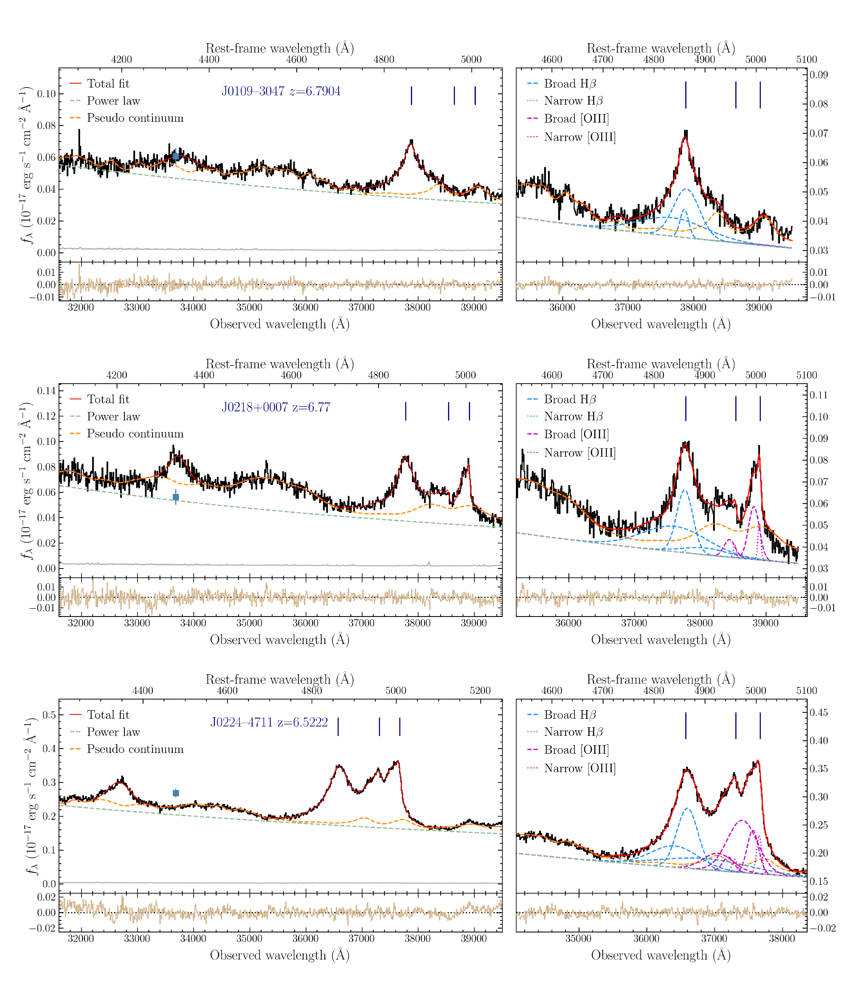
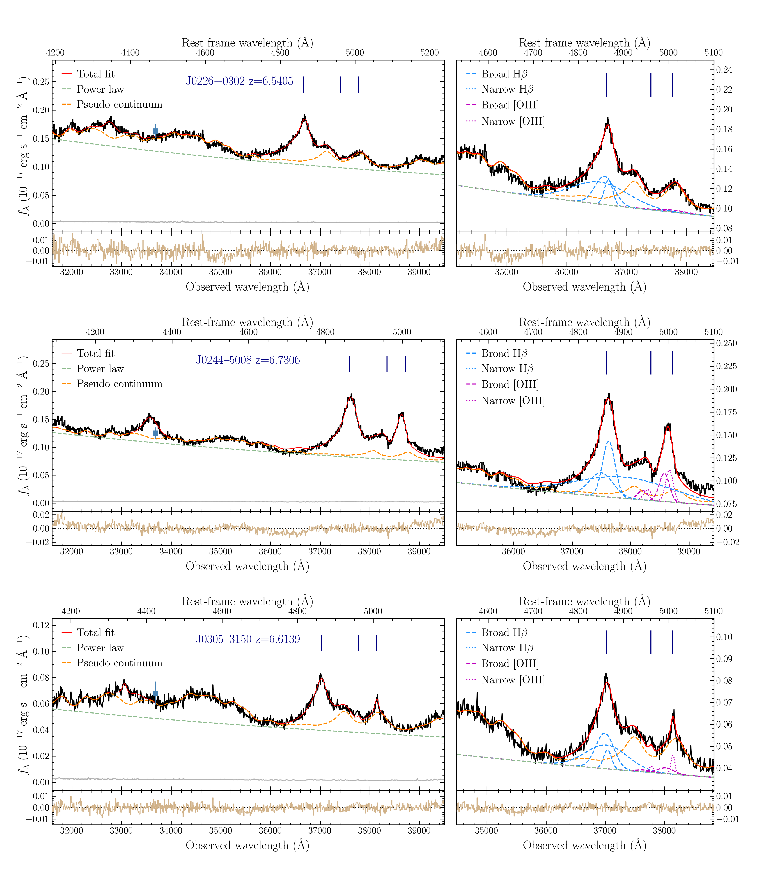
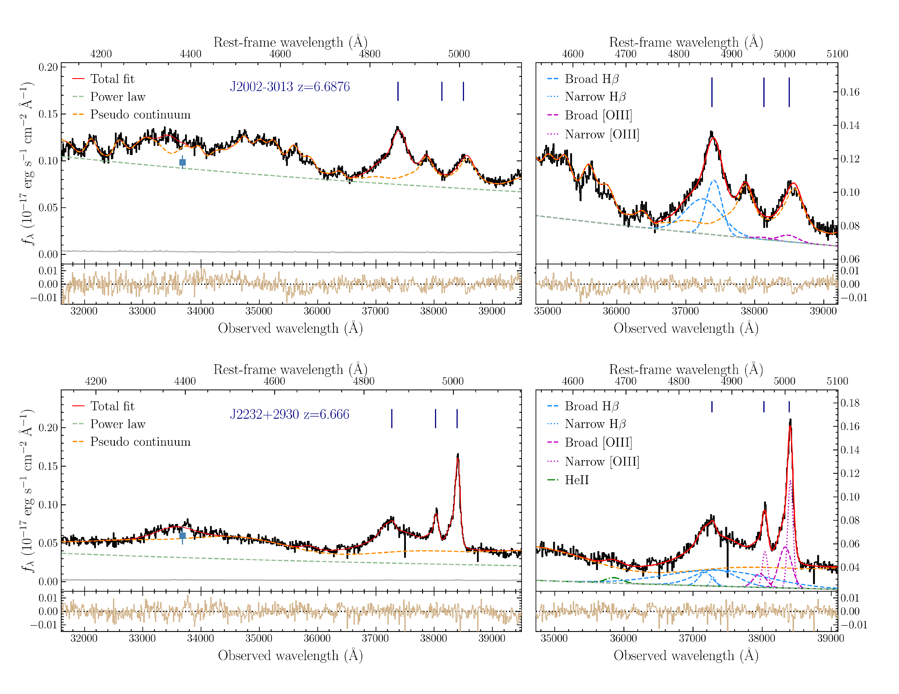

$\newcommand{\ensuremath}{}$
$\newcommand{\xspace}{}$
$\newcommand{\object}[1]{\texttt{#1}}$
$\newcommand{\farcs}{{.}''}$
$\newcommand{\farcm}{{.}'}$
$\newcommand{\arcsec}{''}$
$\newcommand{\arcmin}{'}$
$\newcommand{\ion}[2]{#1#2}$
$\newcommand{\textsc}[1]{\textrm{#1}}$
$\newcommand{\hl}[1]{\textrm{#1}}$
$\newcommand{\footnote}[1]{}$
$\newcommand{\vdag}{(v)^\dagger}$
$\newcommand$
$\newcommand$
$\newcommand{\mgii}{\ion{Mg}{2}}$
$\newcommand{\civ}{\ion{C}{4}}$
$\newcommand{\cii}{\ion{C}{2}}$
$\newcommand{\nv}{\ion{N}{5}}$
$\newcommand{\heii}{\ion{He}{2}}$
$\newcommand{\hii}{\ion{H}{2}}$
$\newcommand{\hi}{\ion{H}{1}}$
$\newcommand{\feii}{\ion{Fe}{2}}$
$\newcommand{\oiii}{\ion{O}{3}}$

# A SPectroscopic survey of biased halos In the Reionization Era (ASPIRE): A First Look at the Rest-frame Optical Spectra of $z > 6.5$ Quasars Using JWST

<mark>Appeared on: 2023-04-21</mark> -  _13 pages, 4 figures, accepted for publication in ApJL_

J. Yang, et al. -- incl., <mark>E. Bañados</mark>, <mark>S. Bosman</mark>, <mark>M. Habouzit</mark>, <mark>Y. Khusanova</mark>, <mark>S. Rojas-Ruiz</mark>

**Abstract:** Studies of rest--frame optical emission in quasars at $z>6$ have historically been limited by the wavelengths accessible by ground-based telescopes. The James Webb Space Telescope (JWST) now offers the opportunity to probe this emission deep into the reionization epoch. We report the observations of eight quasars at $z>6.5$ using the JWST/NIRCam Wide Field Slitless Spectroscopy, as a part of the "A SPectroscopic survey of biased halos In the Reionization Era (ASPIRE)" program. Our JWST spectra cover the quasars' emission between rest frame $\sim$ 4100 and 5100 Å. The profiles of these quasars' broad H $\beta$ emission lines span a FWHM from 3000 to 6000 $\rm{km s^{-1}}$ . The H $\beta$ -based virial black hole (BH) masses, ranging from 0.6 to 2.1 billion solar masses, are generally consistent with their $\mgii$ -based BH masses. The new measurements based on the more reliable H $\beta$ tracer thus confirm the existence of billion solar-mass BHs in the reionization epoch. In the observed [ $\oiii$ ] $\lambda\lambda$ 4960,5008 doublets of these luminous quasars, broad components are more common than narrow core components ( $\le 1200 \rm{km s^{-1}}$ ), and only one quasar shows stronger narrow components than broad. Two quasars exhibit significantly broad and blueshifted [ $\oiii$ ] emission, thought to trace galactic--scale outflows, with median velocities of $-610 \rm{km s^{-1}}$ and $-1430 \rm{km s^{-1}}$ relative to the [ $\cii$ ] $158 \mu$ m line. All eight quasars show strong optical $\feii$ emission, and follow the Eigenvector 1 relations defined by low--redshift quasars. The entire ASPIRE program will eventually cover 25 quasars and provide a statistical sample for the studies of the BHs and quasar spectral properties.

**Figure 4. -** The JWST NIRCam WFSS F356W spectra of eight ASPIRE quasars (black line) with spectral uncertainty (grey), ordered by RA. The red solid lines  denote the best total fits. The best-fits of different spectral components are shown with dashed and dotted lines. For each object, the left panel presents the entire spectrum with total fit, power-law continuum, and pseudo continuum (i.e., power-law plus $\feii$ emission). The right panel shows the zoomed-in region of H$\beta$ and [$\oiii$] lines. The systemic redshifts of the quasars are based on their [$\cii$] line measurements from ALMA observations. The blue squares with error bars are the photometric data in the WISE $W1$ 3.4 $\mu$m band. The panels below the spectra present the residuals (data--model) of each best-fit model. (*fig:spec01*)

**Figure 5. -** Continued (*fig:spec01*)

**Figure 6. -** Continued (*fig:spec01*)

