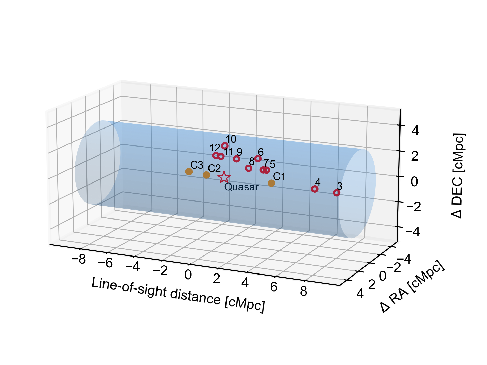
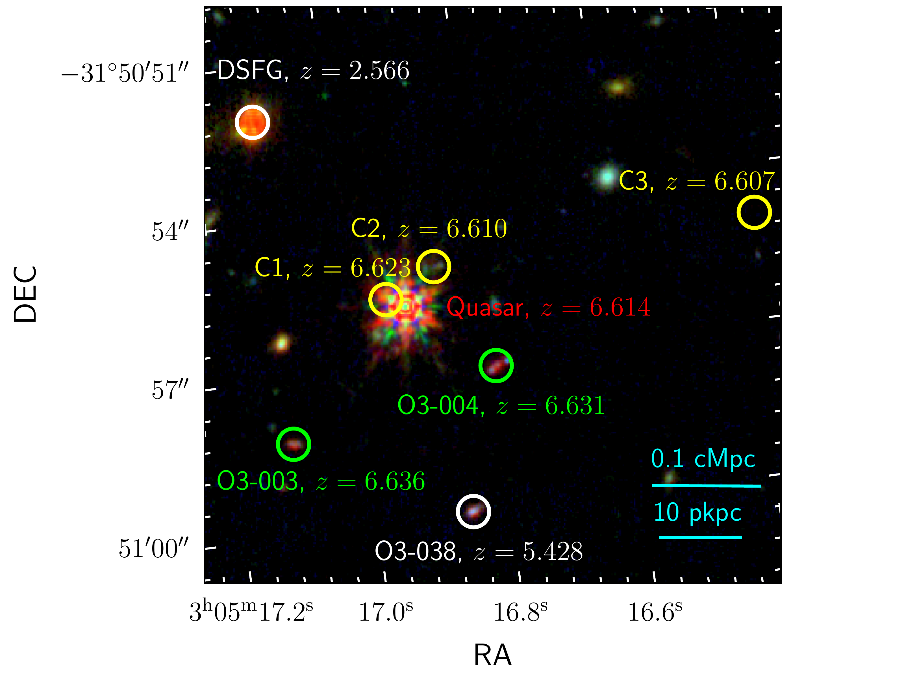
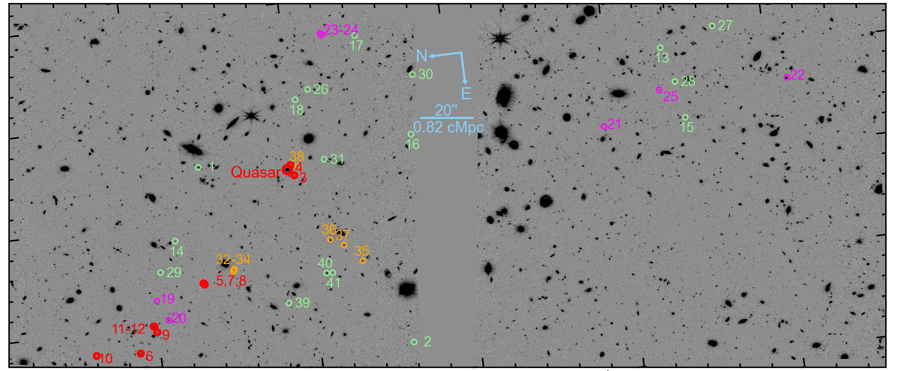
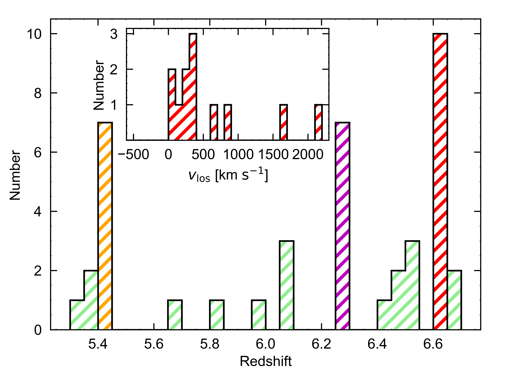

$\newcommand{\ensuremath}{}$
$\newcommand{\xspace}{}$
$\newcommand{\object}[1]{\texttt{#1}}$
$\newcommand{\farcs}{{.}''}$
$\newcommand{\farcm}{{.}'}$
$\newcommand{\arcsec}{''}$
$\newcommand{\arcmin}{'}$
$\newcommand{\ion}[2]{#1#2}$
$\newcommand{\textsc}[1]{\textrm{#1}}$
$\newcommand{\hl}[1]{\textrm{#1}}$
$\newcommand{\footnote}[1]{}$
$\newcommand{\url}[1]{\href{#1}{#1}}$
$\newcommand{\dodoi}[1]{doi:~\href{http://doi.org/#1}{\nolinkurl{#1}}}$
$\newcommand{\doeprint}[1]{\href{http://ascl.net/#1}{\nolinkurl{http://ascl.net/#1}}}$
$\newcommand{\doarXiv}[1]{\href{https://arxiv.org/abs/#1}{\nolinkurl{https://arxiv.org/abs/#1}}}$
$\newcommand{\}{natexlab}$

# A SPectroscopic survey of biased halos In the Reionization Era (ASPIRE): JWST Reveals a Filamentary Structure around a $z=6.61$ Quasar

<mark>Appeared on: 2023-04-21</mark> -  _accepted for publication in ApJL_

F. Wang, et al. -- incl., <mark>M. Habouzit</mark>, <mark>E. Bañados</mark>, <mark>S. Bosman</mark>, <mark>Y. Khusanova</mark>, <mark>S. Rojas-Ruiz</mark>

**Abstract:** We present the first results from the JWST ASPIRE program (A SPectroscopic survey of biased halos In the Reionization Era). This program represents an imaging and spectroscopic survey of 25 reionization-era quasars and their environments by utilizing the unprecedented capabilities of NIRCam Wide Field Slitless Spectroscopy (WFSS) mode. ASPIRE will deliver the largest ( $\sim280 {\rm arcmin}^2$ ) galaxy redshift survey at 3--4 $\mu$ m among JWST Cycle-1 programs and provide extensive legacy values for studying the formation of the earliest supermassive black holes (SMBHs), the assembly of galaxies, early metal enrichment, and cosmic reionization. In this first ASPIRE paper, we report the discovery of a filamentary structure traced by the luminous quasar J0305--3150 and ten [ $\ion{O}{3}$ ] emitters at $z=6.6$ . This structure has a 3D galaxy overdensity of $\delta_{\rm gal}=12.6$ over 637 cMpc $^3$ , one of the most overdense structures known in the early universe, and could eventually evolve into a massive galaxy cluster. Together with existing VLT/MUSE and ALMA observations of this field, our JWST observations reveal that J0305–3150 traces a complex environment where both UV-bright and dusty galaxies are present, and indicate that the early evolution of galaxies around the quasar is not simultaneous. In addition, we discovered 31 [ $\ion{O}{3}$ ] emitters in this field at other redshifts, $5.3<z<6.7$ , with half of them situated at $z\sim5.4$ and $z\sim6.2$ . This indicates that star-forming galaxies, such as [ $\ion{O}{3}$ ] emitters, are generally clustered at high redshifts. These discoveries demonstrate the unparalleled redshift survey capabilities of NIRCam WFSS and the potential of the full ASPIRE survey dataset.

**Figure 4. -** **Left: 3D structure of the galaxy overdensity at $z=6.6$.**
In this plot, we show both [$\ion${O}{3}] emitters and [$\ion${C}{2}] emitters in the vicinity of the quasar. The blue shaded region highlights a cylinder volume with line-of-sight length of 2000 km $\rm s^{-1}$(or 18.8 cMpc) and a projected radius of 3.28 cMpc at $z=6.6$(corresponding to an effective area of $\rm 5.5  arcmin^2$ in the projected plane).
**Right: The immediate vicinity of quasar J0305--3150.**
The background is a RGB image made using NIRCam imaging in F115W (B), F200W (G), and F356W (R).
Quasar J0305--3150 is surrounded by three [$\ion${C}{2}] emitters \citep[C1, C2, and C3;][]{Venemans19} and two [$\ion${O}{3}] emitters (ASPIRE-J0305M31-O3-003 and ASPIRE-J0305M31-O3-004) with line-of-sight velocities relative to the quasar of $\Delta v_{\rm los}<1000 {\rm km s^{-1}}$. Galaxy C3 is undetected in our deep JWST observations which indicates that it is a dusty star forming galaxy (DSFG). Galaxy [$\ion${O}{3}]-04 is also detected in Ly$\alpha$\citep{Farina17}. Two foreground galaxies are also shown with a DSFG at $z=2.566$ and a [$\ion${O}{3}] emitter at $z=5.428$.
 (*fig:vicinity*)

**Figure 2. -** **F356W-band imaging of the J0305--3150 quasar field.**
We identified 41 [$\ion${O}{3}] emitters as highlighted by colored circles.
The quasar J0305--3150 and [$\ion${O}{3}] emitters with line-of-sight velocity relative to the quasar of $\Delta v_{\rm los}<1000 {\rm km s^{-1}}$ are highlighted by red circles.
The magenta circles and orange circles denote the member galaxies of two galaxy overdensities at $z=6.2$ and $z=5.4$, respectively. The green circles are other field [$\ion${O}{3}] emitters. The compass and the scale length (at $z=6.6$) are shown as blue lines.
 (*fig:map*)

**Figure 1. -** **Redshift distribution of [$\ion${O**{3}] emitters.}
The [$\ion${O}{3}] emitters are strongly clustered in redshift space. There are obvious galaxy number excess at $z\sim5.4$, $z\sim6.2$, and $z\sim6.6$ in this field.
The most significant excess in galaxy number appears at $z\sim6.6$, the same redshift as the quasar. The inner plot shows the distribution of the line-of-sight velocities relative to the quasar of galaxies at $6.6<z<6.7$. Ten of the twelve galaxies at $z\sim6.6-6.7$ have $v_{\rm los}<1000 {\rm km s^{-1}}$ relative to the quasar. A positive velocity offset means that the galaxy has a higher redshift than the quasar. Limited by the precision of NIRCam/WFSS wavelength calibration, the redshifts of [$\ion${O}{3}] emitters could have a constant offset up to 0.003 as discussed in \S\ref{sec:wfss}, which could explain the asymmetric distribution of $v_{\rm los}$.
 (*fig:redshift*)

