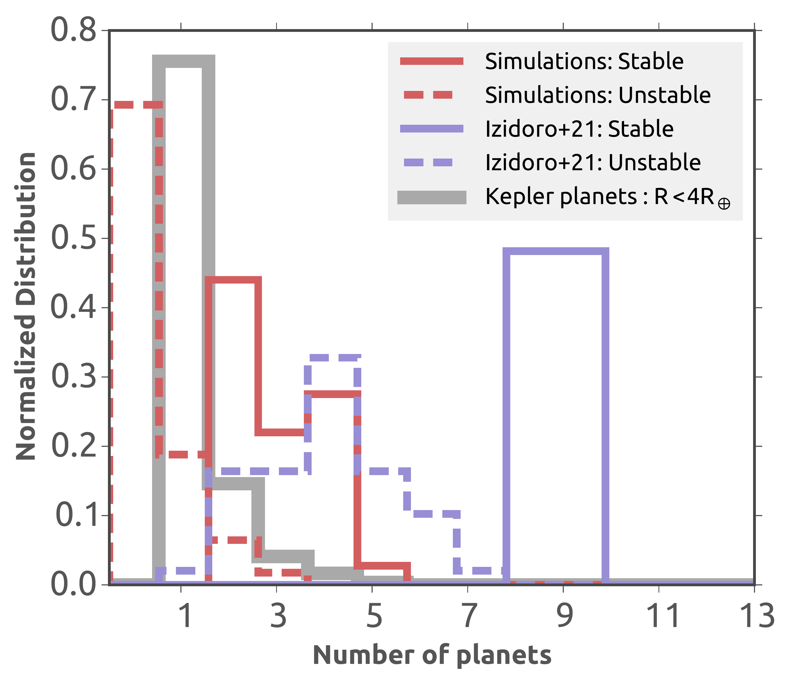
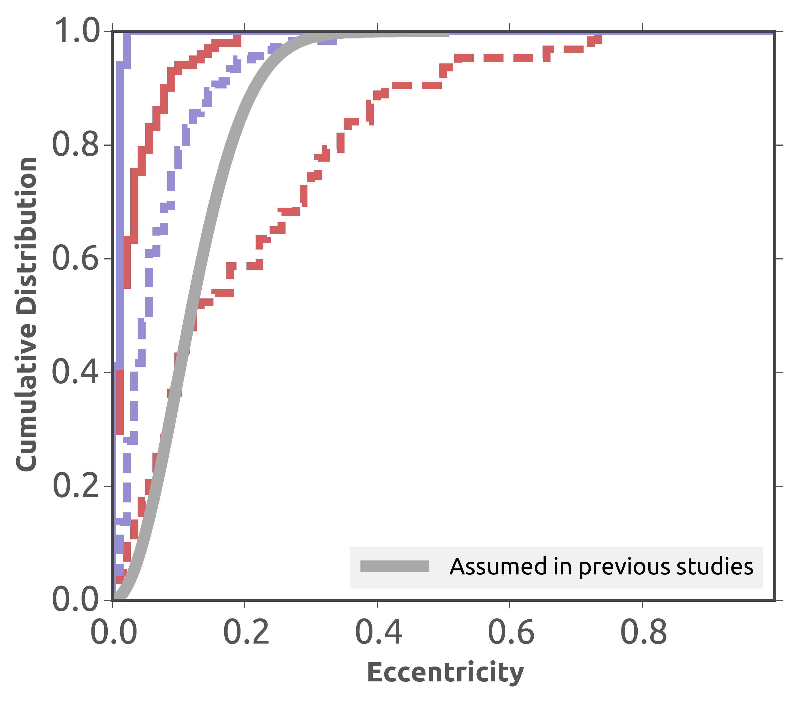
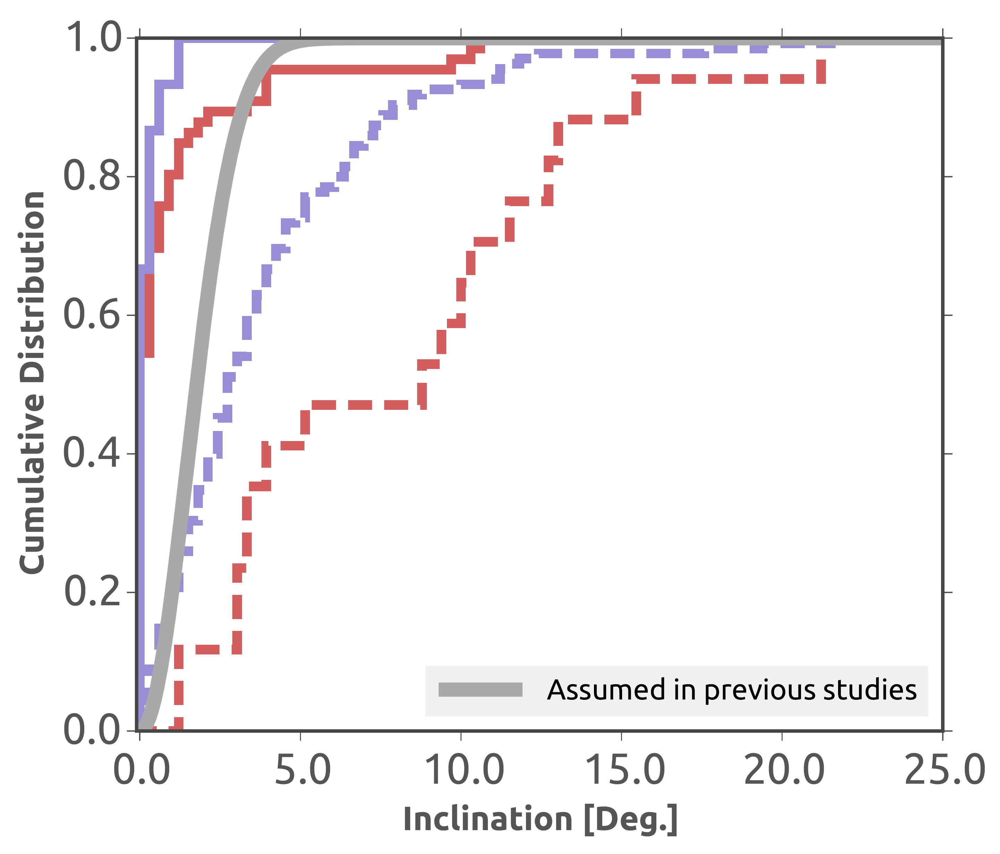
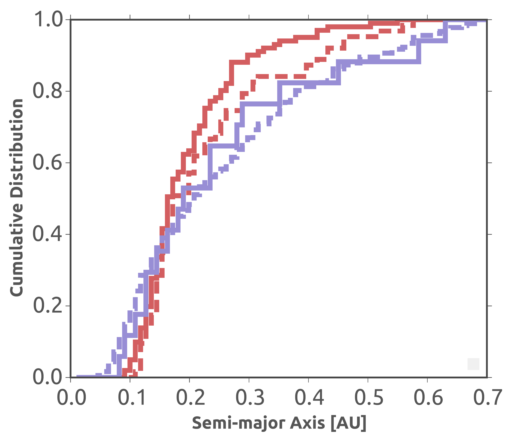
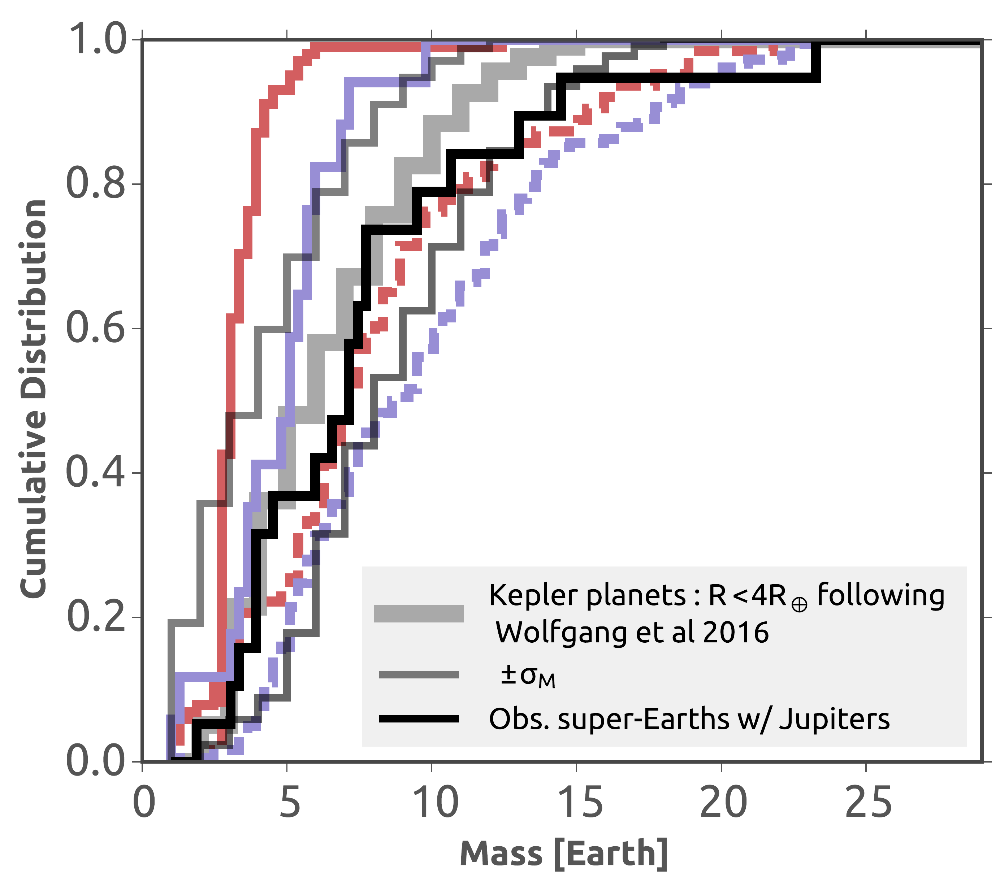
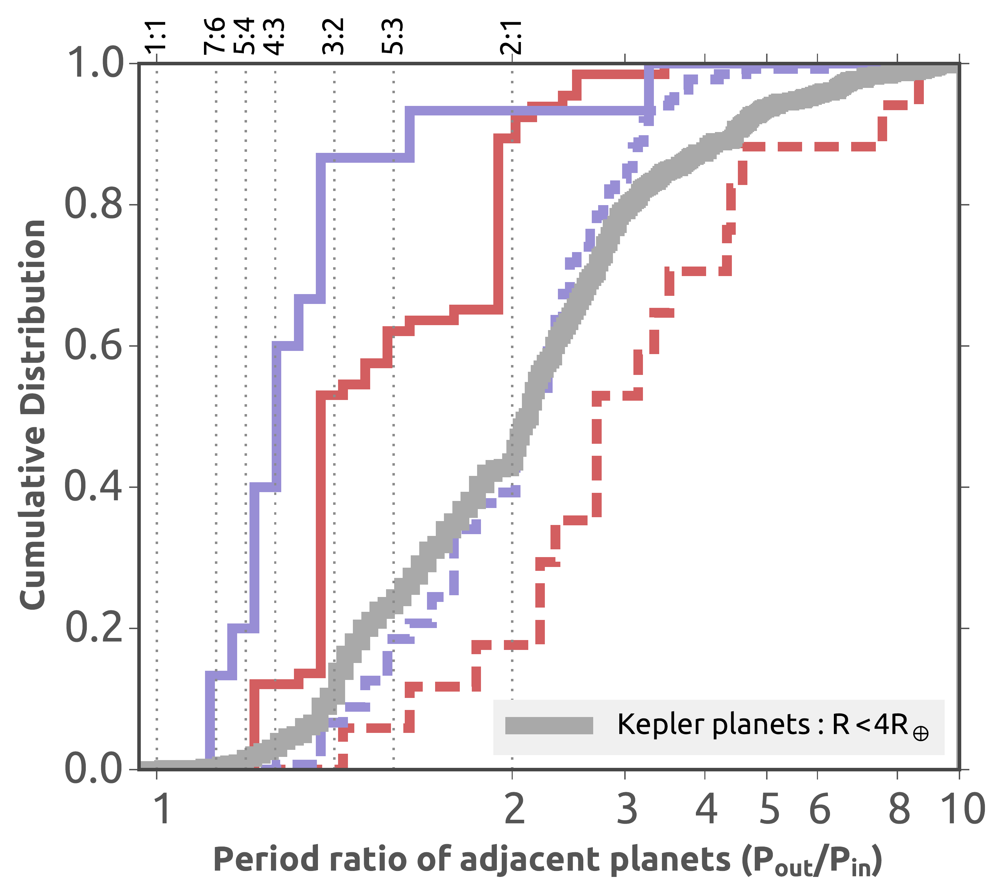
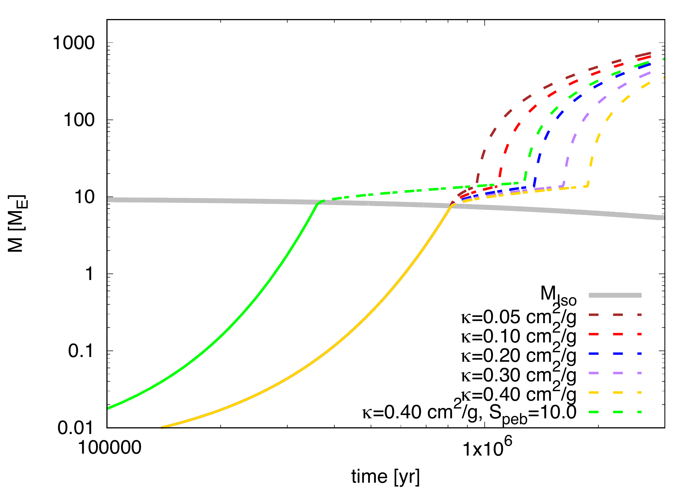
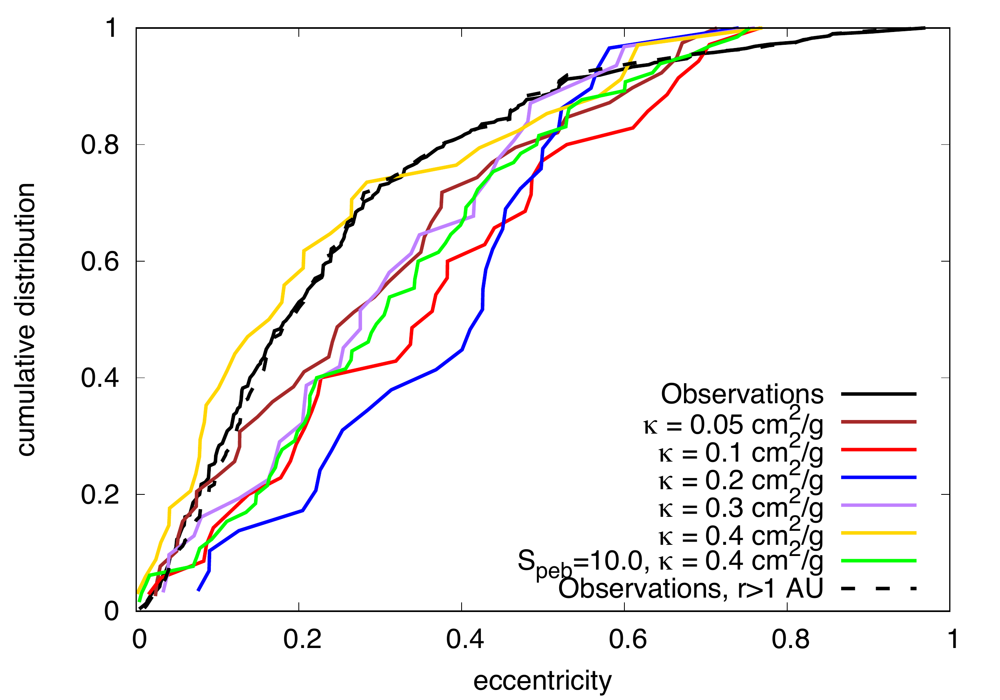

$\newcommand{\ensuremath}{}$
$\newcommand{\xspace}{}$
$\newcommand{\object}[1]{\texttt{#1}}$
$\newcommand{\farcs}{{.}''}$
$\newcommand{\farcm}{{.}'}$
$\newcommand{\arcsec}{''}$
$\newcommand{\arcmin}{'}$
$\newcommand{\ion}[2]{#1#2}$
$\newcommand{\textsc}[1]{\textrm{#1}}$
$\newcommand{\hl}[1]{\textrm{#1}}$
$\newcommand{\footnote}[1]{}$

# Giants are bullies: how their growth influences systems of inner sub-Neptunes and super-Earths

 _21 pages, 17 figures, accepted for publication by A&A_

<mark>B. Bitsch</mark>, a. A. Izidoro

**Abstract:** Observational evidence points to an unexpected correlation between outer giant planets and inner sub-Neptunes, unexplained by simulations so far. We utilize N-body simulations including pebble and gas accretion as well as planetary migration to investigate how the gas accretion rates, which depend on the envelope opacity and the core mass, influence the formation of systems of inner sub-Neptunes and outer gas giants as well as the eccentricity distribution of the outer giant planets. We find that less efficient envelope contraction rates allow a more efficient formation of systems with inner sub-Neptunes and outer gas giants. This is caused by the fact that the cores formed in the inner disc are too small to effectively accrete large envelopes and only cores growing in the outer disc, where the cores are more massive due to the larger pebble isolation mass, can become giants. As a result, instabilities between the outer giant planets do not necessarily destroy the inner systems of sub-Neptunes unlike simulations with more efficient envelope contraction where giant planets can form closer in. Our simulations show that up to 50 \% of the systems of cold Jupiters could have inner sub-Neptunes, in agreement with observations. At the same time our simulations show a good agreement with the eccentricity distribution of giant exoplanets, even though we find a slight mismatch to the mass and semi-major axes distributions. Synthetic transit observations of the inner systems (r<0.7 AU) formed in our simulations reveal an excellent match to the Kepler observations, where our simulations can especially match the period ratios of adjacent planet pairs. As a consequence the breaking the chains model for super-Earth and sub-Neptune formation remains consistent with observations even when outer giant planets are present. However, simulations with outer giant planets produce more systems with mostly only one inner planet and with larger eccentricities, in contrast to simulations without outer giants. We thus predict that systems with truly single close-in planets are more likely to host outer gas giants. We consequently suggest RV follow-up observations of systems of close-in transiting sub-Neptunes to understand if these inner sub-Neptunes are truly alone in the inner systems or not.

**Figure 14. -** Number of planets (top left), their eccentricity distribution (top middle), their inclination distribution (top right), their semi-major axis distribution (bottom left), their mass distribution (bottom middle) as well as the period ratio of adjacent planets from our simulations as well as from the simulations of [Izidoro, Bitsch and Raymond (2021)]() divided into the stable and unstable samples. The gray lines mark the constraints from the Kepler observations.
    (*fig:SEproperties*)

**Figure 1. -** Growth of planetary embryos fixed at 10 AU for different envelope opacities and for the two different pebble fluxes used in our simulations. In all simulations $S_{\rm peb}=5.0$ unless stated otherwise (see text). The solid (pebble) accretion phase is marked with a solid line, the envelope contraction phase via a dotted-dashed line, and the runaway gas accretion phase is marked in a dashed line. Higher opacities prolong the gas contraction phase and result in slower planetary growth once the planet has reached its pebble isolation mass. As a consequence the final planetary mass is lower for higher envelope opacities. The larger pebble flux allows the core to grow faster and thus to reach the pebble isolation mass earlier, when it is larger, reducing the envelope contraction phase and thus resulting in a larger final planet mass.
    (*fig:gasaccretion*)

**Figure 3. -** Cumulative distribution of the eccentricity of giant planets with orbital distances of up to 5 AU. Giant planets are defined as objects above 0.5 Jupiter masses. The simulations with $\kappa=0.05{\rm cm}^2/{\rm g}$ originate from [Bitsch, Trifonov and Izidoro (2020)]() and are not displayed in this paper in detail.
    (*fig:eccentricity*)

