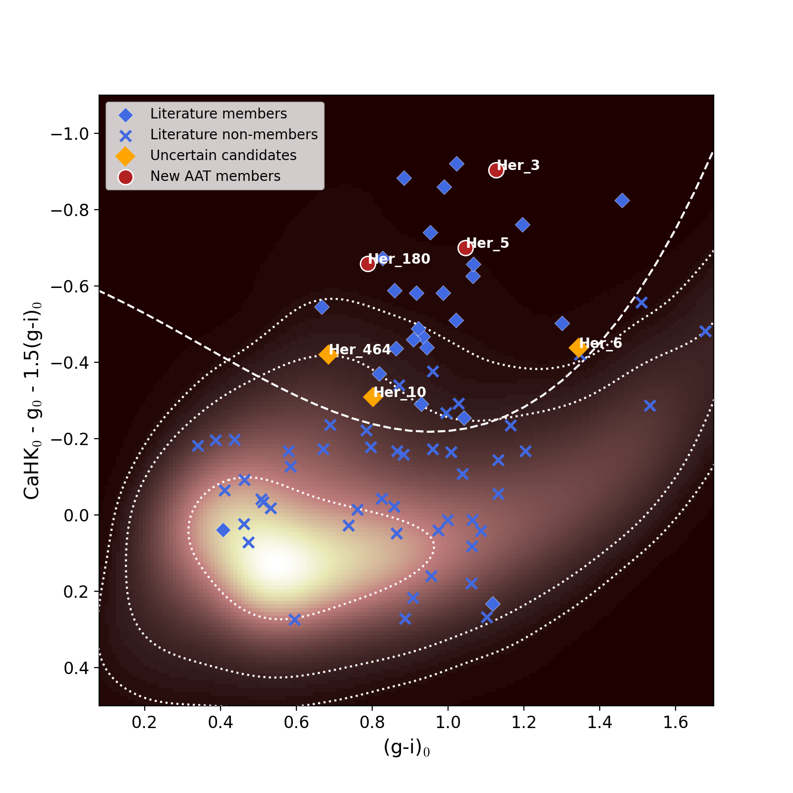
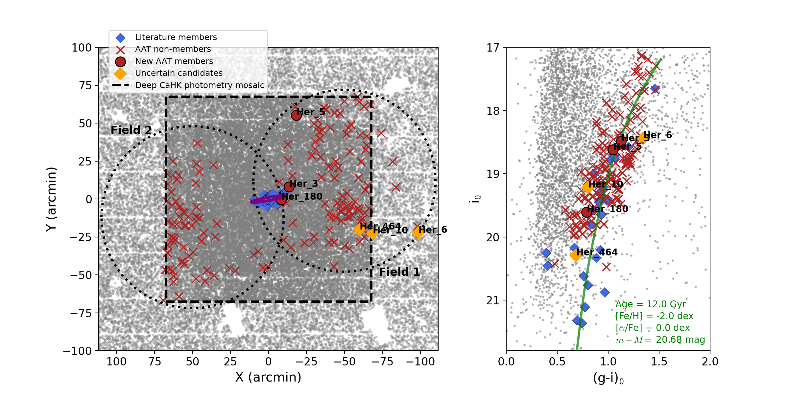
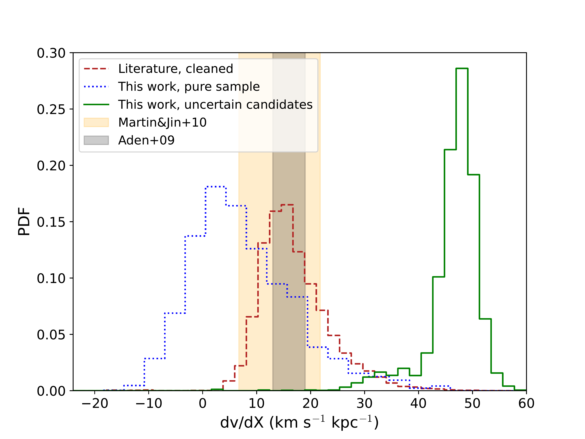

$\newcommand{\ensuremath}{}$
$\newcommand{\xspace}{}$
$\newcommand{\object}[1]{\texttt{#1}}$
$\newcommand{\farcs}{{.}''}$
$\newcommand{\farcm}{{.}'}$
$\newcommand{\arcsec}{''}$
$\newcommand{\arcmin}{'}$
$\newcommand{\ion}[2]{#1#2}$
$\newcommand{\textsc}[1]{\textrm{#1}}$
$\newcommand{\hl}[1]{\textrm{#1}}$
$\newcommand{\footnote}[1]{}$
$\newcommand{\fmmm}[1]{\mbox{#1}}$
$\newcommand{\scnd}{\mbox{\fmmm{"}\hskip-0.3em .}}$
$\newcommand{\scnp}{\mbox{\fmmm{"}}}$
$\newcommand{\mcnd}{\mbox{\fmmm{'}\hskip-0.3em .}}$
$\newcommand{\mnras}{MNRAS}$
$\newcommand{\pasa}{PASA}$
$\newcommand{\nat}{Nature}$
$\newcommand{\araa}{ARAA}$
$\newcommand{\aj}{AJ}$
$\newcommand{\apj}{ApJ}$
$\newcommand{\apjl}{ApJ}$
$\newcommand{\apjs}{ApJSupp}$
$\newcommand{\aap}{A\&A}$
$\newcommand{\aaps}{A\&ASupp}$
$\newcommand{\pasp}{PASP}$
$\newcommand{\pasj}{PASJ}$
$\newcommand{\arraystretch}{0.3}$
$\newcommand{\arraystretch}{0.3}$
$\newcommand{\arraystretch}{0.3}$
$\newcommand{\arraystretch}{0.3}$
$\newcommand{\ltsima}{\; \buildrel < \over \sim \;}$
$\newcommand{\lta}{\lower.5ex\hbox{\ltsima}}$
$\newcommand{\gtsima}{\; \buildrel > \over \sim \;}$
$\newcommand{\simgt}{\lower.5ex\hbox{\gtsima}}$
$\newcommand{\erf}{\mathop{\rm erf}\nolimits}$
$\newcommand{\sech}{ \mathop{\rm sech}\nolimits}$
$\newcommand{\csch}{ \mathop{\rm csch}\nolimits}$
$\newcommand{\arcsinh}{\mathop{\rm arcsinh}\nolimits}$
$\newcommand{\arccosh}{\mathop{\rm arccosh}\nolimits}$
$\newcommand{\arctanh}{\mathop{\rm arctanh}\nolimits}$
$\newcommand{\arccoth}{\mathop{\rm arccoth}\nolimits}$
$\newcommand{\arcsech}{\mathop{\rm arcsech}\nolimits}$
$\newcommand{\arccsch}{\mathop{\rm arccsch}\nolimits}$
$\newcommand{\arccot}{\mathop{\rm arccot}\nolimits}$
$\newcommand{\arcsec}{\mathop{\rm arcsec}\nolimits}$
$\newcommand{\arccsc}{\mathop{\rm arccsc}\nolimits}$
$\newcommand{\ylm}{\mathop{\rm Y}_l^m\nolimits}$
$\newcommand{\ylmp}{\mathop{\rm Y}_{l'}^{m'}\nolimits}$
$\newcommand{\real}{\Re e}$
$\newcommand{\imag}{\Im m}$
$\newcommand{\km}{{\rm km}}$
$\newcommand{\kms}{{\rm km \; s^{-1}}}$
$\newcommand{\mas}{{\rm mas}}$
$\newcommand{\masyr}{{\rm mas/yr}}$
$\newcommand{\kpc}{{\rm kpc}}$
$\newcommand{\mpc}{{\rm Mpc}}$
$\newcommand{\msun}{{\rm M_\odot}}$
$\newcommand{\lsun}{{\rm L_\odot}}$
$\newcommand{\rsun}{{\rm R_\odot}}$
$\newcommand{\pc}{{\rm pc}}$
$\newcommand{\cm}{{\rm cm}}$
$\newcommand{\yr}{{\rm yr}}$
$\newcommand{\au}{{\rm AU}}$
$\newcommand{\g}{{\rm g}}$
$\newcommand{\om}{\Omega_0}$
$\newcommand{\}{ca}$
$\newcommand{\}{r}$
$\newcommand{\}{magnitude}$
$\newcommand{\kr}{{\cal K}_r}$
$\newcommand{\kz}{{\cal K}_z}$
$\newcommand{\kzz}{{\cal K}_z(z)}$
$\newcommand{\mss}{{\rm M}_\odot \rm pc^{-2}}$
$\newcommand{\msss}{{\rm M}_\odot \rm pc^{-3}}$
$\newcommand{\Aa}{\; \buildrel \circ \over{\rm A}}$
$\newcommand{Å}{\; \buildrel \circ \over{\rm A}}$
$\newcommand{\yr}{{\rm yr}}$
$\newcommand{\CompactFigs}{0}$
$\newcommand{\UseFigs}{1}$
$\newcommand{\deg}{^\circ}$
$\newcommand{\degg}{\hbox{\null^\circ\hskip-3pt .}}$
$\newcommand{\sec}{\hbox{"\hskip-3pt .}}$
$\newcommand{\half}{{\scriptstyle{1\over2}}}$
$\newcommand{\s}{\ifmmode \widetilde \else \~\fi}$
$\newcommand{\=}{\overline}$
$\newcommand{\scre}{{\cal E}}$
$\newcommand{\}{spose}$
$\newcommand{\larrow}{\leftarrow}$
$\newcommand{\rarrow}{\rightarrow}$
$\newcommand{\llangle}{\langle\langle}$
$\newcommand{\rrangle}{\rangle\rangle}$
$\newcommand{\etal}{{\it et al. }}$
$\newcommand{\cf}{{\it cf. }}$
$\newcommand{\eg}{{ e.g., }}$
$\newcommand{\ie}{{ i.e., }}$
$\newcommand{\lta}{\mathrel{\spose{\lower 3pt\hbox{\mathchar"218}}$
$     \raise 2.0pt\hbox{\mathchar"13C}}}$
$\newcommand{\gta}{\mathrel{\spose{\lower 3pt\hbox{\mathchar"218}}$
$     \raise 2.0pt\hbox{\mathchar"13E}}}$
$\newcommand{\Dt}{\spose{\raise 1.5ex\hbox{\hskip3pt\mathchar"201}}}$
$\newcommand{\dt}{\spose{\raise 1.0ex\hbox{\hskip2pt\mathchar"201}}}$
$\newcommand{\del}{\nabla}$
$\newcommand{\delv}{\bb\nabla}$
$\newcommand{\r}{{\rm r^{1/4}}}$
$\newcommand{\jla}{J_{\lambda}}$
$\newcommand{\jmu}{J_{\mu}}$
$\newcommand{\jnu}{J_{\nu}}$
$\newcommand{\pomega}{\varpi}$
$\newcommand{\sigla}{\sigma_{\lambda}}$
$\newcommand{\sigmu}{\sigma_{\mu}}$
$\newcommand{\signu}{\sigma_{\nu}}$
$\newcommand{\dotsfill}{\leaders\hbox to 1em{\hss.\hss}\hfill}$
$\newcommand{\sun}{\odot}$
$\newcommand{\earth}{\oplus}$
$\newcommand{\Gyr}{{\rm Gyr}}$
$\newcommand{\FeH}{{\rm[Fe/H]}}$
$\newcommand{\kmsd}{{\rm km/s/degree}}$
$\newcommand{\}{Ger}$
$\newcommand{\}{Rod}$
$\newcommand{\}{Mike}$
$\newcommand{\}{Nickl}$
$\newcommand{\}{Nick}$
$\newcommand{\}{natexlab}$

# The Pristine Dwarf-Galaxy survey - V. The edges of the dwarf galaxy Hercules

<mark>Appeared on: 2023-04-27</mark> - 

N. Longeard, et al. -- incl., <mark>K. Malhan</mark>

**Abstract:** We present a new spectroscopic study of the dwarf galaxy Hercules (d $\sim 132$ kpc) with data from the Anglo-Australian Telescope and its AAOmega spectrograph together with the Two Degree Field multi-object system to solve the conundrum that whether Hercules is tidally disrupting. We combine broadband photometry, proper motions from Gaia, and our Pristine narrow-band and metallicity-sensitive photometry to efficiently weed out the Milky Way contamination. Such cleaning is particularly critical in this kinematic regime, as both the transverse and heliocentric velocities of Milky Way populations overlap with Hercules. Thanks to this method, three new member stars are identified, including one at almost $10$ $r_h$ of the satellite. All three have velocities and metallicities consistent with that of the main body. Combining this new dataset with the entire literature cleaned out from contamination shows that Hercules does not exhibit a velocity gradient (d $\langle v \rangle$ /d $\chi$ $ = 0.1^{+0.4}_{-0.2}$ km s $^{-1}$ arcmin $^{-1}$ ) and, as such, does not show evidence to undergo tidal disruption.

**Figure 7. -** Pristine colour-colour space, with the ($g-i$)$_0$ temperature proxy and the $CaHK_0 - g_0 - 1.5$($g-i$)$_0$ colour on the y-axis. In this plot, [Fe/H] decreases as values on the y-axis decrease. The density plot of the MW contamination is also shown with the colour scale. The density decreases as the colour goes darker. The $1$, $2$ and $3$\s$igma$ contours are shown as white dotted lines. Literature members and non-members are shown as blue diamonds and crosses respectively and are only the ones with a spectroscopic metallicity and a proper motion measurement to ensure their membership status. Our new AAT members as shown as red circles, while uncertain candidates are represented as orange diamonds. (*cahk_density*)

**Figure 10. -** _Left panel:_ Spatial distribution of the AAT spectroscopic sample. Newly discovered members are shown as red circles, while uncertain candidates are shown as orange diamonds. Non-members from the AAT sample are shown as red crosses. Previously known members from the literature are represented as smaller blue diamonds.  The two half-light radii of Hercules as inferred by \citet[M18]{munoz18} are shown as a purple ellipse. _Right panel:_ CMD of our spectroscopic sample superimposed with a metal-poor Darmouth isochrone at the distance of Hercules. (*field*)

**Figure 9. -** PDFs of the velocity gradient of Hercules in the three cases detailed in section 5. (*pdfs_vel_grad*)

