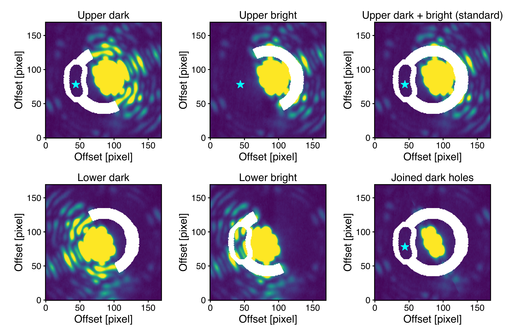
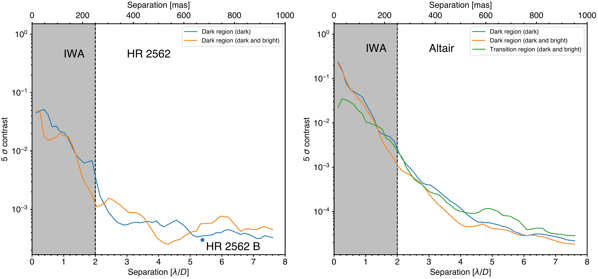
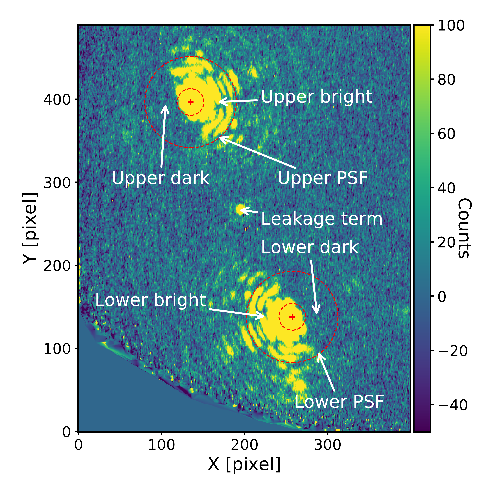

$\newcommand{\ensuremath}{}$
$\newcommand{\xspace}{}$
$\newcommand{\object}[1]{\texttt{#1}}$
$\newcommand{\farcs}{{.}''}$
$\newcommand{\farcm}{{.}'}$
$\newcommand{\arcsec}{''}$
$\newcommand{\arcmin}{'}$
$\newcommand{\ion}[2]{#1#2}$
$\newcommand{\textsc}[1]{\textrm{#1}}$
$\newcommand{\hl}[1]{\textrm{#1}}$
$\newcommand{\footnote}[1]{}$

# Applying a temporal systematics model to vector Apodizing Phase Plate coronagraphic data: TRAP4vAPP

<mark>Appeared on: 2023-04-28</mark> -  _15 pages, 10 figures, accepted to A&A_

P. Liu, et al. -- incl., <mark>M. Samland</mark>

**Abstract:** The vector Apodizing Phase Plate (vAPP) is a pupil plane coronagraph that suppresses starlight by forming a dark hole in its point spread function (PSF).   The unconventional and non-axisymmetrical PSF arising from the phase modification applied by this coronagraph presents a special challenge to post-processing techniques. We aim to implement a recently developed post-processing algorithm, temporal reference analysis of planets (TRAP) on vAPP coronagraphic data. The property of TRAP that uses non-local training pixels, combined with the unconventional PSF of vAPP, allows for more flexibility than previous spatial algorithms in selecting reference pixels to model systematic noise. Datasets from two types of vAPPs are analysed: a double grating-vAPP (dgvAPP360) that produces a single symmetric PSF and a grating-vAPP (gvAPP180) that produces two D-shaped PSFs. We explore how to choose reference pixels to build temporal systematic noise models in TRAP for them. We then compare the performance of TRAP with previously implemented algorithms that produced the best signal-to-noise ratio (S/N) in companion detections in these datasets. We find that the systematic noise between the two D-shaped PSFs is not as temporally associated as expected. Conversely, there is still a significant number of systematic noise sources that are shared by the dark hole and the bright side in the same PSF. We should choose reference pixels from the same PSF when reducing the dgvAPP360 dataset or the gvAPP180 dataset with TRAP. In these datasets, TRAP achieves results consistent with previous best detections, with an improved S/N for the gvAPP180 dataset.

**Figure 4. -** Six reference pixel designs for an assumed planet position (cyan asterisk) in the upper dark hole of a gvAPP180 PSF, as shown by the white pixels. Upper dark: choosing reference pixels from the dark side of the same PSF; upper bright: choosing reference pixels from the bright side of the same PSF; lower dark: choosing reference pixels from the dark side of the complementary PSF; lower bright: choosing reference pixels from the bright side of the complementary PSF; upper dark+bright: choosing reference pixels from the dark and bright sides of the same PSF; joined dark holes: choosing reference pixels from the joined dark holes.
     (*fig:gvAPP180_reference_pixels*)

**Figure 9. -** 5$\sigma$ contrast curves of the gvAPP180 datasets with TRAP. The contrast curve is calculated as five times the median of a three-pixel-wide annulus as a function of separation in the normalised uncertainty map. Left panel: the contrast curves of the upper dark region of cube A of the HR 2562 dataset reduced by choosing reference pixels exclusively from the dark hole (labelled as `dark') or both dark and bright sides (labelled as `dark and bright'). The detection significance of HR 2562 B is also marked in the figure. Right panel: the contrast curves of the dark region of the Altair dataset reduced by choosing reference pixels only from the dark hole or both dark and bright sides. The contrast curve of the transition region is also compared in the right panel, which is not much worse than that of the dark region.
           (*Fig:gvAPP180_contrast_curve*)

**Figure 2. -** On-sky coronagraphic PSF from the gvAPP180 mounted on MagAO/Clio2 at 3.94 $\mu$m. One PSF (upper PSF) is above another PSF (lower PSF) with a leakage term in the middle. The red circles in dashed lines show the IWA and OWA. The dark holes of the two PSFs complement the FoV of each other. The four different regions of the two PSFs we defined in this work are marked with white text. The colourbar shows the flux intensity after background subtraction. (*fig:gvAPP180_PSF*)

