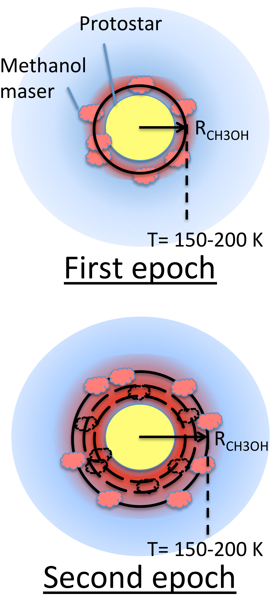
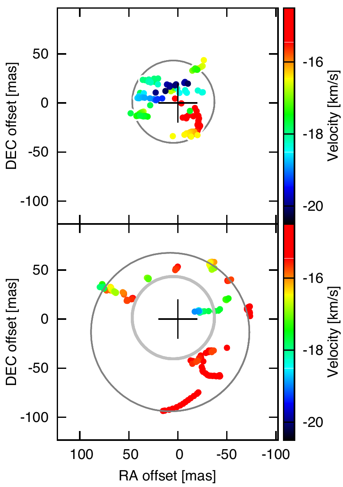
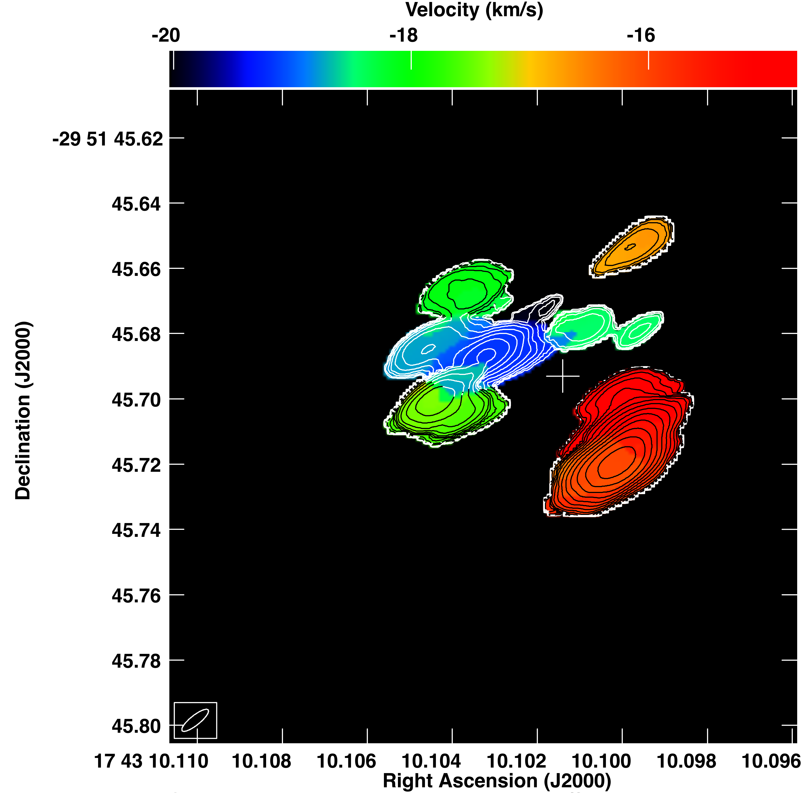
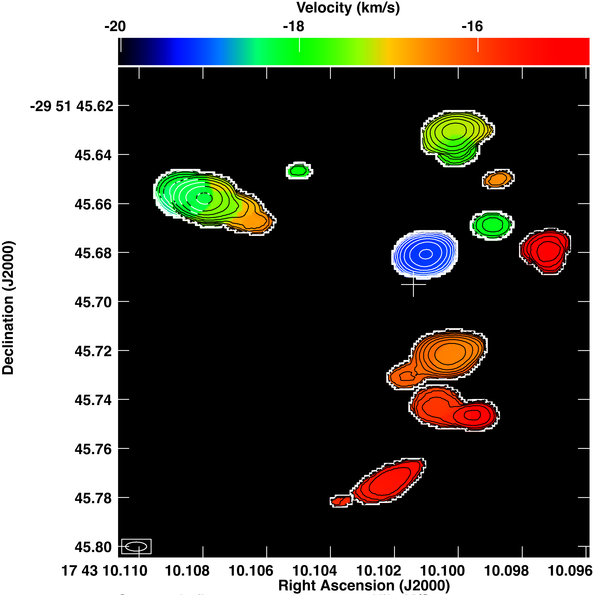
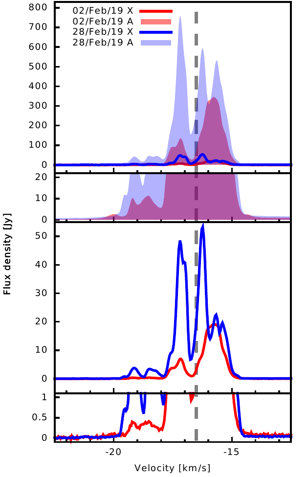

$\newcommand{\ensuremath}{}$
$\newcommand{\xspace}{}$
$\newcommand{\object}[1]{\texttt{#1}}$
$\newcommand{\farcs}{{.}''}$
$\newcommand{\farcm}{{.}'}$
$\newcommand{\arcsec}{''}$
$\newcommand{\arcmin}{'}$
$\newcommand{\ion}[2]{#1#2}$
$\newcommand{\textsc}[1]{\textrm{#1}}$
$\newcommand{\hl}[1]{\textrm{#1}}$
$\newcommand{\footnote}[1]{}$
$\newcommand{\bibinfo}[2]{#2}$
$\newcommand{\eprint}[2][]{\url{#2}}$
$\newcommand{\bibinfo}[2]{#2}$
$\newcommand{\eprint}[2][]{\url{#2}}$
$\newcommand$
$\newcommand$
$\newcommand$
$\newcommand$
$\newcommand$
$\newcommand$
$\newcommand$
$\newcommand$
$\newcommand$
$\newcommand$
$\newcommand$
$\newcommand$
$\newcommand$
$\newcommand$
$\newcommand$
$\newcommand$
$\newcommand{\includegraphics}[2][]$
$\newcommand{\}{url}$
$\newcommand{\urlprefix}{URL }$
$\newcommand{\}{url}$
$\newcommand{\urlprefix}{URL }$

# A "Heatwave" from the G358 accretion event

<mark>Appeared on: 2023-05-01</mark> -  _Published in Nature Astronomy in 2020_

R. A. Burns, et al. -- incl., <mark>H. Linz</mark>

**Abstract:** High-mass stars are thought to accumulate much of their mass via short, infrequent bursts of disk-aided accretion \cite{Stamatellos11,Meyer17} . Such accretion events are rare and difficult to observe directly but are known to drive enhanced maser emission \cite{Hunter18,Gordon18,Szymczak18,Moscadelli17} . In this Letter we report high-resolution, multi-epoch methanol maser observations toward G358.93-0.03 which reveal an interesting phenomenon; the sub-luminal propagation of a thermal radiation "heat-wave" emanating from an accreting high-mass proto-star.The extreme transformation of the maser emission implies a sudden intensification of thermal infrared radiation from within the inner (40 mas, 270 au) region. Subsequently, methanol masers trace the radial passage of thermal radiation through the environment at $\geq$ 4-8 \% the speed of light. Such a high translocation rate contrasts with the $\leq$ 10 km s $^{-1}$ physical gas motions of methanol masers typically observed using very long baseline interferometry (VLBI).The observed scenario can readily be attributed to an accretion event in the high-mass proto-star G358.93-0.03-MM1. While being the third case in its class, G358.93-0.03-MM1 exhibits unique attributes hinting at a possible `zoo' of accretion burst types.These results promote the advantages of maser observations in understanding high-mass star formation, both through single-dish maser monitoring campaigns and via their international cooperation as VLBI arrays.

**Figure 2. -** ** Schematic illustration of the observational data.**(*Left*) A schematic model of the maser distribution and evolution in an accreting star-disk system. *Right* Spot maps of emission above 5 $\sigma$ detailing the evolution of methanol maser emission in G358-MM1. Colours indicate the velocity in the frame of the local standard of rest, and symbol sizes are arbitrary. The upper and lower panels illustrate the data of vx026a (2nd Feb 2019) and vx026c (28th Feb 2019), respectively. Directional offsets are stated with respect to the coordinate (RA, DEC) = (17:43:10.1014, -29:51:45.693) which correspond to the position of G358-MM1 where the symbol size indicates the 40 mas absolute positional uncertainty in the continuum source position from \cite{Brogan19a}. The dark rings delineate the fits to each epoch, while the grey ring indicates the extent of the vx026a masers at the epoch of vx026c.  (*RINGS*)

**Figure 3. -** ** Methanol maser distributions in G358-MM1.** Zero'th (contours) and first (colours) moment maps of the 6.7 GHz methanol maser emission in G358-MM1. *Left* shows the distribution of emission during the vx026a epoch while *right* shows that of vx026c, taken 26 days later. Moment image cubes were produced for emission above a 5 $\sigma$ cutoff and contours increase by factors of 2 multiples of the first contour at 2 Jy beam$^{-1}$ km s$^{-1}$. The white cross indicates the position of the brightest millimeter continuum peak of the G358-MM1 region \cite{Brogan19a}.  (*MOMNT*)

**Figure 1. -** ** Spectral profiles of the 6.7 GHz methanol maser emission in G358-MM1.** Solid shapes and lines indicate the auto- and cross-correlation spectra respectively. Magnifications are shown in the lower insets to display low flux density components. The dashed line indicates the source systemic velocity.  (*SPECTRA*)

