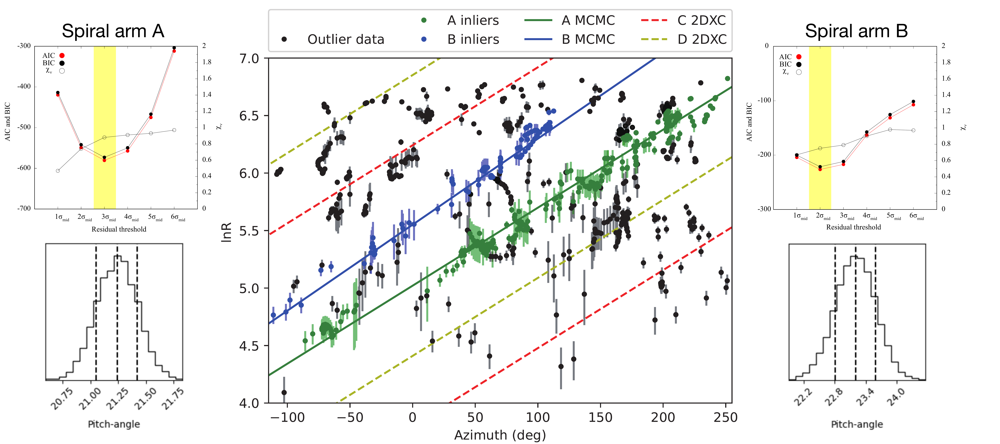
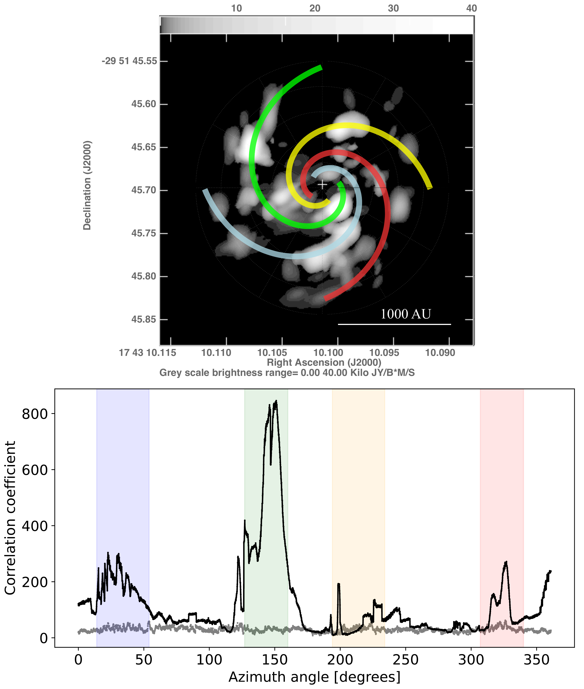
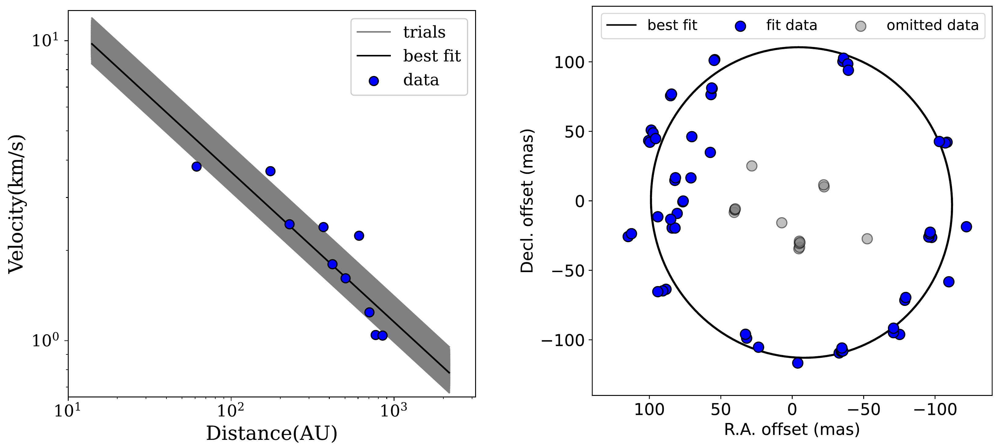

$\newcommand{\ensuremath}{}$
$\newcommand{\xspace}{}$
$\newcommand{\object}[1]{\texttt{#1}}$
$\newcommand{\farcs}{{.}''}$
$\newcommand{\farcm}{{.}'}$
$\newcommand{\arcsec}{''}$
$\newcommand{\arcmin}{'}$
$\newcommand{\ion}[2]{#1#2}$
$\newcommand{\textsc}[1]{\textrm{#1}}$
$\newcommand{\hl}[1]{\textrm{#1}}$
$\newcommand{\footnote}[1]{}$
$\newcommand{\bibinfo}[2]{#2}$
$\newcommand{\micro}{\fontsize{4pt}{4pt}\selectfont}$
$\newcommand$
$\newcommand$
$\newcommand$
$\newcommand$
$\newcommand$
$\newcommand$
$\newcommand$
$\newcommand$
$\newcommand$
$\newcommand$
$\newcommand$
$\newcommand$
$\newcommand$
$\newcommand$
$\newcommand$
$\newcommand$
$\newcommand{\thefootnote}{\fnsymbol{footnote}}$
$\newcommand{\includegraphics}[2][]$
$\newcommand{\kms}{km s^{-1}}$
$\newcommand{\nh}{NH_3}$
$\newcommand{\HII}{H \emissiontype{II} }$
$\newcommand{\ho}{H_2O}$
$\newcommand{\red}{\textcolor{red}}$
$\newcommand{\blue}{\textcolor{blue}}$
$\newcommand{\fdg}{.\!\!^\circ}$
$\newcommand{\}{url}$

# A Keplerian disk with a four-arm spiral birthing an episodically accreting high-mass protostar

<mark>Appeared on: 2023-05-01</mark> -  _Published in Nature Astronomy in 2023_

R. A. Burns, et al. -- incl., <mark>H. Linz</mark>

**Abstract:** High-mass protostars (M $_{\star} >$ 8 M $_{\odot}$ ) are thought to gain the majority of their mass via short, intense bursts of growth. This episodic accretion is thought to be facilitated by gravitationally unstable and subsequently inhomogeneous accretion disks. Limitations of observational capabilities, paired with a lack of observed accretion burst events has withheld affirmative confirmation of the association between disk accretion, instability and the accretion burst phenomenon in high-mass protostars.Following its 2019 accretion burst, a heat-wave driven by a burst of radiation propagated outward from the high-mass protostar G358.93-0.03-MM1.Six VLBI (very long baseline interferometry) observations of the raditively pumped 6.7 GHz methanol maser were conducted during this period, tracing ever increasing disk radii as the heat-wave propagated outward. Concatenating the VLBI maps provided a sparsely sampled, milliarcsecond view of the spatio-kinematics of the accretion disk covering a physical range of $\sim$ 50 - 900 AU. We term this observational approach `heat-wave mapping'.We report the discovery of a Keplerian accretion disk with a spatially resolved four-arm spiral pattern around G358.93-0.03-MM1. This result positively implicates disk accretion and spiral arm instabilities into the episodic accretion high-mass star formation paradigm.

**Figure 4. -** ** Identification of spiral arms A and B**(*Upper left*) shows the AIC, BIC and $\chi$ values for 200,000 trials of each residual threshold in the RANSAC procedure for arm A. (*Lower left*) shows the posterior distribution for pitch angles fit during 10,000 samples in the MCMC procedure for arm A. (*Upper and lower right*) show the same for arm B. (*Center*) shows the six combined spotmap data set in $\phi-ln(R)$ space where spots determined by RANSAC to be associated with arms A and B, and best fit arm functions determined by MCMC, are shown in green and blue, respectively. The nomial locations of spiral arms C and D are shown as dashed lines. Colours of arms are consistent with Figure \ref{Fig5}. Error bars express each maser's astrometric uncertainty. (*Fig4*)

**Figure 5. -** ** 4-arm spiral identification***Below* shows the results of the spatial 2D cross-correlation as a function of azimuth angle. The green and blue regions indicate the full-width half-maximum range for the correlation peaks associated with arms A and B, respectively. Red and yellow regions highlight the disk regions at $\pm 180^{\circ}$ opposite to the green and blue regions where symmetric arm pairs were searched. The grey line shows a $5\sigma$ detection criteria derived from the 5 times the standard deviation of correlation coefficients at each azimuth acquired from 10 sets of random data of the same size and variable ranges as the maser data. (*Above*) shows the spiral structure model in G358-MM1 plotted on the flux density map (grey-scale). Green and blue arms represent arms A and B respectively, parameterised by RANSAC and MCMC. The red and yellow lines illustrate arms C and D, which represent the symmetric pairs of arms A and B, respectively, detected using 2D cross-correlation.  (*Fig5*)

**Figure 3. -** ** Analyses of maser data**(*Left*) Shows the Position-velocity diagram for the maser data an best fit line to the Keplerian profile. Bootrapping trials are shown as semi-opaque lines, indicating the fit uncertainty. *Right* shows the maser spot positions for the outer 50\% of masers in the 5th VLBI epoch (blue circles) where the point size represents the 2.60 milliarcsecond positional uncertainty in the astrometric positions. Spots omitted from the ellipse fitting are shown in grey. The black line shows the ellipse fit to the maser data to determine the system inclination.   (*Fig3*)

