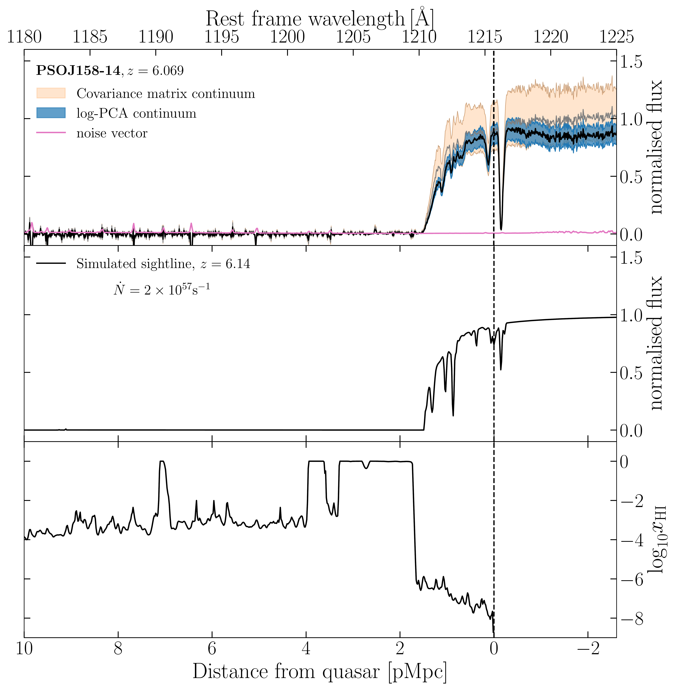
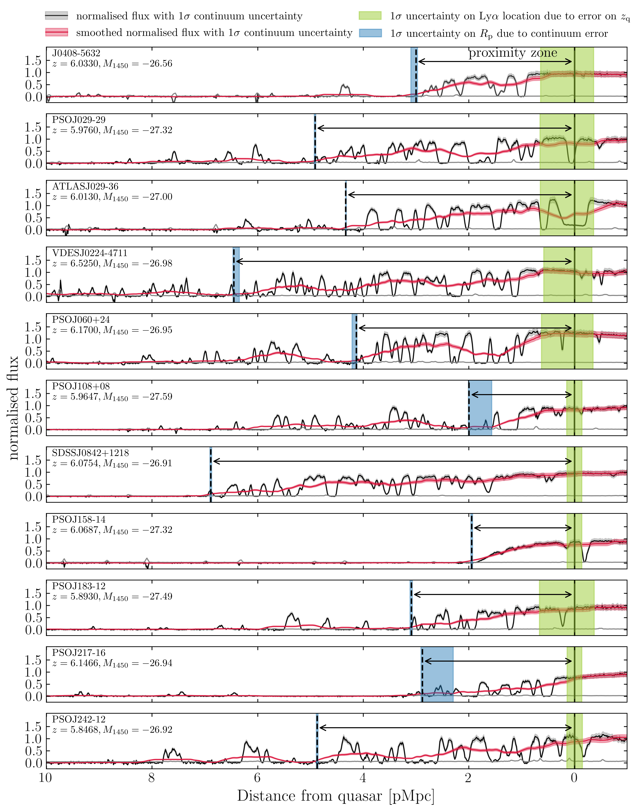
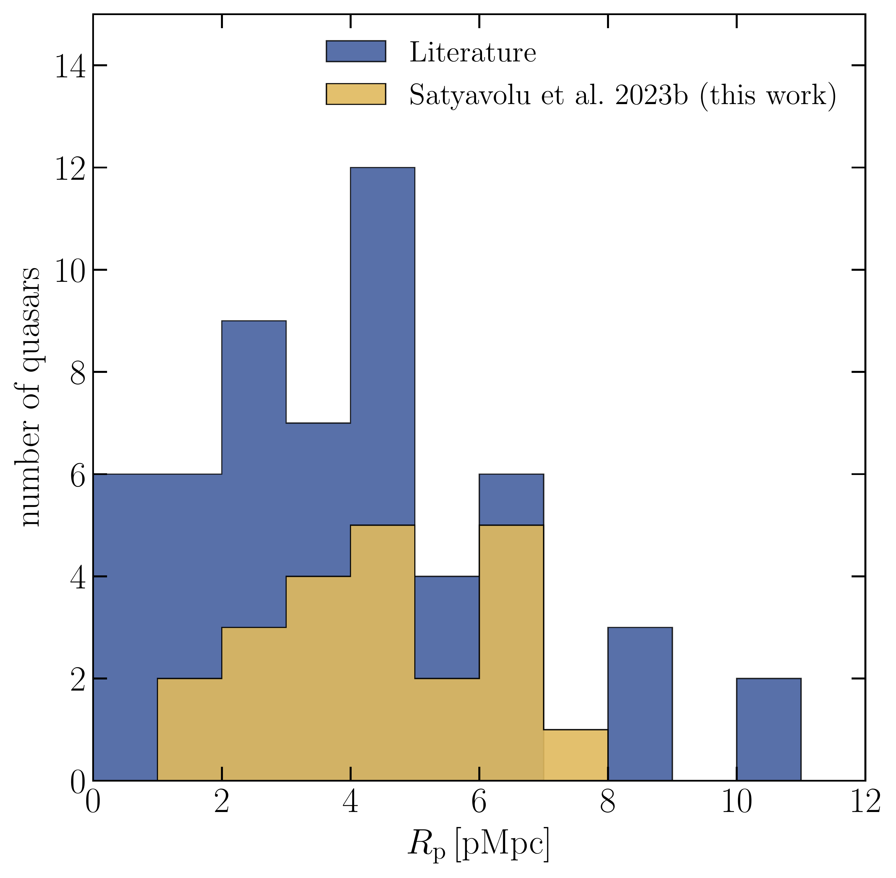

$\newcommand{\ensuremath}{}$
$\newcommand{\xspace}{}$
$\newcommand{\object}[1]{\texttt{#1}}$
$\newcommand{\farcs}{{.}''}$
$\newcommand{\farcm}{{.}'}$
$\newcommand{\arcsec}{''}$
$\newcommand{\arcmin}{'}$
$\newcommand{\ion}[2]{#1#2}$
$\newcommand{\textsc}[1]{\textrm{#1}}$
$\newcommand{\hl}[1]{\textrm{#1}}$
$\newcommand{\footnote}[1]{}$
$\newcommand{\orcidauthorA}{0000-0001-5818-6838}$
$\newcommand{\orcidauthorB}{0000-0003-2895-6218}$
$\newcommand{\orcidauthorC}{0000-0001-5829-4716}$
$\newcommand{\orcidauthorD}{0000-0003-2344-263X}$
$\newcommand{\orcidauthorE}{0000-0001-8582-7012}$
$\newcommand{\orcidauthorF}{0000-0002-3324-4824}$
$\newcommand{\orcidauthorG}{0000-0002-5360-8103}$
$\newcommand{\orcidauthorH}{0000-0003-4793-7880}$
$\newcommand{\orcidauthorI}{0000-0002-4314-021X}$
$\newcommand{\orcidauthorJ}{0000-0003-3693-3091}$
$\newcommand{\orcidauthorK}{0000-0003-3310-0131}$
$\newcommand{\orcidauthorL}{0000-0002-6822-2254}$
$\newcommand{\orcidauthorM}{0000-0003-4793-7880}$
$\newcommand{\orcidauthorN}{0000-0001-8443-2393}$
$\newcommand{\orcidauthorO}{0000-0001-5211-1958}$
$\newcommand{\orcidauthorP}{0000-0003-4793-7880}$
$\newcommand{\orcidauthorQ}{0000-0003-4793-7880}$
$\newcommand{\orcidauthorR}{0000-0003-4793-7880}$
$\newcommand{\msun}{\mathrm{M}_\odot}$
$\newcommand{\lya}{Ly\alpha}$
$\newcommand{\lyb}{Ly\beta}$
$\newcommand{\HI}{H I}$
$\newcommand{\HII}{H II}$
$\newcommand{\HeI}{He I}$
$\newcommand{\HeII}{He II}$
$\newcommand{\HeIII}{He III}$
$\newcommand{\MgII}{Mg {\small II}}$
$\newcommand{\CII}{[C {\small II}]}$
$\newcommand{\CV}{C {\small V}}$
$\newcommand{\CIV}{C {\small IV}}$
$\newcommand{\SiIV}{Si {\small IV}}$
$\newcommand{\NV}{N\thinspace{V}}$
$\newcommand{\ud}{\mathrm{d}}$
$\newcommand{\nel}{n_\mathrm{e}}$
$\newcommand{\nH}{n_\mathrm{H}}$
$\newcommand{\nHe}{n_\mathrm{He}}$
$\newcommand{\nHI}{n_\mathrm{HI}}$
$\newcommand{\nHII}{n_\mathrm{HII}}$
$\newcommand{\nHeI}{n_\mathrm{HeI}}$
$\newcommand{\nHeII}{n_\mathrm{HeII}}$
$\newcommand{\nHeIII}{n_\mathrm{HeIII}}$
$\newcommand{\rp}{R_\mathrm{p}}$
$\newcommand{\rpc}{R_\mathrm{p,corr}}$
$\newcommand{\tq}{t_\mathrm{q}}$
$\newcommand{\gk}[1]{{\color{notecolor} [GK: #1]}}$
$\newcommand{\sr}[1]{{\color{color2} [SR: #1]}}$
$\newcommand{\change}[1]{{\color{purple} #1}}$
$\newcommand{\ace}[1]{{\color{green} [ACE: #1]}}$
$\newcommand{\theenumi}{\textbf{\Alph{enumi}.}}$
$\newcommand{\theenumii}{\textbf{\alph{enumii}.}}$
$\newcommand{\thebibliography}{\DeclareRobustCommand{\VAN}[3]{##3}\VANthebibliography}$

# New quasar proximity zone size measurements at $z\sim 6$ using the enlarged XQR-30 sample

<mark>Appeared on: 2023-05-03</mark> -  _16 pages, 9 figures, Accepted in MNRAS_

S. Satyavolu, et al. -- incl., <mark>E. Bañados</mark>, <mark>F. Walter</mark>

**Abstract:** Proximity zones of high-redshift quasars are unique probes of their central supermassive black holes as well as the intergalactic medium in the last stages of reionization.  We present 22 new measurements of proximity zones of quasars with redshifts between 5.8 and 6.6, using the enlarged XQR-30 sample of high-resolution, high-SNR quasar spectra.  The quasars in our sample have UV magnitudes of $M_{1450}\sim -27$ and black hole masses of $10^9$ -- $10^{10}$ M $_\odot$ .  Our inferred proximity zone sizes are 2--7 physical Mpc, with a typical uncertainty of less than 0.5 physical Mpc, which, for the first time, also includes uncertainty in the quasar continuum.  We find that the correlation between proximity zone sizes and the quasar redshift, luminosity, or black hole mass,  indicates a large diversity of quasar lifetimes. Two of our proximity zone sizes are exceptionally small.  The spectrum of one of these quasars, with $z=6.02$ , displays, unusually for this redshift, damping wing absorption without any detectable metal lines, which could potentially originate from the IGM. The other quasar has a high-ionization absorber $\sim$ 0.5 pMpc from the edge of the proximity zone. This work increases the number of proximity zone measurements available in the last stages of cosmic reionization to 87.  This data will lead to better constraints on quasar lifetimes and obscuration fractions at high redshift, which in turn will help probe the seed mass and formation redshift of supermassive black holes.

**Figure 6. -** _Top panel_: Continuum-normalised spectrum of PSOJ158-14, for two continuum reconstruction methods, the log-PCA method \citep[]{2022ApJ...931...29C} and the covariance matrix method  ([Greig, et. al 2017](https://ui.adsabs.harvard.edu/abs/2017MNRAS.466.1814G)) , shown in blue and orange, respectively. Shaded regions show the $1\sigma$ spread around the median value.  (We use the log-PCA method for all quasars in this work.) _Middle panel_: A simulated spectrum showing an IGM damping wing at $z=6.14$  for a quasar with magnitude $-27$ and age 1 Myr. _Bottom panel_: The ionised hydrogen fraction along the same simulated sightline. This reveals the neutral hydrogen regions that create the damping wing seen in the middle panel. At redshift 6.14, only one of 500 sightlines in our simulation shows this feature. (*fig:dwingprops*)

**Figure 8. -** Proximity zones of the quasars in our sample.  The normalised flux obtained by dividing measured flux by continuum, is shown in black. Red curves show the smoothed spectra with shaded region showing the 1$\sigma$ uncertainty in the continuum. Black solid and dotted lines show the quasar location and the extent of proximity zones, respectively. The blue shaded regions show the 1$\sigma$ uncertainty on proximity zone sizes due to continuum uncertainties.  Green shaded regions show redshift errors as the uncertainty on the location of the expected $\lya$ emission of the quasar.   (*fig:fullsample*)

**Figure 1. -** Distribution of proximity zone sizes reported in this work.  The blue histogram shows the distribution of all previously available proximity zone sizes  ([ and Carilli 2010](https://ui.adsabs.harvard.edu/abs/2010ApJ...714..834C), [Eilers, et. al 2017](https://ui.adsabs.harvard.edu/abs/2017ApJ...840...24E), [ and Mazzucchelli 2017](https://ui.adsabs.harvard.edu/abs/2017ApJ...849...91M), [ and Reed 2017](https://ui.adsabs.harvard.edu/abs/2017MNRAS.468.4702R), [ and Bañados 2018](https://ui.adsabs.harvard.edu/abs/2018Natur.553..473B), [ and Eilers 2020](https://ui.adsabs.harvard.edu/abs/2020ApJ...900...37E), [ and Ishimoto 2020](https://ui.adsabs.harvard.edu/abs/2020ApJ...903...60I), [ and Bañados 2021](https://ui.adsabs.harvard.edu/abs/2021ApJ...909...80B)) , except those only available as values scaled to a fiducial luminosity, or that have been updated in this paper.  The yellow histogram shows the distribution of the 22 proximity zone sizes presented in this work. (*fig:rphist*)

