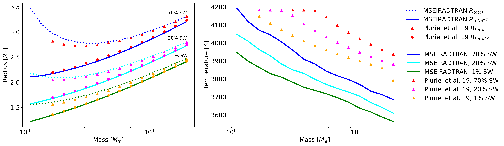
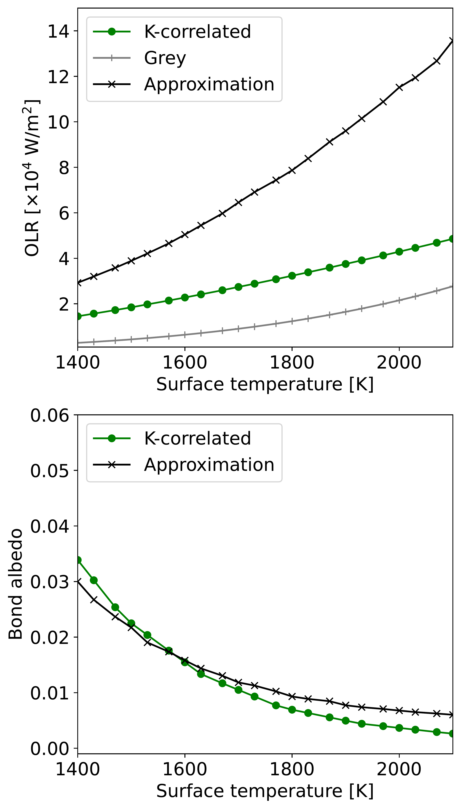
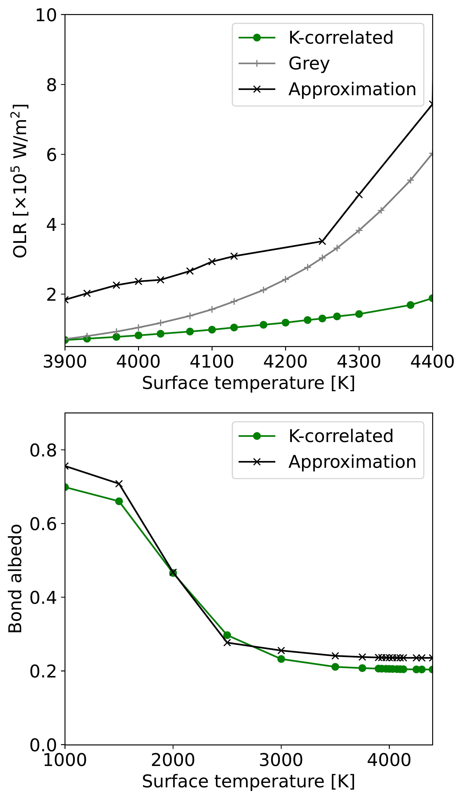

$\newcommand{\ensuremath}{}$
$\newcommand{\xspace}{}$
$\newcommand{\object}[1]{\texttt{#1}}$
$\newcommand{\farcs}{{.}''}$
$\newcommand{\farcm}{{.}'}$
$\newcommand{\arcsec}{''}$
$\newcommand{\arcmin}{'}$
$\newcommand{\ion}[2]{#1#2}$
$\newcommand{\textsc}[1]{\textrm{#1}}$
$\newcommand{\hl}[1]{\textrm{#1}}$
$\newcommand{\footnote}[1]{}$

# Interior-atmosphere modelling to assess the observability of rocky planets with JWST

<mark>Appeared on: 2023-05-03</mark> -  _15 pages, 9 figures. Accepted for publication in A&A_

L. Acuña, M. Deleuil, O. Mousis

**Abstract:** Super-Earths present compositions dominated by refractory materials. However, there is a degeneracy in their interior structure between a planet with no atmosphere and a small Fe content, and a planet with a thin atmosphere and a higher core mass fraction. To break this degeneracy, atmospheric characterization observations are required. We present a self-consistent interior-atmosphere model to constrain the volatile mass fraction, surface pressure, and temperature of rocky planets with water and CO $_{2}$ atmospheres. These parameters obtained in our analysis can then be used to predict observations in emission spectroscopy and photometry with JWST, which can determine the presence of an atmosphere, and if present, its composition. We couple a 1D interior model with a supercritical water layer with an atmospheric model. To obtain the bolometric emission and Bond albedo for an atmosphere in radiative-convective equilibrium, we present the k-uncorrelated approximation for fast computations within our retrieval on planetary mass, radius and host stellar abundances. For the generation of emission spectra, we use our k-correlated atmospheric model. An adaptive Markov chain Monte Carlo (MCMC) is used for an efficient sampling of the parameter space at low volatile mass fractions. We show how to use our modelling approach to predict observations with JWST for TRAPPIST-1 c and 55 Cancri e, which have been proposed in Cycle 1. TRAPPIST-1 c's most likely scenario is a bare surface, although the presence of an atmosphere cannot be ruled out. If the emission in the MIRI F1500 filter is 731 ppm or higher, there would be a water-rich atmosphere. For fluxes between 730 and 400 ppm, no atmosphere is present, while low emission fluxes (300 ppm) indicate a CO $_{2}$ -dominated atmosphere. In the case of 55 Cancri e, a combined spectrum with NIRCam and MIRI LRS may present high uncertainties at wavelengths between 3 and 3.7 $\mu$ m. However, this does not affect the identification of H $_{2}$ O and CO $_{2}$ because they do not present spectral features in this wavelength range.

**Figure 7. -** Comparison of the radius and interior-atmosphere boundary temperature between a k-correlated model and the k-uncorrelated approximation. Left panel: Mass-radius relationships for a planet with a water-dominated atmosphere orbiting a Sun-like star at $a_{d} = 0.05$ AU. Dashed lines indicate the total radius calculated by the k-uncorrelated version of MSEIRADTRAN, while the solid line corresponds to the interior radius, which comprises the core, mantle, and supercritical water (SW). Triangles and circles indicate the total radius and the interior radius obtained when the interior model is coupled with the atmospheric model of \cite{Pluriel19}, respectively. Right panel: Temperature at the 300 bar interface as a function of planetary mass. (*fig:MRdiag_MSEI*)

**Figure 5. -** Outgoing longwave radiation (OLR) and Bond albedo as function of the surface temperature for a grey model, our k-correlated model, and the k-uncorrelated approximation, assuming the water-dominated case of TRAPPIST-1 c (see text). (*fig:OLR_T_T1c*)

**Figure 6. -** Outgoing longwave radiation (OLR) and Bond albedo as function of the surface temperature for a grey model, our k-correlated model, and the k-uncorrelated approximation, assuming the water-dominated case of 55 Cancri e (see text). (*fig:OLR_T_55cnce*)

