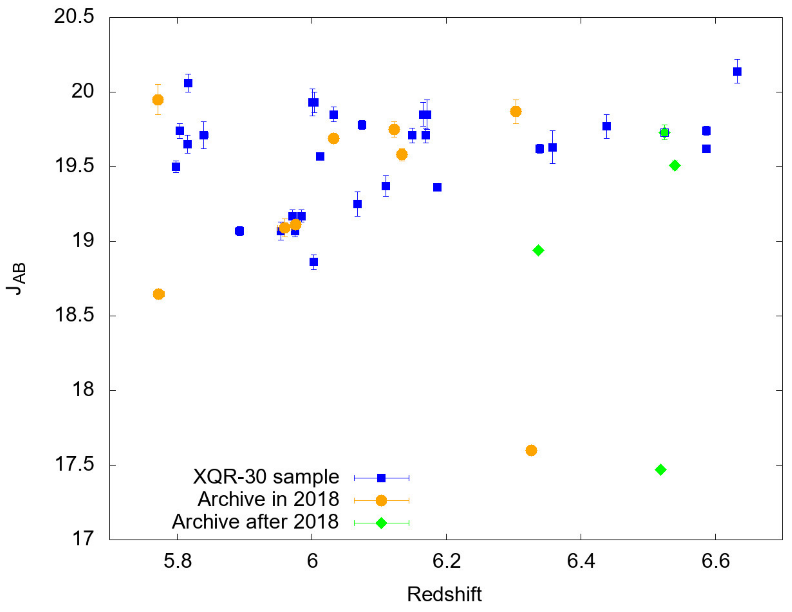
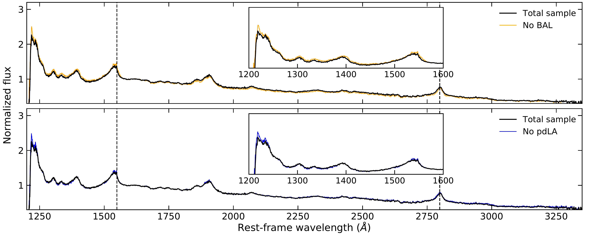
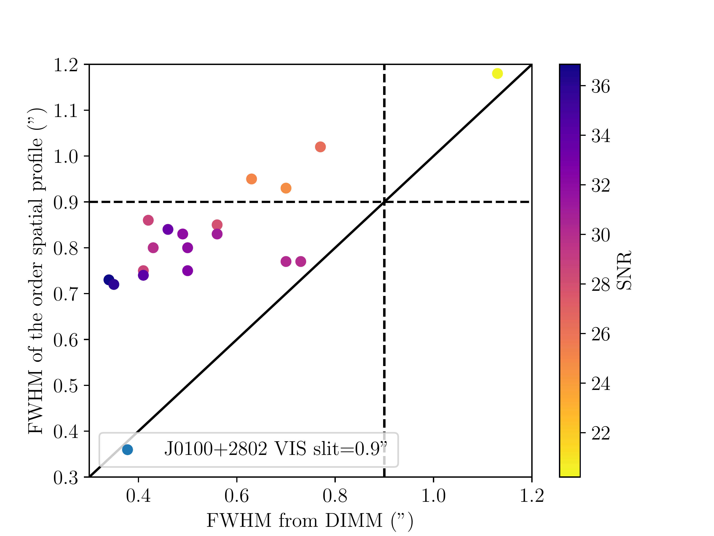
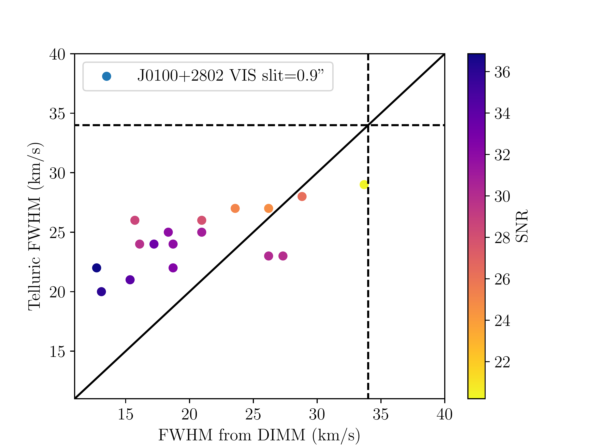

$\newcommand{\ensuremath}{}$
$\newcommand{\xspace}{}$
$\newcommand{\object}[1]{\texttt{#1}}$
$\newcommand{\farcs}{{.}''}$
$\newcommand{\farcm}{{.}'}$
$\newcommand{\arcsec}{''}$
$\newcommand{\arcmin}{'}$
$\newcommand{\ion}[2]{#1#2}$
$\newcommand{\textsc}[1]{\textrm{#1}}$
$\newcommand{\hl}[1]{\textrm{#1}}$
$\newcommand{\footnote}[1]{}$
$\newcommand{\CIV}{\mbox{C {\sc iv}}}$
$\newcommand{\CV}{\mbox{C {\sc v}}}$
$\newcommand{\CIII}{\mbox{C {\sc iii}}}$
$\newcommand{\CII}{\mbox{C {\sc ii}}}$
$\newcommand{\NV}{\mbox{N {\sc v}}}$
$\newcommand{\NIII}{\mbox{N {\sc iii}}}$
$\newcommand{\NII}{\mbox{N {\sc ii}}}$
$\newcommand{\OVI}{\mbox{O {\sc vi}}}$
$\newcommand{\OIV}{\mbox{O {\sc iv}}}$
$\newcommand{\OIII}{\mbox{O {\sc iii}}}$
$\newcommand{\OII}{\mbox{O {\sc ii}}}$
$\newcommand{\OI}{\mbox{O {\sc i}}}$
$\newcommand{\MgI}{\mbox{Mg {\sc i}}}$
$\newcommand{\MgII}{\mbox{Mg {\sc ii}}}$
$\newcommand{\AlII}{\mbox{Al {\sc ii}}}$
$\newcommand{\AlIII}{\mbox{Al {\sc iii}}}$
$\newcommand{\SiIV}{\mbox{Si {\sc iv}}}$
$\newcommand{\SiIII}{\mbox{Si {\sc iii}}}$
$\newcommand{\SiII}{\mbox{Si {\sc ii}}}$
$\newcommand{\SiV}{\mbox{Si {\sc v}}}$
$\newcommand{\SIII}{\mbox{S {\sc iii}}}$
$\newcommand{\SIV}{\mbox{S {\sc iv}}}$
$\newcommand{\FeIII}{\mbox{Fe {\sc iii}}}$
$\newcommand{\FeII}{\mbox{Fe {\sc ii}}}$
$\newcommand{\ZnII}{\mbox{Zn {\sc ii}}}$
$\newcommand{\HI}{\mbox{H {\sc i}}}$
$\newcommand{\HII}{\mbox{H {\sc ii}}}$
$\newcommand{\HeII}{\mbox{He {\sc ii}}}$
$\newcommand{\thebibliography}{\DeclareRobustCommand{\VAN}[3]{##3}\VANthebibliography}$
$\newcommand{\gtsima}{\; \buildrel > \over \sim \;}$
$\newcommand{\ltsima}{\; \buildrel < \over \sim \;}$
$\newcommand{\gsim}{\lower.5ex\hbox{\gtsima}}$
$\newcommand{\lsim}{\lower.5ex\hbox{\ltsima}}$
$\newcommand{\kms}{km s^{-1}}$
$\newcommand{\zabs}{z_{\rm abs}}$
$\newcommand{\zem}{z_{\rm em}}$
$\newcommand{\zlb}{z_{\rm Ly\beta}}$
$\newcommand{\Lya}{Ly\alpha}$
$\newcommand{\Lyb}{Ly\beta}$
$\newcommand{\lam}{\lambda}$
$\newcommand{\lama}{\lambda_{\alpha}}$
$\newcommand{\lamb}{\lambda_{\beta}}$
$\newcommand{\lambdaem}{\lambda_{\rm em}~}$
$\newcommand{\Jv}{{\rm J_{\nu}~}}$
$\newcommand{\nh}{{n_{\rm H}~}}$
$\newcommand{\nhs}{{\rm n_{\rm H,syn}~}}$
$\newcommand{\LJ}{{L_{\rm J}}}$
$\newcommand{\NHI}{{N_{\rm HI}}}$

# XQR-30: the ultimate XSHOOTER quasar sample at the reionization epoch

<mark>Appeared on: 2023-05-10</mark> -  _21 pages, 10 figures. Revised version resubmitted to MNRAS after minor referee report_

V. D'Odorico, et al. -- incl., <mark>F. Walter</mark>, <mark>F. Davies</mark>, <mark>P. Gaikwad</mark>, <mark>S. Rojas-Ruiz</mark>

**Abstract:** The final phase of the reionization process can be probed by rest--frame UV absorption spectra of quasars at $z>6$ , shedding light on the properties of the diffuse intergalactic medium within the first Gyr of the Universe. The ESO Large Programme “XQR-30: the ultimate XSHOOTER legacy survey of quasars at $z \simeq 5.8-6.6$ ” dedicated $\sim250$ hours of observations at the VLT to create a homogeneous and high-quality sample of spectra of 30 luminous quasars at $z\sim6$ , covering the rest wavelength range from the Lyman limit to beyond the $\MgII$ emission. Twelve quasar spectra of similar quality from the XSHOOTER archive were added to form the enlarged XQR-30 sample, corresponding to a total of $\sim350$ hours of on-source exposure time. The median effective resolving power of the  42 spectra is $R \simeq 11400$ and $9800$ in the VIS and NIR arm, respectively. The signal-to-noise ratio per 10 $\kms$ pixel ranges from $\sim11$ to 114 at $\lambda\simeq 1285$ Å rest frame, with a median value of $\sim29$ . We describe the observations, data reduction and analysis of the spectra, together with some first results based on the E-XQR-30 sample. New photometry in the $H$ and $K$ bands are provided for the XQR-30 quasars, together with composite spectra whose characteristics reflect the large absolute magnitudes of the sample.  The composite and the reduced spectra are released to the community through a public repository, and will enable a range of studies addressing outstanding questions regarding the first Gyr of the Universe.

**Figure 2. -** Distribution of the XQR-30 targets (blue squares) in the Redshift-$J_{\rm AB}$ magnitude plane. The orange dots represent the 9 quasars with SNR $ \ge 25$ per pixel, already available from the XSHOOTER archive at the time of the proposal preparation. The green diamonds are the 4 quasars with similar properties whose spectra in the XSHOOTER archive became available after 2018. VDES J0224-4711 is represented as a green diamond with a blue contour (see text). (*fig:redshift_range*)

**Figure 14. -** _Upper panel:_ Composite spectrum of the total E-XQR-30 sample rebinned to 250 $\kms$(black curve), compared with the composite spectrum obtained excluding the targets showing BAL systems (orange curve), as detected in [ and Bischetti (2022)](https://ui.adsabs.harvard.edu/abs/2022Natur.605..244B). The list of targets contributing to the no-BAL composite is reported in Table \ref{tab:noBAL}. _Lower panel:_ Composite spectrum of the total E-XQR-30 sample rebinned to 250 $\kms$(black curve), compared with the composite spectrum obtained excluding the targets showing proximate DLAs (blue curve), as identified in [ and Davies (2023)]() and Sodini et al. in prep. The list of targets contributing to the no-pDLA composite is reported in Table \ref{tab:nopDLA}. (*fig:comp_noBAL_nopDLA*)

**Figure 4. -** FWHM of the spectral order spatial profiles (_ upper panel_) and average FWHM of the telluric model (_ lower panel_) as a function of the FWHM at $\sim950$ nm of the seeing disk for the VIS frames of the literature quasar SDSSJ0100+2802,  which was observed with a slit=0.9". The dots are coloured according to the SNR of the corresponding frame (see the scale in the sidebar). The dashed lines indicate the slit value.   (*fig:resol_VIS_J0100*)

