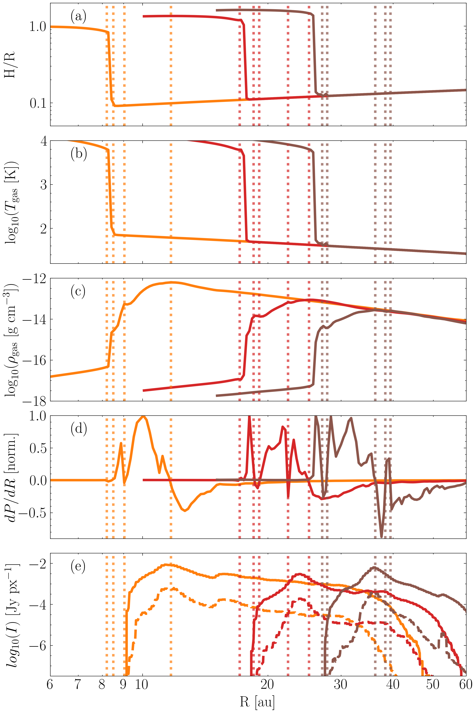
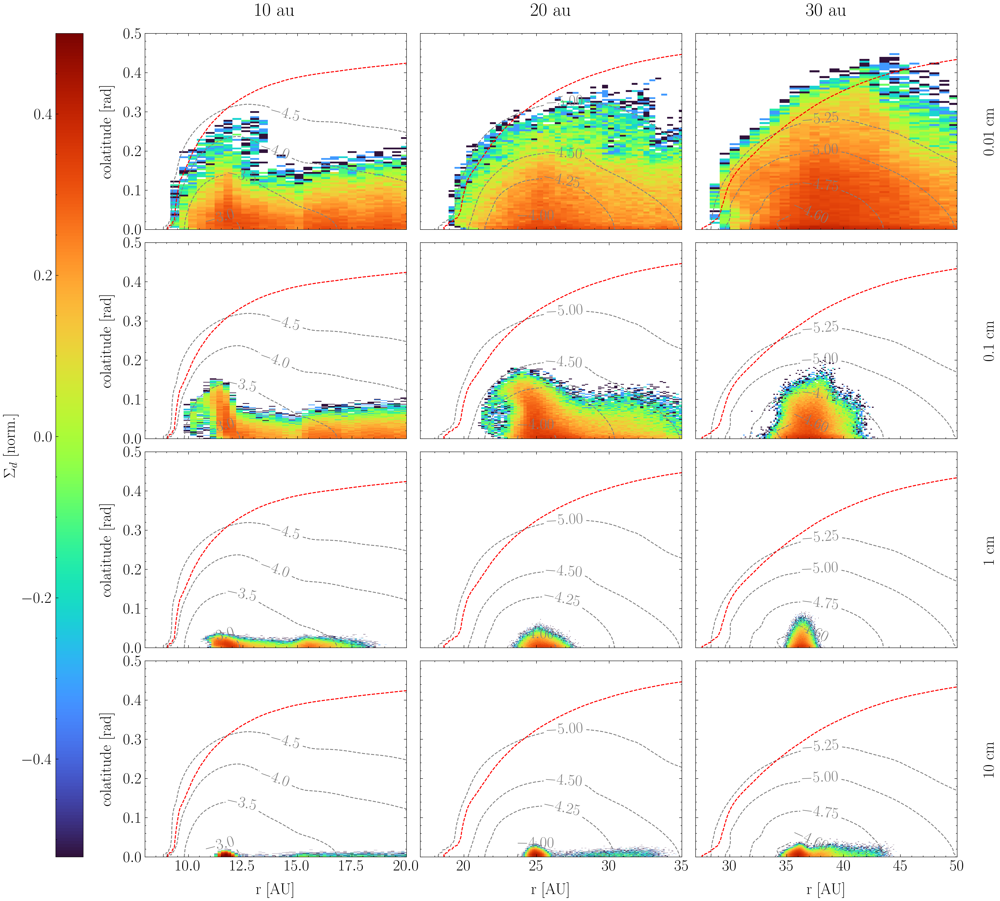

$\newcommand{\ensuremath}{}$
$\newcommand{\xspace}{}$
$\newcommand{\object}[1]{\texttt{#1}}$
$\newcommand{\farcs}{{.}''}$
$\newcommand{\farcm}{{.}'}$
$\newcommand{\arcsec}{''}$
$\newcommand{\arcmin}{'}$
$\newcommand{\ion}[2]{#1#2}$
$\newcommand{\textsc}[1]{\textrm{#1}}$
$\newcommand{\hl}[1]{\textrm{#1}}$
$\newcommand{\footnote}[1]{}$
$\newcommand{\thebibliography}{\DeclareRobustCommand{\VAN}[3]{##3}\VANthebibliography}$

# Observability of Photoevaporation Signatures in the Dust Continuum Emission of Transition Discs

<mark>Appeared on: 2023-05-11</mark> -  _10 pages, 7 figures, accepted for publication in MNRAS_

G. Picogna, et al. -- incl., <mark>M. Gárate</mark>

**Abstract:** Photoevaporative disc winds play a key role in our understanding of circumstellar disc evolution, especially in the final stages, and they might affect the planet formation process and the final location of planets. The study of transition discs (i.e. discs with a central dust cavity) is central for our understanding of the photoevaporation process and disc dispersal. However, we need to distinguish cavities created by photoevaporation from those created by giant planets. Theoretical models are necessary to identify possible observational signatures of the two different processes, and models to find the differences between the two processes are still lacking. In this paper we study a sample of transition discs obtained from radiation-hydrodynamic simulations of internally photoevaporated discs, and focus on the dust dynamics relevant for current ALMA observations. We then compared our results with gaps opened by super Earths/giant planets, finding that the photoevaporated cavity steepness depends mildly on gap size, and it is similar to that of a $\SI{1}{M_J}$ mass planet. However, the dust density drops less rapidly inside the photoevaporated cavity compared to the planetary case due to the less efficient dust filtering. This effect is visible in the resulting spectral index, which shows a larger spectral index at the cavity edge and a shallower increase inside it with respect to the planetary case. The combination of cavity steepness and spectral index might reveal the true nature of transition discs.

**Figure 1. -** Panel a: disc scale height radial profile. Panel b: gas temperature radial profile. Panel c: mid-plane gas density radial profile. Panel d: normalized mid-plane pressure gradient. Panel e: radial profile of the continuum intensity in Band 3 (solid) and 7 (dashed dotted line). With dotted vertical lines the location of zero pressure gradient are reported. In all panels the orange, red, and brown lines represent the 10, 20, and 30 au cavity models respectively.
             (*fig:scale-height*)

**Figure 4. -** Dust (normalized) density distributions for the four dust particles modelled and the different cavity edges. The red dashed line show the maximum penetration depth of X-rays ($N_X = 2\cdot 10^{22}$ pp cm$^{-2}$), while the dashed black lines show the isocontours of gas pressure in log scale. The snapshot is taken after 1,500 yr of dust insertion. (*fig:GasDustDist*)

**Figure 6. -** Dust continuum emission in Band 7 (top panel) and 3 (middle panel) convolved with a realistic ALMA beam size for the 10, 20, and 30 au transition discs. The convolution with the beam size blurs the features seen in Figure \ref{fig:DustContinuum}. In the bottom panel the radial profiles are shown for a direct comparison between Band 7 (in orange) and Band 3 (in brown) and the convolved (solid lines) and unconvolved (dashed lines) intensities. (*fig:comp_beam*)

