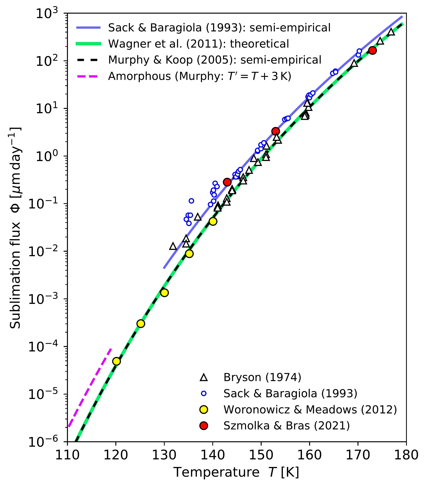
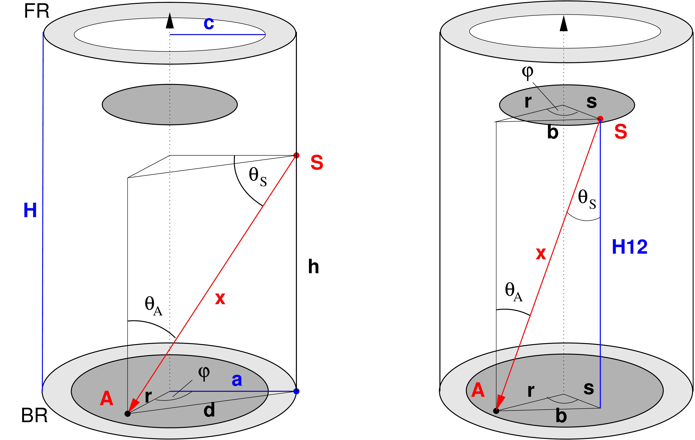
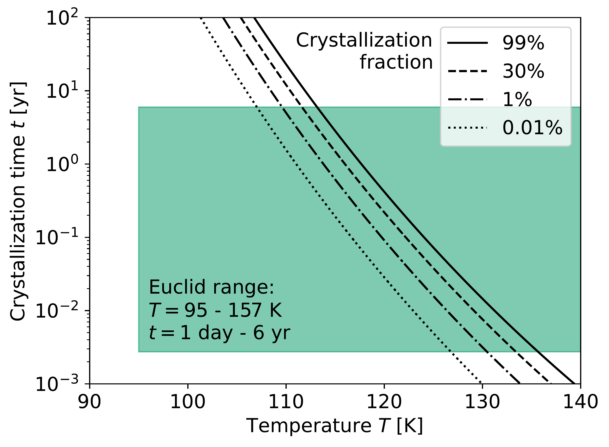

$\newcommand{\ensuremath}{}$
$\newcommand{\xspace}{}$
$\newcommand{\object}[1]{\texttt{#1}}$
$\newcommand{\farcs}{{.}''}$
$\newcommand{\farcm}{{.}'}$
$\newcommand{\arcsec}{''}$
$\newcommand{\arcmin}{'}$
$\newcommand{\ion}[2]{#1#2}$
$\newcommand{\textsc}[1]{\textrm{#1}}$
$\newcommand{\hl}[1]{\textrm{#1}}$
$\newcommand{\footnote}[1]{}$
$\newcommand{\}{natexlab}$

# $\Euclid$ preparation. XXIX. Water ice in spacecraft part I:$\The physics of ice formation and contamination$

<mark>Appeared on: 2023-05-18</mark> -  _35 pages, 22 figures, accepted for publication in A&A_

E. Collaboration, et al. -- incl., <mark>M. Schirmer</mark>

**Abstract:** Material outgassing in a vacuum leads to molecular contamination, a well-known problem in spaceflight. Water is the most common contaminant in cryogenic spacecraft, altering numerous properties of optical systems. Too much ice means that $\Euclid$ 's calibration requirements cannot be met anymore. $\Euclid$ must then be thermally decontaminated, a month-long risky operation. We need to understand how ice affects our data to build adequate calibration and survey plans. A comprehensive analysis in the context of an astrophysical space survey has not been done before.   In this paper we look at other spacecraft with well-documented outgassing records. We then review the formation of thin ice films, and find that for $\Euclid$ a mix of amorphous and crystalline ices is expected. Their surface topography -- and thus optical properties -- depend on the competing energetic needs of the substrate-water and the water-water interfaces, and are hard to predict with current theories. We illustrate that with scanning-tunnelling and atomic-force microscope images of thin ice films.   Sophisticated tools exist to compute contamination rates, and we must understand their underlying physical principles and uncertainties. We find considerable knowledge errors on the diffusion and sublimation coefficients, limiting the accuracy of outgassing estimates. We developed a water transport model to compute contamination rates in $\Euclid$ , and find agreement with industry estimates within the uncertainties. Tests of the $\Euclid$ flight hardware in space simulators did not pick up significant contamination signals, but were also not geared towards this purpose; our in-flight calibrations observations will be much more sensitive.   To derive a calibration and decontamination strategy we need to understand the link between the amount of ice in the optics and its effect on the data. There is little research about this, possibly because other spacecraft can decontaminate more easily, quenching the need for a deeper understanding. In our second paper we quantify the impact of iced optics on $\Euclid$ 's data.

**Figure 11. -** Sublimation-flux models for amorphous and crystalline (hexagonal) ice. Overlaid are various measurements. The model for amorphous ice is shown up to 120 K by the dashed pink line; it is obtained by shifting the \cite{murphy2005} curve by 3 K to lower temperatures. (*fig:sublimation_rate*)

**Figure 21. -** Geometric model of the telescope to compute contamination on the optical surfaces. _Left panel_: Contamination from a point $Q$ on the baffle wall onto a point $P$ on M1 (bottom grey disk). _Right panel_: Contamination from a point $Q$ on M2 (top grey disk) onto $P$. The same setup can be used to compute contamination of M1 by sublimation from the `front ring' (FR), contamination of M2 from M1 and the `back ring' BR, and the water flux loss through the front aperture, simply by adjusting the respective integral bounds. The blue lines indicate fixed parameters listed in Table \ref{plm_model_dimensions}. (*plm_model*)

**Figure 8. -** Annealing time for amorphous ice \Ial to reach different fractions of crystallisation, using the \cite{kouchi1994} formalism that is based on kinetic theory of crystallisation. The shaded box shows the relevant time and temperate ranges for \Euclid. The crystallisation speed can be greatly accelerated  in case of epitaxial growth on suitable substrates \citep{dohnalek2000}. (*fig:crystal_timescale_euclid*)

