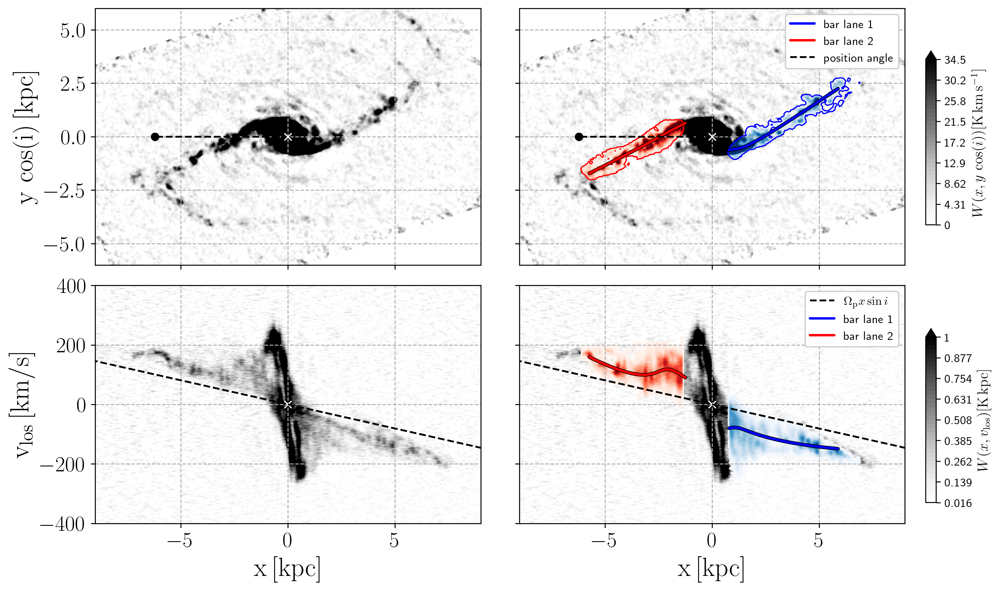
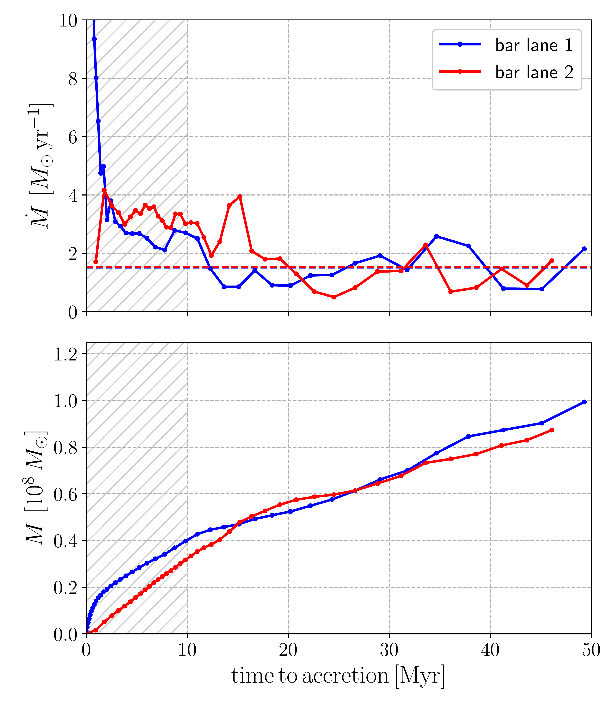
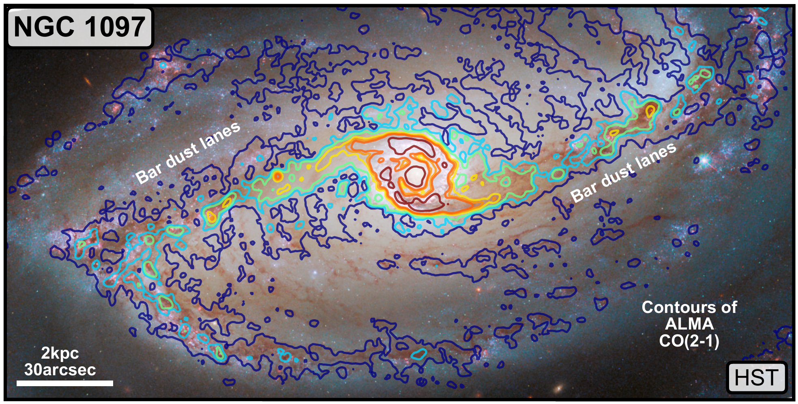

$\newcommand{\ensuremath}{}$
$\newcommand{\xspace}{}$
$\newcommand{\object}[1]{\texttt{#1}}$
$\newcommand{\farcs}{{.}''}$
$\newcommand{\farcm}{{.}'}$
$\newcommand{\arcsec}{''}$
$\newcommand{\arcmin}{'}$
$\newcommand{\ion}[2]{#1#2}$
$\newcommand{\textsc}[1]{\textrm{#1}}$
$\newcommand{\hl}[1]{\textrm{#1}}$
$\newcommand{\footnote}[1]{}$
$\newcommand{\di}{\mathrm{d}}$
$\newcommand{\bfx}{\mathbf{x}}$
$\newcommand{\bfe}{\mathbf{e}}$
$\newcommand{\vlos}{{v}_{\rm los}}$
$\newcommand{\NSD}{\mathrm{NSD}}$
$\newcommand{\BAR}{\mathrm{BAR}}$
$\newcommand{\Tspin}{T_{\rm s}}$
$\newcommand{\Tb}{T_{\rm b}}$
$\newcommand{◦ee}{\ensuremath{^\circ}}$
$\newcommand{\Th}{T_{\rm h}}$
$\newcommand{\Tc}{T_{\rm c}}$
$\newcommand{\bfr}{\mathbf{r}}$
$\newcommand{\bfv}{\mathbf{v}}$
$\newcommand{\bfJ}{\mathbf{J}}$
$\newcommand{\pc}{ {\rm pc}}$
$\newcommand{\kpc}{ {\rm kpc}}$
$\newcommand{\Myr}{ {\rm Myr}}$
$\newcommand{\Gyr}{ {\rm Gyr}}$
$\newcommand{\kms}{ {\rm km  s^{-1}}}$
$\newcommand{\de}[2]{\frac{\partial #1}{\partial{#2}}}$
$\newcommand{\cs}{c_{\rm s}}$
$\newcommand{\rb}{r_{\rm b}}$
$\newcommand{\rqu}{r_{\rm q}}$
$\newcommand{\nuP}{\nu_{\rm P}}$
$\newcommand{\thetaobs}{\theta_{\rm obs}}$
$\newcommand{\hatn}{\hat{\textbf{n}}}$
$\newcommand{\hats}{\hat{\textbf{s}}}$
$\newcommand{\hatx}{\hat{\textbf{x}}}$
$\newcommand{\haty}{\hat{\textbf{y}}}$
$\newcommand{\hatz}{\hat{\textbf{z}}}$
$\newcommand{\hatX}{\hat{\textbf{X}}}$
$\newcommand{\hatY}{\hat{\textbf{Y}}}$
$\newcommand{\hatZ}{\hat{\textbf{Z}}}$
$\newcommand{\hatN}{\hat{\textbf{N}}}$
$\newcommand{\pa}{\partial}$
$\newcommand{\e}{\mathrm{e}}$
$\newcommand{\Msun}{  \rm M_\odot}$
$\newcommand{\Msunyr}{  \rm M_\odot  yr^{-1}}$
$\newcommand{\masyr}{  \rm mas  yr^{-1}}$
$\newcommand{\Omegap}{\Omega_{\rm p}}$
$\newcommand{\mcs}[1]{{\textcolor{myblue}{#1}}}$
$\newcommand{\aifa}{Argelander-Institut für Astronomie, Universität Bonn, Auf dem Hügel 71, 53121, Bonn, Germany}$
$\newcommand{\ita}{Universität Heidelberg, Zentrum für Astronomie, Institut für theoretische Astrophysik, Albert-Ueberle-Str. 2, 69120 Heidelberg, Germany}$
$\newcommand{\eso}{European Southern Observatory, Karl-Schwarzschild-Stra{\ss}e 2, 85748 Garching, Germany}$
$\newcommand{\mcmaster}{Department of Physics and Astronomy, McMaster University, 1280 Main Street West, Hamilton, ON L8S 4M1, Canada}$
$\newcommand{\cita}{Canadian Institute for Theoretical Astrophysics (CITA), University of Toronto, 60 St George Street, Toronto, ON M5S 3H8, Canada}$
$\newcommand{\lyon}{Univ Lyon, Univ Lyon1, ENS de Lyon, CNRS, Centre de Recherche Astrophysique de Lyon UMR5574, F-69230 Saint-Genis-Laval France}$
$\newcommand{\OSU}{Department of Astronomy, The Ohio State University, 140 West 18th Avenue, Columbus, Ohio 43210, USA}$
$\newcommand{ÇAPP}{Center for Cosmology and Astroparticle Physics, 191 West Woodruff Avenue, Columbus, OH 43210, USA}$
$\newcommand{\ljmu}{Astrophysics Research Institute, Liverpool John Moores University, 146 Brownlow Hill, Liverpool L3 5RF, UK}$
$\newcommand{\mpia}{Max-Planck-Institut für Astronomie, Königstuhl 17, D-69117 Heidelberg, Germany}$
$\newcommand{\ugent}{Sterrenkundig Observatorium, Universiteit Gent, Krijgslaan 281 S9,$
$B-9000 Gent, Belgium}$
$\newcommand{\ign}{Observatorio Astron{ó}mico Nacional (IGN), C/Alfonso XII, 3, E-$
$28014 Madrid, Spain}$
$\newcommand{\oxford}{Sub-department of Astrophysics, Department of Physics, University of Oxford, Keble Road, Oxford OX1 3RH, UK}$
$\newcommand{\durham}{Institute for Computational Cosmology, Department of Physics, Durham University, South Road, Durham, DH1 3LE, UK}$
$\newcommand{\aapf}{NSF Astronomy and Astrophysics Postdoctoral Fellow}$
$\newcommand{\arizona}{Steward Observatory, University of Arizona, Tucson, AZ 85721, USA}$
$\newcommand{\anu}{Research School of Astronomy and Astrophysics, Australian National University, Canberra, ACT 2611, Australia}$
$\newcommand{\arc}{ARC Centre of Excellence for All Sky Astrophysics in 3 Dimensions (ASTRO 3D), Australia}$
$\newcommand{\iwr}{Universität Heidelberg, Interdisziplinäres Zentrum für Wissenschaftliches Rechnen, Im Neuenheimer Feld 205, D-69120 Heidelberg, Germany}$
$\newcommand{\epfl}{Institute of Physics, Laboratory for galaxy evolution and spectral modelling, EPFL, Observatoire de Sauverny, Chemin Pegais 51, 1290 Versoix, Switzerland}$
$\newcommand{\ualberta}{Dept. of Physics, 4-183 CCIS, University of Alberta, Edmonton, Alberta T6G 2E1, Canada}$
$\newcommand{\tum}{Technical University of Munich, School of Engineering and Design, Department of Aerospace and Geodesy, Chair of Remote Sensing Technology, \\\hspace{2.2mm}Arcisstr. 21, 80333 Munich, Germany}$
$\newcommand{\cool}{Cosmic Origins Of Life (COOL) Research DAO, coolresearch.io}$
$\newcommand{\manch}{Jodrell Bank Centre for Astrophysics, Department of Physics and Astronomy, University of Manchester, Oxford Road, Manchester M13 9PL, UK}$
$\newcommand{\UCSD}{Center for Astrophysics and Space Sciences, Department of Physics, University of California San Diego, 9500 Gilman Drive, La Jolla, CA 92093, USA}$
$\newcommand{\ari}{Astronomisches Rechen-Institut, Zentrum f{ü}r Astronomie der Universit{ä}t Heidelberg, M{ö}nchhofstra{\ss}e 12-14, 69120 Heidelberg,Germany}$
$\newcommand{\CO}[2]{\mbox{\mathrm{CO} (#1\text{--}#2)}}$
$\newcommand{\thebibliography}{\DeclareRobustCommand{\VAN}[3]{##3}\VANthebibliography}$

# Fuelling the nuclear ring of NGC 1097

<mark>Appeared on: 2023-05-25</mark> -  _Accepted in MNRAS_

M. C. Sormani, et al. -- incl., <mark>E. Schinnerer</mark>, <mark>J. Neumann</mark>, <mark>N. Neumayer</mark>, <mark>F. Pinna</mark>

**Abstract:** Galactic bars can drive cold gas inflows towards the centres of galaxies. The gas transport happens primarily through the so-called bar "dust lanes", which connect the galactic disc at kpc scales to the nuclear rings at hundreds of pc scales much like two gigantic galactic rivers. Once in the ring, the gas can fuel star formation activity, galactic outflows, and central supermassive black holes. Measuring the mass inflow rates is therefore important to understanding the mass/energy budget and evolution of galactic nuclei.  In this work, we use CO datacubes from the PHANGS-ALMA survey and a simple geometrical method to measure the bar-driven mass inflow rate onto the nuclear ring of the barred galaxy NGC 1097. The method assumes that the gas velocity in the bar lanes is parallel to the lanes in the frame co-rotating with the bar, and allows one to derive the inflow rates from sufficiently sensitive and resolved position-position-velocity diagrams if the bar pattern speed and galaxy orientations are known. We find an inflow rate of $\dot{M}=(3.0 \pm 2.1)\Msunyr$ averaged over a time span of 40 Myr, which varies by a factor of a few over timescales of $\sim$ 10 Myr. Most of the inflow appears to be consumed by star formation in the ring which is currently occurring at a rate of ${\rm SFR}\simeq 1.8 \mhyphen 2 \Msunyr$ , suggesting that the inflow is causally controlling the star formation rate in the ring as a function of time.

**Figure 7. -** Position-position (top) and position-velocity (bottom) projection of the CO $J=2-1$ datacube of NGC 1097. The galaxy is rotated in the plane of the sky such that the direction of the kinematic position angle points towards the negative $x$ axis (see black dashed line in the top panels). Red and blue contours indicate the emission in the datacube associated with the bar bar lanes. The red and blue lines indicate the spline fits to the bar lanes. The black dashed line in the bottom-right panel indicates the quantity $v_{\rm los}=\Omega_{\rm p} x \sin i$ which appears in the deprojection of the velocity parallel to the bar lanes (see Equation \ref{eq:vpar}). (*fig:dl*)

**Figure 5. -** *Top*: the instantaneous mass inflow rate along the bar lanes of NGC 1097 calculated using Eq. $\e$qref{eq:Mdot}. The blue and red dashed lines show the inflow rates averaged over the non-hatched region. *Bottom*: the cumulative mass accreted over time. The hatched area shows where the inflow rate is not reliable due to interaction between the bar lanes and the nuclear ring. (*fig:Mdot*)

**Figure 1. -** Position of bar dust lanes in the nearby, barred spiral galaxy NGC 1097. We show in the background a (WFC3) _ HST_ image composed of the following filters from projects PID 13413 and 15654 (processed as part of PHANGS-HST; see \citealp{Lee2021}): F275W nm (UV) and F336W (u) broad-band in violet, F438W (B) broad-band in dark blue, F547M (Strömgren y) medium-band in cyan, F555W broad-band (V) in green, F814W broad-band (I) in yellow, and F657N (H$\alpha$ + [N II]) in red. Overlaid as coloured contours is the CO(2-1) integrated intensity from the PHANGS-ALMA survey \citep{Leroy2021survey}, in levels of 2, 10, 20, 50, 75, 100, 250 K km s$^{-1}$(increasing from blue to red). Note that the galaxy is rotated in the plane of the sky such that the direction of the kinematic position angle points towards the negative $x$ axis (see Fig. \ref{fig:dl}). (*fig:rgb*)

