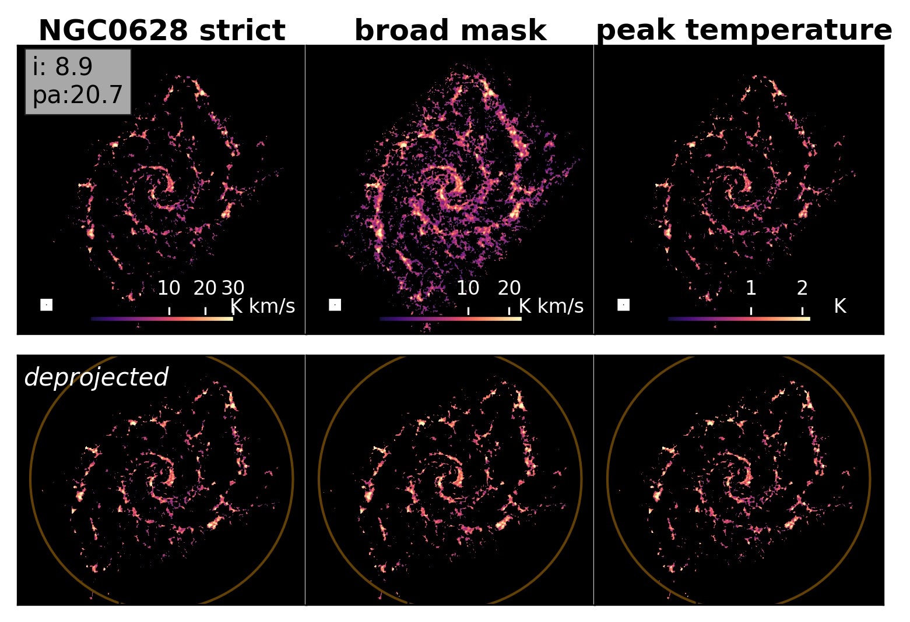
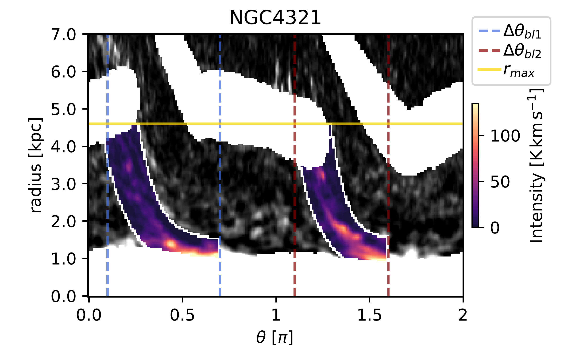

. These image are used as orientation to classify the shape of molecular bar lanes found from class **c1** to **c5**. They were selected to represent physically plausible cases that can be found in our sample, and have a visually increasing curvature from **c1** to **c5**. (*fig:ClassificationAtlas*)

**Figure 1. -** Example CO maps for NGC 0628. From left to right: Strict mom-0 map, broad mom-0 map and peak temperature map (top panels), as well as their deprojected and derotated versions (bottom panels). A circle with $0.5\cdot R_{25}$(orange) is added in the lower panels, as well as the inclination (incl) and position angle (pa) used during deprojection and derotation (top left corner on upper left panel). This galaxy is classified as **G**-**A**-**nR** (*fig:exampleCOmom0*)

**Figure 10. -** CO polar image of NGC 4321 with the bar lane masks on top.
    The center is masked out with an environmental mask, as well as the spiral arms. Emission at radii larger than the full bar length (yellow horizontal line) is also masked out (see Table \ref{tab:Barlanelist}).
    The selected azimuthal range for each bar lane (first bar lane ID 1: $\Delta \theta_{bl1}$ blue dashed line, second bar lane ID 2: $\Delta \theta_{bl2}$ red dashed line) used for the fitting is indicated. The bar lane mask area is defined by two shifted exponential profiles is shown in colorscale, the area outside in greyscale.
    The starting angle corresponds to a position angle of 90 degrees (measured clockwise from north) in the deprojected map, further environmental region masks are applied. (*fig:PolarimageFullmask*)

