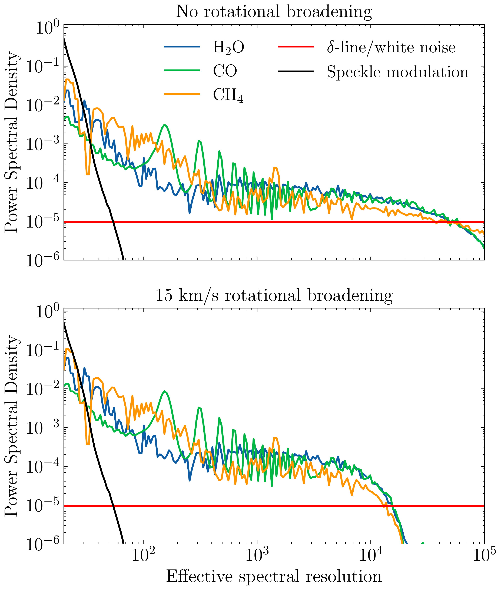
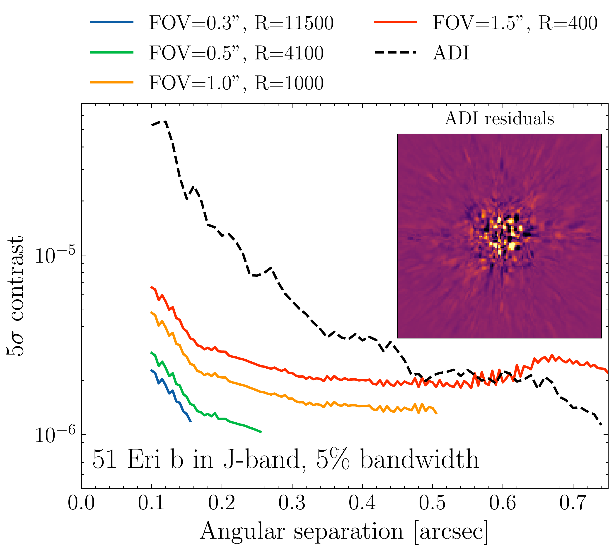
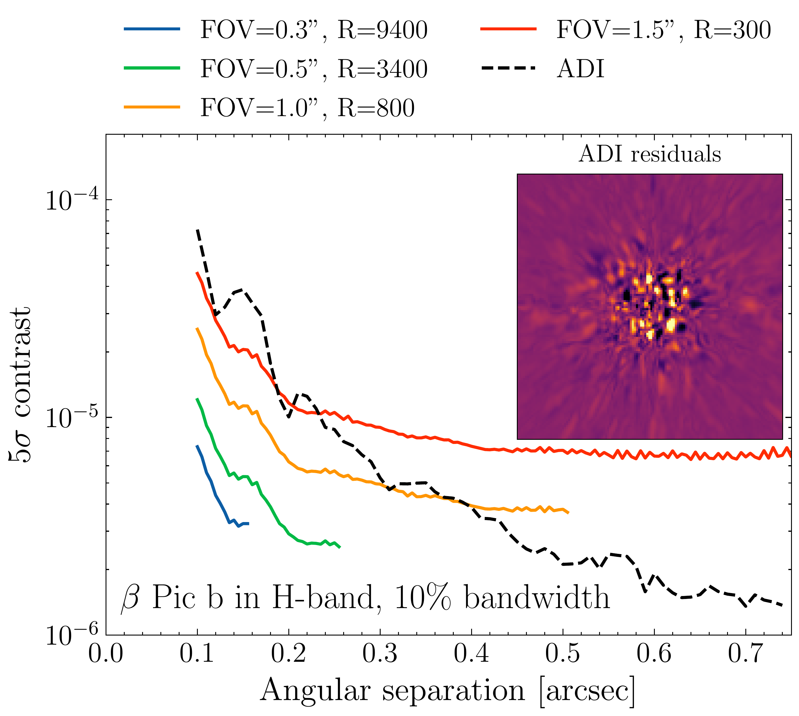
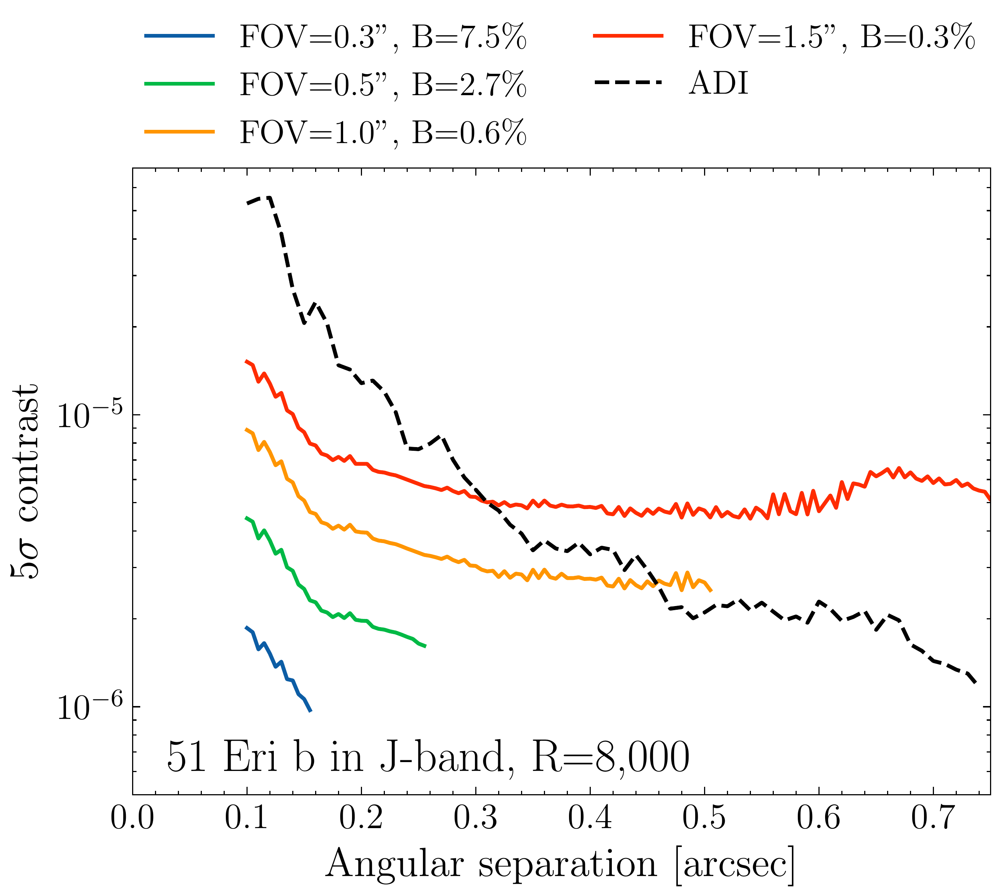
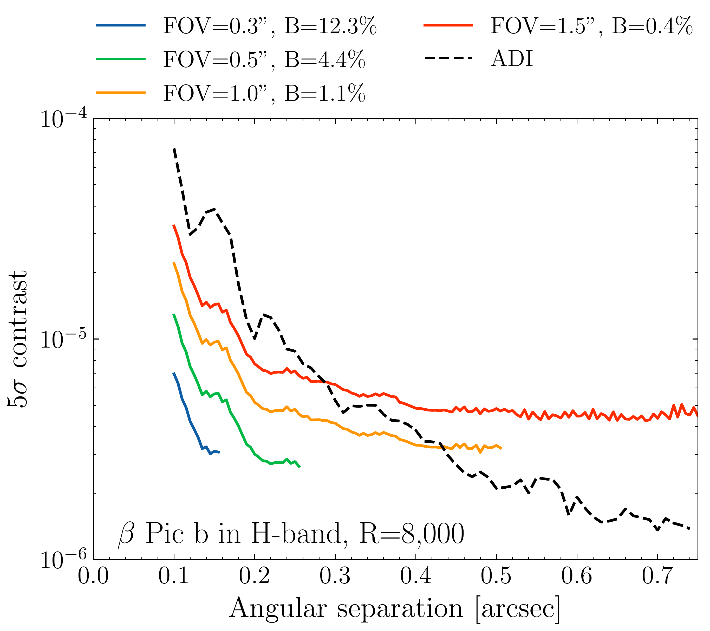

$\newcommand{\ensuremath}{}$
$\newcommand{\xspace}{}$
$\newcommand{\object}[1]{\texttt{#1}}$
$\newcommand{\farcs}{{.}''}$
$\newcommand{\farcm}{{.}'}$
$\newcommand{\arcsec}{''}$
$\newcommand{\arcmin}{'}$
$\newcommand{\ion}[2]{#1#2}$
$\newcommand{\textsc}[1]{\textrm{#1}}$
$\newcommand{\hl}[1]{\textrm{#1}}$
$\newcommand{\footnote}[1]{}$
$\newcommand{\appropto}{\mathrel{\vcenter{$
$  \offinterlineskip\halign{\hfil##\cr$
$    \propto\cr\noalign{\kern2pt}\sim\cr\noalign{\kern-2pt}}}}}$
$\newcommand{\arraystretch}{1.3}$
$\newcommand{\arraystretch}{1.8}$

# Trade-offs in high-contrast integral field spectroscopy for exoplanet detection and characterisation

<mark>Appeared on: 2023-06-01</mark> -  _Accepted for publication in A&A_

R. Landman, et al. -- incl., <mark>C. Desgrange</mark>

**Abstract:** Combining high-contrast imaging with medium- or high-resolution integral field spectroscopy has the potential to boost the detection rate of exoplanets, especially at small angular separations. Furthermore, it immediately provides a spectrum of the planet that can be used to characterise its atmosphere. The achievable spectral resolution, wavelength coverage, and FOV of such an instrument are limited by the number of available detector pixels. We aim to study the effect of the spectral resolution, wavelength coverage, and FOV on the detection and characterisation potential of medium- to high-resolution integral field spectrographs with molecule mapping. The trade-offs are studied through end-to-end simulations of a typical high-contrast imaging instrument, analytical considerations, and atmospheric retrievals. The results are then validated with archival VLT/SINFONI data of the planet $\beta$ Pictoris b. We show that molecular absorption spectra generally have decreasing power towards higher spectral resolution and that molecule mapping is already powerful for moderate resolutions (R $\gtrsim$ 300). When choosing between wavelength coverage and spectral resolution for a given number of spectral bins, it is best to first increase the spectral resolution until R $\sim$ 2,000 and then maximise the bandwidth within an observing band. We find that T-type companions are most easily detected in the J/H band through methane and water features, while L-type companions are best observed in the H/K band through water and CO features. Such an instrument does not need to have a large FOV, as most of the gain in contrast is obtained in the speckle-limited regime close to the star. We show that the same conclusions are valid for the constraints on atmospheric parameters such as the C/O ratio, metallicity, surface gravity, and temperature, while higher spectral resolution (R $\gtrsim$ 10,000) is required to constrain the radial velocity and spin of the planet.

**Figure 1. -** Normalised PSD of different contributions to the observed spectrum between 1 and 2.5 $\mu$m. Here, we assumed a planet with an effective temperature of 1200 K and log(g) of 4.0. The panels show the results without rotational broadening (top) and with rotational broadening of $v_{\textrm{rot}}\sin i = 15$ km/s (bottom). (*fig:psd*)

**Figure 10. -** Contrast curves with molecule mapping from the simulated observations. Different lines are for different combinations of spectral resolution and FOVs, and all use the same number of detector pixels. The inset shows the residuals after applying ADI on the mock observations. **Left:** 51 Eri b in the J-band with a 5\% spectral bandwidth. **Right:**$\beta$ Pic b in the H-band with a 10\% bandwidth.  (*fig:contrast_curves*)

**Figure 11. -** Same as Fig. \ref{fig:contrast_curves} but the spectral resolution is fixed at R=8,000 while varying the spectral bandwidth. (*fig:contrast_curves*)

