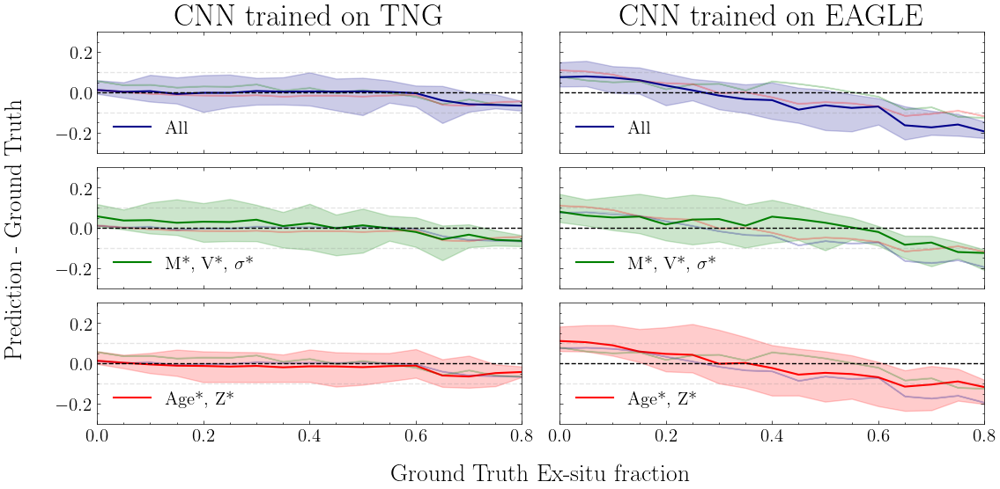
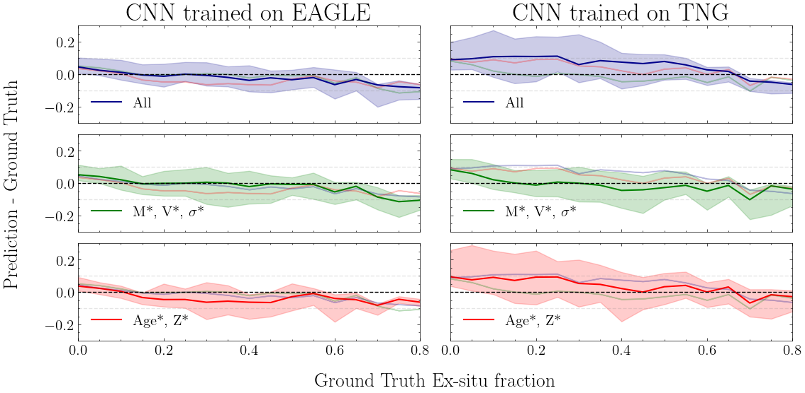
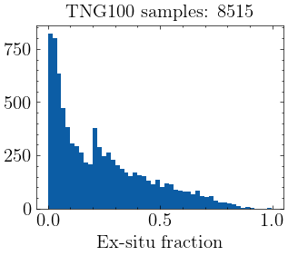
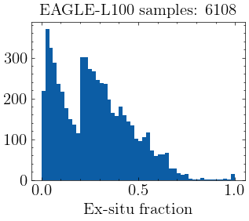
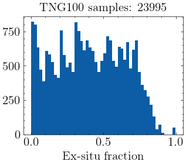
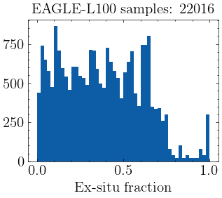
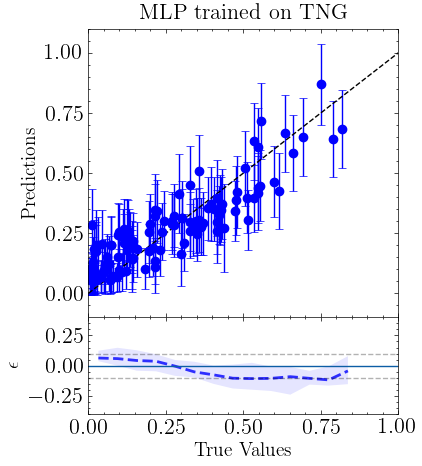
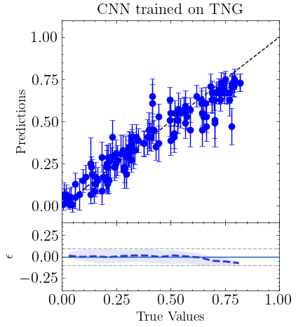
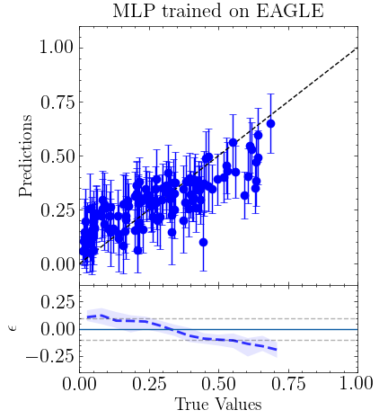
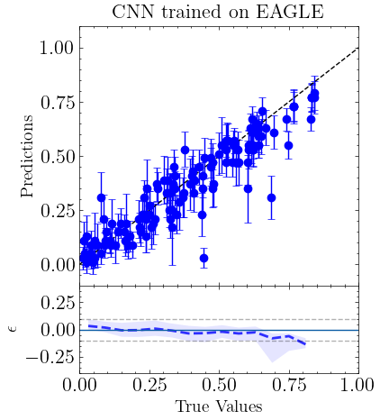

$\newcommand{\ensuremath}{}$
$\newcommand{\xspace}{}$
$\newcommand{\object}[1]{\texttt{#1}}$
$\newcommand{\farcs}{{.}''}$
$\newcommand{\farcm}{{.}'}$
$\newcommand{\arcsec}{''}$
$\newcommand{\arcmin}{'}$
$\newcommand{\ion}[2]{#1#2}$
$\newcommand{\textsc}[1]{\textrm{#1}}$
$\newcommand{\hl}[1]{\textrm{#1}}$
$\newcommand{\footnote}[1]{}$
$\newcommand{\rowname}[1]$
$\newcommand{\columnname}[1]$
$\newcommand{\ap}[1]{{\color{magenta} #1}}$
$\newcommand{\thebibliography}{\DeclareRobustCommand{\VAN}[3]{##3}\VANthebibliography}$

# ERGO-ML: Towards a robust machine learning model for inferring the fraction of accreted stars in galaxies from integral-field spectroscopic maps

<mark>Appeared on: 2023-06-05</mark> -  _23 pages, 15 figures. Accepted for publication in MNRAS_

E. Angeloudi, et al. -- incl., <mark>A. Pillepich</mark>, <mark>L. Eisert</mark>

**Abstract:** $\noindent$ Quantifying the contribution of mergers to the stellar mass of galaxies is key for constraining the mechanisms of galaxy assembly across cosmic time. However, the mapping between observable galaxy properties and merger histories is not trivial: cosmological galaxy simulations are the only  tools we have for calibration. We study the robustness of a simulation-based inference of the ex-situ stellar mass fraction of nearby galaxies to different observables -- integrated and spatially-resolved -- and to different galaxy formation models -- IllustrisTNG and EAGLE -- with Machine Learning. We find that at fixed simulation, the fraction of accreted stars can be inferred with very high accuracy, with an error $\sim5$ per cent (10 per cent) from 2D integral-field spectroscopic maps (integrated quantities) throughout the considered stellar mass range. A bias (> 5 per cent) and an increase in scatter by a factor of 2 are introduced when testing with a different simulation, revealing a lack of generalization to distinct galaxy-formation models. Interestingly, upon using only stellar mass and kinematics maps in the central galactic regions for training, we find that this bias is removed and the ex-situ stellar mass fraction can be recovered in both simulations with <15 per cent scatter, independently of the training set's origin. This opens up the door to a potential robust inference of the accretion histories of galaxies from existing Integral Field Unit surveys, such as MaNGA, covering a similar field of view (FOV) and containing spatially-resolved spectra for tens of thousands of nearby galaxies. $\$

**Figure 10. -** The prediction error (prediction - ground truth) versus the ex-situ stellar mass fraction ground-truth for all galaxies in the TNG100 (a) and EAGLE test set (b) for three different combinations of the input channels. For each panel the median of the over- or under-prediction is illustrated as a solid line and the shaded regions include the 68 per cent of the data points. The medians of the other channels combinations are also displayed in every panel for visual reference. **Top:** The prediction errors of models trained on three different input combinations when applied on the TNG100 test set. **Bottom:** The prediction errors of models trained on three different input combinations when applied on the EAGLE-L100 test set. In both sub-figures, we illustrate on the first column the results when testing and training in a single simulation setup and the second column corresponds to the cross-testing scenario across simulations. Each row corresponds to a distinct configuration of the input channels in the 2D maps. Spatially-resolved maps of stellar mass and kinematics prove to be the most robust predictors across simulations. (*fig:results_relative_error_channels*)

**Figure 1. -** The distribution of the ex-situ stellar mass fraction values for the selected samples from the TNG100 and EAGLE-L100 simulations. We select all galaxies with stellar mass $> {10}^{10} {M}_{\odot }$ from $z = 0$(TNG100 and EAGLE-L100) and galaxies of the same stellar mass range with an ex-situ stellar mass fraction $f_{ex} > 0.2 $ from $z = 0.1$(TNG100 and EAGLE-L100) and $z = 0.2$(EAGLE-L100), in an initial attempt to balance our dataset samples. **Top:** Histogram of ex-situ stellar mass fractions of the original TNG100 (on the left) and EAGLE-L100 galaxy samples (on the right). This sample distribution is used for the integrated values inference approach. **Bottom:** Histogram of ex-situ mass fractions of the two simulation samples after balancing by using multiple projections per galaxy. This sample is used for the 2D spatially-resolved maps inference approach. (*fig:balancing_ds*)

**Figure 2. -** Evaluation of models trained on a fixed simulation scenario with the integrated inputs (a, c) and the 2D spatial maps (b, d) for the TNG100 (upper row) and EAGLE-L100 (bottom row) test sets. In each panel, the ensemble predictions of the models versus the ground truth of the ex-situ stellar mass fraction is illustrated for 128 galaxies randomly selected from the two test sets. The error bars correspond to the standard deviation of the ensemble posterior that is predicted for each galaxy. The black dashed line on the prediction panels marks the 1:1 relation and serves as a guide to the eye, as the prediction points should be gathered as close to that line as possible. On the bottom error panels, the blue dashed line indicates the median of the error in the prediction, i.e. the difference between the model's estimate and the ground truth. The shaded region contains the 68 per cent of the data. (*fig:tng_eagle_test_set_results*)

