

$\newcommand{\ensuremath}{}$
$\newcommand{\xspace}{}$
$\newcommand{\object}[1]{\texttt{#1}}$
$\newcommand{\farcs}{{.}''}$
$\newcommand{\farcm}{{.}'}$
$\newcommand{\arcsec}{''}$
$\newcommand{\arcmin}{'}$
$\newcommand{\ion}[2]{#1#2}$
$\newcommand{\textsc}[1]{\textrm{#1}}$
$\newcommand{\hl}[1]{\textrm{#1}}$
$\newcommand{\footnote}[1]{}$
$\newcommand{\lya}{\ensuremath{{\rm Ly}\alpha}}$
$\newcommand{\kms}{\ensuremath{{\rm\;km\;s^{-1}}}}$
$\newcommand{\Mpc}{\ensuremath{{\rm\;Mpc}}}$
$\newcommand{\Myr}{\ensuremath{{\rm\;Myr}}}$
$\newcommand{\Msun}{\ensuremath{{\rm\;M_\odot}}}$
$\newcommand{\yr}{\ensuremath{{\rm\;yr}}}$
$\newcommand{\cm}{\ensuremath{{\rm\;cm}}}$
$\newcommand{\ergscms}{\ensuremath{{\rm\;ergs\;cm^{-2}\;s^{-1}}}}$
$\newcommand{\ergss}{\ensuremath{{\rm\;ergs\;s^{-1}}}}$
$\newcommand{\mic}{\ensuremath{\mu\rm m}}$
$\newcommand{\todo}[1]{{\color{blue} \tt #1}}$
$\newcommand{\tbc}[1]{#1 ({\color{red} \tt TBC})}$
$\newcommand{\tbd}{({\color{red} \tt TBD})}$
$\newcommand{\outline}[1]{{\color{black}\it #1}}$
$\newcommand{\BRC}[1]{{\color{red!55!black} BR: #1}}$
$\newcommand{\CWC}[1]{{\color{purple!55!black} CW: #1}}$
$\newcommand{\RM}[1]{{\color{green!25!black} RM: #1}}$
$\newcommand{\DJE}[1]{{\color{blue!25!black} DE: #1}}$
$\newcommand{\um}{\ensuremath{\mu{\rm m}}}$
$\newcommand{\nod}{\nodata & \nodata}$

# Overview of the JWST Advanced Deep Extragalactic Survey (JADES)

<mark>Appeared on: 2023-06-06</mark> -  _33 pages, submitted to ApJ Supplement. The JADES Collaboration web site is at this https URL, and the initial data release is available at this https URL with a viewer at this http URL_

D. J. Eisenstein, et al. -- incl., <mark>H.-W. Rix</mark>, <mark>A. d. Graaff</mark>

**Abstract:** We present an overview of the James Webb Space Telescope (JWST) Advanced Deep Extragalactic Survey (JADES), an ambitious program of infrared imaging and spectroscopy in the GOODS-S and GOODS-N deep fields, designed to study galaxy evolution from high redshift to cosmic noon.  JADES uses about 770 hours of Cycle 1 guaranteed time largely from the Near-Infrared Camera (NIRCam) and Near-Infrared Spectrograph (NIRSpec) instrument teams.In GOODS-S, in and around the Hubble Ultra Deep Field and ChandraDeep Field South, JADES produces a deep imaging region of $\sim$ 45arcmin $^2$ with an average of 130 hrs of exposure time spreadover 9 NIRCam filters.  This is extended at medium depth in GOODS-Sand GOODS-N with NIRCam imaging of $\sim$ 175 arcmin $^2$ with an averageexposure time of 20 hrs spread over 8--10 filters.  In bothfields, we conduct extensive NIRSpec multi-object spectroscopy,including 2 deep pointings of 55 hrs exposure time, 14 mediumpointings of $\sim$ 12 hrs, and 15 shallower pointings of $\sim$ 4 hrs, targetingover 5000 HST and JWST-detected faint sources with 5 low, medium, and high-resolution dispersers covering 0.6--5.3 $\mu$ m.  Finally, JADESextends redward via coordinated parallels with the JWST Mid-InfraredInstrument (MIRI), featuring $\sim$ 9 arcmin $^2$ with 43hours of exposure at 7.7 $\mic$ and twice that area with 2--6.5hours of exposure at 12.8 $\mic$ .  For nearly 30 years, the GOODS-Sand GOODS-N fields have been developed as the premier deep fieldson the sky; JADES is now providing a compelling start on the JWSTlegacy in these fields.

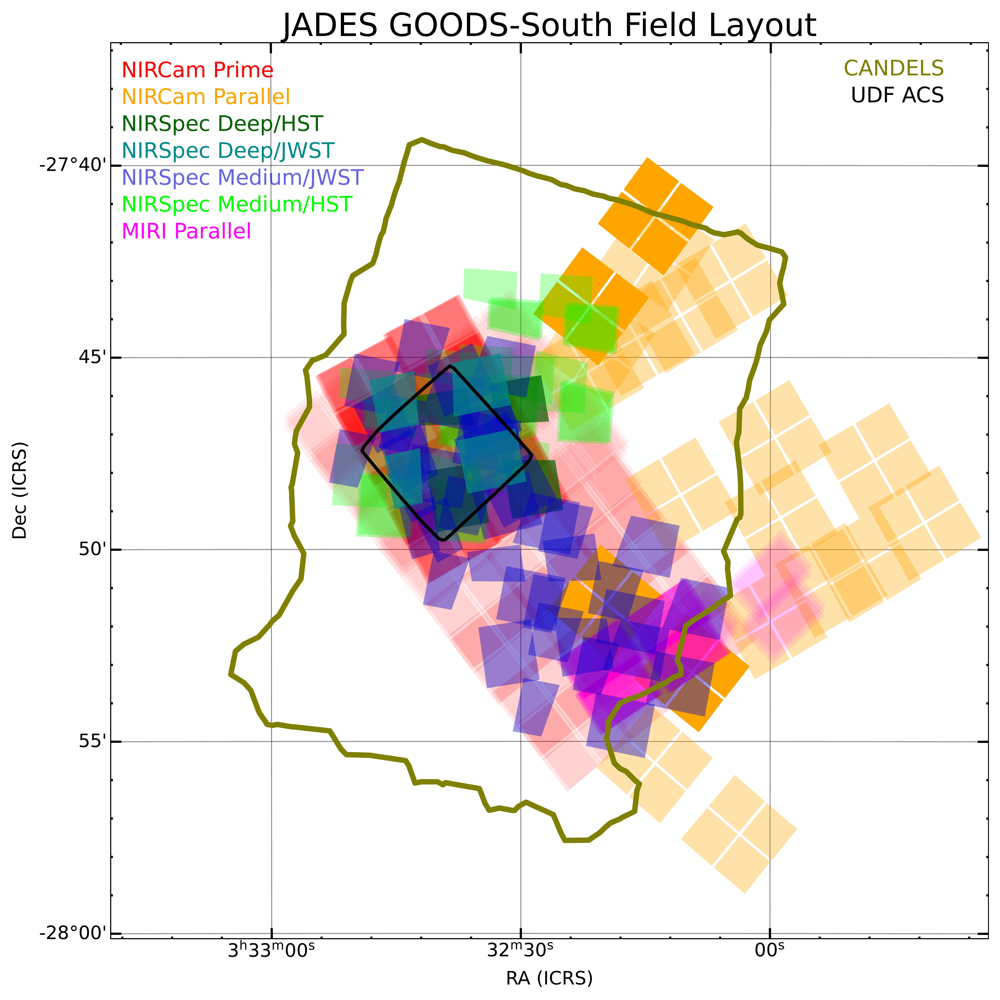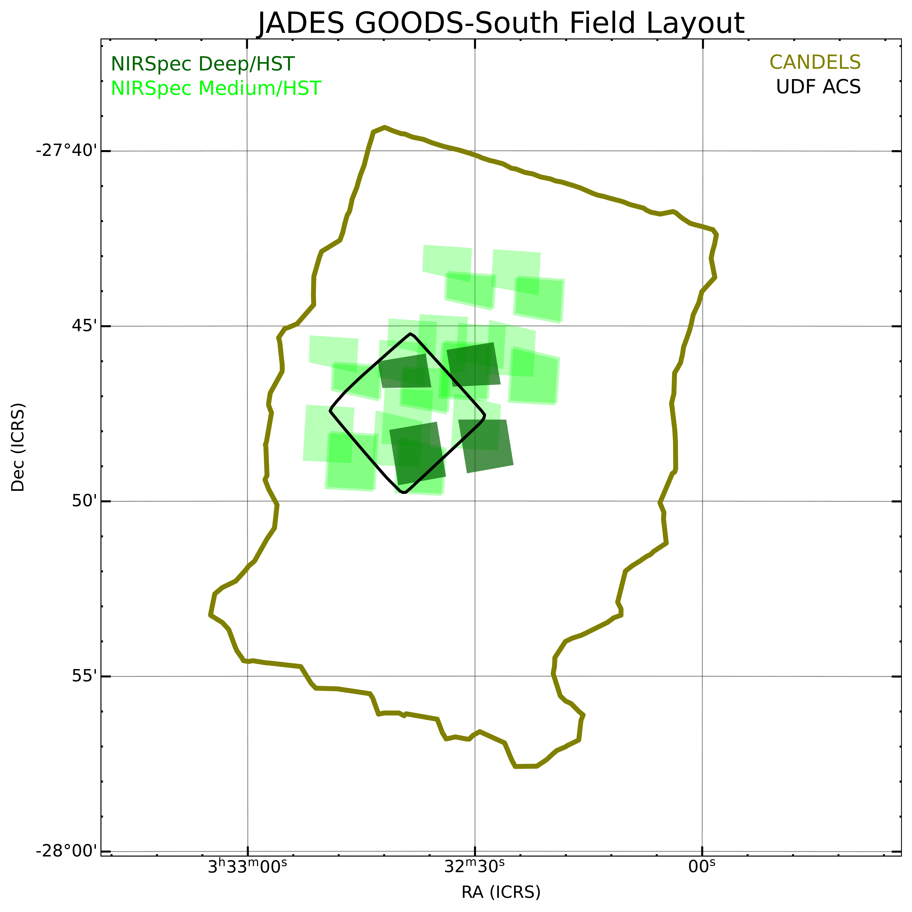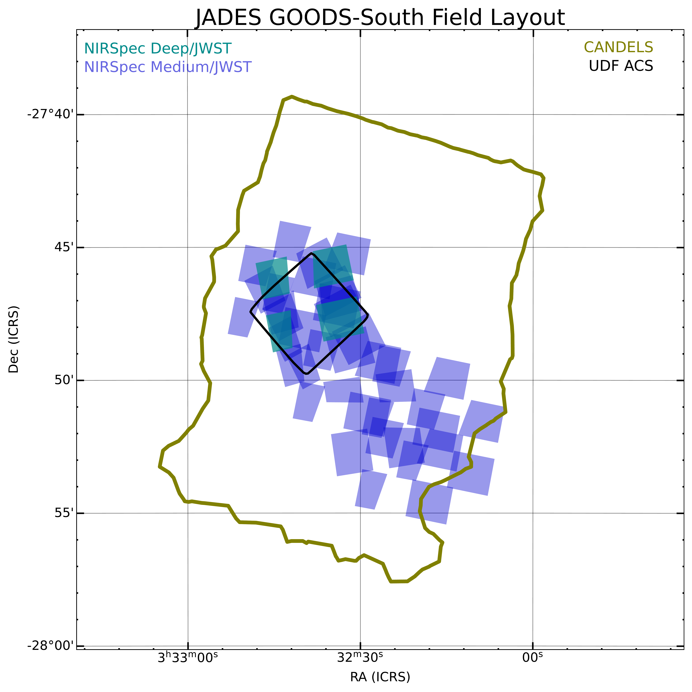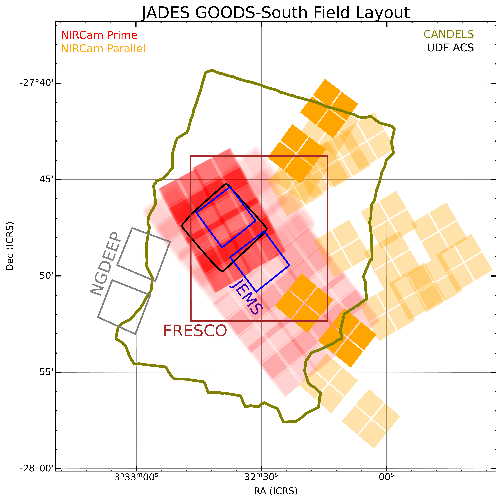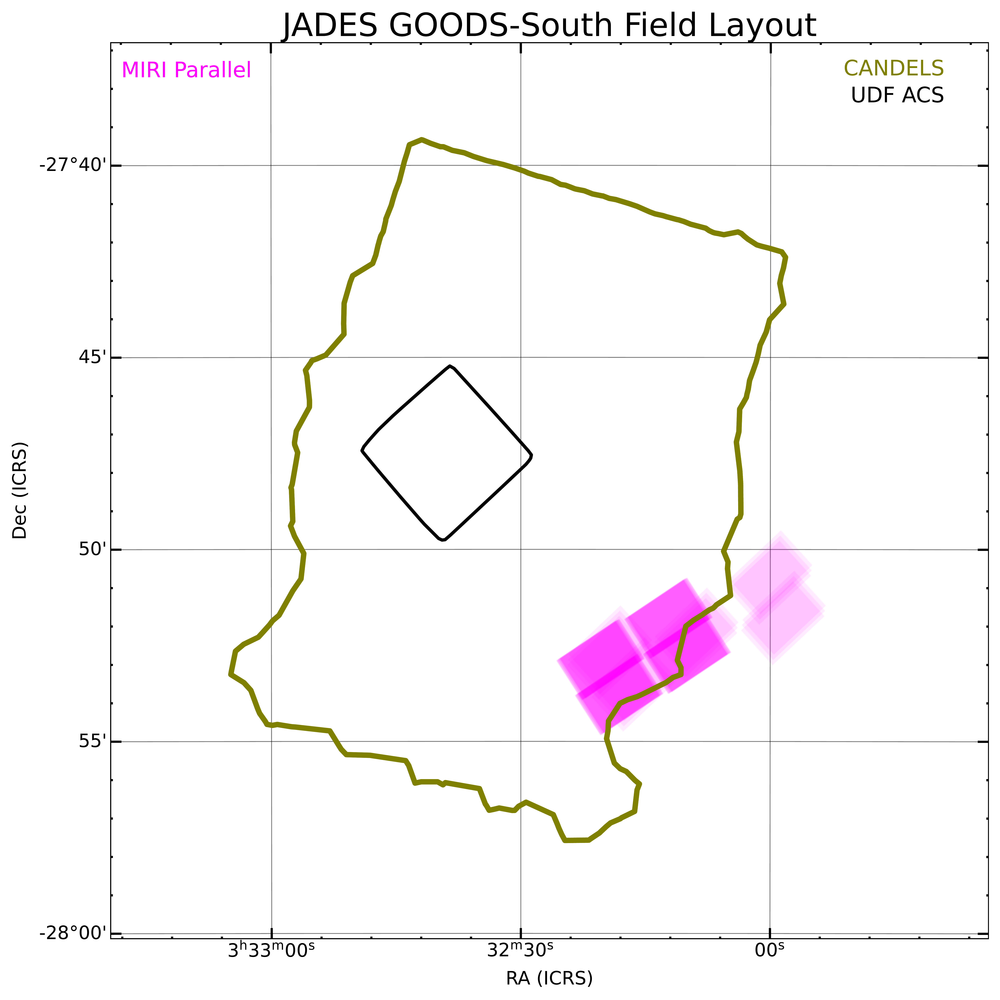

**Figure 6. -** Layout of the JADES observations in the GOODS-South field. JADES observations with NIRCam, NIRSpec MOS, and MIRI are shown as colored shaded regions. Higher opacity indicates higher exposure time for NIRCam and MIRI or overlapping MSA pointings for NIRSpec. Dithers and nods smaller than 2 arcseconds are not plotted. For NIRCam, only the SW quadrants are shown for clarity. For NIRSpec, only the active area of the MSA that was used for target placement, excluding regions that lead to truncated prism spectra, is shown. Some of the observations yet to be made in Cycle 2 (NIRSpec Deep/JWST and most Medium/JWST and their associated NIRCam parallels) have positions and orientations that are still to be defined based on scheduling. Outlines of other surveys, including the HST/ACS UDF and CANDELS, are shown with black and olive green curves. The smaller sub-panels show the same information split by instrument for clarity because it can be difficult to see the details when all observations are plotted together. The NIRCam sub-plot in upper-right additionally includes field outlines for the public JWST Cycle 1 NIRCam imaging from the JEMS, FRESCO and NGDEEEP programs.
 (*fig:south*)

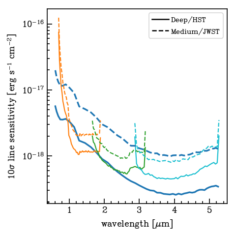

**Figure 2. -** The unresolved line detection limit as a function of wavelength for two JADES NIRSpec tiers.  We assume a well-centered point source and use a $10\sigma$ detection threshold.
The blue long lines are the prism, while the orange, green, and cyan lines are the three $R=1000$ gratings.  The solid lines show the depth in the Deep/HST pointing, while the dashed lines are a representative Medium/JWST pointing.
For an unresolved line, the G395H grating has a similar line detection limit to G395M plotted here.
 (*fig:ns_depth*)

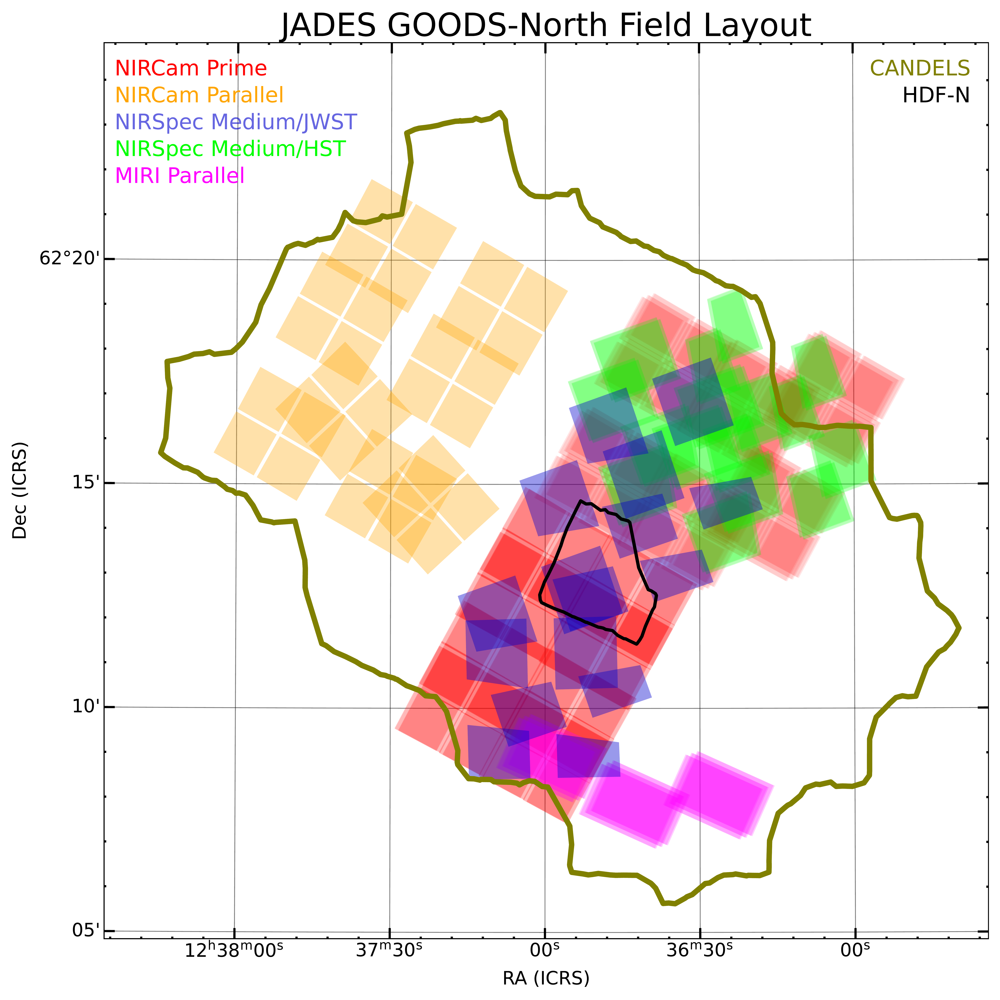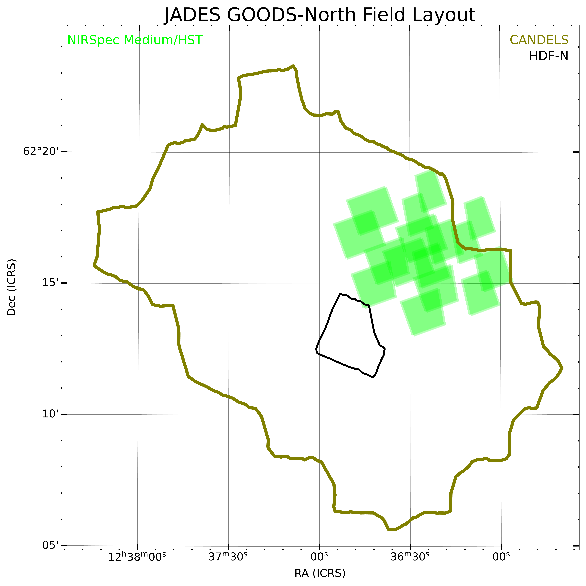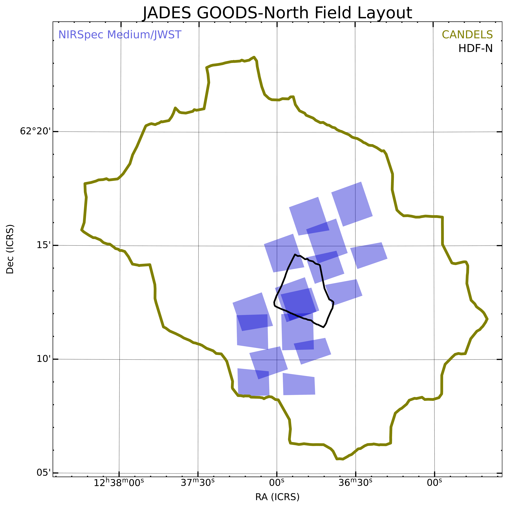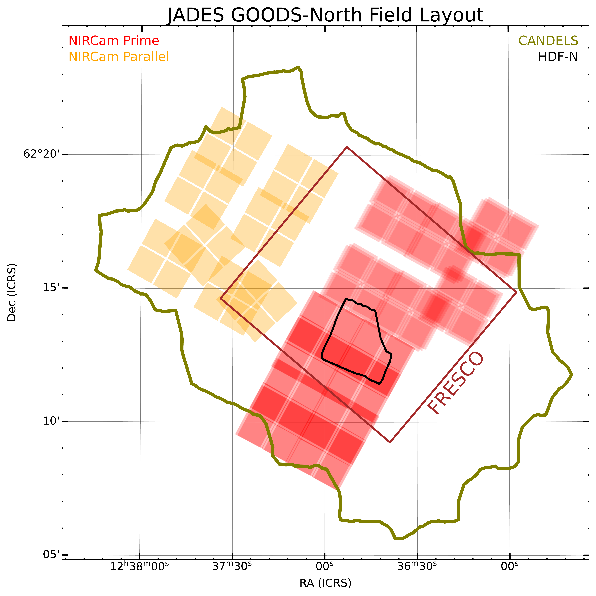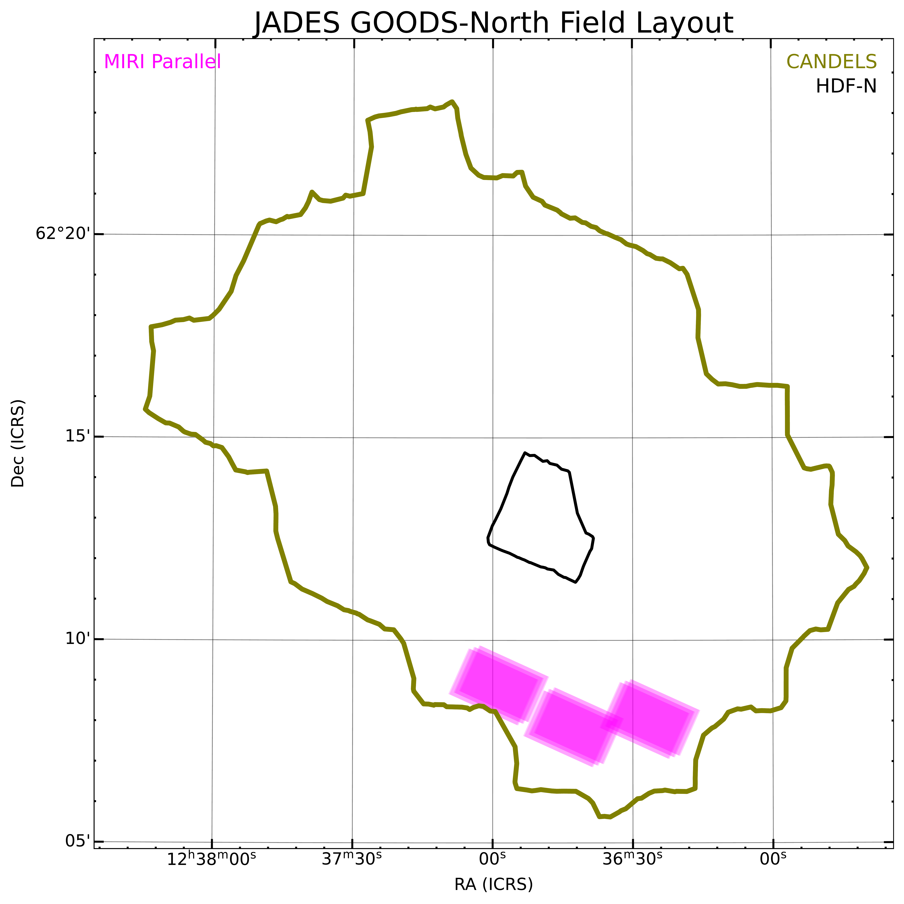

**Figure 7. -** Layout of the JADES observations in the GOODS-North field. Details as in Figure \ref{fig:south}.
GOODS-North data collection is nearly complete, so this figure is nearly final.
Only the southern-most of the Medium/JWST pointings remains, due to a guide-star acquisition failure; this pointing will be repeated at an unknown location and position angle.  The NIRCam sub-plot in the upper-right additionally includes the outlines of the public JWST Cycle 1 NIRCam imaging from the FRESCO program.
 (*fig:north*)

