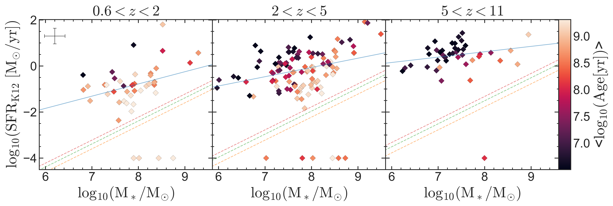
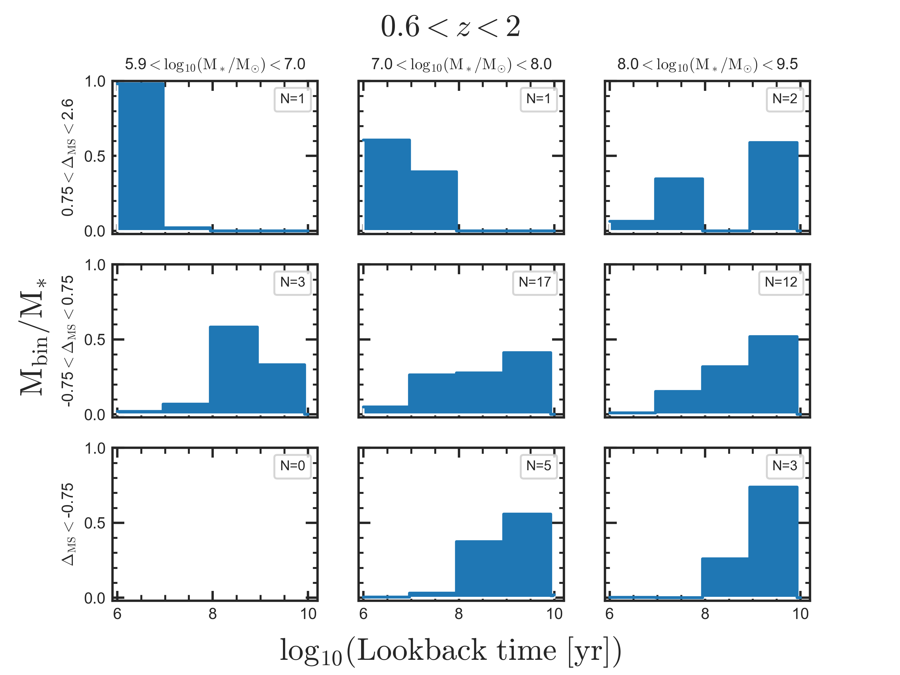
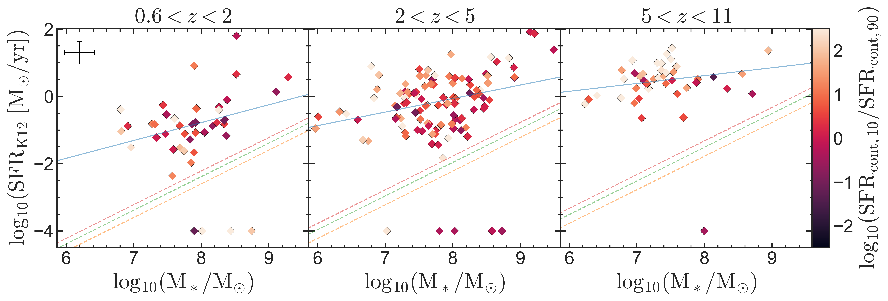

$\newcommand{\ensuremath}{}$
$\newcommand{\xspace}{}$
$\newcommand{\object}[1]{\texttt{#1}}$
$\newcommand{\farcs}{{.}''}$
$\newcommand{\farcm}{{.}'}$
$\newcommand{\arcsec}{''}$
$\newcommand{\arcmin}{'}$
$\newcommand{\ion}[2]{#1#2}$
$\newcommand{\textsc}[1]{\textrm{#1}}$
$\newcommand{\hl}[1]{\textrm{#1}}$
$\newcommand{\footnote}[1]{}$
$\newcommand$
$\newcommand$
$\newcommand$
$\newcommand$
$\newcommand$
$\newcommand$
$\newcommand$
$\newcommand$
$\newcommand$
$\newcommand{\lya}{Ly\alpha}$
$\newcommand{\niii}{N \textsc{iii}]}$
$\newcommand{\niv}{N \textsc{iv}]}$
$\newcommand{\hei}{He \textsc{i}}$
$\newcommand{\heii}{He \textsc{ii}}$
$\newcommand{\ciii}{C \textsc{iii}]}$
$\newcommand{\oii}{[O \textsc{ii}]}$
$\newcommand{\oiii}{[O \textsc{iii}]}$
$\newcommand{\oiiiSF}{O \textsc{iii}]}$
$\newcommand{\neiii}{[Ne \textsc{iii}]}$
$\newcommand{\niiiL}{N \textsc{iii}] \lambda}$
$\newcommand{\nivL}{N \textsc{iv}] \lambda}$
$\newcommand{\ciiiL}{C \textsc{iii}] \lambda}$
$\newcommand{\ciiiLL}{C \textsc{iii}] \lambda\lambda}$
$\newcommand{\civ}{C \textsc{iv}}$
$\newcommand{\oiiL}{[O \textsc{ii}] \lambda\lambda}$
$\newcommand{\oiiiL}{[O \textsc{iii}] \lambda}$
$\newcommand{\oiiiSFL}{O \textsc{iii}] \lambda\lambda}$
$\newcommand{\neiiiL}{[Ne \textsc{iii}] \lambda}$
$\newcommand{\hd}{H \delta}$
$\newcommand{\hg}{H \gamma}$
$\newcommand{\hb}{H \beta}$
$\newcommand{\mgii}{Mg \textsc{ii}}$
$\newcommand{\oiiiau}{[O \textsc{iii}]}$
$\newcommand{\oiiiauL}{[O \textsc{iii}] \lambda}$
$\newcommand{\xhi}{x_{\rm \textsc{hi}}}$
$\newcommand{\flux}{erg s^{-1} cm^{-2}}$
$\newcommand{\kms}{km s^{-1}\xspace}$
$\newcommand{\asec}{^{\prime\prime}}$
$\newcommand{\sfr}[2]{\ensuremath{\mathrm{SFR_{#1,#2}}}\xspace}$
$\newcommand{\cont}{{\ensuremath{\mathrm{cont}}}\xspace}$
$\newcommand{\sfrcten}{\sfr{\cont}{10}}$
$\newcommand{\sfrcninety}{\sfr{\cont}{90}}$
$\newcommand{\sfrchund}{\sfr{\cont}{100}}$
$\newcommand{\sfrnebten}{\sfr{neb}{10}}$
$\newcommand{\jadesdeep}{JADES/DEEP-HST}$
$\newcommand{\todo}[1]{\textcolor{orange}{[to do: #1]}}$
$\newcommand{\todiscuss}[1]{\textcolor{teal}{[to discuss: #1]}}$
$\newcommand{\TBC}[1]{\textcolor{violet}{[TBC: #1]}}$
$\newcommand{\txn}[1]{\textnormal{#1}}$
$\newcommand{\gtsim}{\mbox{{\raisebox{-0.4ex}{\stackrel{>}{{\scriptstyle\sim}}$
$}}}}$
$\newcommand{\ltsim}{\mbox{{\raisebox{-0.4ex}{\stackrel{<}{{\scriptstyle\sim}}$
$}}}}$
$\newcommand{\ssim}{\ensuremath{\sim\!}\xspace}$
$\newcommand{\lthan}{\ensuremath{\!<\!}\xspace}$
$\newcommand{\prob}{\hbox{\txn{P}}}$
$\newcommand{\conditional}[2]{\hbox{\txn{P}(#1 \mid #2)}}$
$\newcommand{\range}[3]{\hbox{#1 \sim #2  \txn{--}  #3}}$
$\newcommand{\citationneeded}{\textcolor{ForestGreen}{^{\rm citation\;needed}}}$
$\newcommand{\M}{\hbox{\txn{M}}}$
$\newcommand{\hda}{\ensuremath{\mathrm{H\updelta_A}}\xspace}$
$\newcommand{\re}{\ensuremath{R_\mathrm{e}}\xspace}$
$\newcommand{\Mstar}{\ensuremath{M_\star}\xspace}$
$\newcommand{\tquench}{\ensuremath{\mathrm{t_{quench}}}\xspace}$
$\newcommand{\tform}{\ensuremath{\mathrm{t_{form}}\xspace}}$
$\newcommand{\lambdar}{\ensuremath{\lambda_{\rm R}}\xspace}$
$\newcommand{\eps}{\ensuremath{\epsilon}\xspace}$
$\newcommand{\MSun}{\ensuremath{{\rm M}_\odot}\xspace}$
$\newcommand{\Met}{\ensuremath{\mathrm{log_{10}(Z/Z_{\odot})}}\xspace}$
$\newcommand{\fluxcgs}{\ensuremath{\mathrm{erg s^{-1} cm^{-2}}}\xspace}$
$\newcommand{\targetidfull}{JADES-GS+53.15508-27.80178\xspace}$
$\newcommand{\targetid}{JADES-GS-z7-01-QU\xspace}$
$\newcommand{\fesc}{\ensuremath{f_{\rm esc}}\xspace}$
$\newcommand{\Mgas}{\hbox{\M_\txn{gas}}}$
$\newcommand{\Mbh}{\hbox{M_{\textsc{bh}}}}$
$\newcommand{\Mtot}{\hbox{\M_\txn{tot}}}$
$\newcommand{\MtotInLog}{\hbox{\txn{M}_\txn{tot}}}$
$\newcommand{\yr}{\hbox{\txn{yr}}}$
$\newcommand{\LymanAlpha}{\text{Ly\alpha}\xspace}$
$\newcommand{\Halpha}{H\alpha\xspace}$
$\newcommand{\Hbeta}{H\beta\xspace}$
$\newcommand{\Hgamma}{H\gamma\xspace}$
$\newcommand{\DeltaMS}{\Delta_{MS}\xspace}$
$\newcommand{\Hdelta}{\text{H\textdelta}\xspace}$
$\newcommand{\OIII}{\text{[O {\sc iii}]\textlambda5008}\xspace}$
$\newcommand{\SiIV}{\text{[Si {\sc iv}]}\xspace}$
$\newcommand{\NII}{{[N {\sc ii}]}\xspace}$
$\newcommand{\Lsun}{\hbox{ {\rm L}_\odot}}$
$\newcommand{\ergscm}{\hbox{\textrm{erg} \textrm{s}^{-1} \textrm{cm}^{-2}}}$
$\newcommand{\jwst}{\textit{JWST}\xspace}$
$\newcommand{\ppxf}{{\sc ppxf}\xspace}$
$\newcommand{\bagpipes}{{\sc bagpipes}\xspace}$
$\newcommand{\beagle}{{\sc beagle}\xspace}$
$\newcommand{\prospector}{{\sc prospector}\xspace}$
$\newcommand{\forcepho}{{\sc forcepho}\xspace}$
$\newcommand{Å}{\oldAA\xspace}$

# JADES: Differing assembly histories of galaxies - Observational evidence for bursty SFHs and (mini-)quenching in the first billion years of the Universe

<mark>Appeared on: 2023-06-06</mark> - 

T. J. Looser, et al. -- incl., <mark>A. d. Graaff</mark>, <mark>H.-W. Rix</mark>

**Abstract:** We use deep NIRSpec spectroscopic data from the JADES survey to derive the star formation histories (SFHs) of a sample of 200 galaxies at 0.6 $<$ z $<$ 11 and spanning stellar masses from $\rm 10^6$ to $\rm 10^{9.5} M_\odot$ .We find that galaxies at high-redshift, galaxiesabove the Main Sequence (MS) and low-mass galaxies tend to host younger stellar populations than their low-redshift, massive, and below the MS counterparts. Interestingly,the correlation between age, M $_*$ and SFR existed even earlier than Cosmic Noon, out to the earliest cosmic epochs.However, these trends have a large scatter.Indeed, there are examples of young stellar populations also below the MS, indicating recent (bursty) star formation in evolved systems.We explore further the burstiness of the SFHs by using the ratio between SFR averaged over the last 10 Myr and averaged between 10 Myr and 100 Myr before the epoch of observation ( $\sfrcten$ / $\sfrcninety$ ).We find thathigh-redshift and low-mass galaxies have particularly bursty SFHs, while more massive and lower-redshift systems evolve more steadily.We also present the discovery ofanother (mini-)quenched galaxy at z = 4.4 (in addition to the one at z=7.3 reported by Looser et al. 2023), which might be only temporarily quiescent as a consequence of the extremely bursty evolution. Finally, we also find a steady decline of dust reddening of the stellar population approaching the earliest cosmic epochs, although some dust reddening is still observed in some of the highest redshift and most star forming systems.

**Figure 5. -** SFR-mass plane color-coded by the average mass-weighted stellar ages measured by $\ppxf$ in three different redshift bins. Each data-point represents a single galaxy. The blue lines represent a simple linear fit of the star-forming main sequence (MS) for this sample at that redshift bin. For reference, the three dotted lines indicate the quenched threshold for the lowest, middle and highest redshifts in each subplot, see main text. The error bar in the top-left corner represent the RMS-errors for $\M$star and SFR for the entire sample. Quiescent and (mini-)quenched galaxies, for which no SFR could be estimated due to non-detection of the relevant nebular emission lines, are plotted at the bottom of the three sub-figures.
 (*fig:Stellar-ages*)

**Figure 6. -** Mass-weighted stacks of "normalized" SFHs of galaxies in three bins of each, $\M$star and $\DeltaMS$, in the redshift range $\mathrm{0<z<2}$. The number in the legend of each sub-figure indicates the number of galaxies contributing to the stack. In each bin, the SSP-weights of each contributing galaxy are first normalized, and then averaged over all galaxies contributing to the bin. The underlying inferred SSP weight-grid  is collapsed into four age-bins, where each bin has a width of 1 dex, as indicated. The oldest bin (from 1 Gyr to 10 Gyr) is artificially extended for consistent plotting: For each individual galaxy SFH, only SSP templates consistent with the age of the Universe at the redshift of the target are included in the fitting. See section $\re$f{ppxf_methodology} for more details. (*fig:SFH_MW_bin_1*)

**Figure 12. -** Observational evidence for bursty SFHs: SFR-mass plane color-coded by the ratio of the SFR over the last 10 Myr ($\sfr$cten), and 10 Myr to 100 Myr ($\sfr$cninety) before the epoch of observation. Both tracers are inferred from non-parametric SSP fitting of the stellar continuum with $\ppxf$. Each data-point represents a single galaxy. The quiescent galaxies are plotted at the bottom of the subplots. More details are given in Fig. $\re$f{fig:Stellar-ages}. (*SFR_mass_plane_burstiness*)

