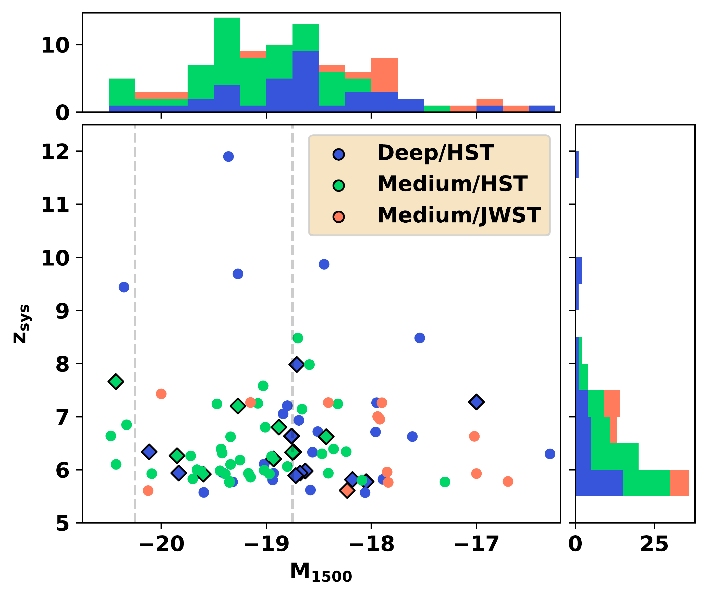
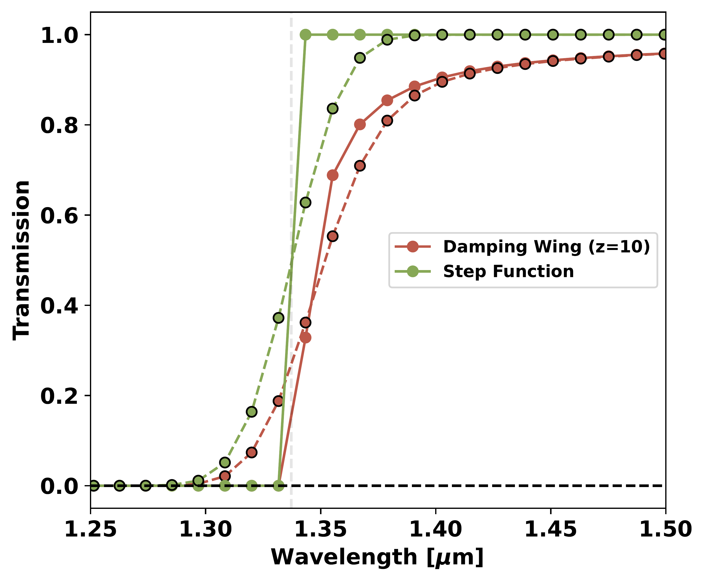
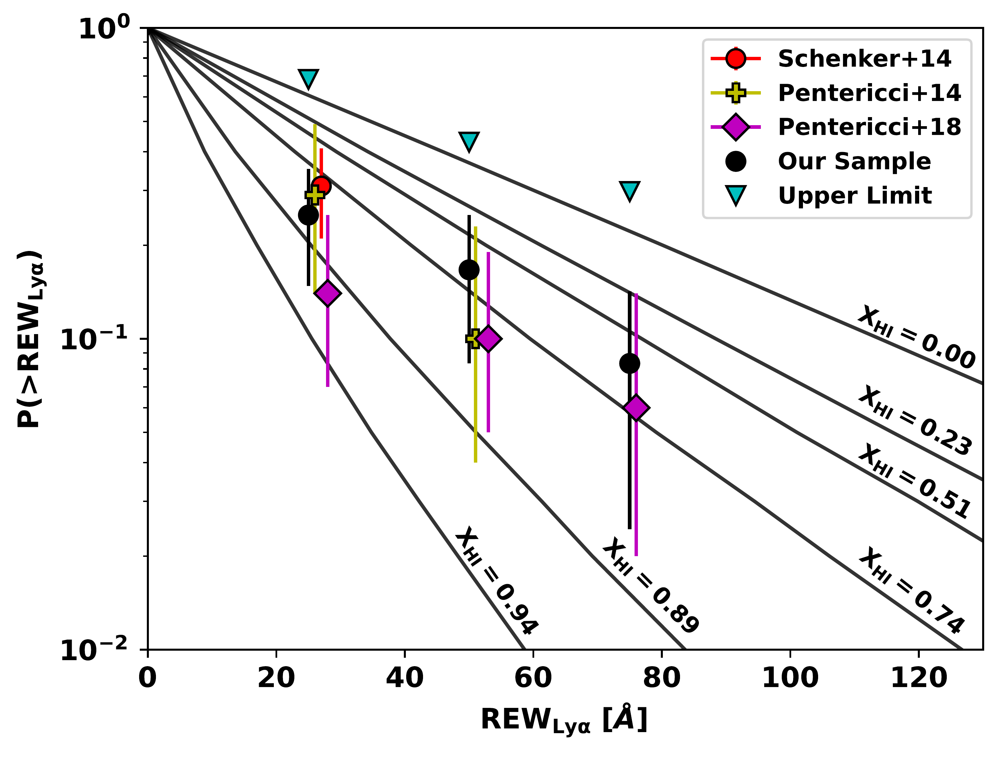

$\newcommand{\ensuremath}{}$
$\newcommand{\xspace}{}$
$\newcommand{\object}[1]{\texttt{#1}}$
$\newcommand{\farcs}{{.}''}$
$\newcommand{\farcm}{{.}'}$
$\newcommand{\arcsec}{''}$
$\newcommand{\arcmin}{'}$
$\newcommand{\ion}[2]{#1#2}$
$\newcommand{\textsc}[1]{\textrm{#1}}$
$\newcommand{\hl}[1]{\textrm{#1}}$
$\newcommand{\footnote}[1]{}$
$\newcommand$
$\newcommand{\cii}{[C II]\xspace}$
$\newcommand{\oiii}{[O III]\xspace}$
$\newcommand{\lya}{Ly\alpha\xspace}$
$\newcommand{\angstrom}{\textup{Å}\xspace}$
$\newcommand{\rew}{REW_{\rm Ly\alpha}}$

# JADES: The emergence and evolution of Ly$\alpha$ emission \& constraints on the IGM neutral fraction

<mark>Appeared on: 2023-06-06</mark> -  _18 pages, 10 figures. Submitted to A&A_

G. C. Jones, et al. -- incl., <mark>H.-W. Rix</mark>

**Abstract:** The rest-frame UV recombination emission line $\lya$ can be powered by ionizing photons from young massive stars in star forming galaxies, but its ability to be resonantly scattered by neutral gas complicates its interpretation. For reionization era galaxies, a neutral intergalactic medium (IGM) will scatter $\lya$ from the line of sight, making $\lya$ a useful probe of the neutral fraction at $z\gtrsim6$ . Here, we explore $\lya$ in JWST/NIRSpec spectra from the ongoing GTO program JADES, which targets hundreds of galaxies in the well-studied GOODS-S and GOODS-N fields. These sources are UV-faint ( $-20.4<\rm M_{\rm UV}<-16.4$ ), and thus represent a poorly-explored class of galaxies. The low spectral resolution ( $R\sim100$ ) spectra of a subset of 93 galaxies in GOODS-S with $z_{spec}>5.5$ (as derived with optical lines) are fit with line and continuum models, in order to search for significant line emission. Through exploration of the R100 data, we find evidence for $\lya$ in 15 sources. Additional analysis of the R1000 data from the same set of galaxies results in five additional detections. This sample allows us to place observational constraints on the fraction of galaxies with $\lya$ emission in the redshift range $5.5<z<7.5$ , with a decrease from $z=6$ to $z=7$ . We also find a positive correlation between $\lya$ equivalent width and M $_{UV}$ , as seen in other samples. These results are used to estimate the neutral gas fraction at $z\sim7$ , agreeing with previous results ( $X_{HI}\sim0.5-0.9$ ).

**Figure 1. -** Systemic redshift (based on optical lines) versus M$_{\rm UV}$(from NIRSpec spectra, see Appendix \ref{m1500app}) for our sample. Galaxies observed in different tiers are coloured differently. Sources detected in $\lya$ emission have black outlines. Vertical dashed lines show M$_{\rm UV}$ values of -18.75 and -20.25. (*fig_zmuv*)

**Figure 3. -** Transmission models of a damping wing (brown lines) and a step function (green lines) for a $z=10$ source. We include the intrinsic model, regridded to match our R100 observations (solid lines), and the dispersed version of this model (dashed lines). The $\lya$ wavelength is shown by a faint vertical line. (*damp*)

**Figure 2. -** Cumulative distribution for $\lya$ rest EW for UV-faint ($-20.25<M_{UV}<-18.75$) galaxies at $z\sim7$. Each solid line shows the expected distribution for a model with $N_{HI}=10^{20}$ cm$^{-2}$ and a wind speed of 200 km s$^{-1}$, but with a different neutral fraction \citep{pent14}. Estimates from literature are shifted by $1$\angstrom$$ for visibility. We include both the estimated distribution from our sample and the associated upper limit (see Section \ref{lyafracsec}) (*xhiplot*)

