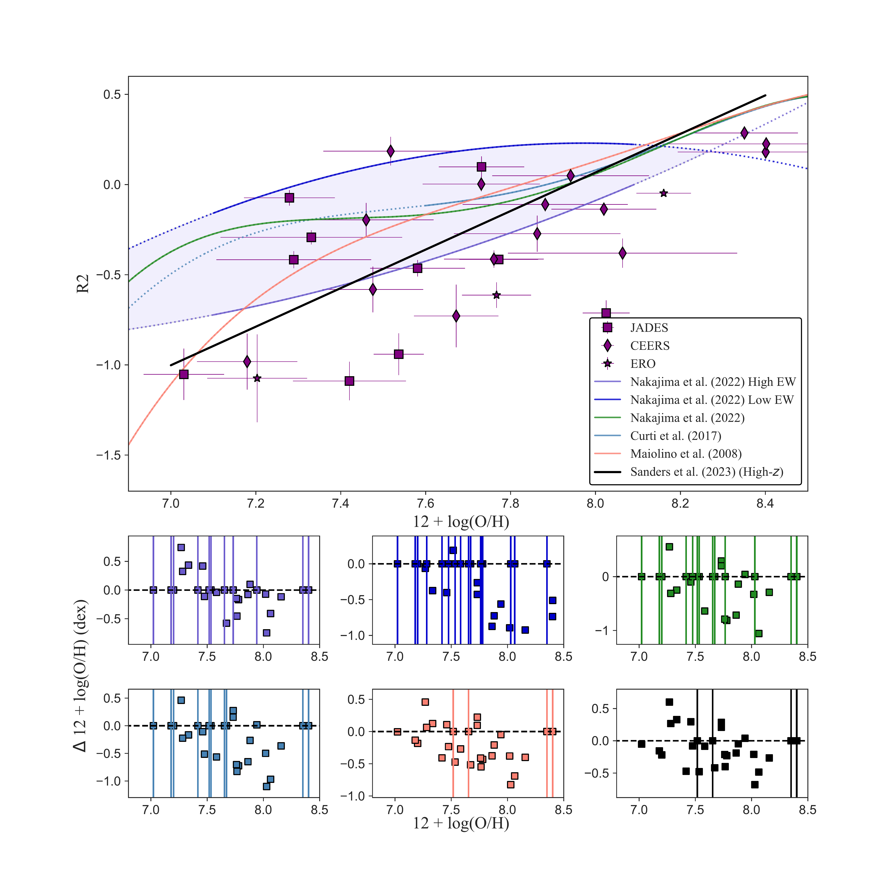
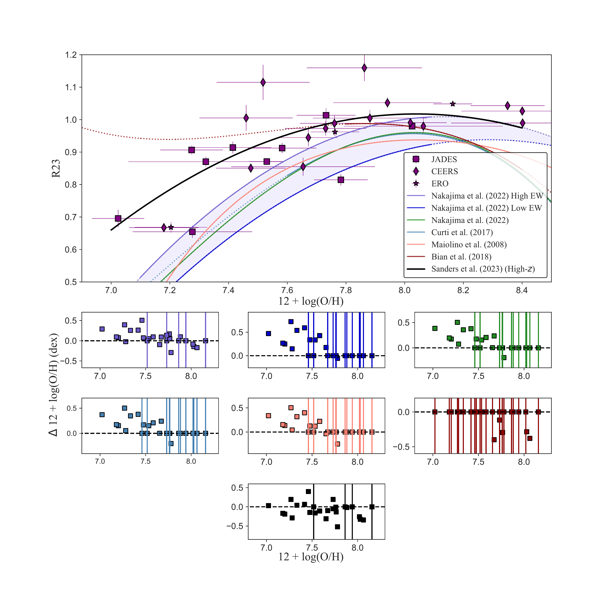
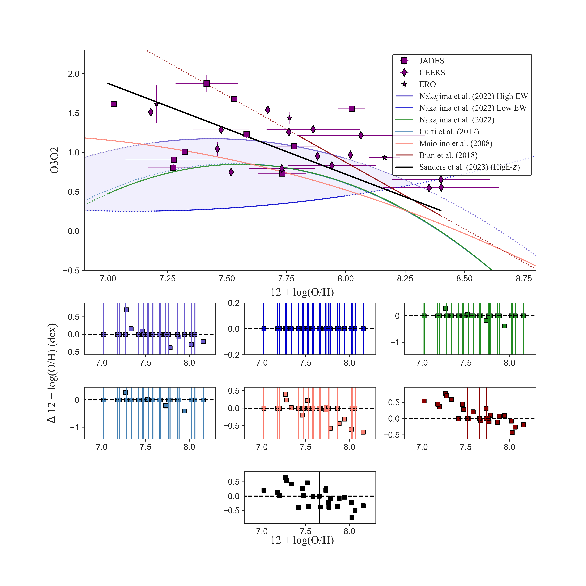

$\newcommand{\ensuremath}{}$
$\newcommand{\xspace}{}$
$\newcommand{\object}[1]{\texttt{#1}}$
$\newcommand{\farcs}{{.}''}$
$\newcommand{\farcm}{{.}'}$
$\newcommand{\arcsec}{''}$
$\newcommand{\arcmin}{'}$
$\newcommand{\ion}[2]{#1#2}$
$\newcommand{\textsc}[1]{\textrm{#1}}$
$\newcommand{\hl}[1]{\textrm{#1}}$
$\newcommand{\footnote}[1]{}$

# **JADES: Detecting [OIII]$\lambda 4363$ Emitters and Testing Strong Line Calibrations in the High-_z** Universe with Ultra-deep JWST/NIRSpec Spectroscopy up to $z \sim 9.5$_

<mark>Appeared on: 2023-06-07</mark> -  _28 pages, 13 figures_

I. H. Laseter, et al. -- incl., <mark>H.-W. Rix</mark>

**Abstract:** We present 10 novel [ OIII ] $\lambda 4363$ auroral line detections up to $z\sim 9.5$ measured from ultra-deep JWST/NIRSpec MSA spectroscopy from the JWST Advanced Deep Extragalactic Survey (JADES). We leverage the deepest spectroscopic observations yet taken with NIRSpec to determine electron temperatures and oxygen abundances using the direct $T_e$ method. We directly compare against a suite of locally calibrated strong-line diagnostics and recent high- _z_ calibrations. We find the calibrations fail to simultaneously match our JADES sample, thus warranting a _self-consistent_ revision of these calibrations for the high- _z_ Universe. We find weak dependence between R2 and O3O2 with metallicity, thus suggesting these line-ratios are ineffective in the high- _z_ Universe as metallicity diagnostics and degeneracy breakers. We find R3 and R23 still correlate with metallicity, but we find tentative flattening of these diagnostics, thus suggesting future difficulties when applying these strong-line ratios as metallicity indicators in the high- _z_ Universe. We also propose and test an alternative diagnostic based on a different combination of R3 and R2 with a higher dynamic range. We find a reasonably good agreement (median offset of 0.002 dex, median absolute offset of 0.13 dex) with the JWST sample at low metallicity, but future investigation is required on larger samples to probe past the turnover point. At a given metallicity, our sample demonstrates higher ionization/excitation ratios than local galaxies with rest-frame EWs(H $\beta$ ) $\approx 200 -300$ Å. However, we find the median rest-frame EWs(H $\beta$ ) of our sample to be $\sim 2\text{x}$ less than the galaxies used for the local calibrations. This EW discrepancy combined with the high ionization of our galaxies does not present a clear description of [ OIII ] $\lambda 4363$ production in the high- _z_ Universe, thus warranting a much deeper examination into the factors affecting production.

**Figure 9. -** The relationship between $T_e$ metallicity and R2 for our JADES sample compared with strong-line calibrations from [Maiolino, Nagao and Grazian (2008)](), [Curti, Cresci and Mannucci (2017)](), [Curti, et. al (2020)](), and the "All", "Large Equivalent Width (EW)", and "Small EW" calibrations from [Nakajima, Ouchi and Xu (2022)](). [Bian, Kewley and Dopita (2018)]() does not include a calibration for R2, but we include their calibrations for O3O2, R3, and R23 in Figures \ref{fig:O3O2 Strong Line Comparison} - \ref{fig:R23 Strong Line Comparison}. Solid lines indicate calibrated ranges whereas dotted lines indicate the extrapolation of the calibration over the metallicity range $6.9 \leq 12 + \log(\text{O/H}) \leq 9.0$. The six subplots demonstrate the change between $T_e$ derived metallicities and calibration derived metallicities for our individual galaxies. The vertical lines represent the failure of a strong-line calibration to account for the measured line ratios at the given metallicity. (*fig:R2 Strong Line Comparison*)

**Figure 12. -** Identical to Figure \ref{fig:R2 Strong Line Comparison} except for the relationship between $T_e$ metallicity and R23. (*fig:R23 Strong Line Comparison*)

**Figure 10. -** Identical to Figure \ref{fig:R2 Strong Line Comparison} except the relationship is between $T_e$ metallicity and O3O2. (*fig:O3O2 Strong Line Comparison*)

