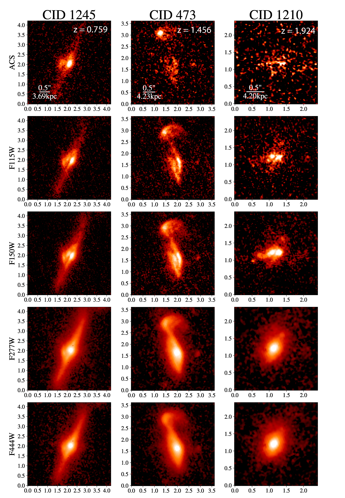
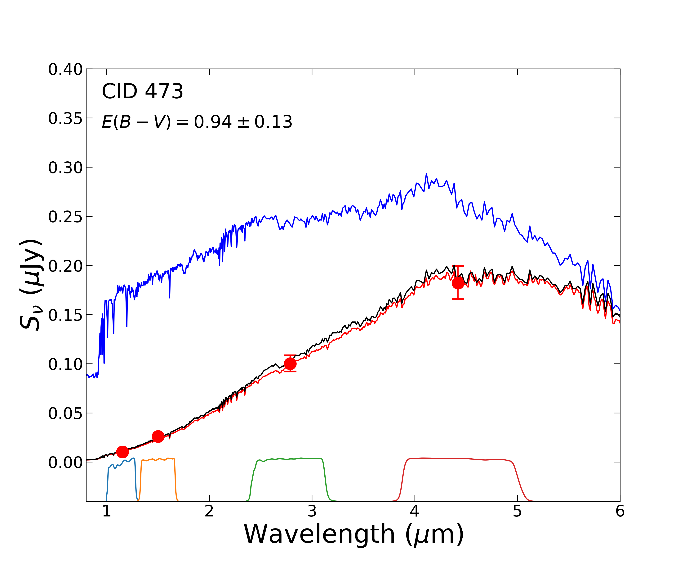
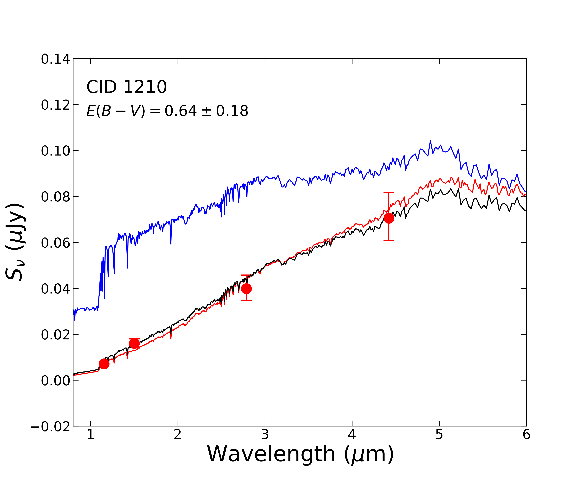
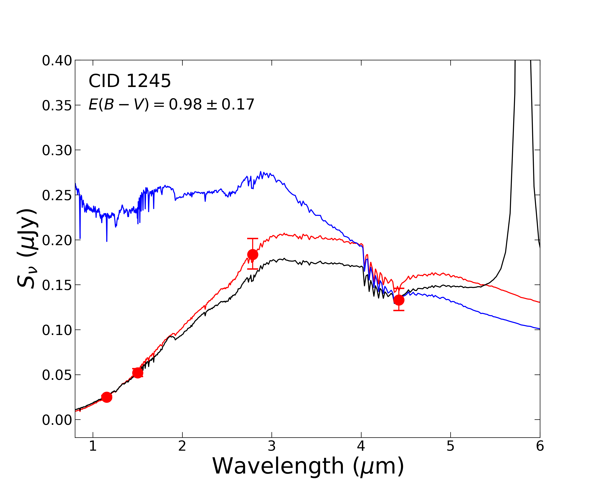
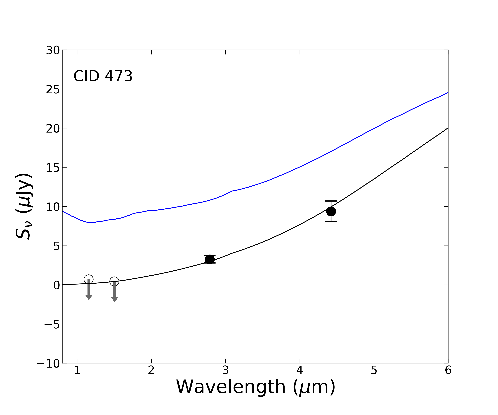
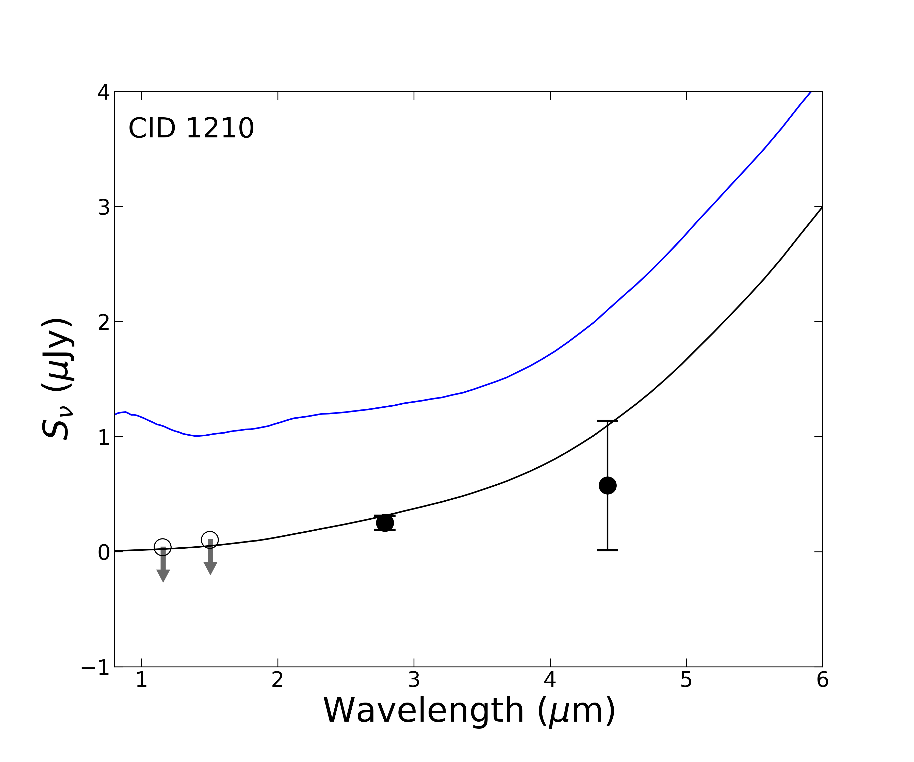
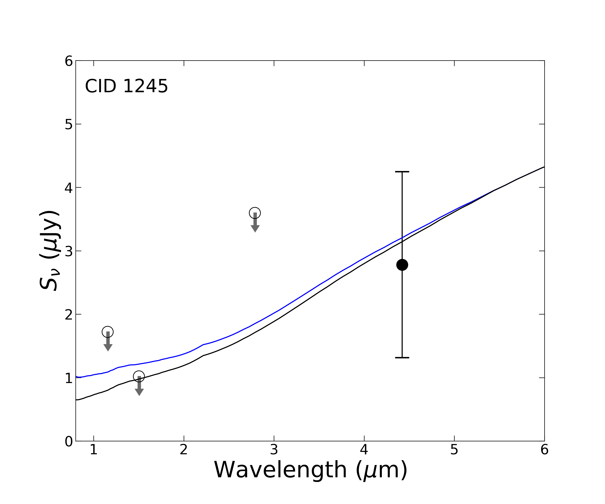

$\newcommand{\ensuremath}{}$
$\newcommand{\xspace}{}$
$\newcommand{\object}[1]{\texttt{#1}}$
$\newcommand{\farcs}{{.}''}$
$\newcommand{\farcm}{{.}'}$
$\newcommand{\arcsec}{''}$
$\newcommand{\arcmin}{'}$
$\newcommand{\ion}[2]{#1#2}$
$\newcommand{\textsc}[1]{\textrm{#1}}$
$\newcommand{\hl}[1]{\textrm{#1}}$
$\newcommand{\footnote}[1]{}$
$\newcommand$
$\newcommand$
$\newcommand{\sersic}{Sérsic}$
$\newcommand{\lenstronomy}{\texttt{lenstronomy}}$
$\newcommand{\galight}{\texttt{galight}}$
$\newcommand{\vdag}{(v)^\dagger}$
$\newcommand{\myemail}{john.silverman@ipmu.jp}$
$\newcommand{\ss}{\textit{\rm S\acute{e}rsic}}$

# Resolving galactic-scale obscuration of X-ray AGN at $z\gtrsim 1$ with COSMOS-Web

<mark>Appeared on: 2023-06-07</mark> -  _12 pages, 8 figures, Accepted for publication in ApJL_

J. D. Silverman, et al. -- incl., <mark>K. Jahnke</mark>

**Abstract:** A large fraction of the accreting supermassive black hole population is shrouded by copious amounts of gas and dust, particularly in the distant ( $z\gtrsim1$ ) Universe. While much of the obscuration is attributed to a parsec-scale torus, there is a known contribution from the larger-scale host galaxy. Using JWST/NIRCam imaging from the COSMOS-Web survey, we probe the galaxy-wide dust distribution in X-ray selected AGN up to $z\sim2$ . Here, we focus on a sample of three AGNs with their host galaxies exhibiting prominent dust lanes, potentially due to their edge-on alignment. These represent 27 \% (3 out of 11 with early NIRCam data) of the heavily obscured ( $N_H>10^{23}$ cm $^{-2}$ ) AGN population. With limited signs of a central AGN in the optical and near-infrared, the NIRCam images are used to produce reddening maps $E(B-V)$ of the host galaxies. We compare the mean central value of $E(B-V)$ to the X-ray obscuring column density along the line-of-sight to the AGN ( $N_H\sim10^{23-23.5}$ cm $^{-2}$ ). We find that the extinction due to the host galaxy is present ( $0.6\lesssim E(B-V) \lesssim 0.9$ ; $1.9 \lesssim A_V\lesssim 2.8$ ) and significantly contributes to the X-ray obscuration at a level of $N_H\sim10^{22.5}$ cm $^{-2}$ assuming an SMC gas-to-dust ratio which amounts to $\lesssim$ 30 \% of the total obscuring column density. These early results, including three additional cases from CEERS, demonstrate the ability to resolve such dust structures with JWST and separate the different circumnuclear and galaxy-scale obscuring structures.

**Figure 5. -** HST/ACS F814W and JWST/NIRCam (F115W, F150W, F277W, F444W) images of three X-ray AGN in COSMOS-Web exhibiting galaxy-scale dust lanes. The axes are labeled in units of arcsecs while the physical scale is also shown in the top panels. The galaxies are ordered by increasing redshift (shown in the top panel) from left to right. (*fig:cw_images*)

**Figure 1. -** Host galaxy fluxes and best-fit SEDs using MICHI2 (red) and CIGALE (black). The observed fluxes are given in red with 1$\sigma$ uncertainties. The unattenuated model SED from CIGALE is shown in blue. The JWST/NIRCam filters are shown in the top panel. (*fig:galaxy_sed-fits*)

**Figure 2. -** Decomposed AGN JWST fluxes (circles) and best-fit SED (blue=unattenuated; black=attenuated) from [Lyu, Rieke and Shi (2017)](). Open symbols indicated upper limits on AGN emission. (*fig:agn_sed-fits*)

