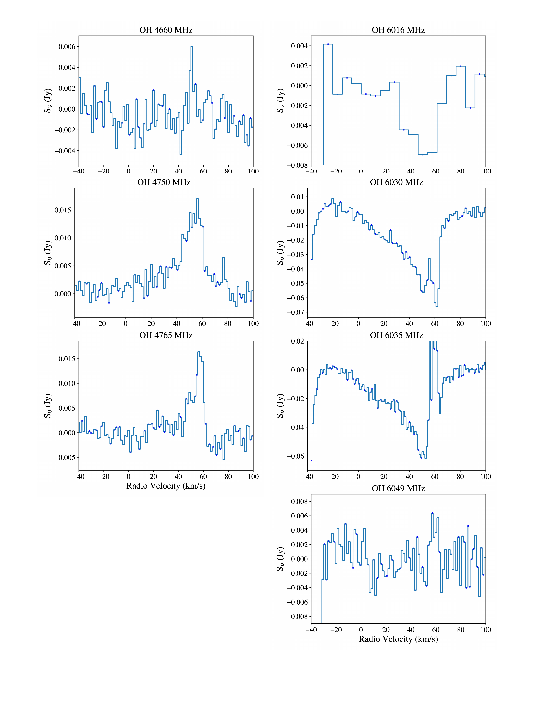
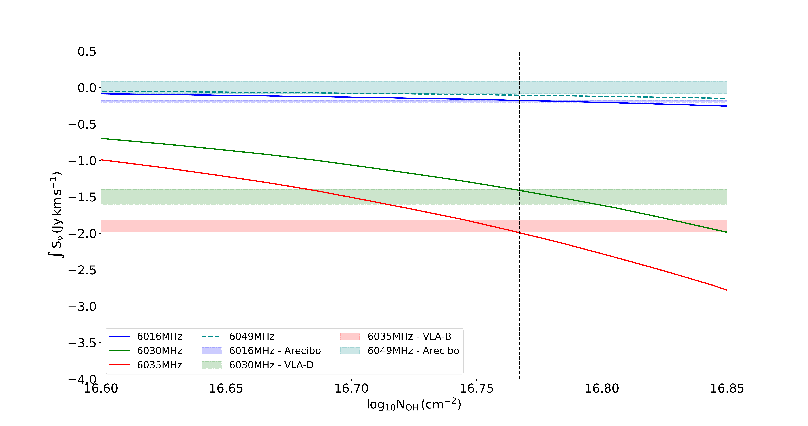

$\newcommand{\ensuremath}{}$
$\newcommand{\xspace}{}$
$\newcommand{\object}[1]{\texttt{#1}}$
$\newcommand{\farcs}{{.}''}$
$\newcommand{\farcm}{{.}'}$
$\newcommand{\arcsec}{''}$
$\newcommand{\arcmin}{'}$
$\newcommand{\ion}[2]{#1#2}$
$\newcommand{\textsc}[1]{\textrm{#1}}$
$\newcommand{\hl}[1]{\textrm{#1}}$
$\newcommand{\footnote}[1]{}$
$\newcommand{\vdag}{(v)^\dagger}$
$\newcommand$
$\newcommand$
$\newcommand{\kms }{ km s^{-1}}$

# Excited Hydroxyl Outflow in the High-Mass Star-Forming Region G34.26+0.15

<mark>Appeared on: 2023-06-14</mark> -  _19 pages, 6 figures. Accepted for publication in The Astrophysical Journal_

W. S. Tan, et al. -- incl., <mark>H. Linz</mark>

**Abstract:** G34.26+0.15 is a region of high-mass star formation that contains a broad range of young stellar objects in different stages of evolution, including a hot molecular core, hyper-compact H ${\small II}$ regions and a prototypical cometary ultra-compact H ${\small II}$ region. Previous high-sensitivity single dish observations by our group resulted in the detection of broad 6035 $ $ MHz OH absorption in this region; the line showed a significant blue-shifted asymmetry indicative of molecular gas expansion. We present high-sensitivity Karl G. Jansky Very Large Array (VLA) observations of the 6035 $ $ MHz OH line conducted to image the absorption and investigate its origin with respect to the different star formation sites in the region. In addition, we report detection of 6030 $ $ MHz OH absorption with the VLA and further observations of 4.7 $ $ GHz and 6.0 $ $ GHz OH lines obtained with the Arecibo Telescope. The 6030 $ $ MHz OH line shows a very similar absorption profile as the 6035 $ $ MHz OH line. We found that the 6035 $ $ MHz OH line absorption region is spatially unresolved at $\sim 2$ $\arcsec$ scales, and it is coincident with one of the bright ionized cores of the cometary H ${\small II}$ region that shows broad radio recombination line emission. We discuss a scenario where the OH absorption is tracing the remnants of a pole-on molecular outflow that is being ionized inside-out by the ultra-compact H ${\small II}$ region.

**Figure 3. -** \small Spectra of the 6.0$ $GHz OH transitions obtained with the Arecibo Telescope (red), VLA in D-configuration (blue) and B-configuration (black) are shown in the left panels; the spectra are sorted by frequency: 6016$ $MHz, 6030$ $MHz, 6035$ $MHz, and 6049$ $MHz from top to bottom. Radio continuum obtained from the line-free channels of the respective spectral windows is shown in the middle (D-configuration) and right panels (B-configuration). In the middle panels, we show with a red circle the $\sim$44$\arcsec$ Arecibo beam, centered at the pointing position; the blue contours in the 6030 and 6035$ $MHz panels show the velocity integrated intensity (moment-0) images of the absorption from the VLA D-configuration cubes (6030$ $MHz OH absorption contour levels: $-$10, $-$90, $-$170, $-$250 $\times $3.08$ $mJy$ $km$ $s$^{-1}$; 6035$ $MHz OH absorption contour levels: $-$70, $-$180, $-$290, $-$400 $\times $2.65$ $mJy$ $km$ $s$^{-1}$). No detection was obtained in the D-configuration observations of the 6016$ $MHz (middle, upper panel) nor the 6049$ $MHz (middle, lower panel) OH transitions; for these transitions, we show with a blue circle the region used to obtain the blue spectrum shown in the respective left panels. The right panels are equivalent to the middle panels, but for the B-configuration observations; black circles are the regions integrated to obtain the black spectra shown in the right panels, and the moment-0 image of the 6035$ $MHz OH absorption is shown in black contours ($-$60, $-$140, $-$220, $-$300 $\times $2.19$ $mJy$ $km$ $s$^{-1}$). The spectral window of the 6030$ $MHz VLA-B observations was corrupted. (*fig:AO-VLA_Spectra_and_Images*)

**Figure 2. -** OH spectra obtained with the Arecibo Telescope. The left panels show the 4.7$ $GHz OH transitions and the right panels show the 6.0$ $GHz lines (the end of the bandpass can be seen at $-$40$\kms$ in the 6.0$ $GHz spectra). We report detection of emission in the 4750$ $MHz and 4765$ $MHz transitions (the 4660$ $MHz may also show a narrow and weak emission line, however, only one channel is above 3$\sigma$). Maser lines are detected in the 6035$ $MHz transition (see  ([Al-Marzouk, Araya and Hofner 2012]()) ), and absorption is found in the 6035$ $MHz, 6030$ $MHz and 6016$ $MHz transitions. The 6016$ $MHz line is weak; the spectra had to be smoothed to a channel width of 7.6$\kms$ to detect the absorption. We report no detection of the 6049$ $MHz transition (no clear evidence of absorption is detected when the spectrum is smoothed). (*fig:Arecibo_spectra*)

**Figure 6. -** Predicted integrated flux density of the \textcolor{blue}{6016$ $MHz}(blue solid line),
\textcolor{DrakGreen}{6030$ $MHz}(green solid line), \textcolor{red}{6035$ $MHz}(red solid line), and
\textcolor{LimeBlue}{6049$ $MHz}(dark-cyan dashed line) OH transitions as a function of column density
computed with {\tt MOLPOP-CEP}(model assumes T$_{k} = 150  $K, $n_{H_2} = 10^{5} $cm$^{-3}$,
$ \chi_{OH} = {5\times10^{-6}}$, FWHM = 33$ $km$ $s$^{-1}$, FWHM$_{6016MHz}$ = 17$ $km$ $s$^{-1}$). The horizontal bands show selected integrated flux density values (including uncertainties) as listed in
Table \ref{tab:OH_Line_Parameters}. The vertical dashed line shows a column density for which the model
matches the observations.
 (*fig:oh_Line_parameters*)

