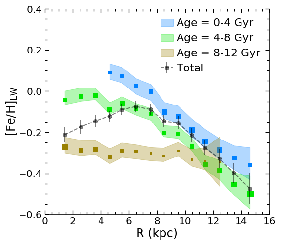
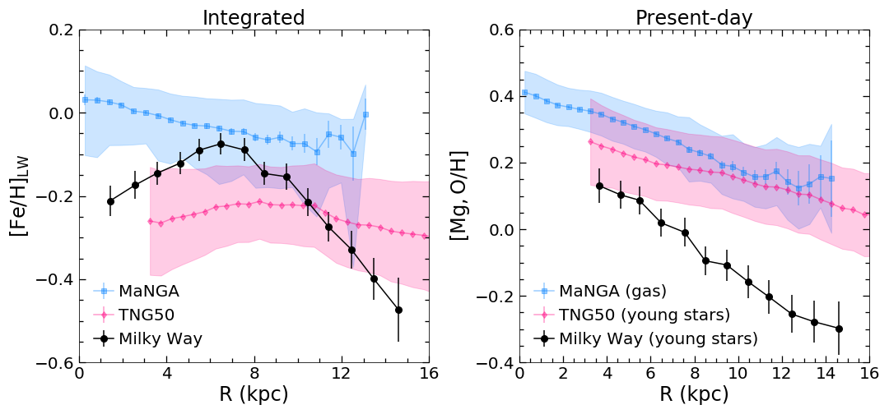
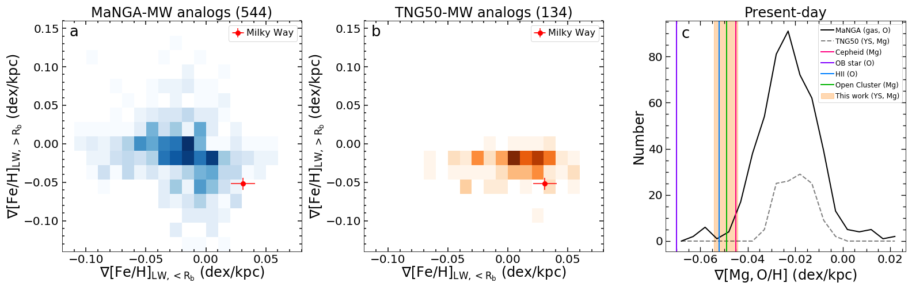

$\newcommand{\ensuremath}{}$
$\newcommand{\xspace}{}$
$\newcommand{\object}[1]{\texttt{#1}}$
$\newcommand{\farcs}{{.}''}$
$\newcommand{\farcm}{{.}'}$
$\newcommand{\arcsec}{''}$
$\newcommand{\arcmin}{'}$
$\newcommand{\ion}[2]{#1#2}$
$\newcommand{\textsc}[1]{\textrm{#1}}$
$\newcommand{\hl}[1]{\textrm{#1}}$
$\newcommand{\footnote}[1]{}$
$\newcommand{\bibinfo}[2]{#2}$
$\newcommand{\eprint}[2][]{\url{#2}}$
$\newcommand{\doi}[1]{\url{https://doi.org/#1}}$
$\newcommand{\mnras}{MNRAS}$
$\newcommand{\apj}{ApJ}$
$\newcommand{\araa}{ARA\&A}$
$\newcommand{\aap}{A\&A}$
$\newcommand{\aj}{AJ}$
$\newcommand{\apjl}{ApJL}$
$\newcommand{\apjs}{ApJS}$
$\newcommand{\pasp}{PASP}$
$\newcommand{\ao}{ApOpt}$
$\newcommand{\mb}[1]{\textcolor{blue}{#1}}$
$\newcommand{\jl}[1]{\textcolor{purple}{#1}}$
$\newcommand{\rr}[1]{\textcolor{green}{#1}}$
$\newcommand{\ap}[1]{\textcolor{magenta}{#1}}$
$\newcommand{\mbnew}[1]{\textcolor{orange}{#1}}$
$\newcommand{\ha}{\hbox{H\alpha}}$
$\newcommand{\hb}{\hbox{H\beta}}$
$\newcommand{\oii}{\hbox{[O {\sc ii}]}}$
$\newcommand{\oiii}{\hbox{[O {\sc iii}]}}$
$\newcommand{\hg}{\hbox{H\gamma}}$
$\newcommand{\nii}{\hbox{[N {\sc ii}]}}$
$\newcommand{\}{url}$
$\newcommand{\urlprefix}{URL }$

# Unusual integrated metallicity profile of our Milky Way

<mark>Appeared on: 2023-06-27</mark> -  _34 pages, 6 figures, published online in Nature Astronomy with open access on 22 June 2023. This is the version prior to the peer review. The published version is available here: this https URL_

<mark>J. Lian</mark>, et al. -- incl., <mark>M. Bergemann</mark>, <mark>A. Pillepich</mark>

**Abstract:** The heavy element abundance profiles in galaxies place stringent constraint on galaxy growth and assembly history. Low-redshift galaxies generally have a negative metallicity gradient in their gas and stars. Such gradients are thought to be a natural manifestation of galaxy inside-out formation. As the Milky Way is currently the only spiral galaxy in which we can measure temporally-resolved chemical abundances, it enables unique insights into the origin of metallicity gradients and their correlation with the growth history of galaxies. However, until now, these unique abundance profiles had not been translated into the integrated-light measurements needed to seamlessly compare with the general galaxy population. Here we report the first measurement of the light-weighted, integrated stellar metallicity profile of our Galaxy. We find that the integrated metallicity profile of the Milky Way has a '$\wedge$'-shape broken metallicity profile, with a mildly positive gradient inside a Galactocentric radius of 7 kpc and a steep negative gradient outside. This metallicity profile appears unusual when compared to Milky Way-mass star-forming galaxies observed in the MaNGA survey and simulated in the TNG50 cosmological simulation. The analysis of the TNG50 simulated galaxies suggests that the Milky Way's positive inner gradient may be due to an inside-out quenching process. The steep negative gradient in the outer disc, however, is challenging to explain in the simulations. Our results suggest the Milky Way may not be a typical spiral galaxy for its mass regarding metallicity distribution and thus offers insight into the variety of galaxy enrichment processes. 

**Figure 1. -** Average light-weighted stellar iron and magnesium abundance profiles of the Milky Way galaxy as a whole and of three different age populations.
	The integrated metallicity of all ages and that in each age bin are average values of mono-abundance populations, weighted by their optical r-band luminosity (Methods). The size of the colourful squares indicates the fraction of the total luminosity at each radial bin contained in each mono-age component.
	 (*z-prof-age*)

**Figure 2. -** {\sl Left:} Average radial light-weighted stellar metallicity profile of the Milky Way (black) in comparison with those of  low-redshift Milky Way-mass star-forming galaxies in the MaNGA survey (blue) and in the TNG50 simulation (magenta), averaged across 544 and 134 galaxies, respectively.
	Black errorbars indicate the stochastic uncertainty of the integrated stellar metallicity of the Milky Way.
	The blue and magenta shaded regions represent the 1 $\sigma$ scatter of the distributions of these Milky Way-mass star forming galaxies in the MaNGA survey and TNG50 simulation, respectively. The filled symbols and errorbars denote their median metallicity profile and the error of the median. {\sl Right:} Comparison among the same galaxy samples as on the left but now for their present-day metallicity gradients. For MaNGA galaxies, we use the oxygen abundance ([O/H]) measured in their ionized gas from optical emission lines (Methods) to represent their present-day metallicity. For the Milky Way and TNG50 galaxies, we use [Mg/H], which is tightly correlated with [O/H]\citep{ting2022}, of their young (0-4 Gyr) population to represent their present-day metallicity (Methods).
	 (*z-prof*)

**Figure 3. -** Comparison of the light-weighted average stellar metallicity gradients in- and outside the break radius ($\rm R_{b}$ -- panels a and b) and of the present-day gradient (panel c) of the Milky Way with those of Milky Way-mass star-forming galaxies in the MaNGA survey and the TNG50 simulation. In panels a and b, the distributions of MaNGA and TNG50 galaxies are colour coded by their number in each pixel. In both cases, the Milky Way is located at the bottom right edge of the distributions of the observed or simulated galaxy populations. In panel c, the shaded region indicates the 1 $\sigma$ stochastic uncertainty of the Milky Way's present-day gradient. For reference, we include the gradient of oxygen or magnesium abundance of different types of young objects in the Milky Way, including OB stars \citep{braganca2019}, Cepheids \citep{genovali2015}, open cluster \citep{magrini2017}, and H II regions \citep{wenger2019}.
	 (*zgrad-hist2d*)

