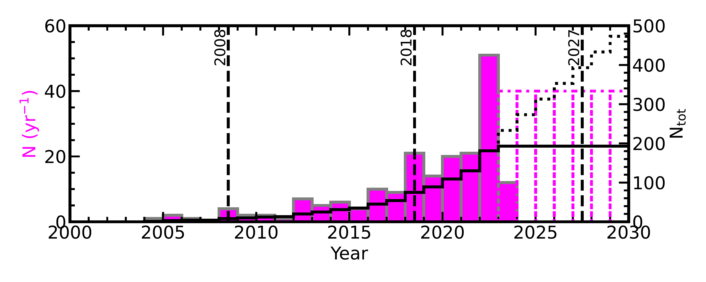
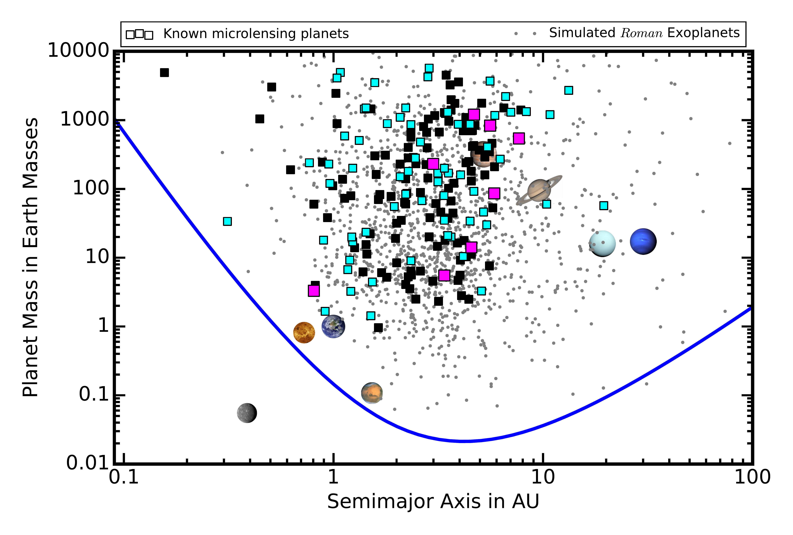
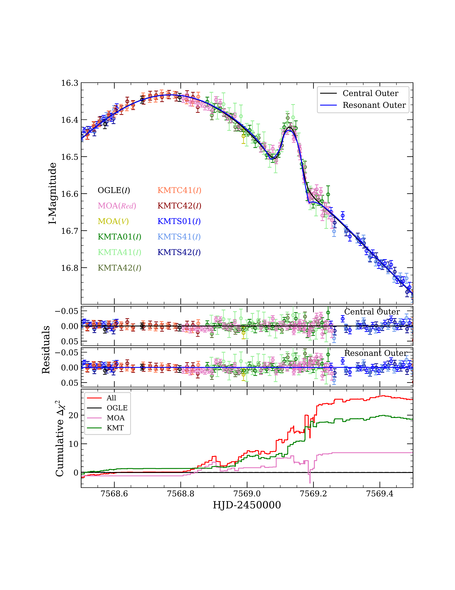
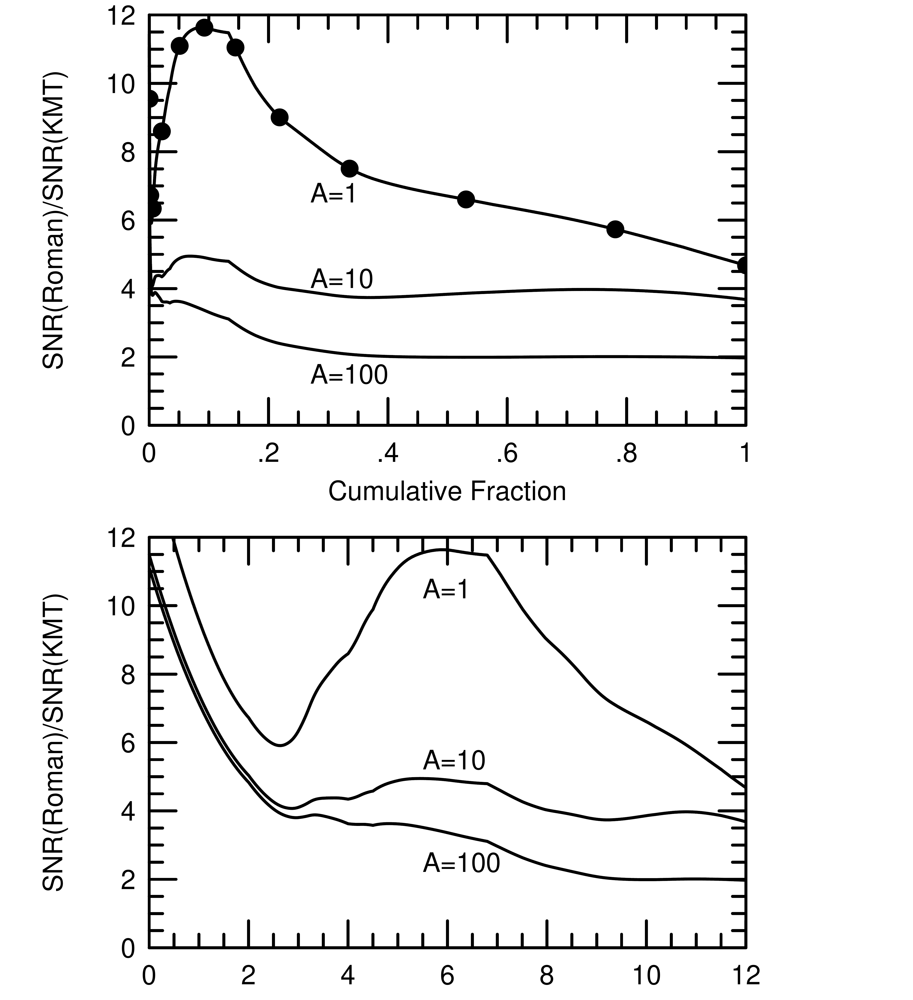
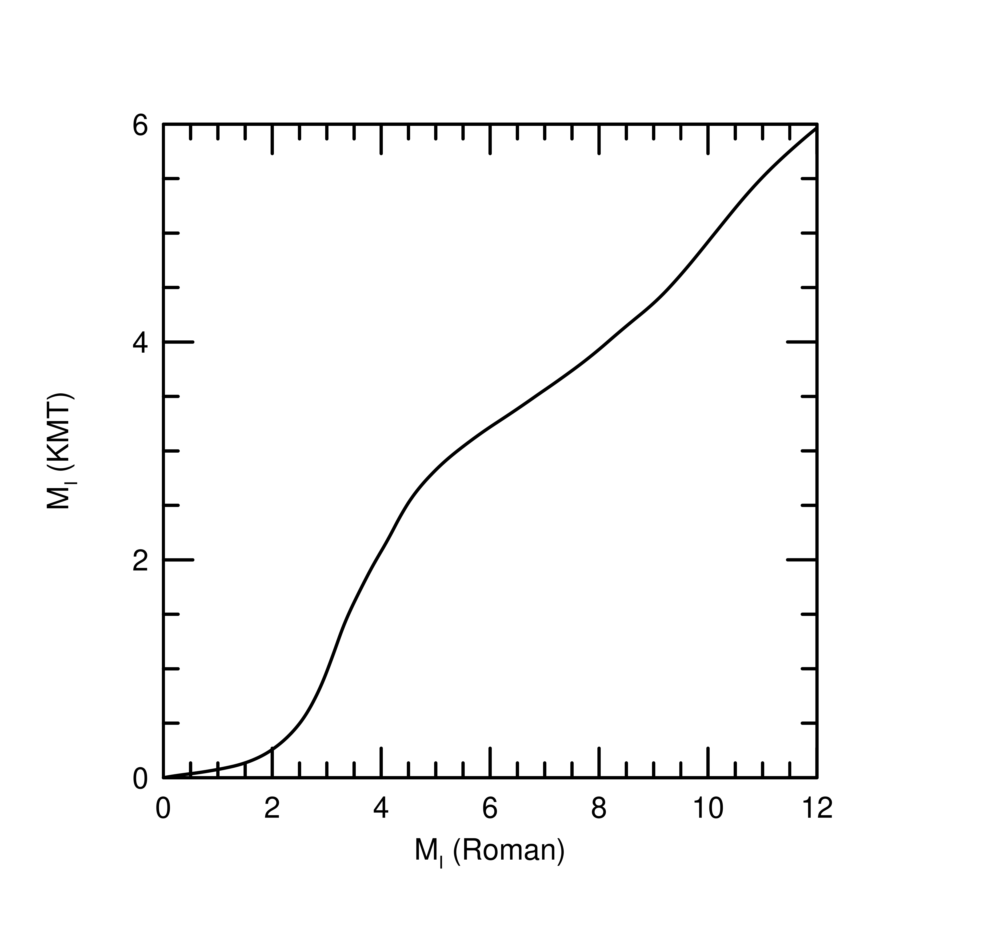

$\newcommand{\ensuremath}{}$
$\newcommand{\xspace}{}$
$\newcommand{\object}[1]{\texttt{#1}}$
$\newcommand{\farcs}{{.}''}$
$\newcommand{\farcm}{{.}'}$
$\newcommand{\arcsec}{''}$
$\newcommand{\arcmin}{'}$
$\newcommand{\ion}[2]{#1#2}$
$\newcommand{\textsc}[1]{\textrm{#1}}$
$\newcommand{\hl}[1]{\textrm{#1}}$
$\newcommand{\footnote}[1]{}$
$\newcommand{\WF}{{\em Roman}}$
$\newcommand{\wangevent}{OGLE-2018-BLG-0383}$
$\newcommand{\wband}{W146-band}$
$\newcommand{\zband}{Z087-band}$
$\newcommand{\bdv}[1]{\mbox{\boldmath#1}}$
$\newcommand{\bpi}{{\bdv\pi}}$
$\newcommand{\}{natexlab}$

# The Scientific Discovery Space for the $\WF$  Galactic Bulge Time Domain Survey

<mark>Appeared on: 2023-06-28</mark> -  _10 pages, submitted to Roman Core Community Survey white paper call_

J. C. Yee, <mark>A. Gould</mark>

**Abstract:** Maximizing the scientific return of Roman requires focusing on the scientific discovery space opened up by Roman relative to the ground: i.e., planets in wide orbits (log s > 0.4), the smallest mass-ratio planets (log q < -4.5), and free-floating planet candidates (especially those with thetaE < 1 uas). However, capitalizing on that leverage requires not just detecting such planets but characterizing them sufficiently that they can be used in a statistical analysis. In particular, the signals from all three categories are all prone to light curve degeneracies that may lead to ambiguities in the planet mass-ratio q, separation s, and the size of the source rho (used to measure thetaE and constrain the host mass). Bound planets may also have light curves that are degenerate with models that include a second source rather than a planet. The most immediate need for designing the Roman Galactic Bulge Time Domain Survey is a detailed simulation of wide-orbit and small planetary perturbations to investigate how well the planet perturbations will be characterized. These investigations and related trade-studies must be done in order to maximize Roman's ability to take advantage of new parameter space. 

**Figure 1. -** $\WF$  Galactic Bulge Time Domain Survey discovery space compared to microlensing discoveries over time (NASA Exoplanet Archive, accessed 5/19/23). Top, left axis (magenta): number of microlensing planets published each year. A publication rate of 40 planets/year from the ground is assumed for future years. Top, right axis (black): cumulative number of published microlensing planets (solid=actual, dotted=projected). The black dashed lines indicate the approximate times when white papers were being prepared for the 2010 and 2020 decadal surveys and the start of the $\WF$  Galactic  Bulge Time Domain Survey. Bottom \citep{Penny19}: squares = known planet distribution at the end of 2008 (magenta), 2018 (cyan), and now (black) compared to the Solar System planets and simulated $\WF$  planet yield (gray points). The blue line indicates the expected $\WF$ , sensitivity limit. (*fig:discovery_space*)

**Figure 5. -** Small mass ratio planets can produce "bump"-like perturbations that may be subject to degeneracies such as the "central-resonant" degeneracy. This example shows two possible models for the planet in OGLE-2016-BLG-1195. Similar to potential degeneracies for wide-orbit planets, the RGBS cadence will need to be high enough to distinguish between various possible models. \citep[Figure from ][]{Gould23_ob1195} (*fig:ob1195*)

**Figure 3. -** $\WF$'s primary advantage over ground-based surveys comes at low magnification. For $A = 1$, $\WF$  has a signal-to-noise advantage of $\sim 5$--$12$ over the KMTNet, but at $A=100$ that advantage is a relatively modest factor of $\sim 2$.
	Bottom: Absolute magnitudes of RGBS sources compared to KMTNet sources at the same cumulative fraction; e.g., half of all RGBS sources will be $M_I < 6$ whereas half of all KMTNet sources are $M_I < 3.25$. Top: relative signal-to-noise ratio between $\WF$  and KMTNet as a function of cumulative fraction of sources and magnification. Middle: same as top, but as a function of $\WF$  absolute source magnitude, for which the corresponding KMTNet source magnitude can be found from the bottom panel; e.g., for a $\WF$  source with $M_I = 6$, the corresponding KMTNet source will be $M_I = 3.25$, and for such sources, $\WF$  has a SNR advantage of $\sim 11.5$ over KMTNet at $A=1$, but only $\sim 3$ at $A=100$. Figures from \citet{Gould23_kb2397}. (*fig:wf_kmt*)

