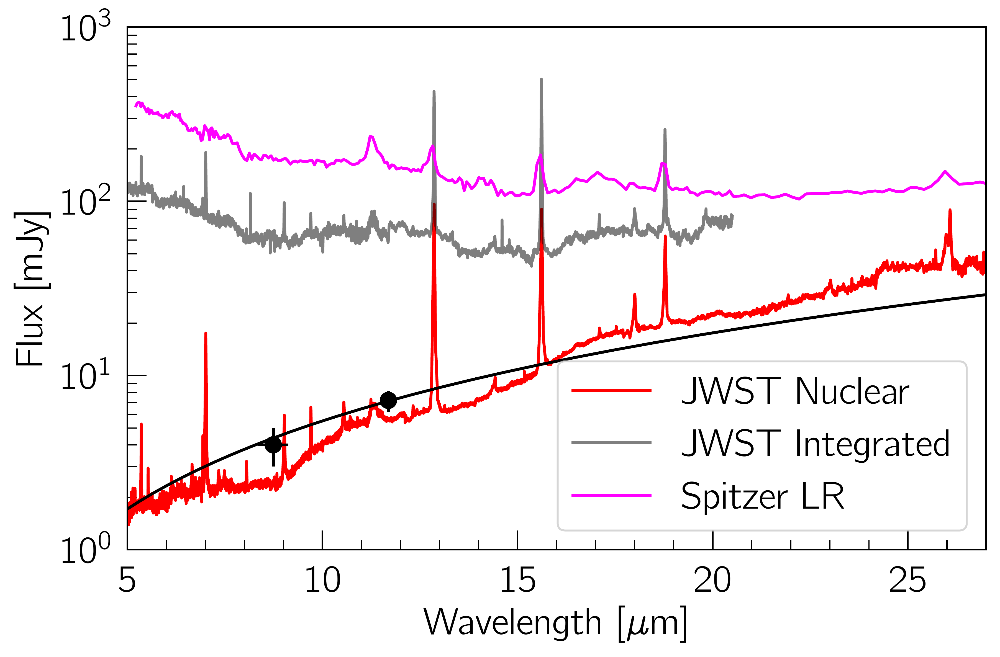
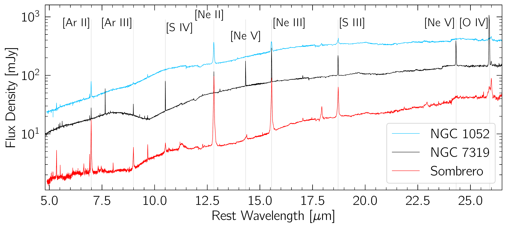

$\newcommand{\ensuremath}{}$
$\newcommand{\xspace}{}$
$\newcommand{\object}[1]{\texttt{#1}}$
$\newcommand{\farcs}{{.}''}$
$\newcommand{\farcm}{{.}'}$
$\newcommand{\arcsec}{''}$
$\newcommand{\arcmin}{'}$
$\newcommand{\ion}[2]{#1#2}$
$\newcommand{\textsc}[1]{\textrm{#1}}$
$\newcommand{\hl}[1]{\textrm{#1}}$
$\newcommand{\footnote}[1]{}$
$\newcommand{\vdag}{(v)^\dagger}$
$\newcommand$
$\newcommand$
$\newcommand{\oltext}[1]{\textcolor{olive}{#1}}$
$\newcommand{\rtext}[1]{\textcolor{red}{#1}}$
$\newcommand{\nefive}{[\ion{Ne}{5}] \lambda14.32 \mum}$
$\newcommand{\ofour}{[\ion{O}{4}] \lambda25.91 \mum}$
$\newcommand{\nethree}{[\ion{Ne}{3}] \lambda15.56 \mum}$
$\newcommand{\netwo}{[\ion{Ne}{2}] \lambda12.81 \mum}$
$\newcommand{\fetwo}{[\ion{Fe}{2}] \lambda5.34 \mum}$

# ReveaLLAGN 0: First Look at JWST MIRI data of Sombrero and NGC 1052

<mark>Appeared on: 2023-07-06</mark> -  _Submitted to ApJ_

K. Goold, et al. -- incl., <mark>A. Dumont</mark>, <mark>N. Neumayer</mark>, <mark>A. Feldmeier-Krause</mark>

**Abstract:** We present the first results from the Revealing Low-Luminosity Active Galactic Nuclei (ReveaLLAGN) survey, a JWST survey of seven nearby LLAGN.  We focus on two observations with the Mid-Infrared Instrument's (MIRI) Medium Resolution Spectrograph (MRS) of the nuclei of NGC 1052 and Sombrero (NGC 4594 / M104).  We also compare these data to public JWST data of a higher-luminosity AGN, NGC 7319.   JWST clearly resolves the AGN component even in Sombrero, the faintest target in our survey; the AGN components have very red spectra.   We find that the emission-line widths in both NGC 1052 and Sombrero increase with increasing ionization potential, with FWHM $>$ 1000 km $ $ s $^{-1}$ for lines with ionization potential $\gtrsim$ 50 eV.  These lines are also significantly blue-shifted in both LLAGN.  The high ionization potential lines in NGC 7319 show neither broad widths or significant blue shifts.  Many of the lower ionization potential emission lines in Sombrero show significant blue wings extending $>$ 1000 km $ $ s $^{-1}$ .  These features and the emission-line maps in both galaxies are consistent with outflows along the jet direction.  Sombrero has the lowest luminosity high-ionization potential lines ( [ $\ion{Ne}{5}$ ] and [ $\ion{O}{4}$ ] ) ever measured in the mid-IR, but the relative strengths of these lines are consistent with higher luminosity AGN.  On the other hand, the [ $\ion{Ne}{5}$ ] emission is much weaker relative to the [ $\ion{Ne}{3}$ ] and [ $\ion{Ne}{2}$ ] lines of higher-luminosity AGN.  These initial results show the great promise that JWST holds for identifying and studying the physical nature of LLAGN.

**Figure 1. -** Emission-line trends with ionization potential.  Emission features are listed along the x-axis ordered by their IP.  *Top -- Luminosity vs IP*. Emission-line luminosities scale with the Eddington ratio of sources. NGC 7319 has the highest Eddington ratio and the most luminous emission lines, followed by NGC 1052, and then Sombrero. The luminosities have a median fractional error of 15\%.
    *Middle -- FWHM$_{line*$ vs IP}. The FWHM$_{\rm line}$ of emission features increases with IP in Sombrero and NGC 1052 while the FWHM$_{\rm line}$ of NGC 7319 emission features stays relatively constant with IP. FWHM$_{\rm line}$ in km s$^{-1}$ is shown on the y-axis with a median error of 30 km s$^{-1}$. Red and blue dashed lines represent the central stellar velocity dispersion measurements from \citet{Ho2009b} translated to a FWHM.
    *Bottom -- Peak Velocity vs IP*. Peak velocity of emission lines trend increasingly blue-shifted with increasing ionization potential in Sombrero and NGC 1052. The y-axis shows the peak velocity of the best fit Guassian model with a median error of 30 km s$^{-1}$.  (*fig:lum-fwhm-vel*)

**Figure 3. -** JWST enables us to separate LLAGN spectra from their host galaxy.
 Comparison of the aperture corrected nuclear extracted spectrum in Sombrero (red line; same as Figure \ref{fig:nucspec}), to the integrated MIRI/MRS spectrum (gray line; FoV: 6$\farcs$6$\times$7$\farcs$7),and the Spitzer LR spectrum  (magenta line; FoV: 27$\farcs$7$\times$51$\farcs$8).  The black line shows the best fit high-spatial resolution power-law fit to Sombrero from \citet{Fern2023} this is fit to the black points, which are photometry from Gemini \citep{Asmus2014} and VLT \citep{Fern2023} as well as  sub-arcsecond data at shorter wavelengths; both the data and fit are in good agreement with our nuclear spectrum. We show the integrated spectrum only out to 20 $\mu$m as the poorly constrained MIRI channel 4 background levels significantly impact the integrated spectrum measurements at redder wavelengths.  (*fig:spitzercomp*)

**Figure 6. -** The first extracted nuclear spectra of ReveaLLAGN targets: Sombrero (red, bottom spectrum) and NGC 1052 (blue, top spectrum). NGC 7319 (black, middle spectrum) is a more distant Seyfert 2 AGN and is included to compare our low-luminosity sample to another spectrum taken with JWST MIRI/MRS.  Spectra are extracted from a $\sim$1 FWHM radius aperture (see Section \ref{sec:nuclear_extraction}) and are aperture corrected using point source observations.  A subset of strong emission lines are labeled.  Also apparent in the spectra at $\sim$10 microns are broad Silicate absorption features (in NGC 7319) and emission features (in Sombrero and NGC 1052), and faint polycyclic aromatic hydrocarbon (PAH) emission at 11.3 $\mu$m in Sombrero.  (*fig:nucspec*)

