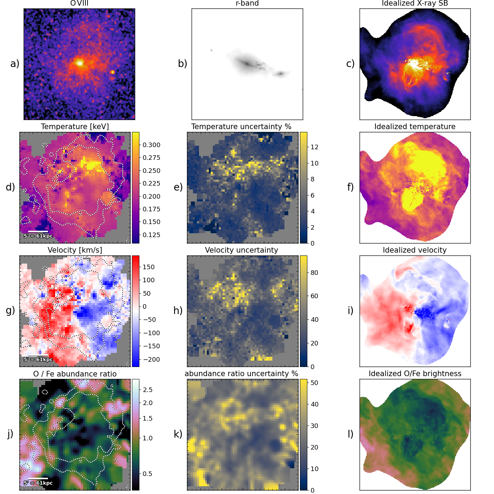
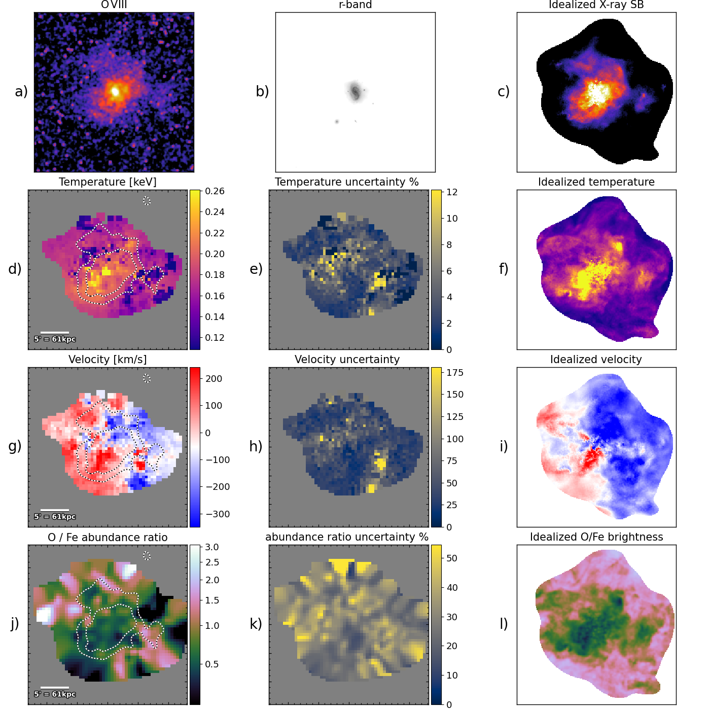
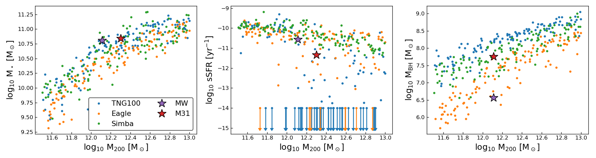

$\newcommand{\ensuremath}{}$
$\newcommand{\xspace}{}$
$\newcommand{\object}[1]{\texttt{#1}}$
$\newcommand{\farcs}{{.}''}$
$\newcommand{\farcm}{{.}'}$
$\newcommand{\arcsec}{''}$
$\newcommand{\arcmin}{'}$
$\newcommand{\ion}[2]{#1#2}$
$\newcommand{\textsc}[1]{\textrm{#1}}$
$\newcommand{\hl}[1]{\textrm{#1}}$
$\newcommand{\footnote}[1]{}$
$\newcommand{\vdag}{(v)^\dagger}$
$\newcommand$
$\newcommand$
$\newcommand{\kms}{km s^{-1}}$

# Mapping the imprints of stellar and AGN feedback in the circumgalactic medium with X-ray microcalorimeters

<mark>Appeared on: 2023-07-06</mark> -  _38 pages, 18 figures, submitted to ApJ_

G. Schellenberger, et al. -- incl., <mark>A. Pillepich</mark>

**Abstract:** The Astro2020 Decadal Survey has identified the mapping of the circumgalactic medium (CGM, gaseous plasma around galaxies) as a key objective.We explore the prospects for characterizing the CGM in and around nearby galaxy halos with future large grasp X-ray microcalorimeters.We create realistic mock observations from hydrodynamical simulations (EAGLE, IllustrisTNG, and Simba) that demonstrate a wide range of potential measurements, which will address the open questions in galaxy formation and evolution.By including all background and foreground components in our mock observations, we show why it is impossible to perform these measurements with current instruments, such as X-ray CCDs, and only microcalorimeters will allow us to distinguish the faint CGM emission from the bright Milky Way (MW) foreground emission lines.We find that individual halos of MW mass can, on average, be traced out to large radii, around R $_{500}$ , and for larger galaxies even out to R $_{200}$ , using the O VII, O VIII, or Fe XVII emission lines.Furthermore, we show that emission line ratios for individual halos can reveal the radial temperature structure. Substructure measurements show that it will be possible to relate azimuthal variations to the feedback mode of the galaxy.We demonstrate the ability to construct temperature, velocity, and abundance ratio maps from spectral fitting for individual galaxy halos, which reveal rotation features, AGN outbursts, and enrichment.

**Figure 15. -** Spectral map of galaxy 358608 from TNG50 (for details see text), showing observed O VIII surface brightness (a), and the predicted optical r-band signal (b), the simulated X-ray brightness (c), the observed temperature in keV (c, and error map d) from a simultaneous fit to O VII, O VIII, and Fe XVII lines), the emission weighted temperature from the simulation (f),
    the observed average line velocity shift in $\si{km s^{-1}}$(g, and error map h), the predicted, emission weighted LOS velocity in the simulation (i), the observed O/Fe abundance ratio (g, and error map h), and the predicted O/Fe brightness ratio in the simulation (l).  (*fig:specmap358608*)

**Figure 16. -** As for Fig. \ref{fig:specmap358608}, but for the lower mass galaxy from TNG50 (ID 467415, details in the text). (*fig:specmap467415*)

**Figure 7. -** Properties of the galaxies in the three samples (low/medium/high mass) for each of the three simulations (TNG100 in blue, EAGLE in orange, Simba in green). The x-axis of each of the three panels is the halo mass M$_{200}$ in log$_{10}$. The left panel shows the stellar mass dependence M$_\star$, similar to what is shown in \ref{fig:stellar_mass}. We also highlight the location of the Milky Way (purple star), and M31 (red star). The middle panel illustrates the specific star formation rate, sSFR in units of $\si{yr^{-1}}$, clearly decreasing with increasing halo mass. The right panel shows the SMBH mass dependence, clearly indicating a different trend between the simulations, where EAGLE produces lower mass black holes than TNG100. (*fig:samples*)

