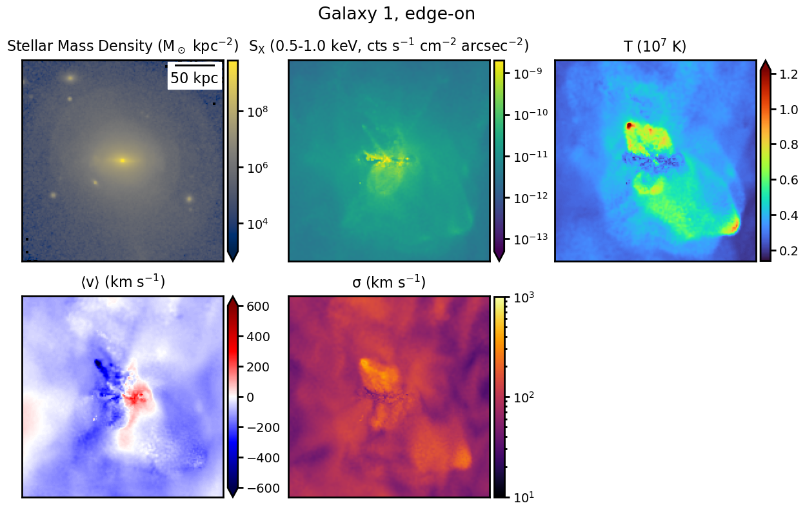
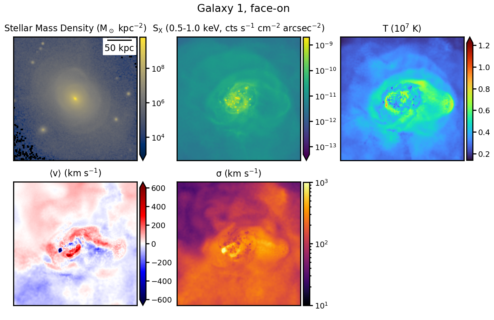
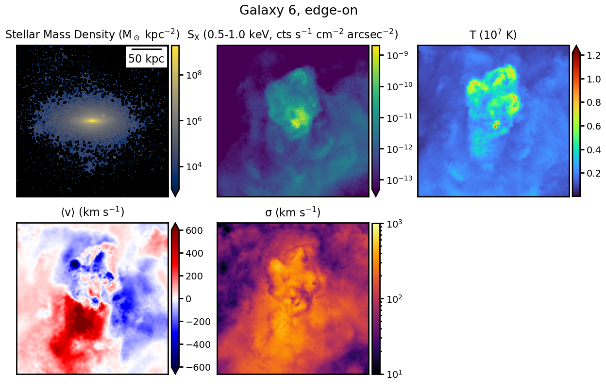
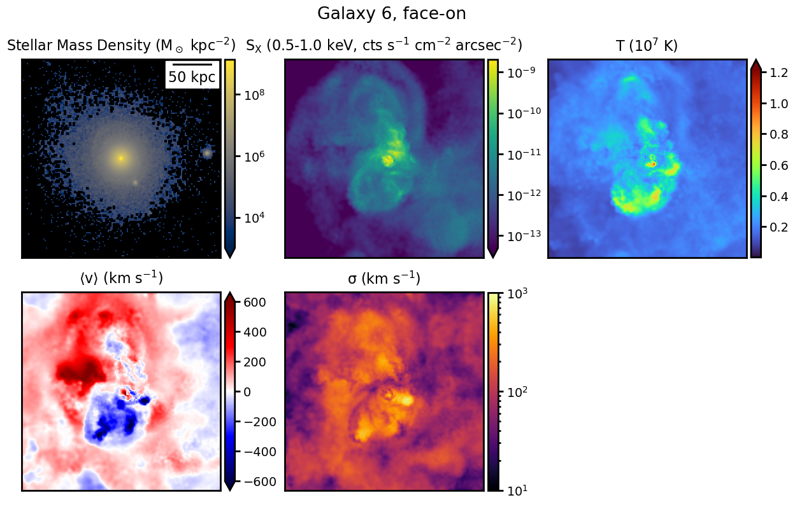

$\newcommand{\ensuremath}{}$
$\newcommand{\xspace}{}$
$\newcommand{\object}[1]{\texttt{#1}}$
$\newcommand{\farcs}{{.}''}$
$\newcommand{\farcm}{{.}'}$
$\newcommand{\arcsec}{''}$
$\newcommand{\arcmin}{'}$
$\newcommand{\ion}[2]{#1#2}$
$\newcommand{\textsc}[1]{\textrm{#1}}$
$\newcommand{\hl}[1]{\textrm{#1}}$
$\newcommand{\footnote}[1]{}$

# Properties of the Line-of-Sight Velocity Field in the Hot and X-ray Emitting Circumgalactic Medium of Nearby Simulated Disk Galaxies

<mark>Appeared on: 2023-07-06</mark> -  _41 pages, 29 figures, submitted to ApJ_

J. A. ZuHone, et al. -- incl., <mark>A. Pillepich</mark>

**Abstract:** The hot, X-ray-emitting phase of the circumgalactic medium in galaxies is believed to be the reservoir of baryons from which gas flows onto the central galaxy and into which feedback from AGN and stars inject mass, momentum, energy, and metals. These effects shape the velocity fields of the hot gas, which can be observed by X-ray IFUs via the Doppler shifting and broadening of emission lines. In this work, we analyze the gas kinematics of the hot circumgalactic medium of Milky Way-mass disk galaxies from the TNG50 simulation, and produce synthetic observations to determine how future instruments can probe this velocity structure. We find that the hot phase is often characterized by outflows outward from the disk driven by feedback processes, radial inflows near the galactic plane, and rotation, though in other cases the velocity field is more disorganized and turbulent. With a spectral resolution of $\sim$ 1 eV, fast and hot outflows ( $\sim$ 200-500 km s $^{-1}$ ) can be measured using both line shifts and widths, depending on the orientation of the galaxy on the sky. The rotation velocity of the hot phase ( $\sim$ 100-200 km s $^{-1}$ ) can be measured using line shifts in edge-on galaxies, and is slower than that of colder gas phases but similar to stellar rotation velocities. By contrast, the slow inflows ( $\sim$ 50-100 km s $^{-1}$ ) are difficult to measure in projection with these other components. We find that the velocity measured is sensitive to which emission lines are used. Measuring these flows will help constrain theories of how the gas in these galaxies forms and evolves.

**Figure 1. -** Projections of various quantities from galaxy 1, viewed edge-on (upper panels) and face-on (lower panels) with respect to the galactic plane. For each set, top row from left: Stellar mass density, X-ray SB in the 0.5-1.0 keV band, emission-weighted gas temperature. Bottom row from left: emission-weighted gas mean velocity, emission-weighted gas velocity dispersion. Each panel is 32' on a side, or $\sim$407 kpc for the given redshift and cosmology. Hot outflows are evident in SB and temperature, which are associated with fast mean velocities and velocity dispersions near the center. The hot gas is also rotating, as seen in the edge-on projection. (*fig:gal1_proj*)

**Figure 9. -** Azimuthally and height-averaged mass-weighted and emission-weighted radial profiles of the gas and stellar velocity for galaxy 1. The top panels show profiles of the $R$-component of the velocity, the middle panels show profiles of the $\phi$-component, and the bottom panels show the $z$-component. Left panels show the mean velocity for each galaxy and right panels show the velocity dispersion. The same patterns of outflows, inflows, and rotation are seen as in the 2D profile in Figure \ref{fig:gal1_phase}. The emission-weighted velocity profiles are similar to the mass-weighted profiles, but higher-energy lines (Fe XVII and Ne IX) track hotter and faster phases of gas. (*fig:gal1_profiles*)

**Figure 3. -** Projections of various quantities from galaxy 6, viewed edge-on (upper panels) and face-on (lower panels) with respect to the plane of the galactic disk. Panel descriptions are the same as in Figure \ref{fig:gal1_proj}. Each panel is 32' on a side, or $\sim$407 kpc for the given redshift and cosmology. Unlike galaxies 1 and 2, this galaxy has no obvious pattern of rotation in the velocity map, and the fast outflow appears to not be aligned with the spin axis of the disk. (*fig:gal6_proj*)

